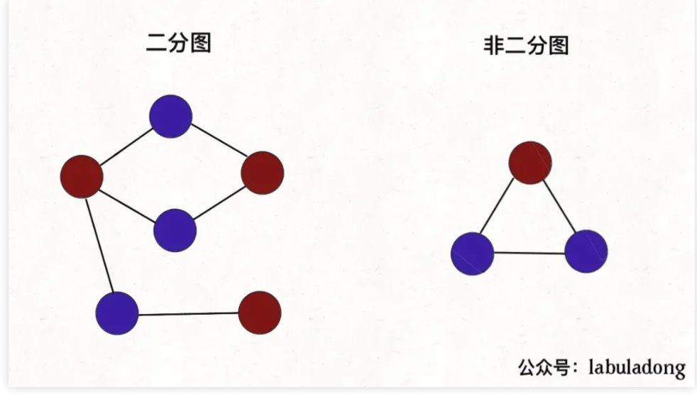
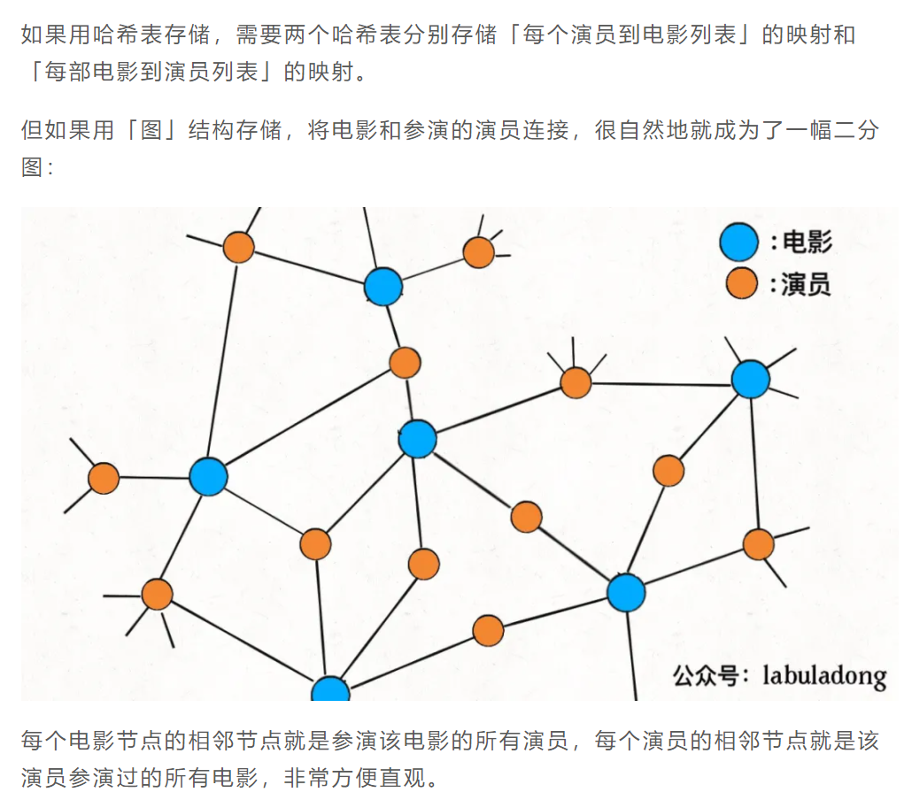

在讲二分图的判定算法之前，我们先来看下百度百科对「二分图」的定义：
==既然说到遍历图，也不涉及最短路径之类的，当然是 DFS 算法和 BFS 皆可了，DFS 算法相对更常用些，所以我们先来看看如何用 DFS 算法判定双色图。==

> 二分图的顶点集可分割为两个互不相交的子集，图中每条边依附的两个顶点都分属于这两个子集，且两个子集内的顶点不相邻。

**给你一幅「图」，请你用两种颜色将图中的所有顶点着色，且使得任意一条边的两个端点的颜色都不相同，你能做到吗**？

这就是图的「双色问题」，其实这个问题就等同于二分图的判定问题，如果你能够成功地将图染色，那么这幅图就是一幅二分图，反之则不是：





判定二分图的算法很简单，就是用代码解决「双色问题」。

说白了就是遍历一遍图，一边遍历一遍染色，看看能不能用两种颜色给所有节点染色，且相邻节点的颜色都不相同。

既然说到遍历图，也不涉及最短路径之类的，当然是 DFS 算法和 BFS 皆可了，DFS 算法相对更常用些，所以我们先来看看如何用 DFS 算法判定双色图。

```tsx
/* 二叉树遍历框架 */
function traverse(root: TreeNode) {
	if (root == null) return
	traverse(root.left)
	traverse(root.right)
}

/* 多叉树遍历框架 */
function traverseNTree(root: Node) {
	if (root == null) return
	for (let child of root.children) traverse(child)
}

/* 图遍历框架 */
let visited: boolean[] = []
function traverseMap(graph: Graph, v: number) {
	// 防止走回头路进入死循环
	if (visited[v]) return
	// 前序遍历位置，标记节点 v 已访问
	visited[v] = true
	for (let neighbor of graph.neighbors(v)) {
		traverse(graph, neighbor)
	}
}

/* 图遍历框架2, Visited换种写法 */
let visited: boolean[] = []
function traverse(graph: Graph, v: number) {
	// 前序遍历位置，标记节点 v 已访问
	visited[v] = true
	for (let neighbor of graph.neighbors(v)) {
		if (!visited[neighbor]) {
			// 只遍历没标记过的相邻节点
			traverse(graph, neighbor)
		}
	}
}
```

==**回顾一下二分图怎么判断，其实就是让`traverse`函数一边遍历节点，一边给节点染色，尝试让每对相邻节点的颜色都不一样**。==

```tsx
/* 二分图遍历框架 */
function traverse(graph: Graph, visited: boolean[], v: number) {
	visited[v] = true
	// 遍历节点 v 的所有相邻节点 neighbor
	for (let neighbor of graph.neighbors(v)) {
		if (!visited[neighbor]) {
			// 相邻节点 neighbor 没有被访问过
			// 那么应该给节点 neighbor 涂上和节点 v 不同的颜色
			traverse(graph, visited, neighbor)
		} else {
			// 相邻节点 neighbor 已经被访问过
			// 那么应该比较节点 neighbor 和节点 v 的颜色
			// 若相同，则此图不是二分图
		}
	}
}
```

```tsx
BFS算法 结果和上述二分图算法完全一致 √


	function isBipartite(graph: number[][]) {
		let n = graph.length
		let color = new Array(n).fill(false) // 记录图中节点的颜色，false 和 true 代表两种不同颜色
		let visited = new Array(n).fill(false) // 记录图中节点是否被访问过
		let ok = true
		// 因为图不一定是联通的，可能存在多个子图
		// 所以要把每个节点都作为起点进行一次遍历
		// 如果发现任何一个子图不是二分图，整幅图都不算二分图
		for (let v = 0; v < n; v++) {
			if (!visited[v]) {
				dfs(graph, v)
			}
		}
		function dfs(graph: number[][], start: number) {
			let q = []
			visited[start] = true
			q.push(start)

			while (q.length !== 0 && ok) {
				let v = q.shift() as number
				// 从节点 v 向所有相邻节点扩散
				for (let w of graph[v]) {
					if (!visited[w]) {
						// 相邻节点 w 没有被访问过
						// 那么应该给节点 w 涂上和节点 v 不同的颜色
						color[w] = !color[v]
						// 标记 w 节点，并放入队列
						visited[w] = true
						q.push(w)
					} else {
						// 相邻节点 w 已经被访问过
						// 根据 v 和 w 的颜色判断是否是二分图
						if (color[w] == color[v]) {
							// 若相同，则此图不是二分图
							ok = false
						}
					}
				}
			}
		}

		return ok
	}


```
