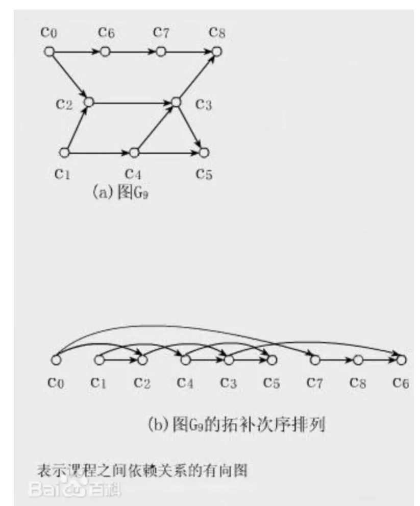
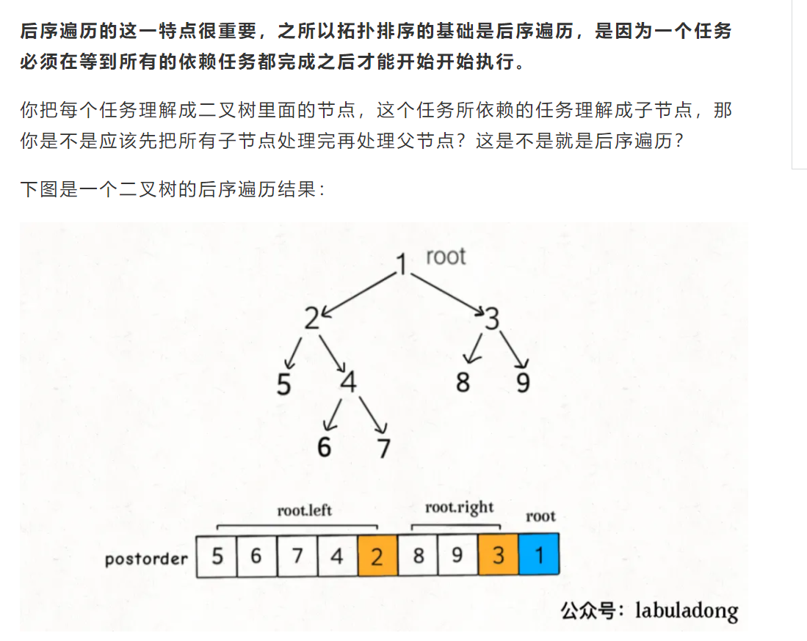
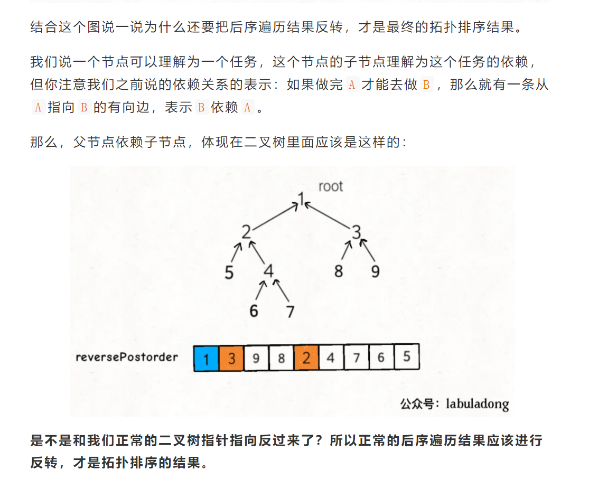

数据结构相关的算法无非两点：遍历 + 访问。那么图的基本遍历方法也很简单，前文 图算法基础 就讲了如何从多叉树的遍历框架扩展到图的遍历。

图这种数据结构还有一些比较特殊的算法，比如二分图判断，有环图无环图的判断，拓扑排序，以及最经典的最小生成树，单源最短路径问题，更难的就是类似网络流这样的问题。

不过以我的经验呢，像网络流这种问题，你又不是打竞赛的，除非自己特别有兴趣，否则就没必要学了；像最小生成树和最短路径问题，虽然从刷题的角度用到的不多，但它们属于经典算法，学有余力可以掌握一下；像拓扑排序这一类，属于比较基本且有用的算法，应该比较熟练地掌握。

那么本文就结合具体的算法题，来说说拓扑排序算法原理，因为拓扑排序的对象是有向无环图，所以顺带说一下如何判断图是否有环。

Topological Sorting

直观地说就是，让你把一幅图「拉平」，而且这个「拉平」的图里面，所有箭头方向都是一致的，比如上图所有箭头都是朝右的。
很显然，如果一幅有向图中存在环，是无法进行拓扑排序的，因为肯定做不到所有箭头方向一致；反过来，如果一幅图是「有向无环图」，那么一定可以进行拓扑排序。

后序遍历的这一特点很重要，之所以拓扑排序的基础是后序遍历，是因为一个任务必须在等到所有的依赖任务都完成之后才能开始开始执行。

