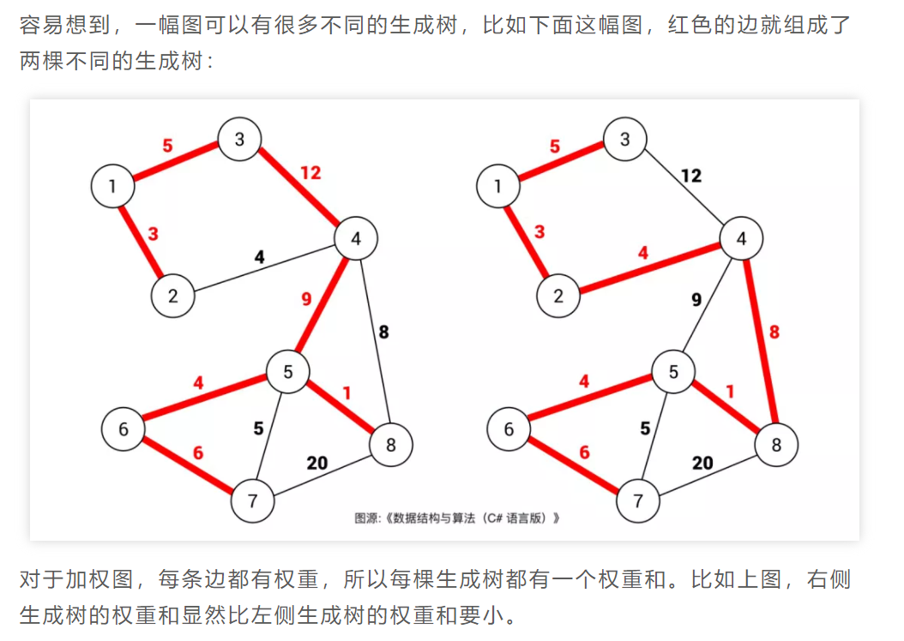
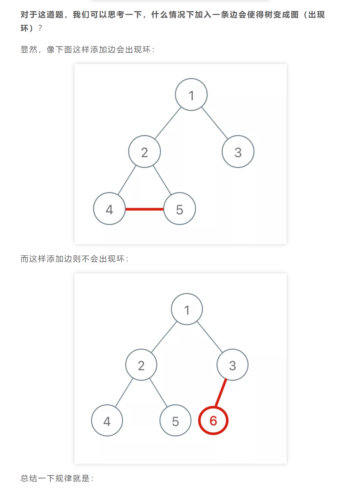

图论中知名度比较高的算法应该就是 Dijkstra 最短路径算法，环检测和拓扑排序，二分图判定算法 以及今天要讲的最小生成树（Minimum Spanning Tree）算法了。

Kruskal 算法其实很容易理解和记忆，其关键是要熟悉并查集算法，如果不熟悉，建议先看下前文 [Union-Find 并查集算法](https://mp.weixin.qq.com/s?__biz=MzAxODQxMDM0Mw==&mid=2247484751&idx=1&sn=a873c1f51d601bac17f5078c408cc3f6&scene=21#wechat_redirect)。

### 什么是最小生成树

==**先说「树」和「图」的根本区别：树不会包含环，图可以包含环**。==

如果一幅图没有环，完全可以拉伸成一棵树的模样。说的专业一点，树就是「无环连通图」。

就是在图中找一棵包含图中的所有节点的树。专业点说，生成树是含有图中所有顶点的「无环连通子图」。
==生成树是含有图中所有顶点的「无环连通子图」。==



对于加权图，每条边都有权重，所以每棵生成树都有一个权重和。比如上图，右侧生成树的权重和显然比左侧生成树的权重和要小。

==**那么最小生成树很好理解了，所有可能的生成树中，权重和最小的那棵生成树就叫「最小生成树」**。==

回顾 并查集算法 ==Union-Find 并查集算法 用来判断树不包含环，树不是图（图才有环）==

```tsx
class UF {
	count: number // 连通分量个数
	parent: number[] = [] // 存储一棵树
	size: number[] = [] // 记录树的“重量”
	constructor(n: number) {
		this.count = n
		this.parent = new Array(n).fill(0).map((_, index) => index) // [ 0,1,2,3,4,...]
		this.size = new Array(n).fill(1)
	}
	connected(p: number, q: number) {
		let rootP = this.find(p)
		let rootQ = this.find(q)
		return rootP === rootQ
	}

	find(x: number) {
		while (this.parent[x] !== x) {
			// 进行路径压缩
			this.parent[x] = this.parent[this.parent[x]]
			x = this.parent[x]
		}
		return x
	}
	union(p: number, q: number) {
		let rootP = this.find(p)
		let rootQ = this.find(q)
		if (rootP === rootQ) {
			return
		}

		// 小树接到大树下面，较平衡
		if (this.size[rootP] > this.size[rootQ]) {
			this.parent[rootQ] = rootP
			this.size[rootP] += this.size[rootQ]
		} else {
			this.parent[rootP] = rootQ
			this.size[rootQ] += this.size[rootP]
		}
		this.count--
	}
}
```



**对于添加的这条边，如果该边的两个节点本来就在同一连通分量里，那么添加这条边会产生环；反之，如果该边的两个节点不在同一连通分量里，则添加这条边不会产生环**。

而判断两个节点是否连通（是否在同一个连通分量中）就是 Union-Find 算法的拿手绝活，

## Kruskal 算法

所谓最小生成树，就是图中若干边的集合（我们后文称这个集合为 mst，最小生成树的英文缩写），你要保证这些边：

1、包含图中的所有节点。

2、形成的结构是树结构（即不存在环）。

3、权重和最小。

如何保证得到的这棵生成树是权重和最小的。???

方法是：
将所有边按照权重从小到大排序，从权重最小的边开始遍历，如果这条边和 mst 中的其它边不会形成环，则这条边是最小生成树的一部分，将它加入 mst 集合；否则，这条边不是最小生成树的一部分，不要把它加入 mst 集合。

这样，最后 mst 集合中的边就形成了最小生成树，下面我们看两道例题来运用一下 Kruskal 算法。

==你可以认为树的判定算法加上按权重排序的逻辑就变成了 Kruskal 算法。==
