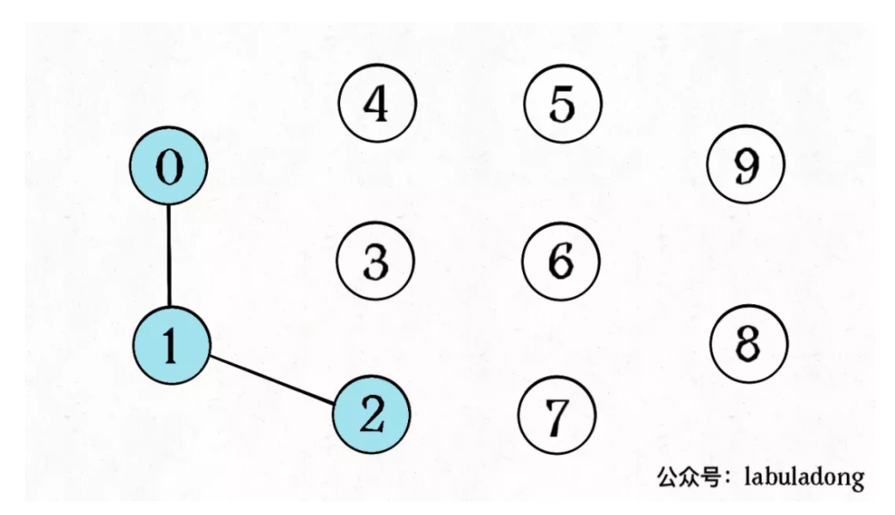
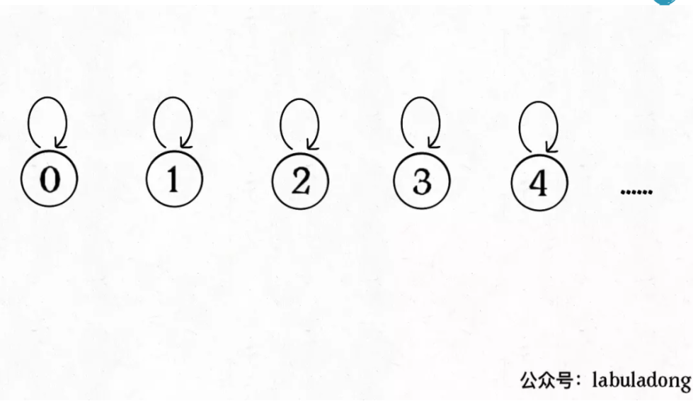
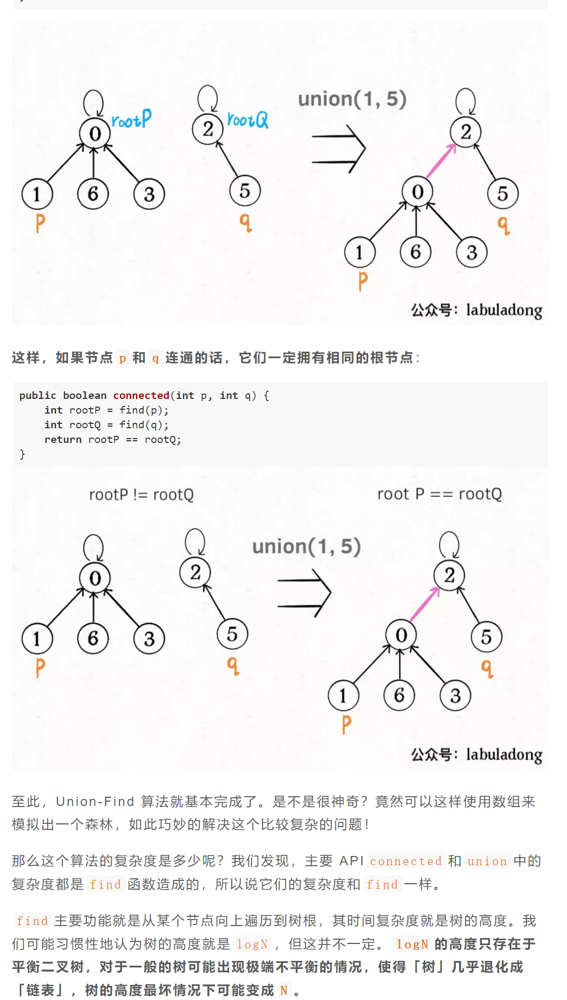
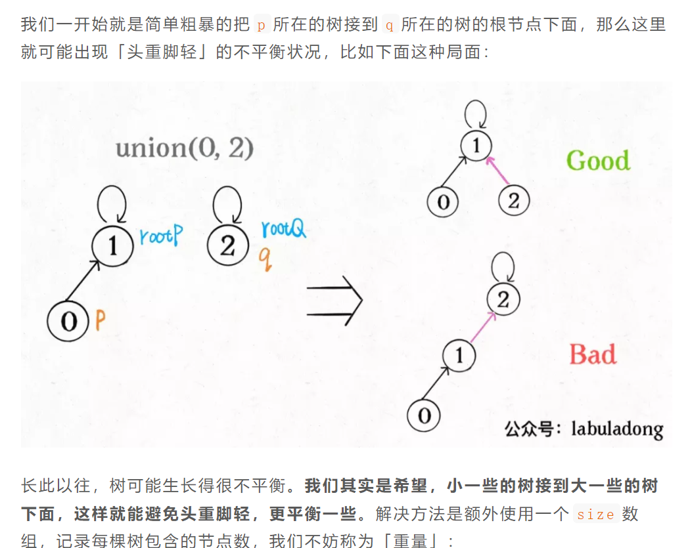
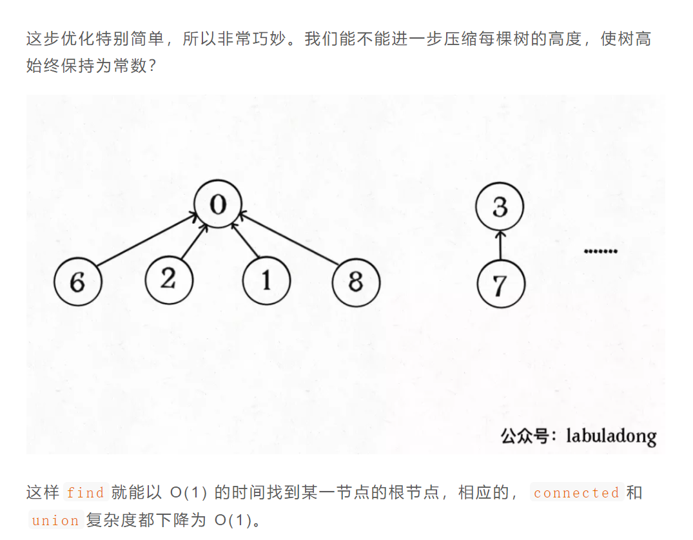

# Union-Find 并查集算法详解

==Union-Find 并查集算法 用来判断树不包含环，树不是图（图才有环）==


```tsx
现在我们的 Union-Find 算法主要需要实现这两个 API：
class UF {
    /* 将 p 和 q 连接 */
    public const union(p:number, q:number):void=>{}
    /* 判断 p 和 q 是否连通 */
    public const connected=(p:number, q:number):boolean=>{}
    /* 返回图中有多少个连通分量 */
    public const count=():number=>{}
}
```

动态连通性

这里所说的「连通」是一种等价关系，也就是说具有如下三个性质：

**1、自反性**：节点`p`和`p`是连通的。

**2、对称性**：如果节点`p`和`q`连通，那么`q`和`p`也连通。

**3、传递性**：如果节点`p`和`q`连通，`q`和`r`连通，那么`p`和`r`也连通。

比如说之前那幅图，0 ～ 9 任意两个**不同**的点都不连通，调用`connected`都会返回 false，连通分量为 10 个。

如果现在调用`union(0, 1)`，那么 0 和 1 被连通，连通分量降为 9 个。

再调用`union(1, 2)`，这时 0,1,2 都被连通，调用`connected(0, 2)`也会返回 true，连通分量变为 8 个。



怎么用森林来表示连通性呢？我们设定树的==每个节点有一个指针指向其父节点，如果是根节点的话，这个指针指向自己==。





**如果某两个节点被连通，则让其中的（任意）一个节点的根节点接到另一个节点的根节点上**：

比如说刚才那幅 10 个节点的图，一开始的时候没有相互连通，就是这样：



比如说`size[3] = 5`表示，以节点`3`为根的那棵树，总共有`5`个节点。这样我们可以修改一下`union`方法：

这样，通过比较树的重量，就可以保证树的生长相对平衡，树的高度大致在`logN`这个数量级，极大提升执行效率。

此时，`find`,`union`,`connected`的时间复杂度都下降为 O(logN)，即便数据规模上亿，所需时间也非常少。

### 路径压缩




Union-Find 算法的复杂度可以这样分析：构造函数初始化数据结构需要 O(N) 的时间和空间复杂度；连通两个节点`union`、判断两个节点的连通性`connected`、计算连通分量`count`所需的时间复杂度均为 O(1)。

```tsx
class UF {
	count: number // 连通分量个数
	parent: number[] = [] // 存储一棵树
	size: number[] = [] // 记录树的“重量”
	constructor(n: number) {
		this.count = n
		this.parent = new Array(n).fill(0).map((_, index) => index) // [ 0,1,2,3,4,...]
		this.size = new Array(n).fill(1)
	}
	connected(p: number, q: number) {
		let rootP = this.find(p)
		let rootQ = this.find(q)
		return rootP === rootQ
	}

	find(x: number) {
		while (this.parent[x] !== x) {
			// 进行路径压缩
			this.parent[x] = this.parent[this.parent[x]]
			x = this.parent[x]
		}
		return x
	}
	union(p: number, q: number) {
		let rootP = this.find(p)
		let rootQ = this.find(q)
		if (rootP === rootQ) {
			return
		}

		// 小树接到大树下面，较平衡
		if (this.size[rootP] > this.size[rootQ]) {
			this.parent[rootQ] = rootP
			this.size[rootP] += this.size[rootQ]
		} else {
			this.parent[rootP] = rootQ
			this.size[rootQ] += this.size[rootP]
		}
		this.count--
	}
}
```
