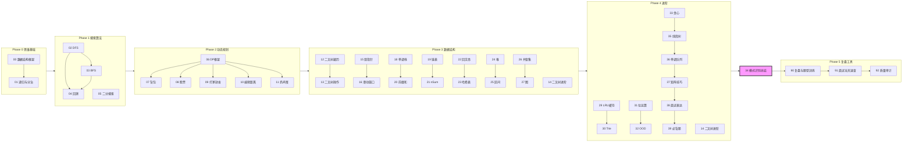
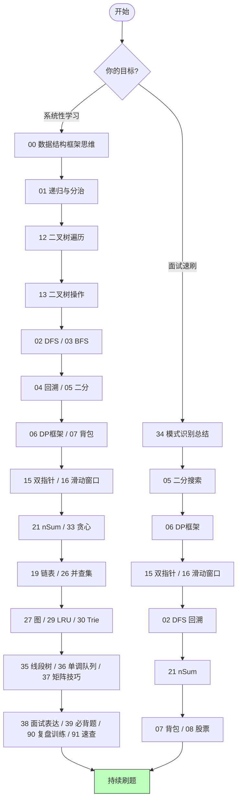

# 📘 Algorithm Frameworks

> 算法框架思维的结构化算法知识库：训练、查找、复盘、面试速查集中在一个入口。

---

## 快速入口

| 你要做什么 | 去哪 |
|---|---|
| 按题型/触发词/题号查专题 | [详细专题索引](indexes/ALGORITHM-INDEX.md) |
| 查完整题库题号映射 | [题号索引](indexes/QUESTION-INDEX.md) |
| 面试当天 30-60 分钟速查 | [91 面试当天速查](training/91-interview-day-cheatsheet.md) |
| 错题复盘与题型训练 | [90 错题复盘与题型训练](training/90-review-and-pattern-training.md) |
| 必背模板题 | [39 必背题清单](algorithm-frameworks/39-must-solve-list.md) |
| TypeScript / Python / 手写结构 | [95 语言基础与手写结构参考](reference/95-basic-coding-challenges.md) |
| 原始分类题库 | [List.md](List.md) |
| 重新生成题号索引 | `node scripts/generate-question-index.mjs` |
| 一键质量审计 | `node scripts/audit-docs.mjs` |

---

> 算法框架思维的结构化总结 —— 将零散笔记重构为 **47 篇结构化 Markdown**，覆盖并扩展 **269 道 LeetCode 高频题**。
>
> 每篇文章包含：核心思想 → TypeScript + Python 实现 → Mermaid 流程图 → 复杂度分析 → 刷题路线

---

## 🧭 怎么用这套笔记

```
① 按顺序从头读到尾（推荐）→ 适合系统性复习
② 刷题时遇到卡点 → 查对应主题文件
③ 面试前速刷 → 看 34-模式识别总结.md + 复杂度速查表
```

### 🗺️ 知识体系总图



### 📈 学习路线推荐



---

## 📦 文件总览 (47 篇)

### 🔷 全局入口 (2 篇)

| #   | 文件                  | 一句话总结                       | 核心题数 |
| --- | --------------------- | -------------------------------- | :------: |
| —   | [详细专题索引](indexes/ALGORITHM-INDEX.md)  | 按题目触发词和分类跳转到专题     |    —     |
| —   | [题号索引](indexes/QUESTION-INDEX.md)  | 从 `List.md` 生成的完整题号映射   |    —     |

### 🔷 Phase 0 — 思维基础 (2 篇)

| #   | 文件                                                                   | 一句话总结                                           | 核心题数 |
| --- | ---------------------------------------------------------------------- | ---------------------------------------------------- | :------: |
| 00  | [数据结构与算法框架思维](algorithm-frameworks/00-data-structures-and-algorithm-thinking.md) | 数组 vs 链表、遍历方式、Big-O、五步解题框架          |    12    |
| 01  | [递归与分治思想](algorithm-frameworks/01-recursion-and-divide-conquer.md)                   | 递归三要素、分治 vs DP vs 回溯 vs 贪心对比、归并排序 |    9     |

### 🔷 Phase 1 — 搜索算法 (4 篇)

| #   | 文件                                                                         | 一句话总结                                     | 核心题数 |
| --- | ---------------------------------------------------------------------------- | ---------------------------------------------- | :------: |
| 02  | [DFS 与回溯算法](algorithm-frameworks/02-dfs-backtracking.md)                                     | 回溯万能模板、4 种剪枝策略、N 皇后、全排列     |    18    |
| 03  | [BFS 框架](algorithm-frameworks/03-bfs-framework.md)                                              | BFS 模板、双向 BFS、多源 BFS、拓扑排序、图遍历 |    24    |
| 04  | [回溯：子集·排列·组合](algorithm-frameworks/04-backtracking-subsets-permutations-combinations.md) | 三合一模板、去重口诀、剪枝优化                 |    10    |
| 05  | [二分搜索框架](algorithm-frameworks/05-binary-search.md)                                          | 三种二分模板、答案二分法、珂珂吃香蕉           |    15    |

### 🔷 Phase 2 — 动态规划 (6 篇)

| #   | 文件                                                    | 一句话总结                                        | 核心题数 |
| --- | ------------------------------------------------------- | ------------------------------------------------- | :------: |
| 06  | [动态规划框架](algorithm-frameworks/06-dp-framework.md)                      | DP 四步走、斐波那契进化、零钱兑换、LCS            |    10    |
| 07  | [背包问题](algorithm-frameworks/07-knapsack-problems.md)                     | 0-1 背包 vs 完全背包、状态压缩、排列 vs 组合      |    8     |
| 08  | [团灭股票买卖](algorithm-frameworks/08-stock-series.md)                      | 三维状态机 DP、6 道股票题统一解法、冷冻期、手续费 |    6     |
| 09  | [打家劫舍与区间 DP](algorithm-frameworks/09-house-robber-and-interval-dp.md) | 线性→环形→树形 DP 递进                            |    7     |
| 10  | [编辑距离](algorithm-frameworks/10-edit-distance.md)                         | 二维 DP 表、增删改操作可视化、路径回溯            |    4     |
| 11  | [高楼扔鸡蛋](algorithm-frameworks/11-egg-drop.md)                            | DP + 二分优化、反向 DP 最优解                     |    2     |

### 🔷 Phase 3 — 数据结构 (16 篇)

| #   | 文件                                                     | 一句话总结                                       | 核心题数 |
| --- | -------------------------------------------------------- | ------------------------------------------------ | :------: |
| 12  | [二叉树遍历框架](algorithm-frameworks/12-binary-tree-traversal.md)            | 前/中/后序本质、迭代遍历、快排=前序归并=后序     |    17    |
| 13  | [二叉树常见操作与 BST](algorithm-frameworks/13-binary-tree-operations.md)     | 序列化、BST 增删查、合法性判断、重复子树         |    21    |
| 14  | [二叉树进阶](algorithm-frameworks/14-binary-tree-advanced.md)                  | LCA、序列化、路径综合、BST 迭代器                 |    10    |
| 15  | [双指针技巧](algorithm-frameworks/15-two-pointers.md)                         | 快慢/左右/归并/三指针 四种模式、接雨水           |    18    |
| 16  | [滑动窗口](algorithm-frameworks/16-sliding-window.md)                         | 万能滑动窗口模板、最小覆盖子串、定长窗口         |    8     |
| 17  | [排序算法合集](algorithm-frameworks/17-sorting-algorithms.md)                 | 10 大排序算法、Mermaid 流程、三语言实现          |    12    |
| 18  | [单调栈](algorithm-frameworks/18-monotonic-stack.md)                          | 下一个更大元素、每日温度、环形数组、接雨水       |    8     |
| 19  | [链表技巧](algorithm-frameworks/19-linked-list-techniques.md)                 | 反转链表、快慢指针、相交链表、回文链表、K 组反转 |    16    |
| 20  | [前缀和与差分数组](algorithm-frameworks/20-prefix-sum-and-diff-array.md)      | 前缀和 + 二分、和为 K 的子数组、差分航班预订     |    8     |
| 21  | [nSum 问题](algorithm-frameworks/21-n-sum-problems.md)                        | 两数之和→三数→四数、递归 nSum 统一框架           |    8     |
| 22  | [回文串与字符串](algorithm-frameworks/22-palindrome-and-string-techniques.md) | 中心扩展、验证回文串、最长回文子串               |    11    |
| 23  | [哈希表技巧](algorithm-frameworks/23-hash-table-techniques.md)                | 两数之和、字母异位词分组、最长连续序列           |    10    |
| 24  | [堆与优先级队列](algorithm-frameworks/24-heap-and-priority-queue.md)          | 双堆求中位数、Top K、合并 K 个链表               |    7     |
| 25  | [区间与扫描线](algorithm-frameworks/25-interval-and-sweep-line.md)            | 合并区间、会议室 II、扫描线模板                  |    7     |
| 26  | [并查集 Union-Find](algorithm-frameworks/26-union-find.md)                    | 路径压缩 + 按秩合并、岛屿数量、账户合并          |    7     |
| 27  | [图算法](algorithm-frameworks/27-graph-algorithms.md)                         | Dijkstra、拓扑排序、二分图染色                   |    9     |

### 🔷 Phase 4 — 进阶专题 (12 篇)

| #   | 文件                                                    | 一句话总结                          | 核心题数 |
| --- | ------------------------------------------------------- | ----------------------------------- | :------: |
| 28  | [字符串匹配](algorithm-frameworks/28-string-matching.md)                     | KMP / Rabin-Karp / Z-Algorithm     |    6     |
| 29  | [LRU & LFU 缓存](algorithm-frameworks/29-lru-and-lfu-cache.md)               | 哈希表 + 双向链表、频率桶淘汰       |    2     |
| 30  | [Trie 前缀树](algorithm-frameworks/30-trie-prefix-tree.md)                   | 插入/搜索/前缀搜索模板、通配符匹配  |    4     |
| 31  | [位运算](algorithm-frameworks/31-bit-manipulation-and-math.md)               | 异或性质、n&(n-1)、位掩码枚举子集   |    6     |
| 32  | [设计与 OOD](algorithm-frameworks/32-design-and-ood.md)                      | 最小栈、O(1)随机访问、LFU、文件系统 |    12    |
| 33  | [贪心算法](algorithm-frameworks/33-greedy.md)                                | 区间调度、跳跃游戏、加油站          |    7     |
| 34  | [算法模式识别总结](algorithm-frameworks/34-algorithm-pattern-recognition.md) | 看到什么→想到什么速查表 + 面试策略  |    —     |
| 35  | [线段树与树状数组](algorithm-frameworks/35-segment-tree-and-bit.md)           | Fenwick / Segment Tree / 区间查询  |    5     |
| 36  | [单调队列](algorithm-frameworks/36-monotonic-queue.md)                       | 滑动窗口最值、前缀和单调队列        |    4     |
| 37  | [矩阵技巧](algorithm-frameworks/37-matrix-techniques.md)                     | 网格 DFS/BFS、二维前缀和、矩阵变换  |    7     |
| 38  | [面试表达模板](algorithm-frameworks/38-interview-explanation-patterns.md)     | 暴力到优化、正确性、复杂度表达      |    —     |
| 39  | [必背题清单](algorithm-frameworks/39-must-solve-list.md)                     | 高频模板题压缩清单                  |    50    |

### 🔷 Phase 5 — 复盘训练与质量维护 (3 篇)

| #   | 文件                                      | 一句话总结                         | 核心题数 |
| --- | ----------------------------------------- | ---------------------------------- | :------: |
| 90  | [错题复盘与题型训练手册](training/90-review-and-pattern-training.md) | 错题复盘、题型触发、相似模式对比、间隔复习 |    —     |
| 91  | [面试当天速查](training/91-interview-day-cheatsheet.md) | 30-60 分钟最后速查：触发词、复杂度、边界 |    —     |
| 92  | [文档质量审计](Audit.md)       | 统计、围栏、双语代码块检查命令     |    —     |

### 🔷 Phase 6 — 补充专题 (2 篇)

| #   | 文件                                                                    | 一句话总结                     | 核心题数 |
| --- | ----------------------------------------------------------------------- | ------------------------------ | :------: |
| 95  | [语言基础与手写结构参考](reference/95-basic-coding-challenges.md)                 | TypeScript / Python / 基础练习 / 手写结构 |    20    |
| 99  | [剑指 Offer 题解](reference/99-jianzhi-offer.md)                                   | 71 道经典面试题，11 个分类     |    71    |

---

## 🗓️ 复习计划建议

### 按阶段推进

```
第 1 周 — 基础扫盲（5 篇）
  · 00 数据结构框架 → 01 递归分治 → 05 二分搜索 → 12 二叉树遍历 → 06 DP 框架
  · 目标：理解递归、遍历、DP 三要素

第 2 周 — 核心算法（6 篇）
  · 02 DFS → 03 BFS → 04 回溯 → 15 双指针 → 16 滑动窗口 → 21 nSum
  · 目标：掌握搜索、指针、窗口三大套路

第 3 周 — 数据结构（6 篇）
  · 13 二叉树操作 → 14 二叉树进阶 → 19 链表 → 24 堆 → 26 并查集 → 27 图
  · 目标：常见数据结构的应用场景

第 4 周 — 动态规划（4 篇）
  · 07 背包 → 08 股票 → 09 打家劫舍 → 10 编辑距离
  · 目标：DP 状态定义与转移方程

第 5 周 — 专项突破（逐篇）
  · 17 排序 → 18 单调栈 → 20 前缀和 → 22 回文串 → 23 哈希表
  · 25 区间 → 28 字符串匹配 → 29 LRU → 30 Trie → 31 位运算
  · 33 贪心 → 34 模式识别 → 35 线段树 → 36 单调队列 → 37 矩阵技巧
  · 38 面试表达 → 39 必背题清单 → 90 错题复盘与题型训练 → 91 面试当天速查

第 6 周 — 实战查漏
  · 99 剑指 Offer 71 道（每天 12 道）
  · 用 90 复习错题、做题型触发训练、按间隔复习计划二刷
```

### 面试前突击时间表

| 时间 | 做什么 |
|---|---|
| **提前 1 个月** | 按上面 6 周计划过一遍，每篇看思路 + 抄一遍模板 |
| **提前 1 周** | 刷 34-模式识别 → 90-复盘训练 → 05-二分 → 06-DP → 02-DFS → 15-双指针 → 16-滑动窗口 |
| **提前 1 天** | 看 91 面试当天速查 + 39 必背题 + 各篇末尾的复杂度表 |

### 主动复习技巧

```
1. 遮住代码，只看核心一句话，尝试默写模板
2. 随机翻到某篇的复杂度表，回忆每种操作的时间复杂度
3. 做 List.md 中标记 ✅ 的题，限时 15 分钟
4. 用 34-模式识别 的速查表反向训练：看到题目特征 → 想到对应算法
5. 用 90 训练：只看题名说模式，再判断相似模式为什么不用
6. 用 90 的每日 30 分钟方案保持手感：题名识别 → 模板默写 → 限时题 → 复盘
```

---

| 来源                   |    数量    | 备注                                 |
| ---------------------- | :--------: | ------------------------------------ |
| 原始题库规模           | **269 题** | 来自 `leetcode-questions-summary.md` |
| 当前专题/索引文件      | **47 篇**  | 不含本入口 README                    |
| 新增扩展专题           | **9 篇**   | 线段树/树状数组、单调队列、矩阵技巧、面试表达、必背题、错题复盘与题型训练、面试当天速查、质量审计 |

---

## 🔗 关联阅读顺序建议

```
新手友好路径：
  00 → 01 → 12 → 13 → 14 → 02 → 03 → 04 → 05 → 06 → 07 → 15 → 16 → 21 → 34

面试速刷路径：
  91 → 34 → 90 → 39 → 05 → 06 → 02 → 15 → 16 → 21 → 07 → 08 → 19 → 23 → 24 → 33 → 38
```
