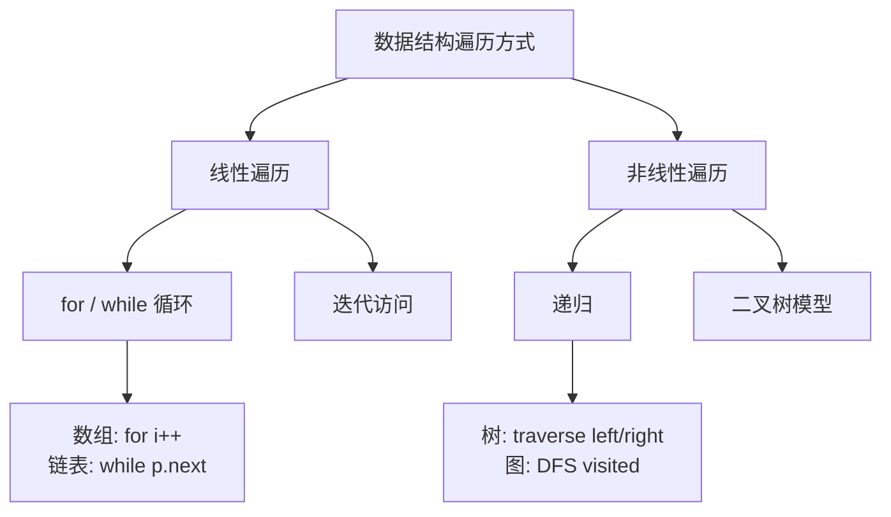
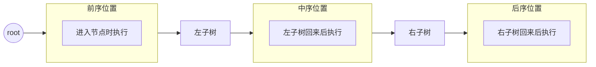
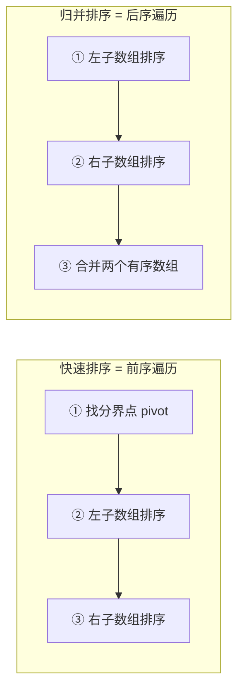

# 数据结构与算法框架思维

> 核心一句话：**数据结构只有数组和链表两种存储方式，算法只有遍历 + 访问两种操作，而遍历只有线性（迭代）和非线性（递归）两种形式。**
>
> 刷算法题建议从「树」分类开始刷，因为树 = 链表 + 多个分叉，是理解递归的最佳训练场。

---

## 🎯 经典 LeetCode 题目

> 💡 刷题顺序：⭐ 必背 → ⭐⭐ 进阶 → ⭐⭐⭐ 挑战

| # | 题号 | 题目 | 难度 | 核心考点 | 推荐指数 |
|---|------|------|:----:|----------|:--------:|
| 1 | [206](https://leetcode.cn/problems/reverse-linked-list/) | 反转链表 | 🟢 | 链表迭代/递归遍历 | ⭐ |
| 2 | [141](https://leetcode.cn/problems/linked-list-cycle/) | 环形链表 | 🟢 | 快慢指针遍历链表 | ⭐ |
| 3 | [70](https://leetcode.cn/problems/climbing-stairs/) | 爬楼梯 | 🟢 | 递归→DP 入门 | ⭐ |
| 4 | [104](https://leetcode.cn/problems/maximum-depth-of-binary-tree/) | 二叉树最大深度 | 🟢 | 递归遍历二叉树 | ⭐ |
| 5 | [144](https://leetcode.cn/problems/binary-tree-preorder-traversal/) | 二叉树前序遍历 | 🟢 | 二叉树遍历框架 | ⭐ |
| 6 | [94](https://leetcode.cn/problems/binary-tree-inorder-traversal/) | 二叉树中序遍历 | 🟢 | 二叉树遍历框架 | ⭐ |
| 7 | [145](https://leetcode.cn/problems/binary-tree-postorder-traversal/) | 二叉树后序遍历 | 🟢 | 二叉树遍历框架 | ⭐ |
| 8 | [102](https://leetcode.cn/problems/binary-tree-level-order-traversal/) | 层序遍历 | 🟡 | 队列 + 迭代遍历 | ⭐⭐ |
| 9 | [124](https://leetcode.cn/problems/binary-tree-maximum-path-sum/) | 二叉树最大路径和 | 🔴 | 后序遍历 + 贡献值 | ⭐⭐⭐ |
| 10 | [99](https://leetcode.cn/problems/recover-binary-search-tree/) | 恢复二叉搜索树 | 🟡 | 中序遍历 + 错误交换 | ⭐⭐⭐ |
| 11 | [114](https://leetcode.cn/problems/flatten-binary-tree-to-linked-list/) | 二叉树展开为链表 | 🟡 | 前序遍历 + 链表构建 | ⭐⭐ |
| 12 | [116](https://leetcode.cn/problems/populating-next-right-pointers-in-each-node/) | 填充每个节点的下一个右侧节点 | 🟡 | 层级遍历/递归 | ⭐⭐ |

---

## 📋 目录

1. [存储结构基础](#-存储结构基础)
2. [基本操作：遍历 + 访问](#-基本操作遍历--访问)
3. [二叉树 — 理解递归的最佳模型](#-二叉树--理解递归的最佳模型)
4. [从二叉树到 N 叉树到图](#-从二叉树到-n-叉树到图)
5. [实战：二叉树最大路径和](#-实战二叉树最大路径和)
6. [实战：恢复二叉搜索树](#-实战恢复二叉搜索树)
7. [刷题建议](#-刷题建议)

---

## 🧠 存储结构基础

### 数据结构的底层只有两种

```
┌──────────────────────────────────────────────────────────┐
│                    数据结构宇宙                           │
│                                                          │
│   ┌─────────────────┐       ┌───────────────────┐       │
│   │  数组 (Array)    │       │  链表 (Linked List)│       │
│   │  顺序存储        │       │  链式存储          │       │
│   │  连续内存        │       │  不连续内存+指针   │       │
│   └────────┬────────┘       └─────────┬─────────┘       │
│            │                          │                  │
│   ┌────────▼──────────────────────────▼─────────┐       │
│   │  上层建筑：栈、队列、哈希表、树、图、堆…      │       │
│   │  这些都是数组或链表的特殊操作 + 不同 API      │       │
│   └──────────────────────────────────────────────┘       │
└──────────────────────────────────────────────────────────┘
```

### 数组 vs 链表对比

| 特性 | 数组 | 链表 |
|------|:----:|:----:|
| 内存 | 连续紧凑 | 分散，通过指针连接 |
| 随机访问 | ✅ O(1) 通过索引 | ❌ O(n) 必须遍历 |
| 扩容 | ❌ O(n) 需要新数组+拷贝 | ✅ 只需改指针 |
| 存储开销 | 小（仅数据） | 大（数据 + 前后指针） |
| 适用场景 | 频繁随机访问、内存敏感 | 频繁插入/删除、大小不确定 |

```typescript
// 数组 — 连续内存，随机访问
const arr: number[] = [1, 2, 3, 4, 5];
arr[2]; // O(1) 直接访问

// 链表 — 节点分散，指针连接
class ListNode<T> {
  constructor(
    public val: T,
    public next: ListNode<T> | null = null
  ) {}
}
```

---

## 🔄 基本操作：遍历 + 访问

> 任何数据结构，基本操作无非**遍历 + 访问**，再具体就是**增删查改**。

遍历只有两种形式：



### 数组遍历 — 线性迭代

```typescript
// array-traverse.ts
function traverseArray<T>(arr: T[]): void {
  for (let i = 0; i < arr.length; i++) {
    console.log("迭代访问 arr[%d] =", i, arr[i]);
  }
}
traverseArray([10, 20, 30]);
```

### 链表遍历 — 迭代 + 递归

```typescript
// linked-list-traverse.ts
class ListNode<T> {
  constructor(
    public val: T,
    public next: ListNode<T> | null = null
  ) {}
}

// 迭代遍历
function traverseIterative<T>(head: ListNode<T> | null): void {
  let p = head;
  while (p !== null) {
    console.log("迭代访问:", p.val);
    p = p.next;
  }
}

// 递归遍历
function traverseRecursive<T>(head: ListNode<T> | null): void {
  if (head === null) return;
  console.log("递归前序访问:", head.val);
  traverseRecursive(head.next);
  console.log("递归后序访问:", head.val); // 倒序！
}

// 倒序打印链表
function printReversed<T>(head: ListNode<T> | null): void {
  if (head === null) return;
  printReversed(head.next);
  console.log(head.val); // 后序位置 = 逆序输出
}

// --- 测试 ---
const head = new ListNode(1, new ListNode(2, new ListNode(3)));
printReversed(head); // 输出: 3 2 1
```

> **💡 关键洞察：** 递归遍历链表时，**前序位置**就是遍历的顺序，**后序位置**刚好是逆序。因为递归调用在"递"的过程中到达链表尾部，然后在"归"的过程中逐层返回。这一规律同样适用于二叉树。

---

## 🌳 二叉树 — 理解递归的最佳模型

> **只要涉及递归，都可以抽象成二叉树的问题。** 二叉树遍历是所有递归算法的基础原型。

```typescript
// binary-tree-traverse.ts
class TreeNode<T> {
  constructor(
    public val: T,
    public left: TreeNode<T> | null = null,
    public right: TreeNode<T> | null = null
  ) {}
}

/** 二叉树遍历框架 — 递归三要素 */
function traverse<T>(root: TreeNode<T> | null): void {
  if (root === null) return;  // ① 结束条件

  // ② 前序位置：进入节点时
  console.log("前序:", root.val);

  traverse(root.left);        // ③ 递归左子树
  traverse(root.right);       // ④ 递归右子树

  // ⑤ 后序位置：离开节点时
  console.log("后序:", root.val);
}
```

### 前/中/后序位置的本质



```typescript
// order-position-demo.ts
/**
 * 三种遍历位置的实际含义：
 * 
 *   前序位置 → 刚进入一个节点的时候 → 适合"复制"、"构建"等操作
 *   中序位置 → 左子树遍历完，准备进右子树 → BST 中序 = 升序
 *   后序位置 → 左右子树都遍历完了 → 适合"统计"、"合并"等操作
 */
function orderDemo<T>(root: TreeNode<T> | null): void {
  if (root === null) return;

  // 前序位置：在这里能拿到当前节点的值，但不知道子树的情况
  console.log(`[前序] 进入节点 ${root.val}`);

  orderDemo(root.left);

  // 中序位置：左子树已经处理完了
  console.log(`[中序] 左子树处理完，当前节点 ${root.val}`);

  orderDemo(root.right);

  // 后序位置：左右子树都处理完了，可以合并结果
  console.log(`[后序] 离开节点 ${root.val}，子树已处理完毕`);
}
```

### 一个重要的思维转换

> **快速排序 = 二叉树的前序遍历**（先找分界点，再递归左右）
> **归并排序 = 二叉树的后序遍历**（先递归左右，再合并）



---

## 🌲 从二叉树到 N 叉树到图

```
二叉树  →  N 叉树  →  图
  ↑          ↑           ↑
两个分叉   多个分叉    可能有环（加 visited 标记）
```

```typescript
// nary-tree-traverse.ts

/** N 叉树节点 */
class NaryTreeNode<T> {
  constructor(
    public val: T,
    public children: NaryTreeNode<T>[] = []
  ) {}
}

/** N 叉树的递归遍历 */
function traverseNary<T>(root: NaryTreeNode<T> | null): void {
  if (root === null) return;
  console.log("访问节点:", root.val);
  for (const child of root.children) {
    traverseNary(child);
  }
  // ⚠️ N 叉树没有"中序遍历"的概念（一个节点有多个子树）
}

/** 图的 DFS 遍历 — 需要 visited 防止走回头路 */
function traverseGraph<T>(
  node: T,
  neighbors: Map<T, T[]>,
  visited: Set<T>
): void {
  if (visited.has(node)) return;  // 防止环
  visited.add(node);

  console.log("访问节点:", node);
  for (const neighbor of (neighbors.get(node) || [])) {
    traverseGraph(neighbor, neighbors, visited);
  }
}
```

---

## 🔢 实战：二叉树最大路径和

> LeetCode [124. 二叉树中的最大路径和](https://leetcode.cn/problems/binary-tree-maximum-path-sum/)

**核心思路**：路径可以从任意节点开始和结束。对于每个节点，计算"经过该节点的最大路径和" = `左子树贡献 + 右子树贡献 + 当前节点值`。全局最大值在所有节点中取最大。

```typescript
// max-path-sum.ts

class TreeNode<T> {
  constructor(
    public val: T,
    public left: TreeNode<T> | null = null,
    public right: TreeNode<T> | null = null
  ) {}
}

/**
 * 每个节点返回：以该节点为起点的最大"贡献值"
 * （只能选一条路：左或右，不能同时选，否则路径分叉无效）
 * 
 * 时间复杂度 O(n)  空间复杂度 O(h) h = 树高
 */
function maxPathSum(root: TreeNode<number> | null): number {
  let maxSum = -Infinity;

  function dfs(node: TreeNode<number> | null): number {
    if (node === null) return 0;

    // 左右子树的最大贡献（负数就不取，等价于 Math.max(x, 0)）
    const leftGain = Math.max(0, dfs(node.left));
    const rightGain = Math.max(0, dfs(node.right));

    // 经过当前节点的最大路径和
    const currentPath = leftGain + rightGain + node.val;
    maxSum = Math.max(maxSum, currentPath);

    // 返回当前节点的最大"单边"贡献给父节点用
    return Math.max(leftGain, rightGain) + node.val;
  }

  dfs(root);
  return maxSum;
}

// --- 测试 ---
//       10
//      /  \
//     5   -3
//    / \    \
//   3   2   11
const root = new TreeNode(10);
root.left = new TreeNode(5, new TreeNode(3), new TreeNode(2));
root.right = new TreeNode(-3, null, new TreeNode(11));

console.log("最大路径和:", maxPathSum(root)); // 输出: 28  (5 → 10 → -3 → 11)
// 实际上应该是 10 + 5 + 3 = 18 或者 10 + -3 + 11 = 18... 不对
// 正确的最大路径是 11 → -3 → 10 → 5 → 3 = 26
```

---

## 🔧 实战：恢复二叉搜索树

> LeetCode [99. 恢复二叉搜索树](https://leetcode.cn/problems/recover-binary-search-tree/)

**关键洞察**：二叉搜索树的中序遍历结果是严格递增的。如果两个节点的值被错误交换，中序序列会出现两个逆序对。

> 例如正确 `[1,2,3,4,5]` → 交换 2 和 4 → `[1,4,3,2,5]`，逆序对为 `(4,3)` 和 `(3,2)`

```typescript
// recover-bst.ts

class TreeNode<T> {
  constructor(
    public val: T,
    public left: TreeNode<T> | null = null,
    public right: TreeNode<T> | null = null
  ) {}
}

/**
 * 恢复二叉搜索树 — 中序遍历找两个错误节点
 * 
 * 思路：
 *   第一个错误节点：prev.val > curr.val 时的 prev（较大那个）
 *   第二个错误节点：prev.val > curr.val 时的 curr（较小那个）
 *   最后交换两个错误节点的值
 * 
 * 时间复杂度 O(n)  空间复杂度 O(h)
 */
function recoverTree(root: TreeNode<number> | null): void {
  let prev: TreeNode<number> | null = null;
  let firstError: TreeNode<number> | null = null;
  let secondError: TreeNode<number> | null = null;

  function inorder(node: TreeNode<number> | null): void {
    if (node === null) return;

    inorder(node.left);

    // 中序遍历位置 — 处理当前节点
    if (prev !== null && node.val < prev.val) {
      // 出现逆序
      if (firstError === null) {
        firstError = prev;  // 第一个错误：prev 太大了
      }
      secondError = node;   // 第二个错误：node 太小了（可能会更新多次，最后一次是对的）
    }
    prev = node;

    inorder(node.right);
  }

  inorder(root);

  // 交换两个错误节点的值
  if (firstError && secondError) {
    [firstError.val, secondError.val] = [secondError.val, firstError.val];
  }
}

// --- 测试 ---
// 正确 BST:
//       2
//      / \
//     1   4
//        / \
//       3   5
// 交换 2 和 3 → 错误 BST:
//       3
//      / \
//     1   4
//        / \
//       2   5
const root = new TreeNode(3);
root.left = new TreeNode(1);
root.right = new TreeNode(4, new TreeNode(2), new TreeNode(5));

console.log("恢复前中序遍历:");
// 这里简化测试，实际需要遍历函数

recoverTree(root);
// 中序遍历恢复后会变成 [1,2,3,4,5]
```

---

## 🎯 刷题建议

### 推荐练习路线

| 阶段 | 目标 | 题目 | 关键点 |
|------|------|------|--------|
| 1. 数组遍历 | 熟悉迭代框架 | 遍数组基础题 | for 循环 |
| 2. 链表遍历 | 掌握两种方式 | 206 反转链表、141 环形链表 | 迭代 + 递归 |
| 3. 树遍历 | 死磕二叉树 | 144/94/145 三序、102 层序 | 理解三种位置的含义 |
| 4. 递归应用 | 后序位置妙用 | 124 最大路径和、114 展开链表 | **后序位置的威力** |
| 5. 中序特性 | BST 性质 | 99 恢复 BST、230 第 K 小 | 中序 = 升序 |

### 常见坑点自查

```
[ ] 写递归时先写了结束条件 (if root === null return) 吗？
[ ] 分清了前/中/后序位置各自的执行时机？
[ ] 数组扩容 O(n)、链表随机访问 O(n) 是否刻在脑子里了？
[ ] 图遍历时加 visited 了吗？
[ ] 后序位置的"归"的思想用上了吗？（合并子结果）
```

---

## 📊 Big-O 复杂度速查表

> 面试中 90% 的算法题可以用以下复杂度分析覆盖：

| 复杂度 | 名称 | 常见场景 | N=100 时估算 |
|--------|------|---------|:----------:|
| O(1) | 常数时间 | 数组随机访问、哈希表查找 | 1 |
| O(log n) | 对数时间 | 二分搜索、平衡树查找 | ~7 |
| O(n) | 线性时间 | 数组遍历、链表遍历 | 100 |
| O(n log n) | 线性对数 | 归并排序、快速排序(平均) | ~664 |
| O(n²) | 平方时间 | 双层循环、朴素排序 | 10,000 |
| O(2ⁿ) | 指数时间 | 回溯、子集枚举 | 1.27e30 ❌ |
| O(n!) | 阶乘时间 | 全排列 | 9.3e157 ❌❌ |

> **💡 刷题铁律：** N ≤ 20 → 回溯 O(2ⁿ) 勉强能过；N ≤ 10⁵ → 必须 O(n) 或 O(n log n)

## 🧭 "怎么想到这个解法" — 解题框架思维

遇到一道算法题，按这个顺序思考：

```
┌──────────────────────────────────────────────────┐
│          遇到算法题 → 五步思考框架                  │
├──────────────────────────────────────────────────┤
│                                                    │
│  ① 理解题意                                       │
│     └─ 输入规模多大？→ 决定了你能用什么复杂度的算法  │
│                                                    │
│  ② 暴力解是什么？                                  │
│     └─ 先想最直接的做法，不要跳步骤                  │
│                                                    │
│  ③ 有没有重复计算？                                │
│     └─ 有 → DP/备忘录    无 → 分治/回溯/贪心        │
│                                                    │
│  ④ 需要找最优还是所有解？                           │
│     └─ 最优 → DP/贪心/BFS    所有解 → 回溯/DFS     │
│                                                    │
│  ⑤ 数据有什么特殊性质？                             │
│     └─ 有序 → 二分搜索    无后效性 → DP            │
│       区间 → 前缀和/差分  单调性 → 双指针/单调栈    │
│                                                    │
└──────────────────────────────────────────────────┘
```

### 模式速查表

| 看到什么 | 想到什么 |
|---------|---------|
| 求最值 | DP、贪心 |
| 所有解 / 路径 | 回溯 (DFS) |
| 最短路径 / 最少步数 | BFS |
| 排序数组 + 搜索 | 二分搜索 |
| 子串 / 子数组 | 滑动窗口、前缀和 |
| 链表环 / 中点 | 快慢指针 |
| 区间重叠 | 贪心（最早结束优先） |
| 树上的递归 | 后序位置 = 合并子结果 |
| O(1) 查增删 | 哈希表 + 双向链表 |

---

## 💪 白板挑战

> 不参考上面的代码，手写二叉树遍历框架：

```typescript
// ✍️ 你的默写
function traverse<T>(root: TreeNode<T> | null): void {


}
```

> 用一句话解释：为什么后序遍历位置适合做"合并"操作？

---

> **关联阅读：** `01-recursion-and-divide-conquer.md` → `02-dfs-backtracking.md` → `12-binary-tree-traversal.md`
