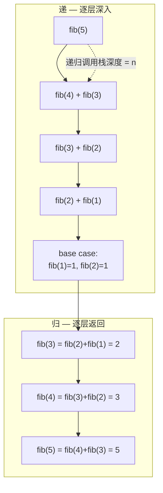
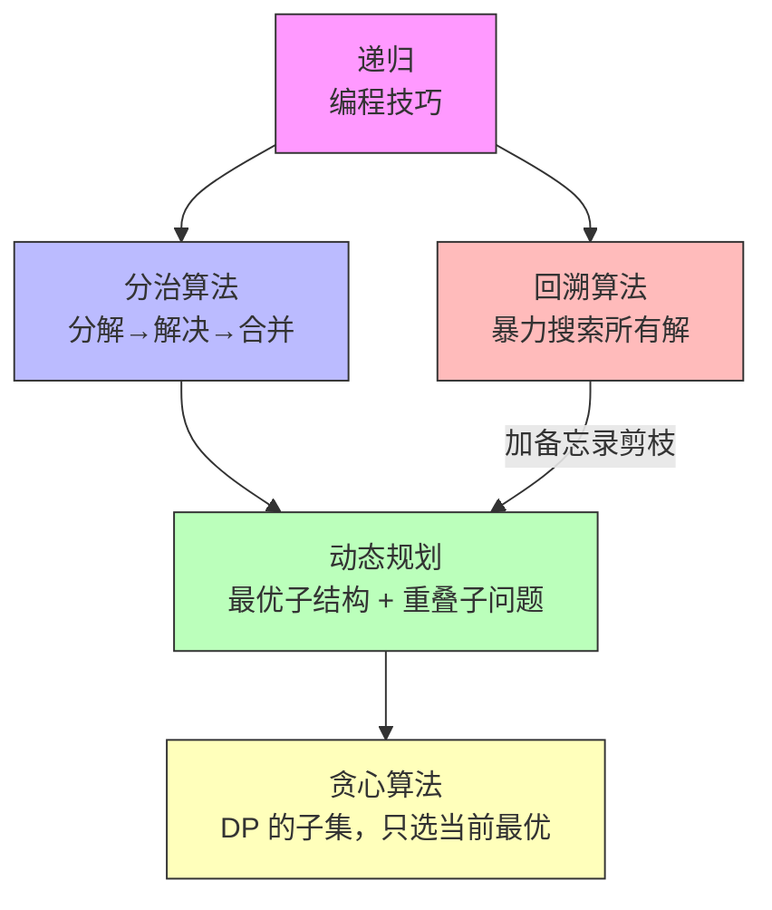
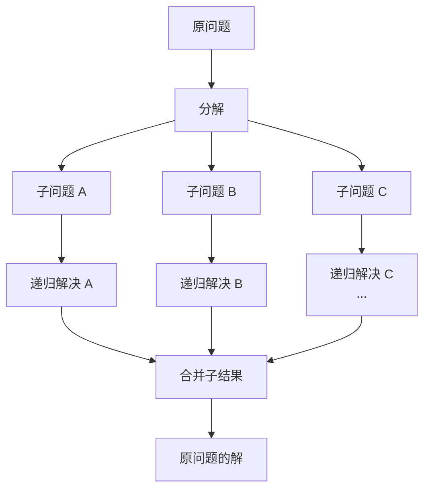
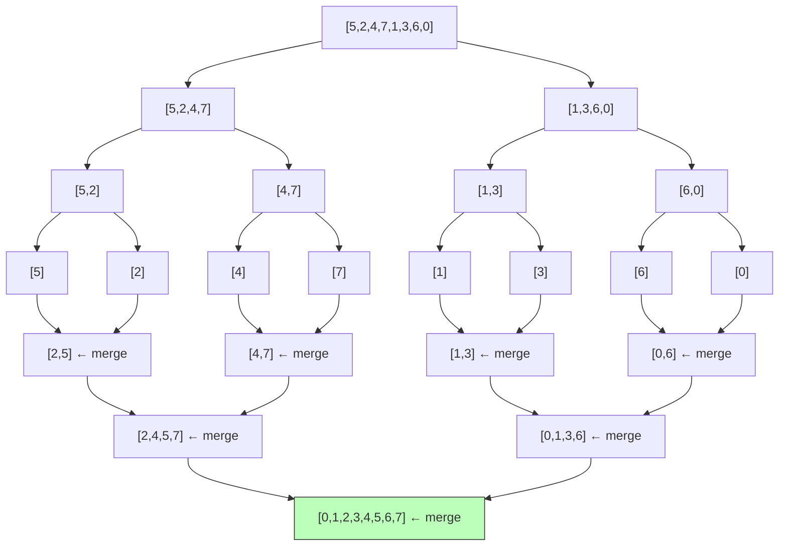
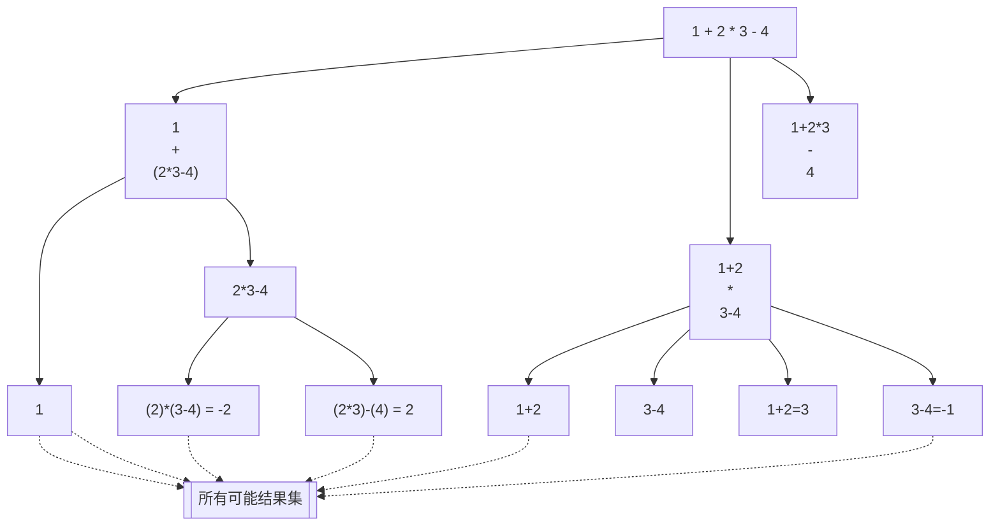
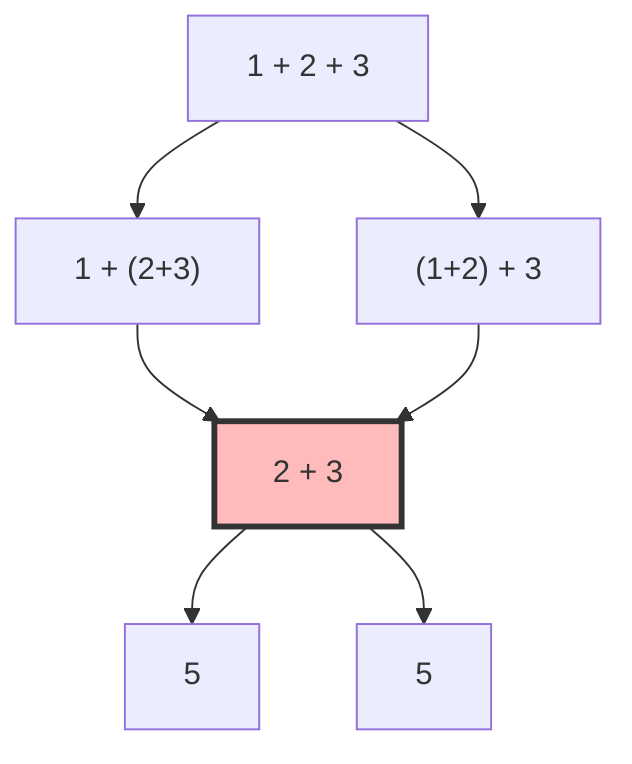

# 递归与分治思想

> 核心一句话：**递归是一种编程技巧，分治是一种算法思想。写递归的关键是明确函数定义并相信它，不要跳进递归细节。**
>
> 递归、分治、动态规划、回溯、贪心 —— 这五者的关系是层层递进的，理解它们之间的区别是算法水平的试金石。

---

## 🎯 经典 LeetCode 题目

> 💡 刷题顺序：⭐ 必背 → ⭐⭐ 进阶 → ⭐⭐⭐ 挑战

| #   | 题号                                                                                           | 题目                          | 难度 | 核心考点             | 推荐指数 |
| --- | ---------------------------------------------------------------------------------------------- | ----------------------------- | :--: | -------------------- | :------: |
| 1   | [50](https://leetcode.cn/problems/powx-n/)                                                     | Pow(x, n)                     |  🟡  | 分治快速幂           |    ⭐    |
| 2   | [169](https://leetcode.cn/problems/majority-element/)                                          | 多数元素                      |  🟢  | 分治合并             |    ⭐    |
| 3   | [53](https://leetcode.cn/problems/maximum-subarray/)                                           | 最大子数组和                  |  🟡  | 分治 / DP            |   ⭐⭐   |
| 4   | [241](https://leetcode.cn/problems/different-ways-to-add-parentheses/)                         | 为运算表达式设计优先级        |  🟡  | 分治 + 表达式树      |  ⭐⭐⭐  |
| 5   | [912](https://leetcode.cn/problems/sort-an-array/)                                             | 排序数组                      |  🟡  | 归并排序（分治模版） |    ⭐    |
| 6   | [215](https://leetcode.cn/problems/kth-largest-element-in-an-array/)                           | 数组中的第 K 大元素           |  🟡  | 快速选择（分治）     |   ⭐⭐   |
| 7   | [395](https://leetcode.cn/problems/longest-substring-with-at-least-k-repeating-characters/)    | 至少有 K 个重复字符的最长子串 |  🟡  | 分治 + 计数          |  ⭐⭐⭐  |
| 8   | [932](https://leetcode.cn/problems/beautiful-array/)                                           | 漂亮数组                      |  🟡  | 分治构造             |  ⭐⭐⭐  |
| 9   | [105](https://leetcode.cn/problems/construct-binary-tree-from-preorder-and-inorder-traversal/) | 从前序与中序构造二叉树        |  🟡  | 分治构建树           |   ⭐⭐   |

---

## 📋 目录

1. [递归的本质](#-递归的本质)
2. [递归 → 分治 → DP → 回溯 → 贪心：五者关系](#-递归--分治--dp--回溯--贪心五者关系)
3. [分治算法三步走](#-分治算法三步走)
4. [经典案例：归并排序](#-经典案例归并排序)
5. [经典案例：表达式加括号（LeetCode 241）](#-经典案例表达式加括号leetcode-241)
6. [备忘录优化（剪枝重复子问题）](#-备忘录优化剪枝重复子问题)
7. [复杂度速查表](#-复杂度速查表)
8. [刷题建议](#-刷题建议)

---

## 🧠 递归的本质

### 递归三要素

```
① 结束条件（Base Case）：最简子问题的解，不再调用自身
② 自我调用（Recursive Case）：把问题分解为规模更小的子问题
③ 信任函数定义：假设子问题已经被正确解决，利用它构造原问题答案
```

```typescript
// recursion-template.ts
/**
 * 递归函数的通用思考模式：
 *
 *   1. 这个函数是干什么的？（明确函数定义）
 *   2. 什么时候不需要递归？（找到 base case）
 *   3. 怎么把大问题变成小问题？（找到递归关系）
 */
function recursive(input: any): any {
  // 2️⃣ Base case：最简单的场景，直接返回
  if (/* 最简单的条件 */) {
    return /* 直接答案 */;
  }

  // 3️⃣ 递归调用：相信函数能解决子问题
  const subResult = recursive(/* 规模更小的输入 */);

  // 合并子问题结果
  return /* 利用 subResult 构造答案 */;
}
```

### 递归的调用过程：递 vs 归



### 递归的思维转变

> **递推思维：** 关心"现在怎么做"，想着下一步 → 正常人的思维
> **递归思维：** 看到问题的"尽头"，假设子问题已解决 → 逆向思维

```typescript
// 关键心态：不要试图跟踪每一层递归！
// ❌ 错误：脑子里模拟整个调用栈
// ✅ 正确：只关心函数定义，相信它能完成任务

// 例子：倒序打印链表
function printReversed<T>(head: ListNode<T> | null): void {
  if (head === null) return; // base case
  printReversed(head.next); // ❓ 先不管它做了什么，相信它能打印后面的
  console.log(head.val); // 我只需要在当前节点打印
}
```

---

## 🔗 递归 → 分治 → DP → 回溯 → 贪心：五者关系



| 算法         | 本质       | 子问题关系       | 典型场景           |    能否加备忘录    |
| ------------ | ---------- | ---------------- | ------------------ | :----------------: |
| **递归**     | 编程技巧   | —                | 一切可分解的问题   |         —          |
| **分治**     | 分解合并   | 子问题**不重复** | 归并排序、快速排序 |     一般不需要     |
| **动态规划** | 最优子结构 | 子问题**会重复** | 最短路径、背包问题 |     ✅ 必须加      |
| **回溯**     | 暴力枚举   | 无重叠子问题     | 全排列、N 皇后     |   ❌ 加了就变 DP   |
| **贪心**     | 局部最优   | 特殊子结构       | 区间调度、换硬币   | 不需要（但难证明） |

> **一个思考实验：** 回溯算法加个备忘录剪枝 → 就变成动态规划了。
> 分治算法加个备忘录剪枝 → 其实也用得上（如 LeetCode 241 优化）。

---

## 📐 分治算法三步走

```
    分治 = 分解（Divide） + 解决（Conquer） + 合并（Combine）

    ① Divide：    将原问题分解为结构相同的子问题
    ② Conquer：   递归地解决子问题（直到 base case）
    ③ Combine：   将子问题的解合并成原问题的解
```



```typescript
// divide-and-conquer-template.ts
/**
 * 分治算法通用框架
 *
 * 归并排序就是最典型的分治：
 *   分：把数组从中间分成两半，分别排序
 *   治：合并两个有序数组
 */
function divideAndConquer(problem: any): any {
  // 1️⃣ Base case：问题足够小，直接求解
  if (problem === null || problem.length <= 1) {
    return problem;
  }

  // 2️⃣ Divide：将问题分解为子问题
  const mid = Math.floor(problem.length / 2);
  const leftPart = problem.slice(0, mid);
  const rightPart = problem.slice(mid);

  // 3️⃣ Conquer：递归解决子问题
  const leftResult = divideAndConquer(leftPart);
  const rightResult = divideAndConquer(rightPart);

  // 4️⃣ Combine：合并子问题的解
  return merge(leftResult, rightResult);
}

function merge(left: any[], right: any[]): any[] {
  const result: any[] = [];
  let i = 0,
    j = 0;
  while (i < left.length && j < right.length) {
    if (left[i] <= right[j]) result.push(left[i++]);
    else result.push(right[j++]);
  }
  return result.concat(left.slice(i)).concat(right.slice(j));
}
```

---

## 🔢 经典案例：归并排序

> 归并排序 = 最纯粹的分治算法 = 二叉树的后序遍历



```typescript
// merge-sort.ts
/**
 * 归并排序 — 典型的分治算法
 *
 * 时间复杂度：O(n log n)  每一层 O(n)，共 log n 层
 * 空间复杂度：O(n)        需要额外数组存储合并结果
 */
function mergeSort(arr: number[]): number[] {
  // Base case：长度 < 2 说明已有序
  if (arr.length < 2) return arr;

  // 分：从中间切分
  const mid = Math.floor(arr.length / 2);
  const left = arr.slice(0, mid);
  const right = arr.slice(mid);

  // 递归解决 + 合并（这就是后序遍历！）
  return merge(mergeSort(left), mergeSort(right));
}

function merge(left: number[], right: number[]): number[] {
  const result: number[] = [];
  let i = 0,
    j = 0;

  // 双指针合并两个有序数组
  while (i < left.length && j < right.length) {
    if (left[i] <= right[j]) {
      result.push(left[i++]);
    } else {
      result.push(right[j++]);
    }
  }

  // 收尾剩余元素
  return result.concat(left.slice(i)).concat(right.slice(j));
}

// --- 测试 ---
const testArr = [5, 2, 4, 7, 1, 3, 6, 0];
console.log('排序前:', testArr);
console.log('排序后:', mergeSort(testArr));
// 输出: [0, 1, 2, 3, 4, 5, 6, 7]
```

### 归并排序 = 后序遍历

```typescript
// 对比二叉树的后序遍历：
function postorder<T>(root: TreeNode<T> | null): void {
  if (root === null) return;
  postorder(root.left); // ① 左子树 → 相当于左半排序
  postorder(root.right); // ② 右子树 → 相当于右半排序
  console.log(root.val); // ③ 后序 → 相当于 merge
}

// 再对比归并排序：
function mergeSortCompare(nums: number[], lo: number, hi: number): void {
  if (lo >= hi) return;
  const mid = Math.floor((lo + hi) / 2);
  mergeSortCompare(nums, lo, mid); // ① 左半排序
  mergeSortCompare(nums, mid + 1, hi); // ② 右半排序
  merge(nums, lo, mid, hi); // ③ 合并（后序位置）
}
```

---

## 🔢 经典案例：表达式加括号（LeetCode 241）

> [241. 为运算表达式设计优先级](https://leetcode.cn/problems/different-ways-to-add-parentheses/)
>
> 输入 `"2-1-1"`，通过加括号得到不同结果：`(2-1)-1 = 0`，`2-(1-1) = 2`

### 分治思路

以运算符为中心，将表达式拆分成左右两部分，分别递归计算，再组合。



```typescript
// diff-ways-to-compute.ts
/**
 * 为运算表达式设计优先级
 *
 * 思路：扫描每个运算符，以此为界将表达式分成左右两部分
 * 左右分别递归计算出所有可能的结果，然后两层循环组合
 *
 * 时间复杂度：O(2^n)  卡特兰数级别的组合可能
 */
function diffWaysToCompute(input: string): number[] {
  const result: number[] = [];

  for (let i = 0; i < input.length; i++) {
    const c = input[i];

    // 遇到运算符，以此为分割点
    if (c === '+' || c === '-' || c === '*') {
      // 🔀 Divide：以运算符为中心分割
      const left = diffWaysToCompute(input.substring(0, i));
      const right = diffWaysToCompute(input.substring(i + 1));

      // 🔀 Combine：两层循环组合左右结果
      for (const a of left) {
        for (const b of right) {
          if (c === '+') result.push(a + b);
          else if (c === '-') result.push(a - b);
          else if (c === '*') result.push(a * b);
        }
      }
    }
  }

  // Base case：如果 result 为空，说明 input 是一个纯数字
  if (result.length === 0) {
    result.push(Number(input));
  }

  return result;
}

// --- 测试 ---
console.log('2-1-1 的结果:', diffWaysToCompute('2-1-1'));
// 输出: [0, 2]
// 解释: (2-1)-1 = 0, 2-(1-1) = 2

console.log('1+2*3 的结果:', diffWaysToCompute('1+2*3'));
// 输出: [7, 9]
// 解释: (1+2)*3 = 9, 1+(2*3) = 7
```

---

## ⚡ 备忘录优化（剪枝重复子问题）

上面的分治存在重复计算：`1+(2*3)` 和 `(1+2)*3` 可能共享子问题 `(2*3)`。



```typescript
// diff-ways-with-memo.ts

/**
 * 带备忘录的表达式分治
 *
 * 当输入字符串相同时，结果必然相同，用 Map 缓存避免重复计算
 */
const memo = new Map<string, number[]>();

function diffWaysToComputeWithMemo(input: string): number[] {
  // 命中缓存，直接返回
  if (memo.has(input)) {
    return memo.get(input)!;
  }

  const result: number[] = [];

  for (let i = 0; i < input.length; i++) {
    const c = input[i];
    if (c === '+' || c === '-' || c === '*') {
      const left = diffWaysToComputeWithMemo(input.substring(0, i));
      const right = diffWaysToComputeWithMemo(input.substring(i + 1));

      for (const a of left) {
        for (const b of right) {
          if (c === '+') result.push(a + b);
          else if (c === '-') result.push(a - b);
          else result.push(a * b);
        }
      }
    }
  }

  if (result.length === 0) {
    result.push(Number(input));
  }

  // 存入缓存
  memo.set(input, result);
  return result;
}

// --- 测试 ---
console.log('带备忘录优化:', diffWaysToComputeWithMemo('1+2+3+4+5'));
```

---

## 🐛 递归调试技巧

递归出 bug 了怎么调试？不要试图跟踪整个调用栈。

### 三板斧

```typescript
/**
 * 调试技巧 1: 打印缩进 — 可视化递归深度
 */
function debugRecursion(n: number, depth: number = 0): void {
  const indent = '  '.repeat(depth);
  console.log(`${indent}→ fib(${n}) 进入, depth=${depth}`);

  if (n === 0 || n === 1) {
    console.log(`${indent}← fib(${n}) = ${n} (base case)`);
    return n;
  }

  const left = debugRecursion(n - 1, depth + 1);
  const right = debugRecursion(n - 2, depth + 1);
  const result = left + right;

  console.log(`${indent}← fib(${n}) = ${left} + ${right} = ${result}`);
  return result;
}

/**
 * 调试技巧 2: 用计数器检测重复计算
 */
let callCount = 0;
function fibWithCount(n: number): number {
  callCount++;
  if (n === 0 || n === 1) return n;
  return fibWithCount(n - 1) + fibWithCount(n - 2);
}
// fibWithCount(30) → callCount = 2,692,537 😱
// 加了备忘录后 → callCount = 31  ✅

/**
 * 调试技巧 3: 先写 base case，再写递归
 *
 * 递归最常见的 bug 是忘记 base case（栈溢出）
 * 或 base case 条件不对（死循环）
 *
 * ✅ 正确的顺序：
 *   1. 先写 if (结束条件) return 基础值;
 *   2. 再写递归调用
 */
```

### 常见递归错误

| 错误                   | 现象                        | 修复                                      |
| ---------------------- | --------------------------- | ----------------------------------------- |
| 没有 base case         | 栈溢出 `Maximum call stack` | 加结束条件                                |
| base case 永远不会触发 | 死循环/栈溢出               | 检查参数是否在缩小                        |
| 返回值被忽略           | 函数执行了但结果丢了        | `return recursive(x)` 不是 `recursive(x)` |
| 修改了共享状态         | 结果互相污染                | 深拷贝或函数式不变性                      |
| 参数不是递减的         | 无限递归                    | 确保每次调用参数更小                      |

## 📊 复杂度速查表

| 算法/问题                  |   时间复杂度    | 空间复杂度 | 关键特征           |
| -------------------------- | :-------------: | :--------: | ------------------ |
| 递归（斐波那契朴素）       |      O(2ⁿ)      |    O(n)    | 大量重叠子问题     |
| 递归（加备忘录）           |      O(n)       |    O(n)    | 剪枝后变 DP        |
| 归并排序                   |   O(n log n)    |    O(n)    | 稳定排序，分治模板 |
| 快速排序                   | O(n log n) 平均 |  O(log n)  | 不稳定，分治模板   |
| 分治表达式（LeetCode 241） |      O(2ⁿ)      |    O(n)    | 卡特兰数           |
| 分治表达式（加备忘录）     |      O(n³)      |   O(n²)    | 大幅优化           |

---

## 🎯 刷题建议

### 推荐练习路线

| 阶段        | 目标         | 题目                              | 关键点          |
| ----------- | ------------ | --------------------------------- | --------------- |
| ⭐ 入门     | 理解递归结构 | 50 Pow(x,n)、104 最大深度         | 注意 base case  |
| ⭐⭐ 进阶   | 分治思想     | 912 归并排序、241 表达式          | 分 + 治的界限   |
| ⭐⭐⭐ 挑战 | 分治 + 优化  | 395 至少K个重复字符、932 漂亮数组 | 分治 + 其他技巧 |

### 常见坑点自查

```
[ ] 递归函数有没有明确的 base case？（没有会栈溢出）
[ ] 分治的分割点是否合理？（归并=中点，表达式=运算符）
[ ] 子问题的解合并方式对吗？（归并=双指针，表达式=双层循环）
[ ] 是否存在重复子问题？需要加备忘录吗？
[ ] 递归的"信任函数"心态用上了吗？（不跟踪细节）
```

---

## 💪 白板挑战

> 不参考代码，手写归并排序：

```typescript
// ✍️ 你的默写
function mergeSort(arr: number[]): number[] {}
```

> 用一句话解释：为什么归并排序是"后序遍历"？

---

> **关联阅读：** `00-data-structures-and-algorithm-thinking.md` → `02-dfs-backtracking.md` → `05-binary-search.md` → `06-dp-framework.md`
