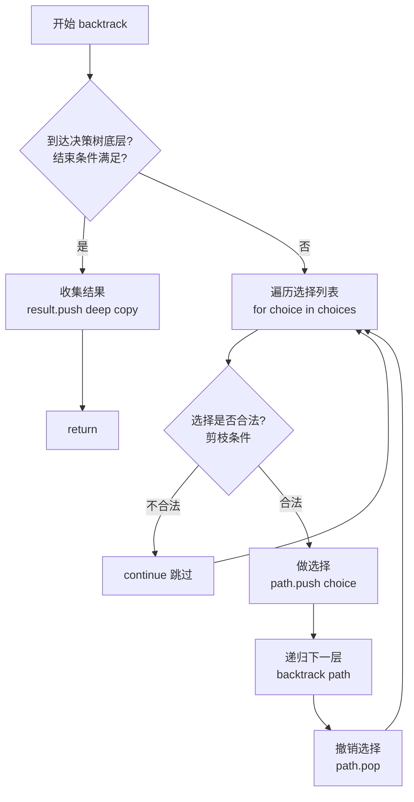
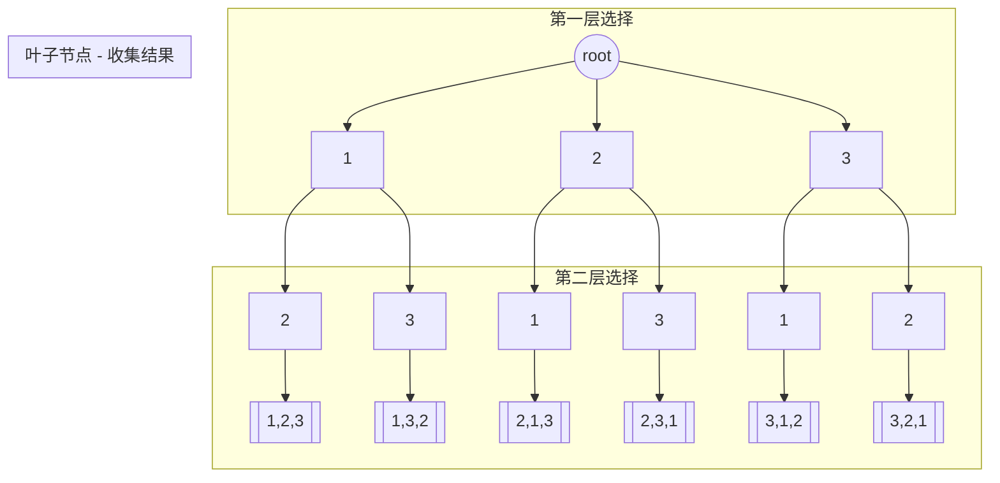
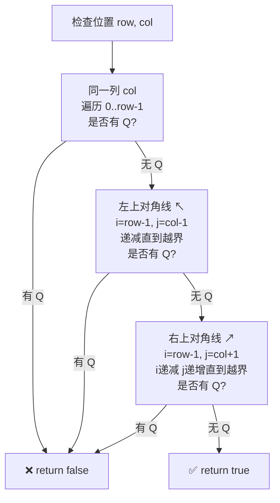

# DFS（深度优先搜索）与回溯算法框架

> 核心一句话：**回溯算法 = DFS + 决策树遍历 + 撤销操作**
>
> 只要涉及递归，都可以抽象成二叉树的问题。

---

## 🎯 经典 LeetCode 题目（按频率排序）

> 💡 刷题顺序：⭐ 必背 → ⭐⭐ 进阶 → ⭐⭐⭐ 挑战

| # | 题号 | 题目 | 难度 | 核心考点 | 推荐指数 |
|---|------|------|:----:|----------|:--------:|
| 1 | [46](https://leetcode.cn/problems/permutations/) | 全排列 | 🟡 | 回溯模板入门 | ⭐ |
| 2 | [78](https://leetcode.cn/problems/subsets/) | 子集 | 🟡 | `start` 参数防重复 | ⭐ |
| 3 | [77](https://leetcode.cn/problems/combinations/) | 组合 | 🟡 | 子集 + 长度限制 | ⭐ |
| 4 | [39](https://leetcode.cn/problems/combination-sum/) | 组合总和 | 🟡 | 可重复使用元素 | ⭐⭐ |
| 5 | [22](https://leetcode.cn/problems/generate-parentheses/) | 括号生成 | 🟡 | 括号合法性剪枝 | ⭐⭐ |
| 6 | [17](https://leetcode.cn/problems/letter-combinations-of-a-phone-number/) | 电话号码的字母组合 | 🟡 | 映射 + 回溯 | ⭐ |
| 7 | [47](https://leetcode.cn/problems/permutations-ii/) | 全排列 II | 🟡 | 重复元素去重 | ⭐⭐ |
| 8 | [40](https://leetcode.cn/problems/combination-sum-ii/) | 组合总和 II | 🟡 | 去重 + 剪枝 | ⭐⭐ |
| 9 | [90](https://leetcode.cn/problems/subsets-ii/) | 子集 II | 🟡 | 有重复子集去重 | ⭐⭐ |
| 10 | [131](https://leetcode.cn/problems/palindrome-partitioning/) | 分割回文串 | 🟡 | 字符串分割回溯 | ⭐⭐ |
| 11 | [93](https://leetcode.cn/problems/restore-ip-addresses/) | 复原 IP 地址 | 🟡 | 字符串 + 多剪枝 | ⭐⭐ |
| 12 | [79](https://leetcode.cn/problems/word-search/) | 单词搜索 | 🟡 | 二维网格 DFS | ⭐⭐ |
| 13 | [200](https://leetcode.cn/problems/number-of-islands/) | 岛屿数量 | 🟡 | 网格 DFS（感染法） | ⭐ |
| 14 | [51](https://leetcode.cn/problems/n-queens/) | N 皇后 | 🔴 | 二维棋盘 + 合法性 | ⭐⭐⭐ |
| 15 | [37](https://leetcode.cn/problems/sudoku-solver/) | 解数独 | 🔴 | 二维 + 多重约束 | ⭐⭐⭐ |
| 16 | [301](https://leetcode.cn/problems/remove-invalid-parentheses/) | 删除无效的括号 | 🔴 | 最少删除 + BFS/DFS | ⭐⭐⭐ |
| 17 | [698](https://leetcode.cn/problems/partition-to-k-equal-sum-subsets/) | 划分为 k 个相等的子集 | 🟡 | 剪枝优化 | ⭐⭐⭐ |
| 18 | [489](https://leetcode.cn/problems/robot-room-cleaner/) | 扫地机器人 | 🔴 | 带方向回溯 | ⭐⭐⭐ |

---

## 📋 目录

1. [核心思想](#-核心思想)
2. [回溯算法万能模板](#-回溯算法万能模板)
3. [问题一：全排列（无重复元素）](#-问题一全排列无重复元素)
4. [问题二：全排列（有重复元素）](#-问题二全排列有重复元素)
5. [问题三：N 皇后问题](#-问题三n-皇后问题)
6. [复杂度速查表](#-复杂度速查表)
7. [刷题建议](#-刷题建议)

---

## 🧠 核心思想

### 什么时候用 DFS / 回溯？

| 场景 | 适合的算法 |
|------|-----------|
| **求所有解**（排列、组合、子集） | 回溯 (DFS) |
| **求是否存在一个解** | 回溯（找到即返回） |
| **求最优解**（最短路径、最小编辑距离） | 动态规划（有重叠子问题时） |
| **求最优解**（无重叠子问题） | 回溯（暴力枚举所有解） |

> **DFS 搜全部解，BFS 搜最短路径。**
> 当求解目标必须走到最深（如树的叶子节点）才能得到一个解时，用 DFS。

### 回溯三要素

写任何回溯算法，永远先问自己三个问题：

```
① 路径（path）：     已经做出的选择 → 用 track[] 记录
② 选择列表（choices）：当前可以做的选择 → 用 for 循环遍历
③ 结束条件（end）：   到达决策树底层，无法再做选择时 → 收集结果并 return
```

### 关键技巧

- **递归前做选择，递归后撤销选择** — 这是回溯的"灵魂"
- **注意深拷贝 vs 浅拷贝** — 收集结果时一定要拷贝当前路径，否则后续撤销操作会污染已保存的结果
- **没有重叠子问题** → 回溯是纯暴力穷举，复杂度一般很高，不可优化（不像 DP）

---

## 📐 回溯算法万能模板

```typescript
// backtracking-template.ts
// 使用方式：npx ts-node backtracking-template.ts

/**
 * 回溯算法通用框架
 * @param path     - 当前已做出的选择（路径）
 * @param choices  - 当前可做的选择列表
 * @param result   - 收集所有合法解的容器
 */
function backtrack<T>(
  path: T[],
  choices: T[],
  result: T[][]
): void {
  // 1️⃣ 结束条件：到达决策树底层
  if (/* path 满足条件 */) {
    result.push([...path]); // ⚠️ 深拷贝！否则后续 pop 会污染结果
    return;
  }

  // 2️⃣ 遍历当前选择列表
  for (const choice of choices) {
    // 排除不合法的选择（剪枝）
    if (/* 不合法 */) continue;

    // 3️⃣ 做选择
    path.push(choice);

    // 4️⃣ 进入下一层决策树（递归）
    backtrack(path, choices, result);

    // 5️⃣ 撤销选择（回溯的核心！）
    path.pop();
  }
}

// --- 测试 ---
const result: number[][] = [];
backtrack([], [1, 2, 3], result);
console.log(result);
```

### 回溯算法执行流程



> **💡 为什么叫"回溯"？** 因为做选择 → 递归 → 撤销选择，就像在决策树上"往前走一步，探完再退回来"。

---

## 🔢 问题一：全排列（无重复元素）

> 输入 `[1, 2, 3]`，输出所有不重复的全排列，共 3! = 6 种。

```typescript
// permute.ts
// 使用方式：npx ts-node permute.ts

/**
 * 全排列 - 无重复元素
 * 思路：用 track 记录已选的数字，用 track.includes() 跳过已选元素
 * 时间复杂度：O(n! * n)   includes 检查是 O(n)，总共有 n! 个叶子节点
 * 空间复杂度：O(n)        递归栈深度 + track 数组
 */
function permute(nums: number[]): number[][] {
  const result: number[][] = [];
  const track: number[] = [];

  function backtrack(): void {
    // 结束条件：路径长度等于 nums 长度，说明所有数字都选完了
    if (track.length === nums.length) {
      result.push([...track]); // ⚠️ 深拷贝！否则后续会被 pop 清空
      return;
    }

    for (let i = 0; i < nums.length; i++) {
      // 剪枝：跳过已经选过的数字
      if (track.includes(nums[i])) continue;

      // 做选择
      track.push(nums[i]);
      // 进入下一层
      backtrack();
      // 撤销选择
      track.pop();
    }
  }

  backtrack();
  return result;
}

// --- 测试 ---
const input = [1, 2, 3];
console.log("全排列结果：", permute(input));
// 输出：[[1,2,3],[1,3,2],[2,1,3],[2,3,1],[3,1,2],[3,2,1]]
```

### 决策树可视化（以 [1,2,3] 为例）



---

## 🔁 问题二：全排列（有重复元素）

> 输入 `[1, 1, 2]`，输出所有不重复的全排列。
> 难点：如何避免因重复元素产生的重复排列？

```typescript
// permute-unique.ts
// 使用方式：npx ts-node permute-unique.ts

/**
 * 全排列 - 有重复元素（去重）
 * ⚠️ 关键区别：
 *   1. 先排序，让相同元素相邻
 *   2. 用 used[] 标记已使用元素
 *   3. 剪枝条件：nums[i] === nums[i-1] && !used[i-1] → 同一层重复，跳过
 *
 * 时间复杂度：O(n! * n)
 * 空间复杂度：O(n)
 */
function permuteUnique(nums: number[]): number[][] {
  // 先排序，让重复元素相邻
  nums.sort((a, b) => a - b);

  const result: number[][] = [];
  const track: number[] = [];
  const used: boolean[] = new Array(nums.length).fill(false);

  function backtrack(): void {
    if (track.length === nums.length) {
      result.push([...track]);
      return;
    }

    for (let i = 0; i < nums.length; i++) {
      // 🚫 剪枝 1：当前元素已被使用
      if (used[i]) continue;

      // 🚫 剪枝 2（核心去重）：
      // 同一层中，如果前一个相同元素没有被使用（即被撤销了），说明这是同层重复
      // used[i-1] === true  → 同一树枝（父节点用过，正常递归）
      // used[i-1] === false → 同一树层（兄弟节点，跳过避免重复）
      if (i > 0 && nums[i] === nums[i - 1] && !used[i - 1]) continue;

      // 做选择
      used[i] = true;
      track.push(nums[i]);

      backtrack();

      // 撤销选择
      track.pop();
      used[i] = false;
    }
  }

  backtrack();
  return result;
}

// --- 测试 ---
console.log("有重复全排列：", permuteUnique([1, 1, 2]));
// 输出：[[1,1,2],[1,2,1],[2,1,1]]
```

> **💡 去重口诀：** "排序 → used 数组 → `i > 0 && nums[i] === nums[i-1] && !used[i-1]`"

---

## 👑 问题三：N 皇后问题

> 在 N×N 棋盘上放置 N 个皇后，使其互不攻击（同一行、列、对角线上最多一个皇后）。
> 输入 `n=4`，输出 2 种摆法。

### isValid 合法性检查流程

每次放置皇后前，需要检查三个方向是否有冲突（只需检查当前行**以上**的部分）：



> **为什么只需要检查上方？** 因为我们是逐行从上往下放的，下面的行还没放任何皇后。

```typescript
// n-queens.ts
// 使用方式：npx ts-node n-queens.ts

/**
 * N 皇后问题
 *
 * 思路：逐行放置，每行尝试每一列
 *   - 行：用 row 参数控制，逐行往下走（row === n 时结束）
 *   - 列：for 循环尝试当前行的每一列
 *   - 合法性检查：列冲突、左上对角线冲突、右上对角线冲突
 *
 * 时间复杂度：O(n!)  第一行有 n 种选择，第二行最多 n-1 种，…
 * 空间复杂度：O(n²)  棋盘数组
 */
function solveNQueens(n: number): string[][] {
  const result: string[][] = [];

  // 初始化棋盘，全部填 '.'
  const board: string[][] = Array.from({ length: n }, () =>
    new Array(n).fill(".")
  );

  /**
   * 检查在 (row, col) 位置放置皇后是否合法
   * 只需检查当前行以上的部分（下面的行还没放皇后）
   */
  function isValid(row: number, col: number): boolean {
    // ① 检查同一列是否有皇后
    for (let i = 0; i < row; i++) {
      if (board[i][col] === "Q") return false;
    }

    // ② 检查左上方对角线 ↖
    for (let i = row - 1, j = col - 1; i >= 0 && j >= 0; i--, j--) {
      if (board[i][j] === "Q") return false;
    }

    // ③ 检查右上方对角线 ↗
    for (let i = row - 1, j = col + 1; i >= 0 && j < n; i--, j++) {
      if (board[i][j] === "Q") return false;
    }

    return true;
  }

  function backtrack(row: number): void {
    // 结束条件：所有行都成功放置了皇后
    if (row === n) {
      // 将棋盘转为字符串数组格式：每行拼成一个字符串
      result.push(board.map((row) => row.join("")));
      return;
    }

    // 尝试当前行的每一列
    for (let col = 0; col < n; col++) {
      if (!isValid(row, col)) continue;

      // 做选择
      board[row][col] = "Q";

      // 进入下一行
      backtrack(row + 1);

      // 撤销选择
      board[row][col] = ".";
    }
  }

  backtrack(0);
  return result;
}

// --- 测试 ---
const solutions = solveNQueens(4);
console.log(`4 皇后共有 ${solutions.length} 种解法：`);
solutions.forEach((solution, i) => {
  console.log(`\n解法 ${i + 1}:`);
  solution.forEach((row) => console.log(row));
});
// 输出：
// 解法 1:        解法 2:
//  .Q..           ..Q.
//  ...Q           Q...
//  Q...           ...Q
//  ..Q.           .Q..
```

### 棋盘可视化

```
解法1:         解法2:
[. Q . .]     [. . Q .]
[. . . Q]     [Q . . .]
[Q . . .]     [. . . Q]
[. . Q .]     [. Q . .]
```

---

## 📊 复杂度速查表

| 问题 | 时间复杂度 | 空间复杂度 | 关键优化 |
|------|-----------|-----------|---------|
| 全排列（无重复） | O(n! × n) | O(n) | `track.includes()` 剪枝 |
| 全排列（有重复） | O(n! × n) | O(n) | 排序 + `used[]` 去重 |
| 全排列（优化版） | O(n!) | O(n) | 用 `swap` 代替 `includes`（见下文） |
| N 皇后 | O(n!) | O(n²) | `isValid()` 提前剪枝 |
| 子集 | O(2ⁿ) | O(n) | `start` 参数防重复 |
| 组合 | O(C(n,k)) | O(n) | `start` 参数 + 剪枝 |

### 💡 全排列的优化技巧

上面用 `track.includes(nums[i])` 检查是否已选，每次是 O(n)。更优的方式是用 **swap 交换法**：

```typescript
// 优化版全排列（swap 法，O(n!) 无额外 includes 开销）
function permuteSwap(nums: number[]): number[][] {
  const result: number[][] = [];

  function backtrack(first: number): void {
    if (first === nums.length) {
      result.push([...nums]); // 当前排列即为结果
      return;
    }
    for (let i = first; i < nums.length; i++) {
      [nums[first], nums[i]] = [nums[i], nums[first]]; // 交换
      backtrack(first + 1);
      [nums[first], nums[i]] = [nums[i], nums[first]]; // 撤销交换
    }
  }

  backtrack(0);
  return result;
}
```

> **`track` 法 vs `swap` 法：** track 法逻辑更清晰（推荐初学），swap 法性能更好（推荐面试）。

---

## 🎯 刷题建议

### 先从这些开始（按难度排序）

| 难度 | 题目 | 关键考点 |
|------|------|---------|
| ⭐ | [46. 全排列](https://leetcode.cn/problems/permutations/) | 回溯模板入门 |
| ⭐ | [78. 子集](https://leetcode.cn/problems/subsets/) | 用 `start` 参数防止重复 |
| ⭐⭐ | [77. 组合](https://leetcode.cn/problems/combinations/) | 子集 + 长度限制 |
| ⭐⭐ | [47. 全排列 II](https://leetcode.cn/problems/permutations-ii/) | 重复元素去重 |
| ⭐⭐⭐ | [51. N 皇后](https://leetcode.cn/problems/n-queens/) | 二维棋盘 + 合法性检查 |
| ⭐⭐⭐ | [37. 解数独](https://leetcode.cn/problems/sudoku-solver/) | 二维 + 多重剪枝 |

## ✂️ 剪枝策略对比

回溯算法的性能全看剪枝。以下是 4 种核心剪枝策略：

| 策略 | 适用场景 | 代码模式 | 效果 |
|------|---------|---------|:----:|
| **`track.includes()` 跳过已选** | 全排列（无重复） | `if (track.includes(nums[i])) continue` | 避免选同一个元素 |
| **`used[]` 标记已选** | 全排列（有重复） | `if (used[i]) continue` | O(1) 检查，比 includes 快 |
| **`start` 参数控制** | 子集/组合 | `backtrack(start + 1)` 中传 i+1 | 防止重复子集，保证顺序 |
| **`used[i-1]` 同层去重** | 有重复元素的排列 | `if (i>0 && nums[i]===nums[i-1] && !used[i-1])` | 确保同一层没有重复分支 |

```typescript
// 四种模式速查：

// ① includes 法 — 全排列（无重复），O(n) 检查
function patternIncludes(nums: number[]): void {
  /* if (track.includes(nums[i])) continue; */
}

// ② used[] 法 — 全排列（有/无重复），O(1) 检查
function patternUsed(nums: number[]): void {
  const used = new Array(nums.length).fill(false);
  /* if (used[i]) continue; */
}

// ③ start 法 — 子集 / 组合，避免回头
function patternStart(nums: number[]): void {
  function backtrack(start: number, track: number[]): void {
    for (let i = start; i < nums.length; i++) {
      track.push(nums[i]);
      backtrack(i + 1, track); // start = i+1，不会选之前的
      track.pop();
    }
  }
}

// ④ 同层去重法 — 有重复的排列/组合
function patternDedup(nums: number[]): void {
  nums.sort((a, b) => a - b);
  const used = new Array(nums.length).fill(false);
  /* 
    if (i > 0 && nums[i] === nums[i-1] && !used[i-1]) continue;
  */
}
```

### 常见坑点自查清单

```
[ ] 收集结果时是否做了深拷贝？       → result.push([...track]) ✓
[ ] 递归结束后是否撤销了选择？       → track.pop() ✓
[ ] 有重复元素时是否先排序了？       → nums.sort() ✓
[ ] 同一层重复剪枝条件是否正确？     → used[i-1] === false ✓
[ ] N 皇后的 isValid 检查了三个方向？ → 列 + ↖ + ↗ ✓
```

---

> **关联阅读：** `03-bfs-framework.md` → `04-backtracking-subsets-permutations-combinations.md` → `05-binary-search.md`
