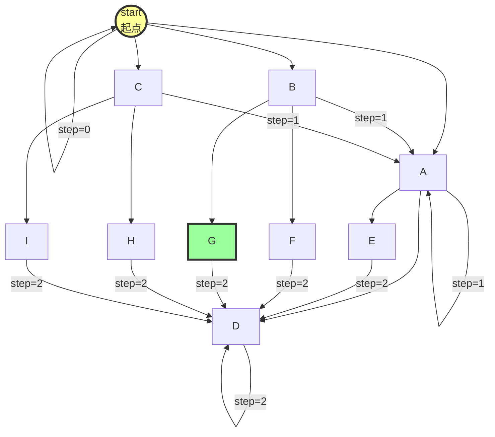
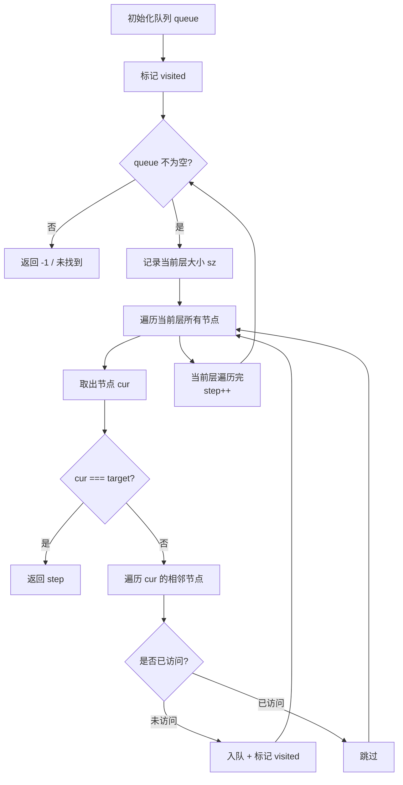
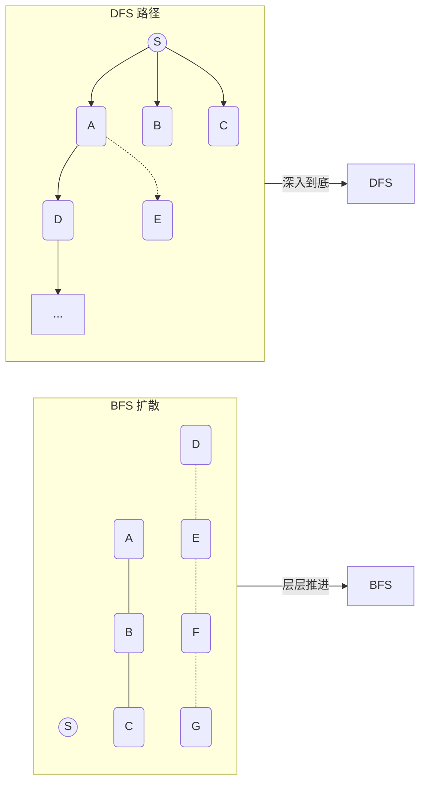
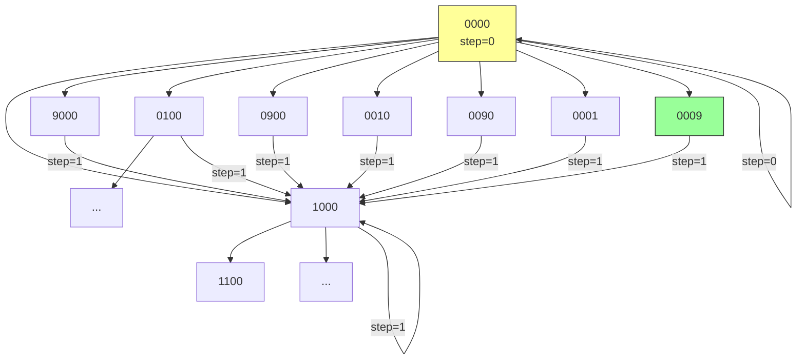
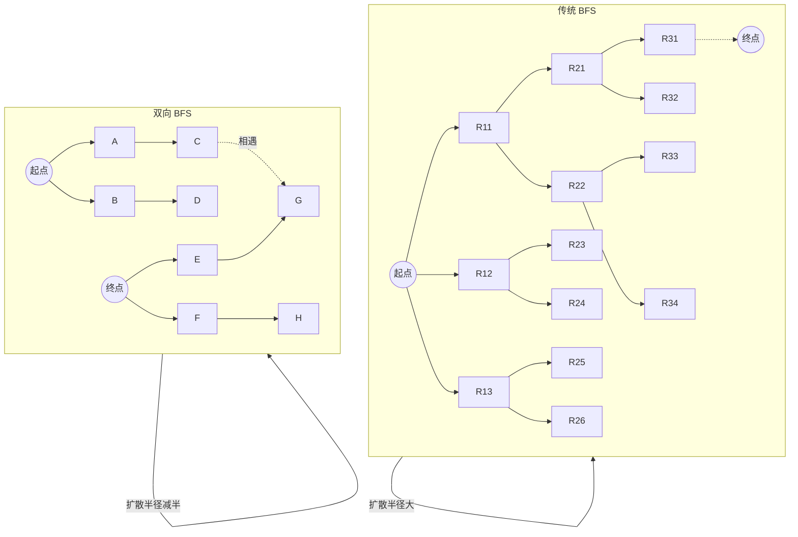
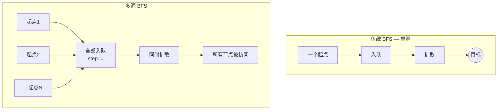

# BFS（广度优先搜索）框架

> 核心一句话：**BFS 找最短路径，DFS 搜全部解。BFS 是"面"（集体行动），DFS 是"线"（单打独斗）。**
>
> BFS 的核心思想是把问题抽象成图，用一个队列从起点向四周逐层扩散，第一次到达终点的路径一定最短。

---

## 🎯 经典 LeetCode 题目

> 💡 刷题顺序：⭐ 必背 → ⭐⭐ 进阶 → ⭐⭐⭐ 挑战

| # | 题号 | 题目 | 难度 | 核心考点 | 推荐指数 |
|---|------|------|:----:|----------|:--------:|
| 1 | [111](https://leetcode.cn/problems/minimum-depth-of-binary-tree/) | 二叉树的最小深度 | 🟢 | BFS 模板入门 | ⭐ |
| 2 | [102](https://leetcode.cn/problems/binary-tree-level-order-traversal/) | 二叉树的层序遍历 | 🟡 | BFS 分层输出 | ⭐ |
| 3 | [107](https://leetcode.cn/problems/binary-tree-level-order-traversal-ii/) | 层序遍历 II | 🟡 | BFS + 反转 | ⭐ |
| 4 | [199](https://leetcode.cn/problems/binary-tree-right-side-view/) | 二叉树的右视图 | 🟡 | BFS 每层最后一个 | ⭐⭐ |
| 5 | [752](https://leetcode.cn/problems/open-the-lock/) | 打开转盘锁 | 🟡 | BFS + visited 去重 | ⭐⭐⭐ |
| 6 | [127](https://leetcode.cn/problems/word-ladder/) | 单词接龙 | 🔴 | BFS + 单词转换 | ⭐⭐⭐ |
| 7 | [433](https://leetcode.cn/problems/minimum-genetic-mutation/) | 最小基因变化 | 🟡 | BFS 标准模板 | ⭐⭐ |
| 8 | [542](https://leetcode.cn/problems/01-matrix/) | 01 矩阵 | 🟡 | 多源 BFS | ⭐⭐⭐ |
| 9 | [994](https://leetcode.cn/problems/rotting-oranges/) | 腐烂的橘子 | 🟡 | 多源 BFS | ⭐⭐ |
| 10 | [200](https://leetcode.cn/problems/number-of-islands/) | 岛屿数量 | 🟡 | BFS/DFS 网格 | ⭐ |
| 11 | [126](https://leetcode.cn/problems/word-ladder-ii/) | 单词接龙 II | 🔴 | BFS + DFS 回溯找路径 | ⭐⭐⭐ |
| 12 | [133](https://leetcode.cn/problems/clone-graph/) | 克隆图 | 🟡 | BFS/DFS 拷贝图 | ⭐⭐ |
| 13 | [207](https://leetcode.cn/problems/course-schedule/) | 课程表 | 🟡 | 拓扑排序（BFS/DFS） | ⭐⭐ |
| 14 | [210](https://leetcode.cn/problems/course-schedule-ii/) | 课程表 II | 🟡 | 拓扑排序返回顺序 | ⭐⭐ |
| 15 | [261](https://leetcode.cn/problems/graph-valid-tree/) | 以图判树 | 🟡 | BFS/DFS 连通性检测 | ⭐⭐ |
| 16 | [286](https://leetcode.cn/problems/walls-and-gates/) | 墙与门 | 🟡 | 多源 BFS | ⭐⭐ |
| 17 | [323](https://leetcode.cn/problems/number-of-connected-components-in-an-undirected-graph/) | 无向图中连通分量数目 | 🟡 | BFS/DFS 连通分量 | ⭐⭐ |
| 18 | [490](https://leetcode.cn/problems/the-maze/) | 迷宫 | 🟡 | BFS 模拟球滚 | ⭐⭐ |
| 19 | [505](https://leetcode.cn/problems/the-maze-ii/) | 迷宫 II | 🟡 | BFS 最短距离 | ⭐⭐⭐ |
| 20 | [733](https://leetcode.cn/problems/flood-fill/) | 图像渲染 | 🟢 | BFS/DFS 填充 | ⭐ |
| 21 | [773](https://leetcode.cn/problems/sliding-puzzle/) | 滑动谜题 | 🔴 | BFS 状态压缩 | ⭐⭐⭐ |
| 22 | [841](https://leetcode.cn/problems/keys-and-rooms/) | 钥匙和房间 | 🟡 | BFS/DFS 可达性 | ⭐⭐ |
| 23 | [909](https://leetcode.cn/problems/snakes-and-ladders/) | 蛇梯棋 | 🟡 | BFS + 棋盘映射 | ⭐⭐⭐ |
| 24 | [1306](https://leetcode.cn/problems/jump-game-iii/) | 跳跃游戏 III | 🟡 | BFS/DFS 跳跃搜索 | ⭐⭐ |

---

## 📋 目录

1. [BFS 核心思想](#-bfs-核心思想)
2. [BFS 万能模板](#-bfs-万能模板)
3. [BFS vs DFS 对比](#-bfs-vs-dfs-对比)
4. [实战：二叉树的最小深度](#-实战二叉树的最小深度)
5. [实战：打开转盘锁（LeetCode 752）](#-实战打开转盘锁leetcode-752)
6. [双向 BFS 优化](#-双向-bfs-优化)
7. [复杂度速查表](#-复杂度速查表)
8. [刷题建议](#-刷题建议)

---

## 🧠 BFS 核心思想

### BFS 的扩散过程



> BFS 像水面投石 — 一圈一圈向外扩散。第 n 圈就是距离起点 n 步的所有节点。
> 所以 BFS 第一次遇到终点时，走的步数**一定是最少的**。

### 什么时候用 BFS？

| 场景 | 用 BFS？ | 原因 |
|------|:--------:|------|
| 求最短路径/最少步数 | ✅ **必须 BFS** | BFS 第一次到达即最优 |
| 求所有解 | ❌ 用 DFS | DFS 空间小，方便递归回溯 |
| 求是否存在一个解 | ✅ 都行 | BFS 更快找到，DFS 省空间 |
| 图的无权最短路径 | ✅ **必须 BFS** | 无权图 BFS = Dijkstra |
| 树的层序遍历 | ✅ BFS | 天然层级结构 |

---

## 📐 BFS 万能模板



```typescript
// bfs-template.ts
/**
 * BFS 算法通用框架 — 计算从 start 到 target 的最短距离
 * 
 * @param start  起点
 * @param target 终点
 * @returns 最短步数，不可达返回 -1
 */
function bfs(start: string, target: string): number {
  // ① 核心数据结构：队列
  const queue: string[] = [];
  // ② 避免走回头路（树遍历不需要，图必须）
  const visited = new Set<string>();

  queue.push(start);
  visited.add(start);
  let step = 0; // 记录扩散的步数

  while (queue.length > 0) {
    // ③ 当前层的节点数 — 关键！用于分层
    const size = queue.length;

    // ④ 将当前队列中的所有节点向四周扩散
    for (let i = 0; i < size; i++) {
      const cur = queue.shift()!;

      // ⑤ 到达终点了？
      if (cur === target) return step;

      // ⑥ 将 cur 的相邻节点加入队列
      for (const neighbor of getNeighbors(cur)) {
        if (!visited.has(neighbor)) {
          queue.push(neighbor);
          visited.add(neighbor);
        }
      }
    }

    // ⑦ 更新步数：当前层全部处理完，步数 +1
    step++;
  }

  // 队列空了还没到终点 → 不可达
  return -1;
}

/**
 * 获取相邻节点 — 根据具体问题实现
 * 例如：二叉树返回左右子节点，图返回邻居，棋盘返回上下左右
 */
function getNeighbors(node: string): string[] {
  // 需要根据具体问题实现
  return [];
}
```

> **💡 为什么 BFS 能找到最短路径？**
> BFS 是"齐头并进"的，step 每增加 1，队列中所有节点同时向外走一步。
> 第一次遇到 target 时，走过的步数一定是最少的。
> DFS 需要遍历完整棵树才能对比出最短路径，时间复杂度高得多。

---

## ⚔️ BFS vs DFS 对比

| 对比维度 | BFS | DFS |
|---------|:---:|:---:|
| **数据结构** | 队列（Queue） | 栈（Stack）/ 递归 |
| **空间复杂度** | O(w) 宽，可能很大 | O(h) 浅，通常较小 |
| **最短路径** | ✅ 第一次遇到即最优 | ❌ 必须遍历全部 |
| **实现方式** | 迭代 + while 循环 | 递归 + 回溯 |
| **遍历特点** | **面** — 集体行动，层级推进 | **线** — 单打独斗，一条路走到黑 |
| **适用场景** | 最短路径、层序遍历 | 所有解、排列组合、深度受限问题 |



---

## 🔢 实战：二叉树的最小深度

> LeetCode [111. 二叉树的最小深度](https://leetcode.cn/problems/minimum-depth-of-binary-tree/)

```typescript
// min-depth-binary-tree.ts

class TreeNode<T> {
  constructor(
    public val: T,
    public left: TreeNode<T> | null = null,
    public right: TreeNode<T> | null = null
  ) {}
}

/**
 * 二叉树的最小深度 — BFS 标准模板
 * 
 * 思路：层序遍历，遇到第一个叶子节点（无左右孩子）就返回当前深度
 * 
 * 时间复杂度 O(n)  空间复杂度 O(n) 最坏情况满二叉树
 */
function minDepth(root: TreeNode<number> | null): number {
  if (root === null) return 0;

  const queue: TreeNode<number>[] = [root];
  // root 本身就是一层，深度初始化为 1
  let depth = 1;

  while (queue.length > 0) {
    const size = queue.length;

    // 遍历当前层的所有节点
    for (let i = 0; i < size; i++) {
      const cur = queue.shift()!;

      // 🎯 到达叶子节点 → 返回当前深度
      if (cur.left === null && cur.right === null) {
        return depth;
      }

      // 将相邻节点（子节点）加入队列
      if (cur.left !== null) queue.push(cur.left);
      if (cur.right !== null) queue.push(cur.right);
    }

    // 当前层处理完，深度 +1
    depth++;
  }

  return depth;
}

// --- 测试 ---
//       3
//      / \
//     9  20
//        / \
//       15  7
const root = new TreeNode(3);
root.left = new TreeNode(9);
root.right = new TreeNode(20, new TreeNode(15), new TreeNode(7));

console.log("最小深度:", minDepth(root)); // 输出: 2 (3→9)
```

> **注意：** 二叉树遍历不需要 `visited` 集合，因为树结构中没有子节点指向父节点的指针，不会走回头路。

---

## 🔢 实战：打开转盘锁（LeetCode 752）

> [752. 打开转盘锁](https://leetcode.cn/problems/open-the-lock/)
>
> 一个转盘锁有 4 个拨轮，每个拨轮 0-9，每次可以向上或向下拨动一位。
> 给定一个 `deadends`（死亡密码）列表，求从 `"0000"` 到 `target` 的最少步数。



```typescript
// open-lock.ts

/**
 * 将 s[i] 向上拨动一次
 * 例如 '0' → '1', '9' → '0'
 */
function plusOne(s: string, i: number): string {
  const arr = s.split("");
  arr[i] = arr[i] === "9" ? "0" : String(Number(arr[i]) + 1);
  return arr.join("");
}

/**
 * 将 s[i] 向下拨动一次
 * 例如 '0' → '9', '1' → '0'
 */
function minusOne(s: string, i: number): string {
  const arr = s.split("");
  arr[i] = arr[i] === "0" ? "9" : String(Number(arr[i]) - 1);
  return arr.join("");
}

/**
 * 打开转盘锁 — BFS 标准模板
 * 
 * 思路：'0000' 为起点，每次有 8 种变化（4个拨轮 × 上下）
 * 用 visited 记录已访问密码，用 deadSet 跳过死亡密码
 * 
 * 时间复杂度 O(10^4 × 8) = O(1) 空间复杂度 O(10^4) = O(1)
 * 状态空间固定为 10000 种组合
 */
function openLock(deadends: string[], target: string): number {
  const start = "0000";

  // 特殊情况
  if (target === start) return 0;
  if (deadends.includes(start)) return -1;

  const deadSet = new Set(deadends);
  const queue: string[] = [start];
  const visited = new Set<string>([start]);
  let step = 0;

  while (queue.length > 0) {
    const size = queue.length;

    for (let i = 0; i < size; i++) {
      const cur = queue.shift()!;

      // 🎯 到达目标？
      if (cur === target) return step;

      // 跳过死亡密码
      if (deadSet.has(cur)) continue;

      // 将相邻的 8 个密码加入队列
      for (let j = 0; j < 4; j++) {
        const up = plusOne(cur, j);
        if (!visited.has(up)) {
          queue.push(up);
          visited.add(up);
        }
        const down = minusOne(cur, j);
        if (!visited.has(down)) {
          queue.push(down);
          visited.add(down);
        }
      }
    }

    step++;
  }

  return -1; // 不可达
}

// --- 测试 ---
const deadends1 = ["0201", "0101", "0102", "1212", "2002"];
const target1 = "0202";
console.log("最少步数:", openLock(deadends1, target1));
// 输出: 6
```

---

## ⚡ 双向 BFS 优化

> **传统 BFS**：从起点向终点扩散 → 扩散范围指数增长，层数越深节点越多
> **双向 BFS**：从起点和终点**同时**扩散 → 当两边相遇时停止，扩散范围大幅减小



### 双向 BFS 模板

```typescript
// bidirectional-bfs.ts

/**
 * 双向 BFS 通用模板
 * 
 * 局限：必须知道终点在哪
 * 优势：扩散规模从 b^d 降到 2 × b^(d/2)，b 为分支因子
 * 
 * 适用于：开锁问题、单词接龙等已知终点的最短路径问题
 */
function bidirectionalBFS(
  start: string,
  target: string,
  getNeighbors: (s: string) => string[]
): number {
  if (start === target) return 0;

  // 使用 Set 代替 Queue — 方便快速判断交集
  let set1 = new Set<string>([start]);
  let set2 = new Set<string>([target]);
  const visited = new Set<string>([start, target]);

  let step = 0;

  while (set1.size > 0 && set2.size > 0) {
    // 🌟 优化：每次扩散较小的集合（分支因子小的先扩散）
    if (set1.size > set2.size) {
      [set1, set2] = [set2, set1];
    }

    const neighbors = new Set<string>();

    for (const cur of set1) {
      for (const neighbor of getNeighbors(cur)) {
        // 🎯 两边相遇了！
        if (set2.has(neighbor)) return step + 1;

        if (!visited.has(neighbor)) {
          visited.add(neighbor);
          neighbors.add(neighbor);
        }
      }
    }

    step++;
    // 交换 set1 和 set2，下一轮扩散另一侧
    set1 = set2;
    set2 = neighbors;
  }

  return -1;
}
```

### 双向 BFS 解开锁问题

```typescript
// open-lock-bidirectional.ts

/**
 * 获取一个密码的所有相邻密码（8 种变化）
 */
function getLockNeighbors(code: string): string[] {
  const neighbors: string[] = [];
  for (let i = 0; i < 4; i++) {
    const up = code[i] === "9" ? "0" : String(Number(code[i]) + 1);
    neighbors.push(code.substring(0, i) + up + code.substring(i + 1));

    const down = code[i] === "0" ? "9" : String(Number(code[i]) - 1);
    neighbors.push(code.substring(0, i) + down + code.substring(i + 1));
  }
  return neighbors;
}

/**
 * 双向 BFS 解决开锁问题
 */
function openLockBidirectional(deadends: string[], target: string): number {
  const start = "0000";
  if (target === start) return 0;
  if (deadends.includes(start)) return -1;

  const deadSet = new Set(deadends);
  if (deadSet.has(target)) return -1;

  let set1 = new Set<string>([start]);
  let set2 = new Set<string>([target]);
  const visited = new Set<string>([start, target]);
  let step = 0;

  while (set1.size > 0 && set2.size > 0) {
    // 总是扩散较小的集合
    if (set1.size > set2.size) {
      [set1, set2] = [set2, set1];
    }

    const neighbors = new Set<string>();

    for (const cur of set1) {
      if (deadSet.has(cur)) continue;

      for (const neighbor of getLockNeighbors(cur)) {
        // 🎯 两边相遇！
        if (set2.has(neighbor)) return step + 1;

        if (!visited.has(neighbor)) {
          visited.add(neighbor);
          neighbors.add(neighbor);
        }
      }
    }

    step++;
    set1 = set2;
    set2 = neighbors;
  }

  return -1;
}

// --- 测试 ---
console.log("双向BFS:", openLockBidirectional(deadends1, target1));
// 输出: 6
```

---

## 🌊 多源 BFS 模式

> 普通 BFS 从一个起点扩散。多源 BFS 从**多个起点同时**扩散，适合"多个源头同时感染"的场景。

### 什么时候用？

| 问题 | 为什么是多源 |
|------|-------------|
| [542. 01 矩阵](https://leetcode.cn/problems/01-matrix/) | 每个 0 是起点，计算所有 1 到最近 0 的距离 |
| [994. 腐烂的橘子](https://leetcode.cn/problems/rotting-oranges/) | 所有烂橘子同时扩散，求全部腐烂的最少时间 |
| [286. 墙与门](https://leetcode.cn/problems/walls-and-gates/) | 所有门是起点，计算房间到最近门的距离 |

### 多源 BFS 模板



```typescript
// multi-source-bfs.ts
/**
 * 多源 BFS 模板
 * 
 * 思路：所有起点先入队，然后同时向外扩散
 * 适用：求每个位置到最近起点的距离
 * 
 * 时间复杂度 O(m×n)  空间复杂度 O(m×n)
 */
function multiSourceBFS(grid: number[][]): number[][] {
  const m = grid.length;
  const n = grid[0].length;
  const dist: number[][] = Array.from({ length: m }, () => new Array(n).fill(-1));
  const queue: [number, number][] = [];

  // ① 所有起点入队（比如所有的 0），距离设为 0
  for (let i = 0; i < m; i++) {
    for (let j = 0; j < n; j++) {
      if (grid[i][j] === 0) {
        queue.push([i, j]);
        dist[i][j] = 0;
      }
    }
  }

  // 四个方向
  const dirs = [[1, 0], [-1, 0], [0, 1], [0, -1]];

  // ② 同时扩散（跟普通 BFS 一模一样的逻辑！）
  while (queue.length > 0) {
    const [x, y] = queue.shift()!;

    for (const [dx, dy] of dirs) {
      const nx = x + dx;
      const ny = y + dy;

      if (nx >= 0 && nx < m && ny >= 0 && ny < n && dist[nx][ny] === -1) {
        dist[nx][ny] = dist[x][y] + 1;
        queue.push([nx, ny]);
      }
    }
  }

  return dist;
}

// --- 测试（01 矩阵）---
const matrix = [
  [0, 0, 0],
  [0, 1, 0],
  [1, 1, 0]
];
console.log("到最近 0 的距离:", multiSourceBFS(matrix));
// 输出: [[0,0,0],[0,1,0],[2,1,0]]
```

> **💡 多源 BFS 的本质：** 创建一个"虚拟超级起点"，连接到所有真实起点。所有起点入队时 step=0，然后同时扩散。代码跟普通 BFS 一样，只是初始化阶段多 push 几个起点。

## 📊 复杂度速查表

| 问题 | 时间复杂度 | 空间复杂度 | 关键点 |
|------|:--------:|:--------:|--------|
| 二叉树最小深度 | O(n) | O(n) | 树不需要 visited |
| 打开转盘锁 | O(10⁴) | O(10⁴) | 状态空间固定 |
| 单词接龙 | O(n × 26^L) | O(n) | n=单词数，L=单词长度 |
| 01 矩阵 | O(m × n) | O(m × n) | 多源 BFS |
| 腐烂的橘子 | O(m × n) | O(m × n) | 多源 BFS + 时间记录 |
| **双向 BFS** | **O(b^(d/2))** | **O(b^(d/2))** | **指数级优化！** |

> **b** = 分支因子（每个节点有几个邻居）
> **d** = 最短路径长度
>
> 双向 BFS 从 `b^d` 降到 `2 × b^(d/2)`，当 b=8, d=6 时：
> 传统 BFS: 8⁶ = **262,144** 节点
> 双向 BFS: 2 × 8³ = **1,024** 节点

---

## 🎯 刷题建议

### 推荐练习路线

| 阶段 | 目标 | 题目 | 关键点 |
|------|------|------|--------|
| ⭐ 入门 | BFS 模板 | 111 最小深度、102 层序遍历 | 理解分层逻辑 |
| ⭐⭐ 进阶 | visited 使用 | 752 开锁、433 基因变化 | 图结构必须 visited |
| ⭐⭐⭐ 挑战 | 多源 BFS | 542 01矩阵、994 腐烂橘子 | 多个起点同时入队 |
| ⭐⭐⭐ 挑战 | 双向 BFS | 127 单词接龙 | 已知终点的优化 |

### BFS 的自查清单

```
[ ] 用了队列（Queue）而不是栈？
[ ] 分层时记录了当前层大小 sz？（for let i=0; i<sz; i++）
[ ] 图结构加上 visited 了吗？
[ ] 是否在正确的时机 step++？（当前层全部处理完后）
[ ] 能否用双向 BFS 优化？（已知终点时）
[ ] 考虑过多源 BFS 吗？（多个起点同时入队）
```

---

## 💪 白板挑战

> 不参考代码，手写 BFS 模板：

```typescript
// ✍️ 你的默写
function bfs(start: string, target: string): number {


}
```

> 用一句话解释：为什么 BFS 能找到最短路径，而 DFS 不行？

---

> **关联阅读：** `02-dfs-backtracking.md` → `04-backtracking-subsets-permutations-combinations.md` → `19-two-pointers.md` → `20-sliding-window.md`
