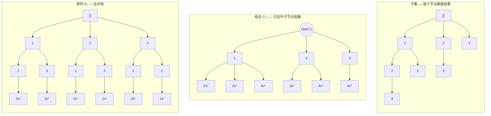
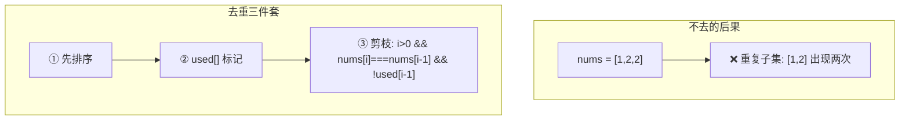

# 回溯算法：子集 · 排列 · 组合

> 核心一句话：**子集、排列、组合是回溯算法的三块基石。区别只在回溯树的结构 — 排列树对称，组合树向右倾斜，子集是组合的超集。**
>
> 只要会了这三种，所有回溯题都是在它们基础上的变形（加约束、加剪枝、加去重）。

---

## 🎯 经典 LeetCode 题目

> 💡 刷题顺序：⭐ 必背 → ⭐⭐ 进阶 → ⭐⭐⭐ 挑战

| #   | 题号                                                          | 题目               | 难度 | 核心考点                    | 推荐指数 |
| --- | ------------------------------------------------------------- | ------------------ | :--: | --------------------------- | :------: |
| 1   | [78](https://leetcode.cn/problems/subsets/)                   | 子集               |  🟡  | `start` 参数、回溯入门      |    ⭐    |
| 2   | [90](https://leetcode.cn/problems/subsets-ii/)                | 子集 II            |  🟡  | 有重复 + 去重剪枝           |   ⭐⭐   |
| 3   | [77](https://leetcode.cn/problems/combinations/)              | 组合               |  🟡  | `start` + 长度限制 k        |    ⭐    |
| 4   | [39](https://leetcode.cn/problems/combination-sum/)           | 组合总和           |  🟡  | 可重复使用元素（`i` 不 +1） |   ⭐⭐   |
| 5   | [40](https://leetcode.cn/problems/combination-sum-ii/)        | 组合总和 II        |  🟡  | 有重复 + 去重               |   ⭐⭐   |
| 6   | [216](https://leetcode.cn/problems/combination-sum-iii/)      | 组合总和 III       |  🟡  | `start` + 长度+sum 双约束   |   ⭐⭐   |
| 7   | [46](https://leetcode.cn/problems/permutations/)              | 全排列             |  🟡  | `used[]` / `includes`       |    ⭐    |
| 8   | [47](https://leetcode.cn/problems/permutations-ii/)           | 全排列 II          |  🟡  | 重复元素 + `used[i-1]`      |   ⭐⭐   |
| 9   | [784](https://leetcode.cn/problems/letter-case-permutation/)  | 字母大小写全排列   |  🟡  | 变种排列                    |   ⭐⭐   |
| 10  | [320](https://leetcode.cn/problems/generalized-abbreviation/) | 列举单词的全部缩写 |  🟡  | 子集变种                    |  ⭐⭐⭐  |

---

## 📋 目录

1. [三个问题的回溯树对比](#-三个问题的回溯树对比)
2. [子集（Subsets）](#-子集subsets)
3. [组合（Combinations）](#-组合combinations)
4. [排列（Permutations）](#-排列permutations)
5. [三种代码差异速查表](#-三种代码差异速查表)
6. [去重套路：有重复元素的三种处理](#-去重套路有重复元素的三种处理)
7. [实战：组合总和（可重复使用）](#-实战组合总和可重复使用)
8. [复杂度速查表](#-复杂度速查表)
9. [刷题建议](#-刷题建议)

---

## 🧠 三个问题的回溯树对比

三种问题的回溯树长得不一样，理解了树的形状，代码自然就清楚了。



| 问题     | 收集时机                     | 参数控制            | 回溯树形状     |
| -------- | ---------------------------- | ------------------- | -------------- |
| **子集** | **每个节点**都收集           | `start` 防回头      | 所有组合的总和 |
| **组合** | **叶子节点**（长度 = k）收集 | `start` + 长度限制  | 向右倾斜       |
| **排列** | **叶子节点**（长度 = n）收集 | `used[]` 防重复选择 | 全对称         |

---

## 🔢 子集（Subsets）

> 输入 `[1,2,3]`，输出 8 个子集：`[ [], [1], [2], [3], [1,2], [1,3], [2,3], [1,2,3] ]`

**关键点：** `start` 参数确保不会选到之前的元素，从而避免重复子集。

```typescript
// subsets.ts
/**
 * 子集 — 回溯法
 *
 * 思路：每次递归时 track 都是当前子集，直接收集。
 *       用 start 参数控制只能往后选，不能往前回头。
 *
 * 时间复杂度 O(2ⁿ × n)  空间复杂度 O(n)
 */
function subsets(nums: number[]): number[][] {
  const result: number[][] = [];
  const track: number[] = [];

  function backtrack(start: number): void {
    // 🎯 每个节点都是一个子集，直接收集
    result.push([...track]);

    // 从 start 开始，避免重复
    for (let i = start; i < nums.length; i++) {
      track.push(nums[i]); // 做选择
      backtrack(i + 1); // 递归，只能往后选
      track.pop(); // 撤销选择
    }
  }

  backtrack(0);
  return result;
}

// --- 测试 ---
console.log('子集:', subsets([1, 2, 3]));
// [[], [1], [1,2], [1,2,3], [1,3], [2], [2,3], [3]]
```

### 子集的数学归纳法理解

```
subsets([1,2,3]) = subsets([1,2]) + [ 每个子集追加 3 ]
                 = subsets([1])   + [ 每个子集追加 2, 每个子集追加 3... ]

subsets([1,2]) = { [], [1], [2], [1,2] }
subsets([1,2,3]) = subsets([1,2]) ∪ { [3], [1,3], [2,3], [1,2,3] }
                 = { [], [1], [2], [1,2] } ∪ { [3], [1,3], [2,3], [1,2,3] }
```

---

## 🔢 组合（Combinations）

> 输入 `n=4, k=2`，输出 `[1,2] [1,3] [1,4] [2,3] [2,4] [3,4]`

**关键点：** 跟子集一模一样，只是加了 `track.length === k` 才收集（只取叶子节点）。

```typescript
// combinations.ts
/**
 * 组合 — 回溯法
 *
 * 和子集的区别：子集收所有节点，组合只收长度 == k 的叶子节点
 *
 * 时间复杂度 O(C(n,k) × k)  空间复杂度 O(k)
 */
function combine(n: number, k: number): number[][] {
  const result: number[][] = [];
  const track: number[] = [];

  function backtrack(start: number): void {
    // 🎯 长度够了，收集（只收叶子）
    if (track.length === k) {
      result.push([...track]);
      return;
    }

    // 🌟 剪枝优化：剩余元素不够凑成 k 个了，提前结束
    // 还需要 k - track.length 个元素
    // 最多从 n - (k - track.length) + 1 开始
    for (let i = start; i <= n; i++) {
      track.push(i);
      backtrack(i + 1);
      track.pop();
    }
  }

  backtrack(1);
  return result;
}

// --- 测试 ---
console.log('组合:', combine(4, 2));
// [[1,2],[1,3],[1,4],[2,3],[2,4],[3,4]]

/**
 * 🌟 剪枝优化版本
 *
 * 当剩余数字不够凑 k 个时，提前结束循环
 * 比如 n=5, k=3, 当前 track=[1]，还需要 2 个
 * 最多从 5-2+1 = 4 开始，即 i ≤ 4
 * i=5 时只剩 5 一个数，不够用了，直接跳过
 */
function combineOptimized(n: number, k: number): number[][] {
  const result: number[][] = [];
  const track: number[] = [];

  function backtrack(start: number): void {
    if (track.length === k) {
      result.push([...track]);
      return;
    }

    // 剪枝：i 最多到 n - (k - track.length) + 1
    const maxI = n - (k - track.length) + 1;
    for (let i = start; i <= maxI; i++) {
      track.push(i);
      backtrack(i + 1);
      track.pop();
    }
  }

  backtrack(1);
  return result;
}
```

---

## 🔢 排列（Permutations）

> 输入 `[1,2,3]`，输出 6 种全排列

**关键点：** 用 `used[]` 标记已选元素（不能用 `start`，因为排列可以选之前的元素！）

```typescript
// permutations.ts
/**
 * 全排列 — 回溯法
 *
 * 和组合/子集的区别：
 *   - 组合用 start 控制顺序，防止回头
 *   - 排列用 used[] 标记已选，因为可以选之前的元素
 *
 * 时间复杂度 O(n! × n)  空间复杂度 O(n)
 */
function permute(nums: number[]): number[][] {
  const result: number[][] = [];
  const track: number[] = [];
  const used: boolean[] = new Array(nums.length).fill(false);

  function backtrack(): void {
    if (track.length === nums.length) {
      result.push([...track]);
      return;
    }

    for (let i = 0; i < nums.length; i++) {
      if (used[i]) continue; // 跳过已选

      used[i] = true;
      track.push(nums[i]);
      backtrack();
      track.pop();
      used[i] = false;
    }
  }

  backtrack();
  return result;
}

// --- 测试 ---
console.log('排列:', permute([1, 2, 3]));
// [[1,2,3],[1,3,2],[2,1,3],[2,3,1],[3,1,2],[3,2,1]]
```

---

## 📊 三种代码差异速查表

> 三种问题用同一套回溯模板，**唯一区别**用红字标出：

| 维度           |       **子集**       |       **组合**        |          **排列**          |
| -------------- | :------------------: | :-------------------: | :------------------------: |
| **收集时机**   |       每个节点       | 叶子 (`length === k`) |   叶子 (`length === n`)    |
| **防重机制**   |     `start` 参数     |     `start` 参数      |     `used[]` 布尔数组      |
| **递归参数**   |   `backtrack(i+1)`   |   `backtrack(i+1)`    |   `backtrack()` 不加参数   |
| **选元素范围** | `i` 从 `start` 开始  |  `i` 从 `start` 开始  | `i` 从 0 开始（跳过 used） |
| **结果数量**   |          2ⁿ          |        C(n, k)        |             n!             |
| **代码差异**   | `result.push` 在开头 | 加 `if length === k`  |   `if used[i] continue`    |

```typescript
// 三合一模板对比
function threeInOne(nums: number[], type: 'subset' | 'combine', k?: number): number[][] {
  const result: number[][] = [];
  const track: number[] = [];
  const used: boolean[] = new Array(nums.length).fill(false);

  function backtrack(start: number): void {
    // 子集：每个节点都收集
    if (type === 'subset') result.push([...track]);

    // 组合/排列：叶子节点收集
    if (type === 'combine' && track.length === k) {
      result.push([...track]);
      return;
    }
    if (type === 'permute' && track.length === nums.length) {
      result.push([...track]);
      return;
    }

    // 遍历范围不同！
    const begin = type === 'permute' ? 0 : start;
    const end = type === 'permute' ? nums.length : nums.length;

    for (let i = begin; i < end; i++) {
      // 排列用 used 跳过，组合/子集用 start 跳过
      if (type === 'permute' && used[i]) continue;

      track.push(nums[i]);
      if (type === 'permute') {
        used[i] = true;
        backtrack(start); // 排列：不增加 start
        used[i] = false;
      } else {
        backtrack(i + 1); // 组合/子集：增加 start
      }
      track.pop();
    }
  }

  backtrack(0);
  return result;
}
```

---

## 🎯 去重套路：有重复元素的三种处理

当输入有重复元素时（如 `[1,2,2]`），需要加 **去重剪枝**：



```typescript
// subsets-with-duplicates.ts
/**
 * 子集 II — 有重复元素的子集
 *
 * 去重口诀：排序 + used + 同层跳过
 */
function subsetsWithDup(nums: number[]): number[][] {
  nums.sort((a, b) => a - b); // ① 排序让相同元素相邻
  const result: number[][] = [];
  const track: number[] = [];

  function backtrack(start: number): void {
    result.push([...track]);

    for (let i = start; i < nums.length; i++) {
      // ② 同层去重：前一个相同元素没有被使用（被撤销了），跳过
      if (i > start && nums[i] === nums[i - 1]) continue;

      track.push(nums[i]);
      backtrack(i + 1);
      track.pop();
    }
  }

  backtrack(0);
  return result;
}

// --- 测试 ---
console.log('子集去重:', subsetsWithDup([1, 2, 2]));
// [[], [1], [1,2], [1,2,2], [2], [2,2]]
// 注意没有重复的 [1,2]

/**
 * 全排列 II — 有重复元素的排列
 * 和子集去重略有不同：需要 used[] 数组
 */
function permuteUnique(nums: number[]): number[][] {
  nums.sort((a, b) => a - b);
  const result: number[][] = [];
  const track: number[] = [];
  const used: boolean[] = new Array(nums.length).fill(false);

  function backtrack(): void {
    if (track.length === nums.length) {
      result.push([...track]);
      return;
    }

    for (let i = 0; i < nums.length; i++) {
      if (used[i]) continue;

      // 同层去重：前一个相同元素刚被撤销
      if (i > 0 && nums[i] === nums[i - 1] && !used[i - 1]) continue;

      used[i] = true;
      track.push(nums[i]);
      backtrack();
      track.pop();
      used[i] = false;
    }
  }

  backtrack();
  return result;
}
```

### 去重口诀

| 问题类型             | 去重写法                                                     | 说明                     |
| -------------------- | ------------------------------------------------------------ | ------------------------ |
| **子集/组合** 有重复 | `if (i > start && nums[i] === nums[i-1]) continue`           | 用 `start` 判断同层      |
| **排列** 有重复      | `if (i > 0 && nums[i] === nums[i-1] && !used[i-1]) continue` | 用 `!used[i-1]` 判断同层 |

---

## 🔢 实战：组合总和（可重复使用）

> [39. 组合总和](https://leetcode.cn/problems/combination-sum/)
> 输入 `candidates=[2,3,6,7]`, `target=7`，输出所有和为 7 的组合。
> **关键区别：** 同一个数字可以无限制重复使用。

```typescript
// combination-sum.ts
/**
 * 组合总和 — 元素可重复使用
 *
 * 和普通组合的两个关键区别：
 *   1. 递归时传 i 而不是 i+1（允许重复使用当前元素）
 *   2. 剪枝：sum > target 时提前返回
 */
function combinationSum(candidates: number[], target: number): number[][] {
  const result: number[][] = [];
  const track: number[] = [];

  function backtrack(start: number, sum: number): void {
    // 剪枝：超过目标和
    if (sum > target) return;

    // 收集结果
    if (sum === target) {
      result.push([...track]);
      return;
    }

    for (let i = start; i < candidates.length; i++) {
      track.push(candidates[i]);
      // 🌟 关键：传 i 而不是 i+1，允许重复使用当前元素
      backtrack(i, sum + candidates[i]);
      track.pop();
    }
  }

  backtrack(0, 0);
  return result;
}

// --- 测试 ---
console.log('组合总和:', combinationSum([2, 3, 6, 7], 7));
// [[2,2,3], [7]]
```

> **💡 `backtrack(i)` vs `backtrack(i+1)` 的区别：**
>
> - `backtrack(i+1)` — **组合**：每个元素只能用一次
> - `backtrack(i)` — **组合总和**：每个元素可以重复使用无限次

---

## 📊 复杂度速查表

| 问题             |  时间复杂度   | 空间复杂度 | 关键特征                |
| ---------------- | :-----------: | :--------: | ----------------------- |
| 子集 (n 个元素)  |   O(2ⁿ × n)   |    O(n)    | 每个节点都收集          |
| 组合 C(n, k)     | O(C(n,k) × k) |    O(k)    | 剪枝：`i ≤ n-(k-len)+1` |
| 排列 (n 个元素)  |   O(n! × n)   |    O(n)    | `used[]` 防重复         |
| 子集 II (有重复) |   O(2ⁿ × n)   |    O(n)    | 排序 + 同层去重         |
| 组合总和         | O(n^(t/m+1))  |   O(t/m)   | 可重复使用，target 剪枝 |

---

## 🎯 刷题建议

### 推荐练习路线

| 阶段   | 目标               | 题目                        | 关键点            |
| ------ | ------------------ | --------------------------- | ----------------- |
| ⭐     | 理解三者的代码差异 | 78 子集、77 组合、46 排列   | 对比它们的回溯树  |
| ⭐⭐   | 去重               | 90 子集 II、47 排列 II      | 排序 + 同层剪枝   |
| ⭐⭐   | 变种               | 39 组合总和、40 组合总和 II | 可重复 / 不可重复 |
| ⭐⭐⭐ | 综合               | 216 组合总和 III            | 多约束剪枝        |

### 自查清单

```
[ ] 子集是每个节点都收集，还是只收集叶子？
[ ] 组合用 start 还是 used 防重复？
[ ] 排列用 start 还是 used 防重复？
[ ] 有重复元素时，去重剪枝加了吗？
[ ] 元素可重复使用时，递归传 i 还是 i+1？
[ ] 组合的剪枝优化加了吗？（i ≤ n-(k-len)+1）
```

---

## 💪 白板挑战

> 不参考代码，写出子集、组合、排列三种的 backtrack 签名区别：

```typescript
// 子集：______  收集时机：______
function subsets(nums: number[]): number[][] {}

// 组合：______  收集时机：______
function combine(n: number, k: number): number[][] {}

// 排列：______  收集时机：______
function permute(nums: number[]): number[][] {}
```

---

## Python 核心模板补充

```python
def subsets(nums: list[int]) -> list[list[int]]:
    ans, path = [], []
    def backtrack(start: int):
        ans.append(path[:])
        for i in range(start, len(nums)):
            path.append(nums[i])
            backtrack(i + 1)
            path.pop()
    backtrack(0)
    return ans

def permutations(nums: list[int]) -> list[list[int]]:
    ans, path, used = [], [], [False] * len(nums)
    def backtrack():
        if len(path) == len(nums):
            ans.append(path[:])
            return
        for i, x in enumerate(nums):
            if used[i]:
                continue
            used[i] = True
            path.append(x)
            backtrack()
            path.pop()
            used[i] = False
    backtrack()
    return ans
```

---

> **关联阅读：** `02-dfs-backtracking.md` → `06-dp-framework.md` → `15-two-pointers.md`
