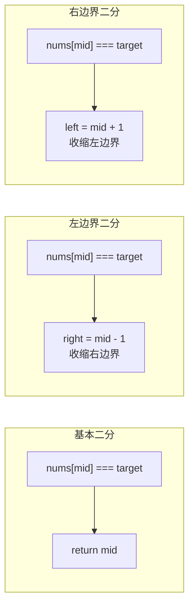
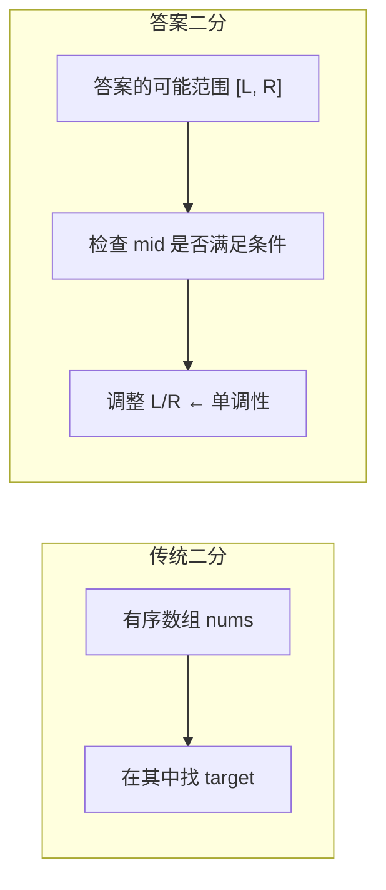
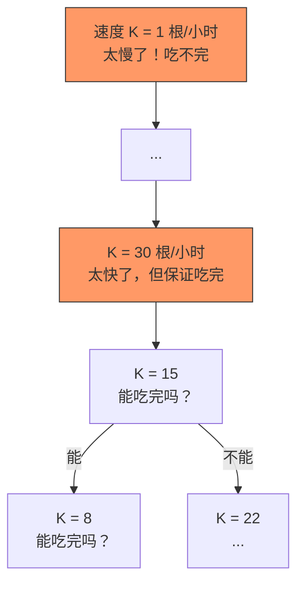

# 二分搜索框架

> 核心一句话：**只要数组有序，就应该想到二分搜索。而二分搜索的精髓不是找目标值，而是*求左右边界*。**
>
> 二分搜索有三套模板（基本/左边界/右边界），但它们可以**统一成一套记忆** — 区别只在 `nums[mid] == target` 时的处理。

---

## 🎯 经典 LeetCode 题目

> 💡 刷题顺序：⭐ 必背 → ⭐⭐ 进阶 → ⭐⭐⭐ 挑战

| #   | 题号                                                                                        | 题目                                       | 难度 | 核心考点           | 推荐指数 |
| --- | ------------------------------------------------------------------------------------------- | ------------------------------------------ | :--: | ------------------ | :------: |
| 1   | [704](https://leetcode.cn/problems/binary-search/)                                          | 二分查找                                   |  🟢  | 基本二分模板       |    ⭐    |
| 2   | [33](https://leetcode.cn/problems/search-in-rotated-sorted-array/)                          | 搜索旋转排序数组                           |  🟡  | 判断哪半有序再二分 |  ⭐⭐⭐  |
| 3   | [34](https://leetcode.cn/problems/find-first-and-last-position-of-element-in-sorted-array/) | 在排序数组中查找元素的第一个和最后一个位置 |  🟡  | 左边界 + 右边界    |    ⭐    |
| 4   | [35](https://leetcode.cn/problems/search-insert-position/)                                  | 搜索插入位置                               |  🟢  | 左边界变种         |    ⭐    |
| 5   | [74](https://leetcode.cn/problems/search-a-2d-matrix/)                                      | 搜索二维矩阵                               |  🟡  | 二维转一维二分     |   ⭐⭐   |
| 6   | [81](https://leetcode.cn/problems/search-in-rotated-sorted-array-ii/)                       | 搜索旋转排序数组 II                        |  🟡  | 有重复值的旋转数组 |  ⭐⭐⭐  |
| 7   | [278](https://leetcode.cn/problems/first-bad-version/)                                      | 第一个错误的版本                           |  🟢  | 二分找第一个 true  |    ⭐    |
| 4   | [69](https://leetcode.cn/problems/sqrtx/)                                                   | x 的平方根                                 |  🟢  | 答案二分           |   ⭐⭐   |
| 5   | [367](https://leetcode.cn/problems/valid-perfect-square/)                                   | 有效的完全平方数                           |  🟢  | 二分验证           |    ⭐    |
| 6   | [153](https://leetcode.cn/problems/find-minimum-in-rotated-sorted-array/)                   | 寻找旋转排序数组中的最小值                 |  🟡  | 旋转数组           |   ⭐⭐   |
| 7   | [33](https://leetcode.cn/problems/search-in-rotated-sorted-array/)                          | 搜索旋转排序数组                           |  🟡  | 旋转数组 + 目标    |  ⭐⭐⭐  |
| 7   | [278](https://leetcode.cn/problems/first-bad-version/)                                      | 第一个错误的版本                           |  🟢  | 二分找第一个 true  |    ⭐    |
| 8   | [658](https://leetcode.cn/problems/find-k-closest-elements/)                                | 找到 K 个最接近的元素                      |  🟡  | 二分 + 双指针扩展  |   ⭐⭐   |
| 9   | [162](https://leetcode.cn/problems/find-peak-element/)                                      | 寻找峰值                                   |  🟡  | 局部单调性         |   ⭐⭐   |
| 10  | [852](https://leetcode.cn/problems/peak-index-in-a-mountain-array/)                         | 山脉数组的峰顶索引                         |  🟢  | 二分找峰顶         |   ⭐⭐   |
| 11  | [875](https://leetcode.cn/problems/koko-eating-bananas/)                                    | 爱吃香蕉的珂珂                             |  🟡  | **答案二分**       |  ⭐⭐⭐  |
| 12  | [1011](https://leetcode.cn/problems/capacity-to-ship-packages-within-d-days/)               | 在 D 天内送达包裹的能力                    |  🟡  | **答案二分**       |  ⭐⭐⭐  |
| 13  | [1283](https://leetcode.cn/problems/find-the-smallest-divisor-given-a-threshold/)           | 使结果不超过阈值的最小除数                 |  🟡  | **答案二分**       |  ⭐⭐⭐  |
| 14  | [410](https://leetcode.cn/problems/split-array-largest-sum/)                                | 分割数组的最大值                           |  🔴  | 答案二分           |  ⭐⭐⭐  |
| 15  | [4](https://leetcode.cn/problems/median-of-two-sorted-arrays/)                              | 寻找两个正序数组的中位数                   |  🔴  | 复杂二分           |  ⭐⭐⭐  |

---

## 📋 目录

1. [二分搜索的本质](#-二分搜索的本质)
2. [三种二分模板（统一记忆法）](#-三种二分模板统一记忆法)
3. [模板一：基本二分（找一个值）](#-模板一基本二分找一个值)
4. [模板二：左边界二分（找第一个）](#-模板二左边界二分找第一个)
5. [模板三：右边界二分（找最后一个）](#-模板三右边界二分找最后一个)
6. [三套模板对比](#-三套模板对比)
7. [答案二分法：当数组本身不是搜索对象时](#-答案二分法当数组本身不是搜索对象时)
8. [实战：爱吃香蕉的珂珂（LeetCode 875）](#-实战爱吃香蕉的珂珂leetcode-875)
9. [实战：在 D 天内送达（LeetCode 1011）](#-实战在-d-天内送达leetcode-1011)
10. [复杂度速查表](#-复杂度速查表)
11. [刷题建议](#-刷题建议)

---

## 🧠 二分搜索的本质

### 搜索区间缩小的过程

```mermaid
flowchart TD
    INIT["[left, right] 整个数组"] --> MID["mid = (left+right)/2"]
    MID --> CMP{比较 nums[mid] 和 target}
    CMP -->|nums[mid] < target| L["left = mid + 1<br/>搜索右半"]
    CMP -->|nums[mid] > target| R["right = mid - 1<br/>搜索左半"]
    CMP -->|nums[mid] === target| FOUND["✅ 找到! (基本)<br/>或收缩边界 (左/右)"]
    L --> MID
    R --> MID
```

> **二分搜索的关键技巧：不要出现 else，把所有情况用 else if 写清楚。**

### 三种场景

| 场景       | 你要找的                 | 对应模板           |
| ---------- | ------------------------ | ------------------ |
| 找一个值   | 它存在吗？索引是多少？   | 基本二分           |
| 找第一个   | 最左边的那个目标值       | 左边界二分         |
| 找最后一个 | 最右边的那个目标值       | 右边界二分         |
| 找插入位置 | 它不存在时，应该插在哪？ | 左边界二分（变种） |

---

## 📐 三种二分模板（统一记忆法）

这三套模板都使用 **闭区间 `[left, right]`** 和 **`while (left <= right)`**，区别只在 `nums[mid] == target` 时的处理。



---

## 🔢 模板一：基本二分（找一个值）

```typescript
// binary-search-basic.ts
/**
 * 基本二分搜索 — 找目标值
 *
 * 区间 [left, right]，while (left <= right)
 * 找到即返回，找不到返回 -1
 */
function binarySearch(nums: number[], target: number): number {
  let left = 0;
  let right = nums.length - 1; // ⚠️ 闭区间 []

  while (left <= right) {
    // ⚠️ <= 因为 [left, right] 非空
    const mid = Math.floor(left + (right - left) / 2); // 防溢出

    if (nums[mid] === target) {
      return mid; // 🎯 找到！直接返回
    } else if (nums[mid] < target) {
      left = mid + 1; // 目标在右半
    } else if (nums[mid] > target) {
      right = mid - 1; // 目标在左半
    }
  }

  return -1; // 没找到
}

// --- 测试 ---
console.log('基本二分:', binarySearch([1, 2, 3, 4, 8, 10, 60, 100], 60)); // 6
```

### 为什么用 `<=` 而不是 `<`？

```
while (left <= right)  → 终止时 left === right + 1，区间 [right+1, right] 为空 ✅
while (left < right)   → 终止时 left === right，区间 [left, right] = [2,2] 还包含元素 2 没查 ❌
```

---

## 🔢 模板二：左边界二分（找第一个）

> 输入 `nums=[1,2,2,2,3], target=2` → 返回 1（第一个 2 的索引）

```typescript
// binary-search-left-bound.ts
/**
 * 左边界二分搜索 — 找第一个等于 target 的位置
 *
 * 区别：找到 target 时不返回，而是收缩右边界继续向左搜
 * 结果：left 就是第一个 target 的位置（如果存在）
 */
function leftBound(nums: number[], target: number): number {
  let left = 0;
  let right = nums.length - 1;

  while (left <= right) {
    const mid = Math.floor(left + (right - left) / 2);

    if (nums[mid] < target) {
      left = mid + 1;
    } else if (nums[mid] > target) {
      right = mid - 1;
    } else if (nums[mid] === target) {
      right = mid - 1; // 🎯 别返回！收缩右边界，继续向左搜
    }
  }

  // 检查 left 是否越界且等于 target
  if (left >= nums.length || nums[left] !== target) return -1;
  return left;
}

/**
 * 左边界二分 — 当 target 不存在时，返回比 target 大的最小元素索引
 *
 * 例: nums=[0,1,3,4], target=2 → left=2 (元素 3 的索引，3 是 >2 的最小元素)
 * 这个性质可以用来快速判断子序列等问题
 */
function leftBoundInsert(nums: number[], target: number): number {
  let left = 0;
  let right = nums.length - 1;

  while (left <= right) {
    const mid = Math.floor(left + (right - left) / 2);
    if (nums[mid] < target) {
      left = mid + 1;
    } else {
      right = mid - 1;
    }
  }

  return left; // 插入位置
}

// --- 测试 ---
console.log('左边界:', leftBound([1, 2, 2, 2, 3], 2)); // 1
console.log('左边界(不存在):', leftBound([1, 2, 2, 2, 3], 4)); // -1
console.log('插入位置:', leftBoundInsert([0, 1, 3, 4], 2)); // 2 (元素3的位置)
```

---

## 🔢 模板三：右边界二分（找最后一个）

```typescript
// binary-search-right-bound.ts
/**
 * 右边界二分搜索 — 找最后一个等于 target 的位置
 *
 * 区别：找到 target 时不返回，而是收缩左边界继续向右搜
 */
function rightBound(nums: number[], target: number): number {
  let left = 0;
  let right = nums.length - 1;

  while (left <= right) {
    const mid = Math.floor(left + (right - left) / 2);

    if (nums[mid] < target) {
      left = mid + 1;
    } else if (nums[mid] > target) {
      right = mid - 1;
    } else if (nums[mid] === target) {
      left = mid + 1; // 🎯 别返回！收缩左边界，继续向右搜
    }
  }

  // 检查 right 是否越界且等于 target
  if (right < 0 || nums[right] !== target) return -1;
  return right;
}

// --- 测试 ---
console.log('右边界:', rightBound([1, 2, 2, 2, 3], 2)); // 3
```

---

## 📊 三套模板对比

| 维度             |    基本二分    |         左边界二分         |      右边界二分       |
| ---------------- | :------------: | :------------------------: | :-------------------: |
| **找到时怎么做** |  `return mid`  |     `right = mid - 1`      |   `left = mid + 1`    |
| **返回值**       | 目标索引 或 -1 |     **left**（第一个）     | **right**（最后一个） |
| **越界检查**     |     不需要     |   `left >= nums.length`    |      `right < 0`      |
| **找不到时返回** |       -1       |       -1 或插入位置        |          -1           |
| **典型场景**     |  704 二分查找  | 34 第一个位置、35 插入位置 |    34 最后一个位置    |

```typescript
// 三合一统一模板
function binarySearchUnified(
  nums: number[],
  target: number,
  mode: 'basic' | 'left' | 'right'
): number {
  let left = 0;
  let right = nums.length - 1;

  while (left <= right) {
    const mid = Math.floor(left + (right - left) / 2);

    if (nums[mid] < target) {
      left = mid + 1;
    } else if (nums[mid] > target) {
      right = mid - 1;
    } else if (nums[mid] === target) {
      // 区别就在这里：
      if (mode === 'basic') return mid; // 找到就返回
      if (mode === 'left') right = mid - 1; // 收缩右边，继续向左
      if (mode === 'right') left = mid + 1; // 收缩左边，继续向右
    }
  }

  if (mode === 'basic') return -1;
  if (mode === 'left') {
    if (left >= nums.length || nums[left] !== target) return -1;
    return left;
  }
  if (mode === 'right') {
    if (right < 0 || nums[right] !== target) return -1;
    return right;
  }
  return -1;
}
```

---

## 🧠 答案二分法：当数组本身不是搜索对象时

> **二分搜索不只是"在数组中找数"** — 只要问题是 **"在一个单调范围内求满足条件的边界值"**，就可以用二分。



### 答案二分的通用框架

```typescript
// 答案二分通用框架
// 求：满足条件的最小值（左边界） 或 最大值（右边界）

// 步骤：
// 1. 确定 x（答案）、f(x)（条件判断函数）、target（目标）
// 2. 确定 x 的取值范围 [left, right]
// 3. 套用左/右边界二分模板

function binarySearchAnswer(nums: number[], target: number): number {
  // 问自己：自变量 x 的最小/最大值是多少？
  let left = minPossible;
  let right = maxPossible;

  while (left < right) {
    const mid = Math.floor(left + (right - left) / 2);

    if (f(mid) <= target) {
      // 条件满足？
      right = mid; // 缩小上界，继续找更小的
    } else {
      left = mid + 1; // 条件不满足，放大
    }
  }

  return left;
}

// f(x) 根据具体问题实现 — x 是答案，f(x) 是在这个答案下的结果
function f(x: number): number {
  // ...
  return result;
}
```

### 什么时候用答案二分？

| 看到什么                       | 可能能用答案二分          |
| ------------------------------ | ------------------------- |
| 求**最小** xxx 使得条件成立    | 左边界二分搜索答案        |
| 求**最大** xxx 使得条件成立    | 右边界二分搜索答案        |
| 暴力的时间复杂度是 O(n) 或更高 | 用二分优化到 O(log n × f) |
| 答案是一个确定的数值范围       | 在这个范围上二分          |

---

## 🔢 实战：爱吃香蕉的珂珂（LeetCode 875）

> 求：在 H 小时内吃完所有香蕉的**最小速度 K**



```typescript
// koko-eating-bananas.ts
/**
 * 875. 爱吃香蕉的珂珂
 *
 * 思路：答案二分 — 在 [1, max(piles)] 范围内二分搜索速度 K
 *   x = 速度 K
 *   f(x) = 以速度 K 吃完需要的小时数
 *   target = H（需要 f(K) ≤ H）
 *
 * 时间复杂度 O(N log M)  N=堆数, M=最大堆的大小
 */
function minEatingSpeed(piles: number[], H: number): number {
  // 速度最小 1，最大是最大堆的香蕉数
  let left = 1;
  let right = Math.max(...piles);

  while (left < right) {
    const mid = Math.floor(left + (right - left) / 2);

    if (canFinish(piles, mid, H)) {
      right = mid; // 能吃完，试试更慢的速度
    } else {
      left = mid + 1; // 吃不完，必须加速
    }
  }

  return left;
}

/**
 * 以速度 speed 能否在 H 小时内吃完？
 */
function canFinish(piles: number[], speed: number, H: number): boolean {
  let hours = 0;
  for (const pile of piles) {
    // 每堆需要的小时数：向上取整
    hours += Math.ceil(pile / speed);
    if (hours > H) return false; // 提前剪枝
  }
  return hours <= H;
}

// --- 测试 ---
console.log('珂珂:', minEatingSpeed([3, 6, 7, 11], 8)); // 4
console.log('珂珂:', minEatingSpeed([30, 11, 23, 4, 20], 5)); // 30
console.log('珂珂:', minEatingSpeed([30, 11, 23, 4, 20], 6)); // 23
```

---

## 🔢 实战：在 D 天内送达（LeetCode 1011）

> 求：能在 D 天内运完的**最小载重能力**

```typescript
// ship-within-days.ts
/**
 * 1011. 在 D 天内送达包裹的能力
 *
 * 思路：答案二分
 *   x = 载重能力
 *   f(x) = 以载重 x 需要的天数
 *   target = D（需要 f(x) ≤ D）
 *
 * 左边界：最大包裹重量（至少能装下一个）
 * 右边界：所有包裹总重（一天运完）
 */
function shipWithinDays(weights: number[], D: number): number {
  // 载重下限：最重的包裹，上限：所有包裹总重
  let left = Math.max(...weights);
  let right = weights.reduce((sum, w) => sum + w, 0);

  while (left < right) {
    const mid = Math.floor(left + (right - left) / 2);

    if (canShip(weights, D, mid)) {
      right = mid; // 运得了，试试更低载重
    } else {
      left = mid + 1; // 运不了，必须加载重
    }
  }

  return left;
}

/**
 * 载重 capacity 能否在 D 天内运完？
 * 按顺序装载，装不下就第二天
 */
function canShip(weights: number[], D: number, capacity: number): boolean {
  let days = 1; // 至少需要 1 天
  let current = 0; // 当前天已装载重量

  for (const w of weights) {
    if (current + w > capacity) {
      // 装不下了，新开一天
      days++;
      current = w;
      if (days > D) return false;
    } else {
      current += w;
    }
  }

  return days <= D;
}

// --- 测试 ---
console.log('ship:', shipWithinDays([1, 2, 3, 4, 5, 6, 7, 8, 9, 10], 5)); // 15
console.log('ship:', shipWithinDays([3, 2, 2, 4, 1, 4], 3)); // 6
console.log('ship:', shipWithinDays([1, 2, 3, 1, 1], 4)); // 3
```

---

## 📊 复杂度速查表

| 问题             |  时间复杂度  | 空间复杂度 | 关键点                   |
| ---------------- | :----------: | :--------: | ------------------------ |
| 基本二分         |   O(log n)   |    O(1)    | `<=` 还是 `<`？          |
| 左边界二分       |   O(log n)   |    O(1)    | 找到后 `right = mid - 1` |
| 右边界二分       |   O(log n)   |    O(1)    | 找到后 `left = mid + 1`  |
| 二分答案（珂珂） |  O(N log M)  |    O(1)    | 设计 f(x) 是关键         |
| 二分答案（ship） | O(N log sum) |    O(1)    | 确定 left/right 边界     |
| 搜索旋转数组     |   O(log n)   |    O(1)    | 先判断哪半有序           |

---

## 🎯 刷题建议

### 推荐练习路线

| 阶段   | 目标         | 题目                        | 关键点         |
| ------ | ------------ | --------------------------- | -------------- |
| ⭐     | 背熟三种模板 | 704 基本、34 左右边界       | 闭区间统一记忆 |
| ⭐⭐   | 答案二分入门 | 875 珂珂、1011 船           | 学会设计 f(x)  |
| ⭐⭐⭐ | 旋转数组     | 33 搜索旋转数组、153 找最小 | 二分条件判断   |
| ⭐⭐⭐ | 复杂二分     | 4 寻找中位数、410 分割数组  | 综合运用       |

### 自查清单

```
[ ] 用的是闭区间 [left, right] 吗？（right = nums.length - 1）
[ ] while 条件写的是 <= 吗？
[ ] mid 的计算防溢出吗？（left + (right-left)/2）
[ ] 属于答案二分吗？如果是，f(x) 写了吗？
[ ] 左边界返回 left，右边界返回 right，检查越界了吗？
```

---

## 💪 白板挑战

> 不参考代码，默写三种二分模板：

```typescript
// 基本二分
function binarySearch(nums: number[], target: number): number {}

// 左边界二分
function leftBound(nums: number[], target: number): number {}

// 右边界二分
function rightBound(nums: number[], target: number): number {}
```

> 一句话解释：左边界二分找到 target 后为什么还要继续向左搜？

---

> **关联阅读：** `15-two-pointers.md` → `16-sliding-window.md` → `11-egg-drop.md`
