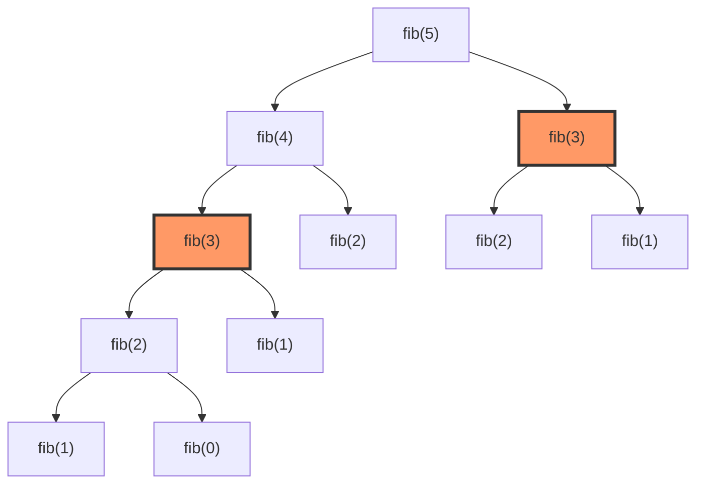
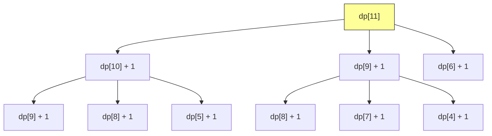
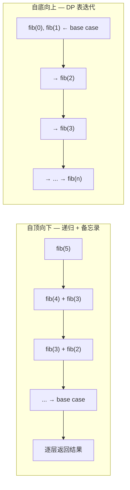

# 动态规划框架

> 核心一句话：**动态规划 = 重叠子问题 + 最优子结构 + 状态转移方程。求最值，就穷举；有重复，加备忘录。**
>
> 动态规划是"聪明地穷举"——用空间换时间，避免重复计算子问题。

---

## 🎯 经典 LeetCode 题目

> 💡 刷题顺序：⭐ 必背 → ⭐⭐ 进阶 → ⭐⭐⭐ 挑战

| #   | 题号                                                                          | 题目                          | 难度 | 核心考点           | 推荐指数 |
| --- | ----------------------------------------------------------------------------- | ----------------------------- | :--: | ------------------ | :------: |
| 1   | [509](https://leetcode.cn/problems/fibonacci-number/)                         | 斐波那契数                    |  🟢  | DP 入门、状态压缩  |    ⭐    |
| 2   | [322](https://leetcode.cn/problems/coin-change/)                              | 零钱兑换                      |  🟡  | 最值 DP、状态转移  |    ⭐    |
| 3   | [300](https://leetcode.cn/problems/longest-increasing-subsequence/)           | 最长递增子序列                |  🟡  | LIS 模板、二分优化 |   ⭐⭐   |
| 4   | [1143](https://leetcode.cn/problems/longest-common-subsequence/)              | 最长公共子序列                |  🟡  | 二维 DP、LCS 模板  |   ⭐⭐   |
| 5   | [583](https://leetcode.cn/problems/delete-operation-for-two-strings/)         | 两个字符串的删除操作          |  🟡  | LCS 变种           |   ⭐⭐   |
| 6   | [712](https://leetcode.cn/problems/minimum-ascii-delete-sum-for-two-strings/) | 两个字符串的最小 ASCII 删除和 |  🟡  | LCS 变种           |  ⭐⭐⭐  |
| 7   | [72](https://leetcode.cn/problems/edit-distance/)                             | 编辑距离                      |  🔴  | 经典二维 DP        |  ⭐⭐⭐  |
| 8   | [53](https://leetcode.cn/problems/maximum-subarray/)                          | 最大子数组和                  |  🟡  | 一维 DP            |   ⭐⭐   |
| 9   | [198](https://leetcode.cn/problems/house-robber/)                             | 打家劫舍                      |  🟡  | DP 入门            |    ⭐    |
| 10  | [139](https://leetcode.cn/problems/word-break/)                               | 单词拆分                      |  🟡  | 字符串 DP          |   ⭐⭐   |

---

## 📋 目录

1. [DP 三要素](#-dp-三要素)
2. [思维框架：四步走](#-思维框架四步走)
3. [入门：斐波那契（DP 优化过程演示）](#-入门斐波那契dp-优化过程演示)
4. [问题一：零钱兑换（最值 DP）](#-问题一零钱兑换最值-dp)
5. [问题二：最长公共子序列（二维 DP）](#-问题二最长公共子序列二维-dp)
6. [DP 表 vs 备忘录 — 两种实现方式](#-dp-表-vs-备忘录--两种实现方式)
7. [状态压缩技巧](#-状态压缩技巧)
8. [复杂度速查表](#-复杂度速查表)
9. [刷题建议](#-刷题建议)

---

## 🧠 DP 三要素

```
┌─────────────────────────────────────────────┐
│              动态规划三要素                    │
├─────────────────────────────────────────────┤
│                                             │
│  ① 重叠子问题 (Overlapping Subproblems)      │
│     └─ 子问题会被重复计算 → 备忘录 / DP 表   │
│                                             │
│  ② 最优子结构 (Optimal Substructure)         │
│     └─ 子问题的最优解能推出原问题的最优解     │
│                                             │
│  ③ 状态转移方程 (State Transition)           │
│     └─ 怎么从子问题的解得到当前问题的解       │
│                                             │
└─────────────────────────────────────────────┘
```

### 一个直觉：DP 怎么来的？

```
暴力递归 → 有重叠子问题 → 加备忘录（自顶向下） → DP 表（自底向上） → 状态压缩
  O(2ⁿ)         ❌           O(n) ✅              O(n) ✅         O(1) 🚀
```

---

## 📐 思维框架：四步走

写 DP 之前，先回答这四个问题：

```

   ① base case 是什么？
      └─ 最简单的情况，直接返回什么值？

   ② 状态是什么？
      └─ 什么变量在变化？→ 就是 dp 数组的维度

   ③ 选择是什么？
      └─ 每一步有哪些决策？→ 就是求最值的地方

   ④ dp 数组/函数怎么定义？
      └─ dp[i][j] 的含义是什么？

```

```typescript
// dp-思维框架.ts
/**
 * 动态规划通用框架
 */
function dpFramework(): void {
  // ① 初始化 base case
  // dp[0][0][...] = baseValue
  // ② 遍历所有状态
  // for (状态1 of 状态1的所有取值) {
  //   for (状态2 of 状态2的所有取值) {
  //     for (...) {
  //       ③ 做选择，求最值
  //       dp[状态1][状态2] = Math.max/min(
  //         选择1, 选择2, ...
  //       );
  //     }
  //   }
  // }
}
```

---

## 🔢 入门：斐波那契（DP 优化过程演示）

斐波那契不是 DP（没有求最值），但它是理解"递归→备忘录→DP→状态压缩"的最佳例子。

### 第一步：暴力递归 → O(2ⁿ)



```typescript
// fib-brute-force.ts
function fibBruteForce(n: number): number {
  if (n === 0 || n === 1) return n;
  return fibBruteForce(n - 1) + fibBruteForce(n - 2);
}
// fib(30) → 1.3M 次调用 😱
```

### 第二步：加备忘录 → O(n)

```typescript
// fib-memo.ts
function fibWithMemo(n: number, memo: number[] = []): number {
  if (n === 0 || n === 1) return n;
  if (memo[n] !== undefined) return memo[n];
  memo[n] = fibWithMemo(n - 1, memo) + fibWithMemo(n - 2, memo);
  return memo[n];
}
// fib(30) → 31 次调用 ✅
```

### 第三步：DP 表（自底向上） → O(n)

```typescript
// fib-dp.ts
function fibDP(n: number): number {
  if (n === 0) return 0;
  const dp: number[] = [0, 1];
  for (let i = 2; i <= n; i++) {
    dp[i] = dp[i - 1] + dp[i - 2];
  }
  return dp[n];
}
```

### 第四步：状态压缩 → O(1) 空间

```typescript
// fib-compressed.ts
function fibCompressed(n: number): number {
  if (n === 0 || n === 1) return n;
  let prev = 0,
    curr = 1;
  for (let i = 2; i <= n; i++) {
    [prev, curr] = [curr, prev + curr];
  }
  return curr;
}
```

---

## 🔢 问题一：零钱兑换（最值 DP）

> [322. 零钱兑换](https://leetcode.cn/problems/coin-change/)
> 输入 `coins=[1,2,5]`, `amount=11` → 最少需要 3 枚（5+5+1）

### 思维四步走

```
① base case: amount = 0 → 0 枚硬币，amount < 0 → 无解
② 状态: 目标金额 amount（唯一变化的量）
③ 选择: 选取一枚硬币，金额减少 coin
④ dp 定义: dp[i] = 凑出金额 i 需要的最少硬币数

dp[i] = min(dp[i - coin] + 1)  for coin in coins
```



```typescript
// coin-change.ts
/**
 * 零钱兑换
 *
 * dp[i] = 凑出金额 i 需要的最少硬币数
 * dp[i] = min(dp[i - coin] + 1)  for coin in coins
 *
 * 时间复杂度 O(amount × n)  空间复杂度 O(amount)
 */
function coinChange(coins: number[], amount: number): number {
  // dp 数组初始化为 amount + 1（最大值，表示不可能）
  const dp: number[] = new Array(amount + 1).fill(amount + 1);

  // base case
  dp[0] = 0;

  // 遍历所有状态（金额）
  for (let i = 0; i <= amount; i++) {
    // 遍历所有选择（硬币）
    for (const coin of coins) {
      if (i - coin < 0) continue; // 金额不够，跳过
      dp[i] = Math.min(dp[i], 1 + dp[i - coin]);
    }
  }

  return dp[amount] === amount + 1 ? -1 : dp[amount];
}

// --- 测试 ---
console.log('零钱兑换:', coinChange([1, 2, 5], 11)); // 3
console.log('零钱兑换:', coinChange([2], 3)); // -1
```

### DP 表填充过程

```
amount:   0  1  2  3  4  5  6  7  8  9  10  11
dp[i]:    0  1  1  2  2  1  2  2  3  3  2   3
          ↑                             ↑
       base case                    答案 = 3
```

---

## 🔢 问题二：最长公共子序列（二维 DP）

> [1143. 最长公共子序列](https://leetcode.cn/problems/longest-common-subsequence/)
> 输入 `s1="abcde"`, `s2="ace"` → 输出 3（"ace"）

### 思维四步走

```
① base case: i === s1.length 或 j === s2.length → 0
② 状态: 两个指针 i (s1 的位置), j (s2 的位置)
③ 选择:
     s1[i] === s2[j] → 这个字符在 LCS 中 → dp+1
     s1[i] !== s2[j] → 至少有一个不在 → 取 max
④ dp 定义: dp[i][j] = s1[i..] 和 s2[j..] 的 LCS 长度
```

````mermaid
flowchart TD
    subgraph DP表 [DP 表填充示意]
        direction LR
        A["s1='abcde', s2='ace'"] --> TABLE["```
         '' a  c  e
      ''  0  0  0  0
      a   0  1  1  1
      b   0  1  1  1
      c   0  1  2  2
      d   0  1  2  2
      e   0  1  2  3
        ```"]
    end
````

```typescript
// longest-common-subsequence.ts
/**
 * 最长公共子序列 — 二维 DP
 *
 * dp[i][j] = s1[0..i-1] 和 s2[0..j-1] 的 LCS 长度
 *
 * 递推公式：
 *   s1[i-1] === s2[j-1] → dp[i][j] = dp[i-1][j-1] + 1
 *   s1[i-1] !== s2[j-1] → dp[i][j] = max(dp[i-1][j], dp[i][j-1])
 *
 * 时间复杂度 O(m×n)  空间复杂度 O(m×n)
 */
function longestCommonSubsequence(s1: string, s2: string): number {
  const m = s1.length;
  const n = s2.length;

  // dp[i][j]：s1[0..i-1] 和 s2[0..j-1] 的 LCS 长度
  const dp: number[][] = Array.from({ length: m + 1 }, () => new Array(n + 1).fill(0));

  for (let i = 1; i <= m; i++) {
    for (let j = 1; j <= n; j++) {
      if (s1[i - 1] === s2[j - 1]) {
        dp[i][j] = dp[i - 1][j - 1] + 1; // 字符匹配，LCS 加一
      } else {
        dp[i][j] = Math.max(
          dp[i - 1][j], // s1[i-1] 不在 LCS 中
          dp[i][j - 1] // s2[j-1] 不在 LCS 中
        );
      }
    }
  }

  return dp[m][n];
}

// --- 测试 ---
console.log('LCS:', longestCommonSubsequence('abcde', 'ace')); // 3
console.log('LCS:', longestCommonSubsequence('abc', 'abc')); // 3
console.log('LCS:', longestCommonSubsequence('abc', 'def')); // 0
```

### LCS 的应用：删除操作（LeetCode 583）

```typescript
// 583. 两个字符串的删除操作
// 思路：算出 LCS，总长度 - 2 × LCS = 需要删除的字符数
function minDistance(s1: string, s2: string): number {
  const lcs = longestCommonSubsequence(s1, s2);
  return s1.length - lcs + (s2.length - lcs);
}
```

---

## ⚔️ DP 表 vs 备忘录 — 两种实现方式



| 维度     |   自顶向下（递归+备忘录）    |  自底向上（DP 表）   |
| -------- | :--------------------------: | :------------------: |
| 实现方式 |       递归 + 数组缓存        |     for 循环迭代     |
| 思考难度 |     更自然（从问题出发）     | 需要先想好 DP 表顺序 |
| 性能     |         递归有栈开销         |       通常更快       |
| 状态压缩 |            相对难            |  容易（改几行代码）  |
| 适用场景 | 状态维度高，但只用到部分状态 |  所有状态都需要遍历  |

---

## ⚡ 状态压缩技巧

> 很多 DP 问题中，`dp[i]` 只依赖 `dp[i-1]`，不需要保存整个数组。

```typescript
// 斐波那契：从 O(n) → O(1)
// 最大子数组和：dp[i] 只依赖 dp[i-1]
function maxSubArray(nums: number[]): number {
  let dpPrev = nums[0]; // dp[i-1]
  let max = nums[0];

  for (let i = 1; i < nums.length; i++) {
    dpPrev = Math.max(nums[i], dpPrev + nums[i]); // 要不要加上之前的？
    max = Math.max(max, dpPrev);
  }

  return max;
}
```

> **状态压缩的判断标准：** dp[i] 只跟 dp[i-1]（或 dp[i-1][...]）有关，就可以滚动。
> 如果 dp[i] 依赖 dp[i-1] 和 dp[i-2]…dp[i-k]，保存 k 个值即可。

---

## 📊 复杂度速查表

| 问题             |  时间复杂度   | 空间复杂度 |       状态压缩       |
| ---------------- | :-----------: | :--------: | :------------------: |
| 斐波那契（暴力） |     O(2ⁿ)     |    O(n)    |          —           |
| 斐波那契（DP）   |     O(n)      |    O(n)    |      ✅ → O(1)       |
| 零钱兑换         | O(n × amount) | O(amount)  |   ❌（一维已最优）   |
| LCS              |   O(m × n)    |  O(m × n)  |   ✅ → O(min(m,n))   |
| 编辑距离         |   O(m × n)    |  O(m × n)  |   ✅ → O(min(m,n))   |
| 最长递增子序列   |     O(n²)     |    O(n)    | ✅ 二分 → O(n log n) |

---

## 🎯 刷题建议

### 推荐练习路线

| 阶段   | 目标        | 题目                              | 关键点       |
| ------ | ----------- | --------------------------------- | ------------ |
| ⭐     | DP 思维入门 | 509 斐波那契、322 零钱兑换        | 四步走框架   |
| ⭐⭐   | 一维 DP     | 300 最长递增子序列、53 最大子数组 | dp[i] 的定义 |
| ⭐⭐⭐ | 二维 DP     | 1143 LCS、72 编辑距离             | 双指针状态   |
| ⭐⭐⭐ | 综合        | 583 删除操作、712 ASCII 删除      | LCS 变种     |

### 自查清单

```
[ ] 四步走都过了吗？（base → 状态 → 选择 → dp 定义）
[ ] dp 数组的每个维度的含义清楚吗？
[ ] base case 初始化正确吗？
[ ] 遍历顺序对吗？（有些问题需要倒着遍历）
[ ] 能状态压缩吗？（dp[i] 只依赖 dp[i-1]？）
[ ] 返回值是 dp[m][n] 还是 max(dp)？
```

---

## 💪 白板挑战

> 不参考代码，写出零钱兑换的 DP 解法：

```typescript
// ✍️ 你的默写
function coinChange(coins: number[], amount: number): number {}
```

> 一句话解释：什么是"最优子结构"？

---

> **关联阅读：** `07-knapsack-problems.md` → `10-edit-distance.md` → `08-stock-series.md`
