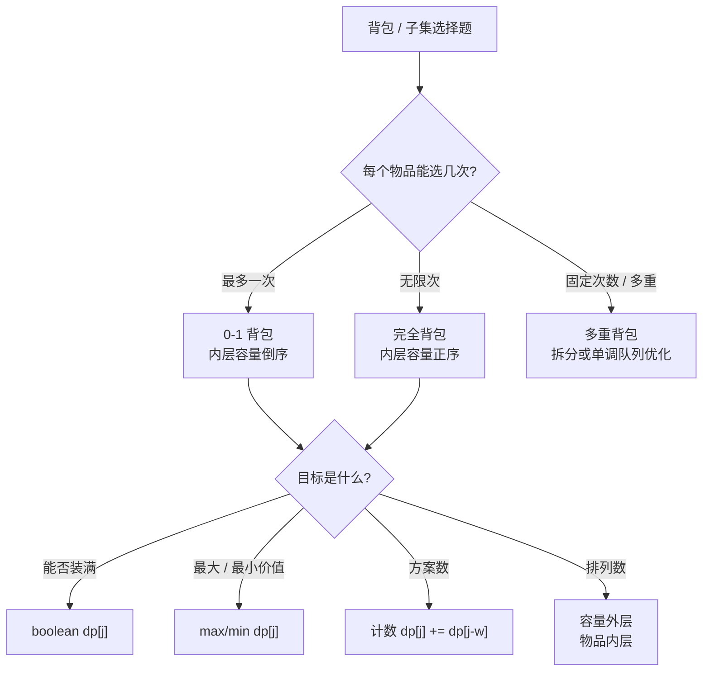
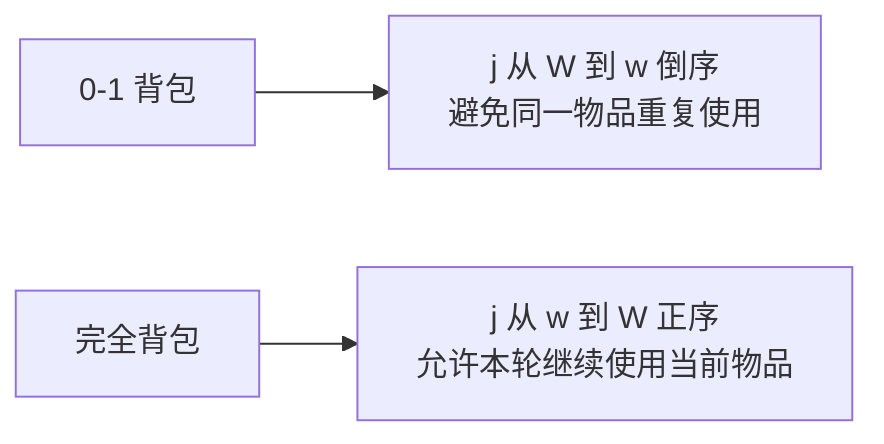
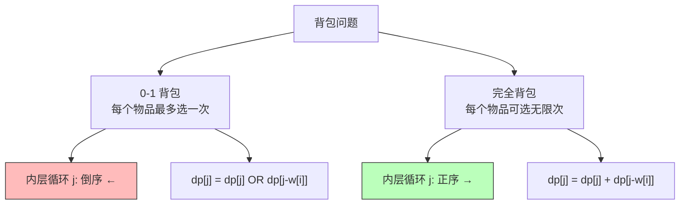

# 背包问题：0-1 背包与完全背包

> 核心一句话：**背包问题的本质是"有限资源下的组合优化" — 0-1 背包每个物品只能选一次，完全背包可以选无限次。**
>
> 所有背包问题的代码差异只有两行：循环方向（正序/倒序）和状态转移（`dp[i-1]` 还是 `dp[i]`）。

---

## 🎯 经典 LeetCode 题目

| #   | 题号                                                            | 题目                  | 难度 | 核心考点                 | 推荐指数 |
| --- | --------------------------------------------------------------- | --------------------- | :--: | ------------------------ | :------: |
| 1   | [416](https://leetcode.cn/problems/partition-equal-subset-sum/) | 分割等和子集          |  🟡  | 0-1 背包（判断能否装满） |    ⭐    |
| 2   | [474](https://leetcode.cn/problems/ones-and-zeroes/)            | 一和零                |  🟡  | 二维 0-1 背包            |   ⭐⭐   |
| 3   | [494](https://leetcode.cn/problems/target-sum/)                 | 目标和                |  🟡  | 0-1 背包变种             |   ⭐⭐   |
| 4   | [1049](https://leetcode.cn/problems/last-stone-weight-ii/)      | 最后一块石头的重量 II |  🟡  | 0-1 背包变种             |   ⭐⭐   |
| 5   | [322](https://leetcode.cn/problems/coin-change/)                | 零钱兑换              |  🟡  | 完全背包（最少硬币）     |    ⭐    |
| 6   | [518](https://leetcode.cn/problems/coin-change-ii/)             | 零钱兑换 II           |  🟡  | **完全背包（组合数）**   |   ⭐⭐   |
| 7   | [279](https://leetcode.cn/problems/perfect-squares/)            | 完全平方数            |  🟡  | 完全背包                 |   ⭐⭐   |
| 8   | [377](https://leetcode.cn/problems/combination-sum-iv/)         | 组合总和 Ⅳ            |  🟡  | **排列数（注意区别！）** |  ⭐⭐⭐  |

---

## 🗺️ 背包题型决策图



## 🔁 一维压缩方向



---

## 📋 目录

- [背包问题：0-1 背包与完全背包](#背包问题0-1-背包与完全背包)
  - [🎯 经典 LeetCode 题目](#-经典-leetcode-题目)
  - [🗺️ 背包题型决策图](#️-背包题型决策图)
  - [🔁 一维压缩方向](#-一维压缩方向)
  - [📋 目录](#-目录)
  - [🧠 0-1 背包 vs 完全背包](#-0-1-背包-vs-完全背包)
  - [📐 0-1 背包模板](#-0-1-背包模板)
  - [📐 完全背包模板](#-完全背包模板)
  - [🔢 问题一：分割等和子集（0-1 背包判断能否装满）](#-问题一分割等和子集0-1-背包判断能否装满)
    - [二维 DP 表填充过程](#二维-dp-表填充过程)
  - [⚡ 状态压缩：从二维到一维](#-状态压缩从二维到一维)
  - [🔢 问题二：零钱兑换 II（完全背包组合数）](#-问题二零钱兑换-ii完全背包组合数)
    - [DP 表填充过程](#dp-表填充过程)
  - [🎯 排列 vs 组合：遍历顺序的秘密](#-排列-vs-组合遍历顺序的秘密)
  - [📊 复杂度速查表](#-复杂度速查表)
  - [🎯 刷题建议](#-刷题建议)
    - [推荐练习路线](#推荐练习路线)
    - [自查清单](#自查清单)
  - [💪 白板挑战](#-白板挑战)
  - [Python 核心模板补充](#python-核心模板补充)

---

## 🧠 0-1 背包 vs 完全背包



| 维度             |              0-1 背包              |             完全背包             |
| ---------------- | :--------------------------------: | :------------------------------: |
| 每个物品         |               选一次               |             选无限次             |
| 内层循环方向     |           **倒序** `j--`           |          **正序** `j++`          |
| 状态转移（一维） | `dp[j] = dp[j] \|\| dp[j-nums[i]]` | `dp[j] = dp[j] + dp[j-coins[i]]` |
| 典型问题         |          子集和、分割等和          |       零钱兑换、完全平方数       |

> **为什么方向不同？**
>
> - 倒序 `j--`：保证每个物品只被用一次（新值不会覆盖本轮已用的旧值）
> - 正序 `j++`：每个物品可以被反复使用（新值会覆盖，下一轮又可以用）

---

## 📐 0-1 背包模板

```typescript
// knapsack-01-template.ts
/**
 * 0-1 背包通用模板
 *
 * 问题：有 N 个物品，每个物品重量 w[i]，价值 v[i]，
 *       背包容量 W，求能装入的最大价值
 *
 * dp[j] = 容量为 j 的背包能装的最大价值
 *
 * 时间 O(N×W)  空间 O(W)
 */
function knapsack01(weights: number[], values: number[], W: number): number {
  const n = weights.length;
  const dp: number[] = new Array(W + 1).fill(0);

  for (let i = 0; i < n; i++) {
    // ⚠️ 倒序！保证每个物品只用一次
    for (let j = W; j >= weights[i]; j--) {
      dp[j] = Math.max(
        dp[j], // 不装
        dp[j - weights[i]] + values[i] // 装
      );
    }
  }

  return dp[W];
}
```

---

## 📐 完全背包模板

```typescript
// knapsack-unbounded-template.ts
/**
 * 完全背包通用模板
 *
 * 问题：有无限个物品，每个物品重量 w[i]，价值 v[i]，
 *       背包容量 W，求能装入的最大价值
 *
 * 时间 O(N×W)  空间 O(W)
 */
function knapsackUnbounded(weights: number[], values: number[], W: number): number {
  const n = weights.length;
  const dp: number[] = new Array(W + 1).fill(0);

  for (let i = 0; i < n; i++) {
    // ⚠️ 正序！保证每个物品可以重复使用
    for (let j = weights[i]; j <= W; j++) {
      dp[j] = Math.max(
        dp[j], // 不装
        dp[j - weights[i]] + values[i] // 装（还可以再装）
      );
    }
  }

  return dp[W];
}
```

---

## 🔢 问题一：分割等和子集（0-1 背包判断能否装满）

> [416. 分割等和子集](https://leetcode.cn/problems/partition-equal-subset-sum/)
> 输入 `[1,5,11,5]` → 可以分割成 `[1,5,5]` 和 `[11]` → true

**转化：** 能否选出一些数，使它们的和等于 `sum/2`？
→ 0-1 背包：容量 = `sum/2`，每个数就是一个物品，判断能否恰好装满。

### 二维 DP 表填充过程

`nums=[1,5,11,5]`，`sum/2=11`

| i \ j | 0 | 1 | 2 | 3 | 4 | 5 | 6 | 7 | 8 | 9 | 10 | 11 |
|-------|---|---|---|---|---|---|---|---|---|---|----|----|
| 0     | T | F | F | F | F | F | F | F | F | F | F  | F  |
| 1 (1) | T | T | F | F | F | F | F | F | F | F | F  | F  |
| 2 (5) | T | T | F | F | F | T | T | F | F | F | F  | F  |
| 3 (11)| T | T | F | F | F | T | T | F | F | F | F  | T  |
| 4 (5) | T | T | F | F | F | T | T | F | F | F | F  | T  |

```typescript
// partition-equal-subset-sum.ts
/**
 * 416. 分割等和子集
 *
 * 转化为 0-1 背包：容量 = sum/2，每个数字是一个物品
 * dp[j] = 是否存在子集的和等于 j
 *
 * 时间复杂度 O(n × sum)  空间复杂度 O(sum)
 */
function canPartition(nums: number[]): boolean {
  const sum = nums.reduce((a, b) => a + b, 0);
  // 奇数肯定不能平分
  if (sum % 2 !== 0) return false;

  const target = sum / 2;
  const dp: boolean[] = new Array(target + 1).fill(false);
  dp[0] = true; // base case: 和为 0 总是可以

  for (const num of nums) {
    // ⚠️ 倒序！0-1 背包
    for (let j = target; j >= num; j--) {
      dp[j] = dp[j] || dp[j - num];
    }
  }

  return dp[target];
}

// --- 测试 ---
console.log('可以分割?', canPartition([1, 5, 11, 5])); // true
console.log('可以分割?', canPartition([1, 2, 3, 5])); // false
```

---

## ⚡ 状态压缩：从二维到一维

为什么 0-1 背包内层循环要倒序？看这个对比：

```typescript
/**
 * 二维版本（不压缩）
 * dp[i][j] = 前 i 个物品能否凑出 j
 *
 * 状态压缩的核心观察：
 * dp[i][j] 只依赖 dp[i-1][..]，不依赖更早的行
 * → 可以只保留一行，每次迭代时"从右往左"更新
 */
function canPartition2D(nums: number[]): boolean {
  const sum = nums.reduce((a, b) => a + b, 0);
  if (sum % 2 !== 0) return false;
  const target = sum / 2;
  const n = nums.length;

  const dp: boolean[][] = Array.from({ length: n + 1 }, () => new Array(target + 1).fill(false));

  // base case: 容量为 0 时总能装满
  for (let i = 0; i <= n; i++) dp[i][0] = true;

  for (let i = 1; i <= n; i++) {
    for (let j = 1; j <= target; j++) {
      if (j - nums[i - 1] < 0) {
        dp[i][j] = dp[i - 1][j]; // 装不下
      } else {
        dp[i][j] =
          dp[i - 1][j] || // 不装
          dp[i - 1][j - nums[i - 1]]; // 装
      }
    }
  }

  return dp[n][target];
}
```

> **💡 状态压缩的本质：** `dp[i][j]` 只依赖 `dp[i-1][j]` 和 `dp[i-1][j - w]`（上一行的值）。如果从右往左更新 `dp[j]`，左边的值还是"上一行"的状态，正好被右边需要；如果从左往右更新，左边的值被覆盖成"当前行"了，右边的 0-1 背包需要的就是"上一行"的值，就错了。

---

## 🔢 问题二：零钱兑换 II（完全背包组合数）

> [518. 零钱兑换 II](https://leetcode.cn/problems/coin-change-ii/)
> 输入 `amount=5, coins=[1,2,5]` → 4 种方式：`5=5, 5=2+2+1, 5=2+1+1+1, 5=1+1+1+1+1`

**转化：** 完全背包，求恰好装满背包的组合数。

```typescript
// coin-change-ii.ts
/**
 * 518. 零钱兑换 II — 完全背包（组合数）
 *
 * dp[j] = 凑出金额 j 的硬币组合数
 *
 * ⚠️ 外层循环硬币，内层循环金额（正序）
 *    这样每个硬币可以无限使用，且统计的是组合数
 *    如果内外层调换，统计的是排列数！
 *
 * 时间复杂度 O(N×amount)  空间 O(amount)
 */
function change(amount: number, coins: number[]): number {
  const dp: number[] = new Array(amount + 1).fill(0);
  dp[0] = 1; // 凑出 0 元只有一种方式：什么也不选

  for (const coin of coins) {
    // ⚠️ 正序！完全背包
    for (let j = coin; j <= amount; j++) {
      // 不选 coin + 选 coin
      dp[j] = dp[j] + dp[j - coin];
    }
  }

  return dp[amount];
}

// --- 测试 ---
console.log('零钱兑换II:', change(5, [1, 2, 5])); // 4
```

### DP 表填充过程

```
coins=[1,2,5], amount=5

初始化: dp[0]=1, dp[1..5]=0

用硬币 1:  dp = [1, 1, 1, 1, 1, 1]
用硬币 2:  dp = [1, 1, 2, 2, 3, 3]
用硬币 5:  dp = [1, 1, 2, 2, 3, 4]  ← 答案 4
```

---

## 🎯 排列 vs 组合：遍历顺序的秘密

> 同一个 DP 公式，内外层循环交换，结果就从**组合数**变成了**排列数**！

```typescript
/**
 * 组合数（上面的 change 函数）
 *
 * 外层 coins → 内层 amount：
 *   保证硬币的顺序固定（先 1 后 2），不会出现 {2,1}
 *   结果：{1,1,1,1,1}, {1,1,1,2}, {1,2,2}, {5} → 4 种
 */
function combination(amount: number, coins: number[]): number {
  const dp: number[] = new Array(amount + 1).fill(0);
  dp[0] = 1;
  for (const coin of coins) {
    // 外层：硬币
    for (let j = coin; j <= amount; j++) {
      // 内层：金额
      dp[j] += dp[j - coin];
    }
  }
  return dp[amount];
}

/**
 * 排列数（LeetCode 377. 组合总和 Ⅳ）
 *
 * 外层 amount → 内层 coins：
 *   每个金额都重新考虑所有硬币
 *   结果：{1,1,1,1,1}, {1,1,1,2}, {1,1,2,1}, {1,2,1,1},
 *         {2,1,1,1}, {1,2,2}, {2,1,2}, {2,2,1}, {5} → 9 种
 */
function permutation(amount: number, coins: number[]): number {
  const dp: number[] = new Array(amount + 1).fill(0);
  dp[0] = 1;
  for (let j = 1; j <= amount; j++) {
    // 外层：金额
    for (const coin of coins) {
      // 内层：硬币
      if (j >= coin) {
        dp[j] += dp[j - coin];
      }
    }
  }
  return dp[amount];
}

// --- 对比 ---
console.log('组合:', combination(5, [1, 2, 5])); // 4
console.log('排列:', permutation(5, [1, 2, 5])); // 9
```

> **💡 记忆口诀：**
>
> - **组合**：先硬币（物品）后金额（容量）— 防止重复顺序
> - **排列**：先金额（容量）后硬币（物品）— 每个位置都有全部选择

---

## 📊 复杂度速查表

| 问题                |   类型    | 时间复杂度  | 空间复杂度 |     循环方向     |
| ------------------- | :-------: | :---------: | :--------: | :--------------: |
| 分割等和子集        | 0-1 判断  |  O(n×sum)   |   O(sum)   |       倒序       |
| 目标和              | 0-1 计数  |  O(n×sum)   |   O(sum)   |       倒序       |
| 一和零              | 0-1 二维  |  O(n×m×n)   |   O(m×n)   |      倒序×2      |
| 零钱兑换（最少）    | 完全 最值 | O(N×amount) | O(amount)  |       正序       |
| 零钱兑换 II（组合） | 完全 计数 | O(N×amount) | O(amount)  |       正序       |
| 组合总和 IV（排列） | 完全 排列 | O(N×amount) | O(amount)  | 正序（内外互换） |

---

## 🎯 刷题建议

### 推荐练习路线

| 阶段   | 目标         | 题目                     | 关键点                       |
| ------ | ------------ | ------------------------ | ---------------------------- |
| ⭐     | 0-1 背包判断 | 416 分割等和子集         | 倒序，`dp[j] \|\| dp[j-num]` |
| ⭐⭐   | 0-1 背包计数 | 494 目标和、1049 石头 II | 状态压缩                     |
| ⭐⭐   | 完全背包     | 518 零钱兑换 II          | 正序，内外层顺序             |
| ⭐⭐⭐ | 排列 vs 组合 | 377 组合总和 IV          | 内外层交换对比               |

### 自查清单

```
[ ] 0-1 背包还是完全背包？
[ ] 内层循环是正序（完全）还是倒序（0-1）？
[ ] 求的是组合数还是排列数？
[ ] 如果求排列数，内外层循环互换了吗？
[ ] 空间压缩了吗？（二维 → 一维）
[ ] base case 设置对了吗？（dp[0] = 0 / 1 / true?）
```

---

## 💪 白板挑战

> 写出 0-1 背包和完全背包的核心代码区别：

```typescript
// 0-1 背包
function knapsack01(weights: number[], W: number): number {
  const dp: number[] = new Array(W + 1).fill(0);
  for (const w of weights) {
    // 循环方向：______    为什么？________________
    for (let j = W; j >= w; j--) {
      dp[j] = Math.max(dp[j], dp[j - w] + 1);
    }
  }
  return dp[W];
}

// 完全背包
function knapsackUnbounded(weights: number[], W: number): number {
  const dp: number[] = new Array(W + 1).fill(0);
  for (const w of weights) {
    // 循环方向：______    为什么？________________
    for (let j = w; j <= W; j++) {
      dp[j] = Math.max(dp[j], dp[j - w] + 1);
    }
  }
  return dp[W];
}
```

---

## Python 核心模板补充

```python
def zero_one_knapsack(weights: list[int], values: list[int], capacity: int) -> int:
    dp = [0] * (capacity + 1)
    for w, v in zip(weights, values):
        for c in range(capacity, w - 1, -1):
            dp[c] = max(dp[c], dp[c - w] + v)
    return dp[capacity]

def complete_knapsack(coins: list[int], amount: int) -> int:
    dp = [0] * (amount + 1)
    dp[0] = 1
    for coin in coins:
        for s in range(coin, amount + 1):
            dp[s] += dp[s - coin]
    return dp[amount]
```

---

> **关联阅读：** `06-dp-framework.md` → `08-stock-series.md` → `09-house-robber-and-interval-dp.md`
