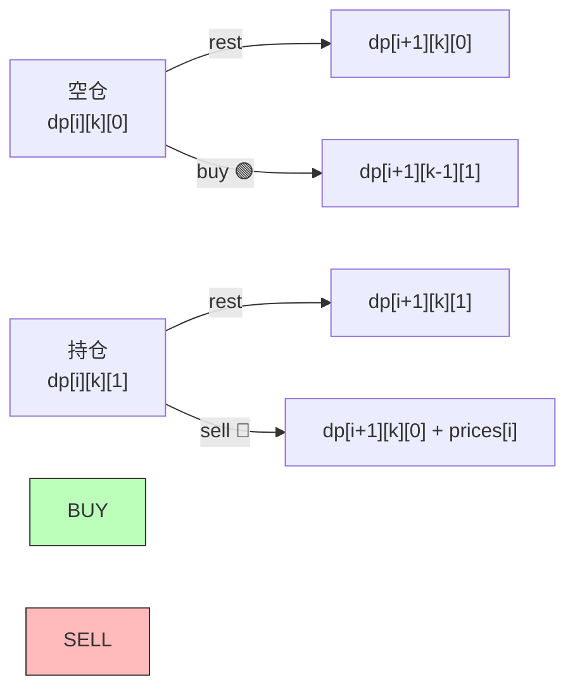

# 团灭股票买卖问题（状态机 DP）

> 核心一句话：**6 道股票题可以用一个统一的三维 DP 状态机搞定 — `dp[i][k][s]` = 第 i 天，最多交易 k 次，持股状态 s（0/1）时的最大利润。**
>
> 区别只在 k 的值（1 / +∞ / 2）和有没有额外条件（冷冻期、手续费）。

---

## 🎯 经典 LeetCode 题目

| #   | 题号                                                                                      | 题目                       | 难度 |  k 值  | 特殊条件        |
| --- | ----------------------------------------------------------------------------------------- | -------------------------- | :--: | :----: | --------------- |
| 1   | [121](https://leetcode.cn/problems/best-time-to-buy-and-sell-stock/)                      | 买卖股票的最佳时机         |  🟢  |  k=1   | 无              |
| 2   | [122](https://leetcode.cn/problems/best-time-to-buy-and-sell-stock-ii/)                   | 买卖股票的最佳时机 II      |  🟡  |  k=+∞  | 无              |
| 3   | [123](https://leetcode.cn/problems/best-time-to-buy-and-sell-stock-iii/)                  | 买卖股票的最佳时机 III     |  🔴  |  k=2   | 无              |
| 4   | [188](https://leetcode.cn/problems/best-time-to-buy-and-sell-stock-iv/)                   | 买卖股票的最佳时机 IV      |  🔴  | k=任意 | 无              |
| 5   | [309](https://leetcode.cn/problems/best-time-to-buy-and-sell-stock-with-cooldown/)        | 最佳买卖股票时机含冷冻期   |  🟡  |  k=+∞  | 卖出后冻结 1 天 |
| 6   | [714](https://leetcode.cn/problems/best-time-to-buy-and-sell-stock-with-transaction-fee/) | 买卖股票的最佳时机含手续费 |  🟡  |  k=+∞  | 每次交易扣费    |

---

## 📋 目录

1. [统一状态机模型](#-统一状态机模型)
2. [状态转移方程推导](#-状态转移方程推导)
3. [通用框架代码](#-通用框架代码)
4. [问题一：k=1（一次交易）](#-问题一k1一次交易)
5. [问题二：k=+∞（无限次交易）](#-问题二k无限次交易)
6. [问题三：k=2（两次交易）](#-问题三k2两次交易)
7. [问题四：含冷冻期](#-问题四含冷冻期)
8. [问题五：含手续费](#-问题五含手续费)
9. [复杂度速查表](#-复杂度速查表)
10. [刷题建议](#-刷题建议)

---

## 🧠 统一状态机模型

### 状态定义

```mermaid
flowchart LR
    subgraph 状态 [三维状态 dp[i][k][s]]
        direction TB
        S1["第 i 天"] --> S2["最多交易 k 次"]
        S2 --> S3["持股状态 s: <br/>0=未持股, 1=持股"]
    end

    subgraph 选择 [每天三种选择]
        BUY["买入 🟢<br/>(消耗一次交易)"] --> HOLD["持股"]
        SELL["卖出 🔴<br/>(获得利润)"] --> CASH["空仓"]
        REST["休息 ⚪<br/>(什么都不做)"] --> KEEP["保持原状态"]
    end
```

```
dp[i][k][0] = 第 i 天结束时，最多交易了 k 次，不持有股票，的最大利润
dp[i][k][1] = 第 i 天结束时，最多交易了 k 次，持有股票，的最大利润

最终答案 = dp[n-1][K][0]  （最后一天，交易了最多 K 次，空仓）
```

---

## 📐 状态转移方程推导

### 状态转移图



### 公式

```
dp[i][k][0] = max(dp[i-1][k][0],              ← 昨天就空仓，今天 rest
                  dp[i-1][k][1] + prices[i])   ← 昨天持仓，今天 sell ✅

dp[i][k][1] = max(dp[i-1][k][1],              ← 昨天就持仓，今天 rest
                  dp[i-1][k-1][0] - prices[i]) ← 昨天空仓，今天 buy 🟢（消耗一次交易）
```

### Base case

```
dp[-1][k][0] = 0          ← 还没开始，利润为 0
dp[-1][k][1] = -Infinity  ← 还没开始，不可能持仓
dp[i][0][0]  = 0          ← 不允许交易，利润为 0
dp[i][0][1]  = -Infinity  ← 不允许交易，不可能持仓
```

---

## 📐 通用框架代码

```typescript
// stock-template.ts
/**
 * 股票买卖 — 通用 DP 框架
 *
 * @param kMax  最大交易次数（+Infinity 表示无限）
 * @param prices 每日价格
 * @param cooldown 冷冻期天数（默认 0）
 * @param fee 手续费（默认 0）
 * @returns 最大利润
 */
function maxProfitGeneral(
  kMax: number,
  prices: number[],
  cooldown: number = 0,
  fee: number = 0
): number {
  const n = prices.length;
  if (n === 0) return 0;

  // 如果 k 非常大，等价于无限次交易（k > n/2 时就没有限制意义了）
  if (kMax > n / 2) {
    return maxProfitUnlimited(prices, cooldown, fee);
  }

  // dp[i][k][0/1]
  const dp: number[][][] = Array.from({ length: n }, () =>
    Array.from({ length: kMax + 1 }, () => [0, -Infinity])
  );

  for (let i = 0; i < n; i++) {
    for (let k = 1; k <= kMax; k++) {
      if (i === 0) {
        // base case
        dp[i][k][0] = 0;
        dp[i][k][1] = -prices[i];
        continue;
      }

      // 状态转移
      dp[i][k][0] = Math.max(
        dp[i - 1][k][0],
        dp[i - 1][k][1] + prices[i] - fee // 卖出（扣手续费）
      );

      // 买入时需要考虑冷冻期：如果 i-1 天是冷冻期，不能从 dp[i-2] 转移
      const prev = cooldown > 0 && i >= 2 ? i - 2 : i - 1;
      dp[i][k][1] = Math.max(
        dp[i - 1][k][1],
        (i >= 1 + cooldown ? dp[i - 1 - cooldown][k - 1][0] : 0) - prices[i]
      );
    }
  }

  return dp[n - 1][kMax][0];
}

/**
 * 无限次交易（k = +∞）的简化版本
 * k 不在状态中，去掉 k 维度
 */
function maxProfitUnlimited(prices: number[], cooldown: number = 0, fee: number = 0): number {
  const n = prices.length;
  if (n === 0) return 0;

  let dp_i_0 = 0; // dp[i][0]
  let dp_i_1 = -Infinity; // dp[i][1]
  let dp_prev_0 = 0; // dp[i-1][0]（用于冷冻期）

  for (let i = 0; i < n; i++) {
    const temp = dp_i_0;

    dp_i_0 = Math.max(dp_i_0, dp_i_1 + prices[i] - fee);

    dp_i_1 = Math.max(dp_i_1, (cooldown > 0 ? dp_prev_0 : dp_i_0) - prices[i]);

    if (cooldown > 0) dp_prev_0 = temp;
  }

  return dp_i_0;
}
```

---

## 🔢 问题一：k=1（一次交易）

> [121. 买卖股票的最佳时机](https://leetcode.cn/problems/best-time-to-buy-and-sell-stock/)
> 只能买卖一次，求最大利润。

```typescript
// stock-1.ts
/**
 * k=1 — 只能买卖一次
 *
 * 其实就是找 max(prices[j] - prices[i])，其中 j > i
 * 可以简化为：记录历史最低点，每天计算"如果今天卖能赚多少"
 *
 * 时间复杂度 O(n)  空间复杂度 O(1)
 */
function maxProfitOnce(prices: number[]): number {
  let minPrice = Infinity;
  let maxProfit = 0;

  for (const price of prices) {
    minPrice = Math.min(minPrice, price); // 历史最低买入价
    maxProfit = Math.max(maxProfit, price - minPrice); // 今天卖能赚多少？
  }

  return maxProfit;
}

// 或者用 DP 模板（k=1 时的简化）
function maxProfitOnceDP(prices: number[]): number {
  // 当 k=1 时，dp[i][1][0] 和 dp[i][1][1]
  let dp_i_0 = 0;
  let dp_i_1 = -Infinity;

  for (const price of prices) {
    // dp[i][1][0] = max(dp[i-1][1][0], dp[i-1][1][1] + price)
    dp_i_0 = Math.max(dp_i_0, dp_i_1 + price);
    // dp[i][1][1] = max(dp[i-1][1][1], -price)  ← k-1=0 时 dp[i-1][0][0]=0
    dp_i_1 = Math.max(dp_i_1, -price);
  }

  return dp_i_0;
}

// --- 测试 ---
console.log('一次交易:', maxProfitOnce([7, 1, 5, 3, 6, 4])); // 5（1买6卖）
```

---

## 🔢 问题二：k=+∞（无限次交易）

> [122. 买卖股票的最佳时机 II](https://leetcode.cn/problems/best-time-to-buy-and-sell-stock-ii/)
> 可以买卖无限次。

```typescript
// stock-unlimited.ts
/**
 * k=+∞ — 无限次交易
 *
 * 因为 k 和 k-1 在无穷大时没有区别，去掉 k 维度
 * 等价于：所有上涨日都买卖，所有下跌日都空仓
 *
 * 贪心思路：只要今天比昨天高，就昨天买今天卖
 * 时间复杂度 O(n)  空间复杂度 O(1)
 */
function maxProfitUnlimitedSimple(prices: number[]): number {
  let profit = 0;
  for (let i = 1; i < prices.length; i++) {
    if (prices[i] > prices[i - 1]) {
      profit += prices[i] - prices[i - 1]; // 昨天买今天卖
    }
  }
  return profit;
}

// DP 版本
function maxProfitUnlimitedDP(prices: number[]): number {
  let dp_i_0 = 0;
  let dp_i_1 = -Infinity;

  for (const price of prices) {
    const prev_0 = dp_i_0;
    dp_i_0 = Math.max(dp_i_0, dp_i_1 + price);
    dp_i_1 = Math.max(dp_i_1, prev_0 - price); // ⚠️ 用 prev_0（旧值），不是 dp_i_0（新值）
  }

  return dp_i_0;
}

// --- 测试 ---
console.log('无限次:', maxProfitUnlimitedSimple([7, 1, 5, 3, 6, 4])); // 7
// 解释: 1买5卖=4, 3买6卖=3, 总=7
```

---

## 🔢 问题三：k=2（两次交易）

> [123. 买卖股票的最佳时机 III](https://leetcode.cn/problems/best-time-to-buy-and-sell-stock-iii/)

```typescript
// stock-k2.ts
/**
 * k=2 — 最多两次交易
 *
 * k 比较小，手动展开所有状态
 *
 * 时间复杂度 O(n)  空间复杂度 O(1)
 */
function maxProfitTwo(prices: number[]): number {
  // 第一次交易
  let dp1_0 = 0; // 第一次交易后空仓
  let dp1_1 = -Infinity; // 第一次交易后持仓
  // 第二次交易
  let dp2_0 = 0; // 第二次交易后空仓
  let dp2_1 = -Infinity; // 第二次交易后持仓

  for (const price of prices) {
    // 第二次交易空仓 = max(之前空仓, 第二次持仓 + 今天卖出)
    dp2_0 = Math.max(dp2_0, dp2_1 + price);
    // 第二次交易持仓 = max(之前持仓, 第一次空仓 - 今天买入)
    dp2_1 = Math.max(dp2_1, dp1_0 - price);
    // 第一次交易空仓
    dp1_0 = Math.max(dp1_0, dp1_1 + price);
    // 第一次交易持仓
    dp1_1 = Math.max(dp1_1, -price);
  }

  return dp2_0;
}

// --- 测试 ---
console.log('两次交易:', maxProfitTwo([3, 3, 5, 0, 0, 3, 1, 4])); // 6
// 解释: 3买5卖=2, 0买4卖=4, 总=6
```

---

## 🔢 问题四：含冷冻期

> [309. 最佳买卖股票时机含冷冻期](https://leetcode.cn/problems/best-time-to-buy-and-sell-stock-with-cooldown/)
> 卖出股票后，第二天不能买入（冷冻期 1 天）。

```typescript
// stock-with-cooldown.ts
/**
 * 含冷冻期 — 卖出后隔一天才能买
 *
 * 区别：买入时要从 i-2 的状态转移（跳过冷冻期的 i-1 天）
 *
 * 时间复杂度 O(n)  空间 O(1)
 */
function maxProfitWithCooldown(prices: number[]): number {
  let dp_i_0 = 0; // dp[i][0]
  let dp_i_1 = -Infinity; // dp[i][1]
  let dp_prev_0 = 0; // dp[i-1][0]（冷冻期专用）

  for (let i = 0; i < prices.length; i++) {
    const temp = dp_i_0;

    // 正常卖出
    dp_i_0 = Math.max(dp_i_0, dp_i_1 + prices[i]);

    // ⚠️ 买入时只能用 dp_prev_0（i-2 天的空仓状态）
    // 因为卖出后冻结一天，i-1 天不能买
    dp_i_1 = Math.max(dp_i_1, dp_prev_0 - prices[i]);

    dp_prev_0 = temp; // 更新为下一轮准备
  }

  return dp_i_0;
}

// --- 测试 ---
console.log('冷冻期:', maxProfitWithCooldown([1, 2, 3, 0, 2])); // 3
// 解释: 1买2卖=1, 0买2卖=2, 总=3（注意中间有冷冻期）
```

---

## 🔢 问题五：含手续费

> [714. 买卖股票的最佳时机含手续费](https://leetcode.cn/problems/best-time-to-buy-and-sell-stock-with-transaction-fee/)

```typescript
// stock-with-fee.ts
/**
 * 含手续费 — 每次交易扣 fee
 *
 * 区别：卖出时扣掉手续费
 *
 * 时间复杂度 O(n)  空间 O(1)
 */
function maxProfitWithFee(prices: number[], fee: number): number {
  let dp_i_0 = 0;
  let dp_i_1 = -Infinity;

  for (const price of prices) {
    dp_i_0 = Math.max(dp_i_0, dp_i_1 + price - fee); // ⚠️ 卖出扣费
    dp_i_1 = Math.max(dp_i_1, dp_i_0 - price);
  }

  return dp_i_0;
}

// --- 测试 ---
console.log('手续费:', maxProfitWithFee([1, 3, 2, 8, 4, 9], 2)); // 8
// 解释: 1买8卖-2=5, 4买9卖-2=3, 总=8
```

---

## 📊 复杂度速查表

| 问题       |  k  | 时间复杂度 | 空间复杂度 | 和基础版的区别 |
| ---------- | :-: | :--------: | :--------: | -------------- |
| 一次交易   |  1  |    O(n)    |    O(1)    | 记录历史最低点 |
| 无限次交易 | +∞  |    O(n)    |    O(1)    | k 维度消失     |
| 两次交易   |  2  |    O(n)    |    O(1)    | 手动展开 k=1,2 |
| 任意次交易 |  K  |   O(nK)    |    O(K)    | 三维 DP        |
| 冷冻期     | +∞  |    O(n)    |    O(1)    | 买入用 dp[i-2] |
| 手续费     | +∞  |    O(n)    |    O(1)    | 卖出扣 fee     |

---

## 🎯 刷题建议

### 推荐练习路线

| 阶段   | 目标       | 题目                     | 关键点            |
| ------ | ---------- | ------------------------ | ----------------- |
| ⭐     | 理解状态机 | 121 一次交易、122 无限次 | 两种维度简化      |
| ⭐⭐   | 展开 k     | 123 两次交易             | 手动展开 k 个状态 |
| ⭐⭐⭐ | 完整 DP    | 188 任意次交易           | 完整三维 dp       |
| ⭐⭐⭐ | 变种       | 309 冷冻期、714 手续费   | 微调转移公式      |

### 自查清单

```
[ ] dp[i][k][0/1] 的三维含义清楚了？
[ ] 买入时 k-1 还是卖出时 k-1？
[ ] k=+∞ 时简化掉了 k 维度？
[ ] 冷冻期买入用的是 dp[i-2] 还是 dp_prev_0？
[ ] 手续费是在卖出时扣的吗？
[ ] base case 初始化了吗？（-Infinity 表示不可能）
```

---

## 💪 白板挑战

> 写出 k=+∞ 时的 DP 代码：

```typescript
// ✍️ 你的默写
function maxProfitUnlimited(prices: number[]): number {}
```

> 一句话解释为什么 k=+∞ 时 k 维度可以去掉？

---

> **关联阅读：** `06-dp-framework.md` → `07-knapsack-problems.md` → `09-house-robber-and-interval-dp.md`
