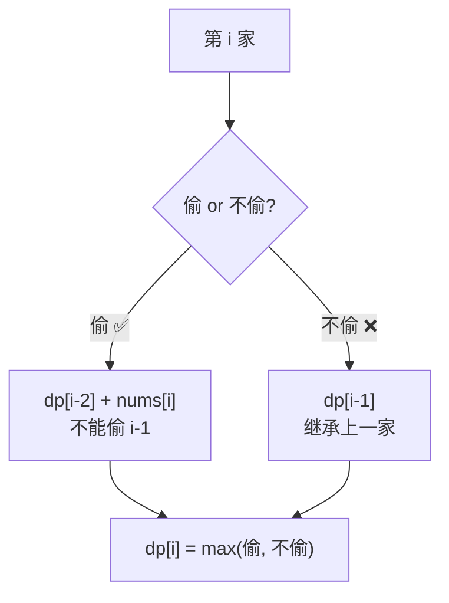
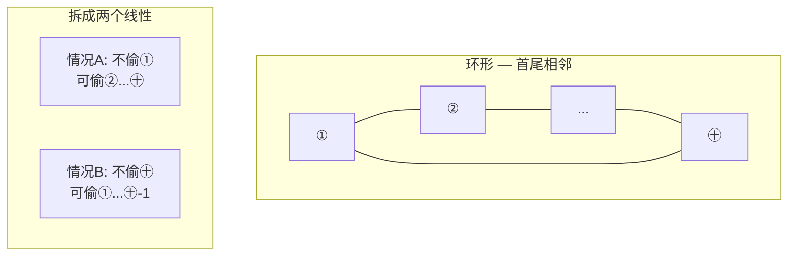
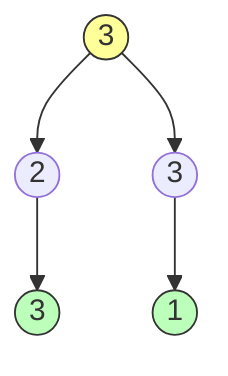

# 打家劫舍与区间 DP

> 核心一句话：**打家劫舍是"一维 DP + 相邻互斥"的经典入门，而区间 DP 是"在区间上做合并"的二维 DP。**
>
> 打家劫舍三部曲展示了从线性到环到树的 DP 递进思路。

---

## 🎯 经典 LeetCode 题目

| # | 题号 | 题目 | 难度 | 类型 | 推荐指数 |
|---|------|------|:----:|------|:--------:|
| 1 | [198](https://leetcode.cn/problems/house-robber/) | 打家劫舍 | 🟡 | 线性 DP | ⭐ |
| 2 | [213](https://leetcode.cn/problems/house-robber-ii/) | 打家劫舍 II | 🟡 | 环形 DP | ⭐⭐ |
| 3 | [337](https://leetcode.cn/problems/house-robber-iii/) | 打家劫舍 III | 🟡 | 树形 DP | ⭐⭐⭐ |
| 4 | [740](https://leetcode.cn/problems/delete-and-earn/) | 删除并获得点数 | 🟡 | 打家劫舍变种 | ⭐⭐ |
| 5 | [2560](https://leetcode.cn/problems/house-robber-iv/) | 打家劫舍 IV | 🟡 | 二分 + DP | ⭐⭐⭐ |
| 6 | [435](https://leetcode.cn/problems/non-overlapping-intervals/) | 无重叠区间 | 🟡 | 区间贪心 | ⭐ |
| 7 | [646](https://leetcode.cn/problems/maximum-length-of-pair-chain/) | 最长数对链 | 🟡 | 区间 DP | ⭐⭐ |

---

## 📋 目录

1. [问题一：线性打家劫舍](#-问题一线性打家劫舍)
2. [问题二：环形打家劫舍](#-问题二环形打家劫舍)
3. [问题三：树形打家劫舍](#-问题三树形打家劫舍)
4. [打家劫舍三步递进对比](#-打家劫舍三步递进对比)
5. [复杂度速查表](#-复杂度速查表)
6. [刷题建议](#-刷题建议)

---

## 🧠 核心思想

打家劫舍的约束很简单：**不能同时偷相邻的两家**。

```
状态：dp[i] = 偷到第 i 家时的最大金额
选择：偷（+nums[i]）+ 隔一家 / 不偷（继承上一家的结果）
```



---

## 🔢 问题一：线性打家劫舍

> [198. 打家劫舍](https://leetcode.cn/problems/house-robber/)

```typescript
// house-robber.ts
/**
 * 198. 打家劫舍 — 线性 DP
 * 
 * dp[i] = 偷到第 i 间时的最大金额
 * dp[i] = max(dp[i-1], dp[i-2] + nums[i])
 * 
 * 时间复杂度 O(n)  空间 O(1)（状态压缩后）
 */
function rob(nums: number[]): number {
  const n = nums.length;
  if (n === 0) return 0;
  if (n === 1) return nums[0];

  let prev2 = nums[0];          // dp[i-2] — 隔两间
  let prev1 = Math.max(nums[0], nums[1]); // dp[i-1] — 上一间

  for (let i = 2; i < n; i++) {
    const curr = Math.max(prev1, prev2 + nums[i]);
    prev2 = prev1;
    prev1 = curr;
  }

  return prev1;
}

// DP 表版本（便于理解）
function robDP(nums: number[]): number {
  const n = nums.length;
  if (n === 0) return 0;

  const dp: number[] = new Array(n + 1).fill(0);
  dp[1] = nums[0];

  for (let i = 2; i <= n; i++) {
    dp[i] = Math.max(dp[i - 1], dp[i - 2] + nums[i - 1]);
  }

  return dp[n];
}

// 从右向左的递归思维（和原文 dp(nums, start) 保持一致）
function robRecursive(nums: number[]): number {
  const memo: number[] = new Array(nums.length).fill(-1);

  function dp(start: number): number {
    if (start >= nums.length) return 0;
    if (memo[start] !== -1) return memo[start];

    // 不抢 → 去下家  vs  抢 → 去下下家
    memo[start] = Math.max(
      dp(start + 1),
      nums[start] + dp(start + 2)
    );
    return memo[start];
  }

  return dp(0);
}

// --- 测试 ---
console.log("打家劫舍:", rob([1, 2, 3, 1])); // 4 (1+3)
console.log("打家劫舍:", rob([2, 7, 9, 3, 1])); // 12 (2+9+1)
```

---

## 🔢 问题二：环形打家劫舍

> [213. 打家劫舍 II](https://leetcode.cn/problems/house-robber-ii/)
> 房屋排成一个环，第一家和最后一家相邻。

**思路：** 环形拆成两个线性问题



```typescript
// house-robber-ii.ts
/**
 * 213. 打家劫舍 II — 环形
 * 
 * 两种情况取最大：
 *   ① 不抢第一家：范围 [1, n-1]
 *   ② 不抢最后一家：范围 [0, n-2]
 */
function robCircular(nums: number[]): number {
  const n = nums.length;
  if (n === 0) return 0;
  if (n === 1) return nums[0];

  // 复用线性版本的逻辑
  return Math.max(
    robLinear(nums, 0, n - 2),  // 不抢最后一家
    robLinear(nums, 1, n - 1)   // 不抢第一家
  );
}

function robLinear(nums: number[], start: number, end: number): number {
  let prev2 = 0;
  let prev1 = 0;

  for (let i = start; i <= end; i++) {
    const curr = Math.max(prev1, prev2 + nums[i]);
    prev2 = prev1;
    prev1 = curr;
  }

  return prev1;
}

// --- 测试 ---
console.log("环形打家劫舍:", robCircular([2, 3, 2])); // 3（不抢第一家：只抢第二家）
console.log("环形打家劫舍:", robCircular([1, 2, 3, 1])); // 4（1+3）
```

---

## 🔢 问题三：树形打家劫舍

> [337. 打家劫舍 III](https://leetcode.cn/problems/house-robber-iii/)
> 房屋是一棵二叉树，相连的父子节点不能同时偷。



```typescript
// house-robber-iii.ts

class TreeNode<T> {
  constructor(
    public val: T,
    public left: TreeNode<T> | null = null,
    public right: TreeNode<T> | null = null
  ) {}
}

/**
 * 337. 打家劫舍 III — 树形 DP
 * 
 * 每个节点返回两个值：[不偷该节点的最大收益, 偷该节点的最大收益]
 * 
 * 不偷: 子节点可以偷或不偷，取 max(left) + max(right)
 * 偷:   left[0] + right[0] + node.val（子节点都不能偷）
 * 
 * 时间复杂度 O(n)  空间 O(h)
 */
function robTree(root: TreeNode<number> | null): number {
  function dfs(node: TreeNode<number> | null): [number, number] {
    if (node === null) return [0, 0];

    const left = dfs(node.left);
    const right = dfs(node.right);

    // 不偷当前节点：子节点偷或不偷都可以
    const skip = Math.max(left[0], left[1]) + Math.max(right[0], right[1]);
    // 偷当前节点：子节点都不能偷
    const rob = node.val + left[0] + right[0];

    return [skip, rob];
  }

  const [skip, rob] = dfs(root);
  return Math.max(skip, rob);
}

// --- 测试 ---
//       3
//      / \
//     2   3
//    /     \
//   3       1
const root = new TreeNode(3);
root.left = new TreeNode(2, new TreeNode(3));
root.right = new TreeNode(3, null, new TreeNode(1));

console.log("树形打家劫舍:", robTree(root)); // 7（3+3+1 或 2+3+... 实际 3+3+1=7）
```

---

## 📊 打家劫舍三步递进对比

| 维度 | 线性（198） | 环形（213） | 树形（337） |
|------|:----------:|:----------:|:----------:|
| 数据结构 | 数组 | 环（数组+首尾相邻） | 二叉树 |
| 状态定义 | `dp[i]` | 拆分两个线性 | `[不偷, 偷]` 元组 |
| 递推 | `max(dp[i-1], dp[i-2]+nums[i])` | 同线性，取两次 max | 后序遍历合并 |
| 复杂度 | O(n)/O(1) | O(n)/O(1) | O(n)/O(h) |

---

## 📊 复杂度速查表

| 问题 | 时间复杂度 | 空间复杂度 | 核心公式 |
|------|:--------:|:--------:|----------|
| 198 线性打家劫舍 | O(n) | O(1) | `dp[i] = max(dp[i-1], dp[i-2]+nums[i])` |
| 213 环形打家劫舍 | O(n) | O(1) | 拆两个线性取 max |
| 337 树形打家劫舍 | O(n) | O(h) | `[不偷, 偷]` 后序合并 |
| 740 删除并获得点数 | O(n) | O(n) | 转化为打家劫舍 |

---

## 🎯 刷题建议

### 推荐练习路线

| 阶段 | 目标 | 题目 | 关键点 |
|------|------|------|--------|
| ⭐ | 线性 DP 入门 | 198 打家劫舍 | 相邻互斥 |
| ⭐⭐ | 环形处理 | 213 打家劫舍 II | 拆环为线 |
| ⭐⭐⭐ | 树形 DP | 337 打家劫舍 III | 后序遍历 + 元组返回 |

### 自查清单

```
[ ] 线性打家劫舍的状态压缩做了吗？（只用两个变量）
[ ] 环形处理：拆成两个线性，取最大值？
[ ] 树形：返回值是 [不偷, 偷] 还是单值？
[ ] 树形：后序遍历的位置利用上了吗？
```

---

## 💪 白板挑战

> 写出打家劫舍的 DP 代码：

```typescript
// 线性版本
function rob(nums: number[]): number {


}
```

> 树形版本中，为什么每个节点要返回两个值？

---

> **关联阅读：** `06-dp-framework.md` → `08-stock-series.md` → `12-binary-tree-traversal.md`
