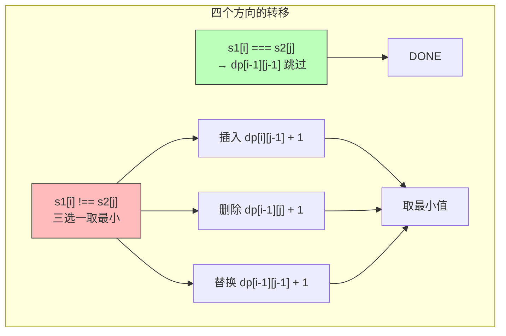
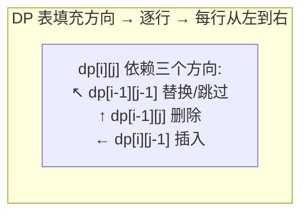

# 编辑距离

> 核心一句话：**编辑距离是二维 DP 的经典 — `dp[i][j]` 表示 s1[0..i] 到 s2[0..j] 的最小编辑距离，三种操作（增/删/改）对应三种状态转移。**
>
> 和 LCS 是"姐妹题"——LCS 求最长公共部分，编辑距离求最短转换路径。

---

## 🎯 经典 LeetCode 题目

| #   | 题号                                                                          | 题目                 | 难度 | 核心考点         | 推荐指数 |
| --- | ----------------------------------------------------------------------------- | -------------------- | :--: | ---------------- | :------: |
| 1   | [72](https://leetcode.cn/problems/edit-distance/)                             | 编辑距离             |  🔴  | 二维 DP 经典     |  ⭐⭐⭐  |
| 2   | [161](https://leetcode.cn/problems/one-edit-distance/)                        | 相隔为 1 的编辑距离  |  🟡  | 一次编辑判断     |   ⭐⭐   |
| 3   | [583](https://leetcode.cn/problems/delete-operation-for-two-strings/)         | 两个字符串的删除操作 |  🟡  | 只能删，LCS 变种 |   ⭐⭐   |
| 4   | [712](https://leetcode.cn/problems/minimum-ascii-delete-sum-for-two-strings/) | 最小 ASCII 删除和    |  🟡  | 删 + ASCII 权重  |  ⭐⭐⭐  |

---

## 📋 目录

1. [问题理解](#-问题理解)
2. [DP 四步走](#-dp-四步走)
3. [代码实现](#-代码实现)
4. [DP 表填充可视化](#-dp-表填充可视化)
5. [回溯操作路径](#-回溯操作路径)
6. [复杂度速查表](#-复杂度速查表)

---

## 🧠 问题理解

> 输入 `word1 = "horse"`, `word2 = "ros"` → 输出 3

**三种操作：**

```
① 插入（Insert）：在 word1 中插入一个字符
② 删除（Delete）：在 word1 中删除一个字符
③ 替换（Replace）：将 word1 中的字符替换为另一个
```

### 一个例子

```
horse → rorse  (h → r, 替换)
rorse → rose   (删除 r)
rose  → ros    (删除 e)
总共 3 步
```

---

## 📐 DP 四步走

```
① base case:
   i = -1 → 需要 j+1 次插入
   j = -1 → 需要 i+1 次删除

② 状态：
   i（s1 的指针），j（s2 的指针）

③ 选择：
   s1[i] === s2[j] → 跳过（不操作）
   s1[i] !== s2[j] → 增 / 删 / 改 中选最小

④ dp 定义：
   dp[i][j] = s1[0..i-1] 到 s2[0..j-1] 的最小编辑距离
```

### 状态转移方程



```
dp[i][j] =
  if s1[i-1] === s2[j-1]:
    dp[i-1][j-1]              ← 字符匹配，不用操作
  else:
    min(
      dp[i][j-1] + 1,          ← 插入
      dp[i-1][j] + 1,          ← 删除
      dp[i-1][j-1] + 1         ← 替换
    )
```

---

## 🔢 代码实现

```typescript
// edit-distance.ts
/**
 * 72. 编辑距离
 *
 * dp[i][j] = word1[0..i-1] → word2[0..j-1] 的最小编辑距离
 *
 * 时间复杂度 O(m×n)  空间复复杂度 O(m×n) → 可压缩到 O(min(m,n))
 */
function minDistance(word1: string, word2: string): number {
  const m = word1.length;
  const n = word2.length;

  // dp[i][j]：word1 前 i 个字符 → word2 前 j 个字符的编辑距离
  const dp: number[][] = Array.from({ length: m + 1 }, () => new Array(n + 1).fill(0));

  // base case
  for (let i = 1; i <= m; i++) dp[i][0] = i; // 删除 i 次
  for (let j = 1; j <= n; j++) dp[0][j] = j; // 插入 j 次

  // 填充 DP 表
  for (let i = 1; i <= m; i++) {
    for (let j = 1; j <= n; j++) {
      if (word1[i - 1] === word2[j - 1]) {
        dp[i][j] = dp[i - 1][j - 1]; // 字符相等，不用操作
      } else {
        dp[i][j] = Math.min(
          dp[i - 1][j] + 1, // 删除 word1[i-1]
          dp[i][j - 1] + 1, // 插入 word2[j-1]
          dp[i - 1][j - 1] + 1 // 替换 word1[i-1] → word2[j-1]
        );
      }
    }
  }

  return dp[m][n];
}

// --- 测试 ---
console.log('编辑距离:', minDistance('horse', 'ros')); // 3
console.log('编辑距离:', minDistance('intention', 'execution')); // 5
```

---

## 🖼️ DP 表填充可视化

```
      ''  r   o   s
  ''   0   1   2   3     ← base: dp[0][j] = j
  h    1   1   2   3     ← h→r 替换 (1)
  o    2   2   1   2     ← o→o 跳过 (1)
  r    3   2   2   2     ← r→r 跳过 (2)
  s    4   3   3   2     ← s→s 跳过 (2)
  e    5   4   4   3 ✅   ← 删除 e (3)

           ↑
      答案是 dp[5][3] = 3
```

### DP 表递推动画



```typescript
// 状态压缩版本（空间 O(n)）
function minDistanceCompressed(word1: string, word2: string): number {
  const m = word1.length;
  const n = word2.length;

  // 只保留上一行
  let dpPrev: number[] = new Array(n + 1).fill(0);
  for (let j = 0; j <= n; j++) dpPrev[j] = j;

  for (let i = 1; i <= m; i++) {
    const dpCurr: number[] = new Array(n + 1).fill(0);
    dpCurr[0] = i; // base case

    for (let j = 1; j <= n; j++) {
      if (word1[i - 1] === word2[j - 1]) {
        dpCurr[j] = dpPrev[j - 1];
      } else {
        dpCurr[j] = Math.min(
          dpPrev[j] + 1, // 删除
          dpCurr[j - 1] + 1, // 插入
          dpPrev[j - 1] + 1 // 替换
        );
      }
    }

    dpPrev = dpCurr;
  }

  return dpPrev[n];
}
```

---

## 🔍 回溯操作路径

如果我们不只想要距离，还想知道**具体做了哪些操作**：

```typescript
// edit-distance-with-path.ts
/**
 * 编辑距离 — 带路径回溯
 * 返回 [最小距离, 操作序列]
 */
function minDistanceWithPath(word1: string, word2: string): [number, string[]] {
  const m = word1.length;
  const n = word2.length;
  const dp: number[][] = Array.from({ length: m + 1 }, () => new Array(n + 1).fill(0));

  for (let i = 1; i <= m; i++) dp[i][0] = i;
  for (let j = 1; j <= n; j++) dp[0][j] = j;

  for (let i = 1; i <= m; i++) {
    for (let j = 1; j <= n; j++) {
      if (word1[i - 1] === word2[j - 1]) {
        dp[i][j] = dp[i - 1][j - 1];
      } else {
        dp[i][j] = Math.min(dp[i - 1][j] + 1, dp[i][j - 1] + 1, dp[i - 1][j - 1] + 1);
      }
    }
  }

  // 回溯操作路径从 dp[m][n] → dp[0][0]
  const operations: string[] = [];
  let i = m,
    j = n;
  while (i > 0 || j > 0) {
    if (i > 0 && dp[i][j] === dp[i - 1][j] + 1) {
      operations.push(`删除 '${word1[i - 1]}'`);
      i--;
    } else if (j > 0 && dp[i][j] === dp[i][j - 1] + 1) {
      operations.push(`插入 '${word2[j - 1]}'`);
      j--;
    } else {
      if (word1[i - 1] !== word2[j - 1]) {
        operations.push(`替换 '${word1[i - 1]}' → '${word2[j - 1]}'`);
      }
      i--;
      j--;
    }
  }

  return [dp[m][n], operations.reverse()];
}

// --- 测试 ---
const [dist, ops] = minDistanceWithPath('horse', 'ros');
console.log(`距离: ${dist}`);
ops.forEach((op, i) => console.log(`  ${i + 1}. ${op}`));
// 输出:
// 距离: 3
//   1. 替换 'h' → 'r'
//   2. 删除 'r'
//   3. 删除 'e'
```

---

## 📊 复杂度速查表

| 版本     | 时间复杂度 |   空间复杂度    | 说明       |
| -------- | :--------: | :-------------: | ---------- |
| 暴力递归 | O(3^(m+n)) |     O(m+n)      | 指数级爆炸 |
| 备忘录   |   O(m×n)   |     O(m×n)      | 自顶向下   |
| DP 表    |   O(m×n)   |     O(m×n)      | 自底向上   |
| 状态压缩 |   O(m×n)   | **O(min(m,n))** | 只保留一行 |

---

## 🎯 刷题建议

### 自查清单

```
[ ] base case 初始化了吗？（dp[i][0]=i, dp[0][j]=j）
[ ] 三种操作对应三个方向是否写对了？
[ ] 字符匹配时操作数是 0（skip）还是别的？
[ ] 能状态压缩吗？（只保留一行）
[ ] 如果需要具体操作路径，知道怎么回溯吗？
```

---

## 💪 白板挑战

```typescript
// ✍️ 默写编辑距离
function minDistance(word1: string, word2: string): number {}
```

---

> **关联阅读：** `06-dp-framework.md` → `07-knapsack-problems.md` → `08-stock-series.md`
