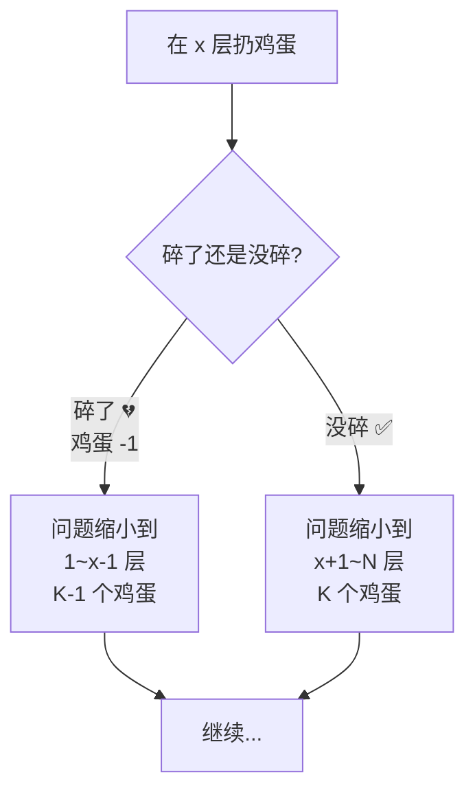
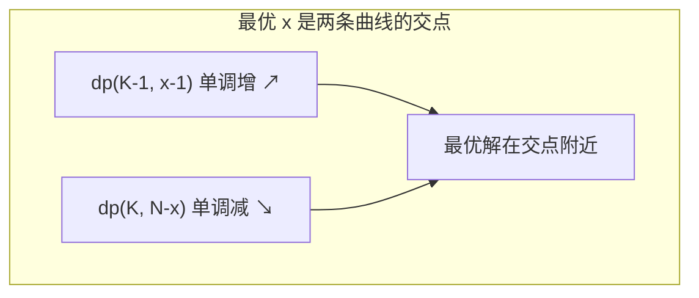
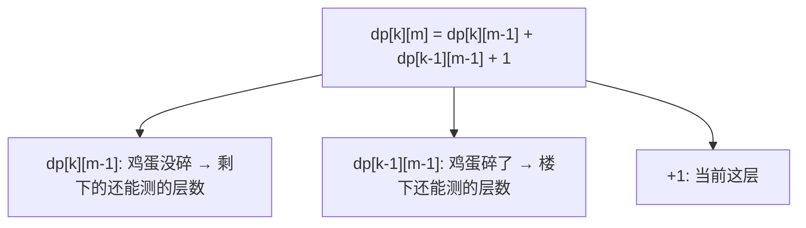

# 高楼扔鸡蛋（二分 + DP）

> 核心一句话：**给你 K 个鸡蛋，N 层楼，求最坏情况下确定鸡蛋临界楼层 F 的最小扔鸡蛋次数。**
>
> 这是 DP + 二分的经典结合——外层 DP 决策状态，内层二分搜索优化决策。

---

## 🎯 经典 LeetCode 题目

| #   | 题号                                                                    | 题目              | 难度 | 核心考点      | 推荐指数 |
| --- | ----------------------------------------------------------------------- | ----------------- | :--: | ------------- | :------: |
| 1   | [887](https://leetcode.cn/problems/super-egg-drop/)                     | 鸡蛋掉落          |  🔴  | DP + 二分优化 |  ⭐⭐⭐  |
| 2   | [1884](https://leetcode.cn/problems/egg-drop-with-2-eggs-and-n-floors/) | 鸡蛋掉落-两枚鸡蛋 |  🟡  | 简化版        |   ⭐⭐   |

---

## 📋 目录

1. [问题理解](#-问题理解)
2. [方法一：基础 DP（超时但好理解）](#-方法一基础-dp超时但好理解)
3. [方法二：DP + 二分优化](#-方法二dp--二分优化)
4. [方法三：最优解 — 反向 DP 思维](#-方法三最优解--反向-dp-思维)
5. [三种方法对比](#-三种方法对比)
6. [复杂度速查表](#-复杂度速查表)
7. [刷题建议](#-刷题建议)

---

## 🧠 问题理解

```
K 个鸡蛋，N 层楼（1..N）：
  鸡蛋从 F 楼扔下不会碎，从 F+1 楼扔下会碎
  求最坏情况下，确定 F 的最小扔鸡蛋次数

关键约束：
  · 鸡蛋没碎 → 可以继续用
  · 鸡蛋碎了 → 少一个鸡蛋
  · 要保证最坏情况下也能测出来
```



---

## 🔢 方法一：基础 DP（超时但好理解）

### 四步走

```
① base case:
   K = 1  → 只能线性扫描 → N 次
   N = 0  → 0 次

② 状态:
   K（剩余鸡蛋数），N（剩余楼层数）

③ 选择:
   在第 x 层扔 → 碎了（K-1, x-1）或 没碎（K, N-x）
   取最坏情况 → max(碎了, 没碎) + 1

④ dp 定义:
   dp(K, N) = K 个鸡蛋，N 层楼，最坏情况下的最小扔鸡蛋次数
```

```typescript
// egg-drop-basic.ts
/**
 * 887. 鸡蛋掉落 — 基础 DP（O(K×N²)，超时但思路清晰）
 *
 * dp(K, N) = min( max( dp(K-1, x-1), dp(K, N-x) ) + 1 )  for x in [1, N]
 *                ↑                       ↑
 *             碎了（楼下）            没碎（楼上）
 *
 * 时间复杂度 O(K×N²)  空间复杂度 O(K×N)
 */
function superEggDropBasic(K: number, N: number): number {
  const memo = new Map<string, number>();

  function dp(k: number, n: number): number {
    // base case
    if (k === 1) return n; // 只剩 1 个鸡蛋 → 线性扫描
    if (n === 0) return 0; // 没有楼层 → 0 次

    const key = `${k}-${n}`;
    if (memo.has(key)) return memo.get(key)!;

    let res = Infinity;

    // 在每一层尝试扔鸡蛋
    for (let x = 1; x <= n; x++) {
      res = Math.min(
        res,
        Math.max(
          dp(k - 1, x - 1), // 碎了 → 楼下
          dp(k, n - x) // 没碎 → 楼上
        ) + 1 // 当前这次扔
      );
    }

    memo.set(key, res);
    return res;
  }

  return dp(K, N);
}

// --- 测试 ---
// console.log(superEggDropBasic(3, 14)); // 4（但很慢！）
```

---

## 🔢 方法二：DP + 二分优化

> 关键观察：`dp(K-1, x-1)` 随 x 单调递增，`dp(K, N-x)` 随 x 单调递减。
> 两条曲线的交点附近就是最优的 x → 可以用二分查找。



```typescript
// egg-drop-binary-search.ts
/**
 * 鸡蛋掉落 — DP + 二分优化
 *
 * 利用 dp(K-1, x-1) 单调递增，dp(K, N-x) 单调递减的特性
 * 用二分查找最优的 x，而不是线性遍历
 *
 * 时间复杂度 O(K×N×logN)  空间复杂度 O(K×N)
 */
function superEggDropBinary(K: number, N: number): number {
  const memo = new Map<string, number>();

  function dp(k: number, n: number): number {
    if (k === 1) return n;
    if (n === 0) return 0;

    const key = `${k}-${n}`;
    if (memo.has(key)) return memo.get(key)!;

    let lo = 1,
      hi = n;
    let res = Infinity;

    while (lo <= hi) {
      const mid = Math.floor((lo + hi) / 2);

      const broken = dp(k - 1, mid - 1); // 碎了
      const notBroken = dp(k, n - mid); // 没碎

      // 取最坏情况
      const worst = Math.max(broken, notBroken) + 1;

      if (broken > notBroken) {
        // 碎了的情况更严重 → 说明 x 太大了，往左找
        hi = mid - 1;
        res = Math.min(res, worst);
      } else {
        // 没碎的情况更严重 → 说明 x 太小了，往右找
        lo = mid + 1;
        res = Math.min(res, worst);
      }
    }

    memo.set(key, res);
    return res;
  }

  return dp(K, N);
}

// --- 测试 ---
console.log('DP+二分:', superEggDropBinary(3, 14)); // 4
console.log('DP+二分:', superEggDropBinary(2, 6)); // 3
```

---

## ⚡ 方法三：最优解 — 反向 DP 思维

> **换个角度：** 不再问"给定 K 个鸡蛋和 N 层楼，最少需要扔几次"，而是问
> **"给定 K 个鸡蛋和 m 次扔的机会，最多能测多少层楼？"**



```
dp[k][m] = 用 k 个鸡蛋，允许扔 m 次，最多能测多少层楼

解释：
  · 在某一层扔鸡蛋
  · 如果没碎 → 楼上还能测 dp[k][m-1] 层
  · 如果碎了 → 楼下还能测 dp[k-1][m-1] 层
  · +1 是当前这一层
```

```typescript
// egg-drop-optimal.ts
/**
 * 鸡蛋掉落 — 反向 DP（最优解）
 *
 * dp[k][m] = k 个鸡蛋，m 次扔的机会，最多能测试的楼层数
 *
 * 当 dp[K][m] >= N 时，m 就是答案
 *
 * 时间复杂度 O(K×m)  m 是答案的大小（≤ N）
 * 空间复杂度 O(K×m) → 可以压缩到 O(K)
 */
function superEggDrop(K: number, N: number): number {
  // dp[k][m] = 用 k 个鸡蛋扔 m 次能测的最大楼层
  const dp: number[][] = Array.from({ length: K + 1 }, () => new Array(N + 1).fill(0));

  let m = 0; // 扔鸡蛋次数

  // 当能测的楼层数 < N 时，继续增加次数
  while (dp[K][m] < N) {
    m++;
    for (let k = 1; k <= K; k++) {
      dp[k][m] = dp[k][m - 1] + dp[k - 1][m - 1] + 1;
    }
  }

  return m;
}

// 状态压缩版本（空间 O(K)）
function superEggDropCompressed(K: number, N: number): number {
  const dp: number[] = new Array(K + 1).fill(0);
  let m = 0;

  while (dp[K] < N) {
    m++;
    // ⚠️ 必须从后往前更新，因为 dp[k] 依赖旧的 dp[k-1]
    for (let k = K; k >= 1; k--) {
      dp[k] = dp[k] + dp[k - 1] + 1;
    }
  }

  return m;
}

// --- 测试 ---
console.log('反向DP:', superEggDrop(3, 14)); // 4
console.log('反向DP:', superEggDrop(2, 6)); // 3
console.log('压缩版:', superEggDropCompressed(3, 14)); // 4
```

### DP 表填充过程（K=3, N=14）

```
m=0: dp[1][0]=0  dp[2][0]=0  dp[3][0]=0
m=1: dp[1][1]=1  dp[2][1]=1  dp[3][1]=1   ← 扔1次最多测1层
m=2: dp[1][2]=2  dp[2][2]=3  dp[3][2]=3
m=3: dp[1][3]=3  dp[2][3]=6  dp[3][3]=7
m=4: dp[1][4]=4  dp[2][4]=10 dp[3][4]=14  ✅ ≥ N=14 → return 4
```

---

## 📊 三种方法对比

| 方法           | 时间复杂度  | 空间复杂度 | 思路                         |
| -------------- | :---------: | :--------: | ---------------------------- |
| 基础 DP        |   O(K×N²)   |   O(K×N)   | 每层都试 → 超时              |
| DP + 二分      | O(K×N×logN) |   O(K×N)   | 利用单调性二分               |
| **反向 DP 🔥** | **O(K×m)**  |  **O(K)**  | 换角度：测多少层而不是扔几次 |

> **反向 DP 的 m 最大不会超过 N**（最坏情况线性扫描）。
> K=3, N=10000 时，m ≈ 45，效率碾压前面的方法。

---

## 🎯 刷题建议

### 自查清单

```
[ ] 理解"最坏情况下的最小"含义了吗？
[ ] 基础 DP 为什么超时？（遍历所有 x 太慢）
[ ] 二分优化利用了 dp 的什么性质？（单调性）
[ ] 反向 DP 是怎么想到的？（转换思维：测多少层）
[ ] 状态压缩时为什么要倒序更新？
```

---

## 💪 白板挑战

> 写出反向 DP 的最优解：

```typescript
function superEggDrop(K: number, N: number): number {}
```

> 一句话解释：`dp[k][m] = dp[k][m-1] + dp[k-1][m-1] + 1` 中的三项分别代表什么？

---

> **关联阅读：** `05-binary-search.md` → `06-dp-framework.md` → `07-knapsack-problems.md`
