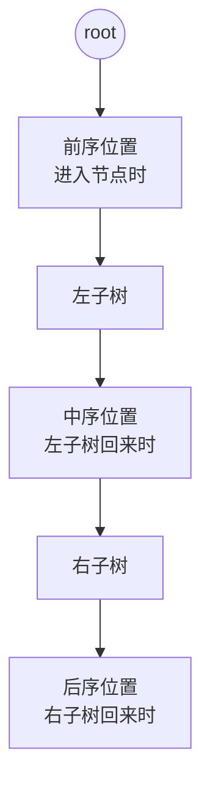
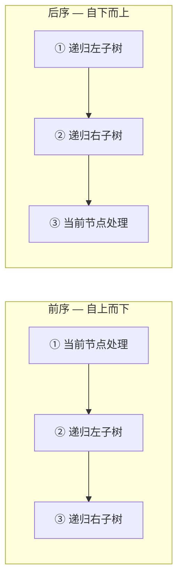

# 二叉树遍历框架

> 核心一句话：**二叉树遍历是所有递归算法的基础原型 — 前序（进入节点）、中序（左子树回来）、后序（右子树回来）。**
>
> 快速排序 = 前序遍历，归并排序 = 后序遍历。理解了三序遍历，就理解了递归。

---

## 🎯 经典 LeetCode 题目

| #   | 题号                                                                                            | 题目                             | 难度 | 核心考点          | 推荐指数 |
| --- | ----------------------------------------------------------------------------------------------- | -------------------------------- | :--: | ----------------- | :------: |
| 1   | [144](https://leetcode.cn/problems/binary-tree-preorder-traversal/)                             | 二叉树的前序遍历                 |  🟢  | 前序模板          |    ⭐    |
| 2   | [94](https://leetcode.cn/problems/binary-tree-inorder-traversal/)                               | 二叉树的中序遍历                 |  🟢  | 中序模板          |    ⭐    |
| 3   | [145](https://leetcode.cn/problems/binary-tree-postorder-traversal/)                            | 二叉树的后序遍历                 |  🟢  | 后序模板          |    ⭐    |
| 4   | [102](https://leetcode.cn/problems/binary-tree-level-order-traversal/)                          | 二叉树的层序遍历                 |  🟡  | BFS 分层          |    ⭐    |
| 5   | [103](https://leetcode.cn/problems/binary-tree-zigzag-level-order-traversal/)                   | 二叉树的锯齿形层序遍历           |  🟡  | 层序 + 奇偶反转   |   ⭐⭐   |
| 6   | [107](https://leetcode.cn/problems/binary-tree-level-order-traversal-ii/)                       | 二叉树的层序遍历 II              |  🟡  | 层序后结果反转    |    ⭐    |
| 7   | [104](https://leetcode.cn/problems/maximum-depth-of-binary-tree/)                               | 二叉树的最大深度                 |  🟢  | 后序应用          |    ⭐    |
| 8   | [100](https://leetcode.cn/problems/same-tree/)                                                  | 相同的树                         |  🟢  | 递归比较          |    ⭐    |
| 9   | [101](https://leetcode.cn/problems/symmetric-tree/)                                             | 对称二叉树                       |  🟢  | 递归镜像比较      |    ⭐    |
| 10  | [110](https://leetcode.cn/problems/balanced-binary-tree/)                                       | 平衡二叉树                       |  🟢  | 后序 + 高度差     |    ⭐    |
| 11  | [226](https://leetcode.cn/problems/invert-binary-tree/)                                         | 翻转二叉树                       |  🟢  | 前序应用          |    ⭐    |
| 12  | [114](https://leetcode.cn/problems/flatten-binary-tree-to-linked-list/)                         | 二叉树展开为链表                 |  🟡  | 后序应用          |   ⭐⭐   |
| 13  | [116](https://leetcode.cn/problems/populating-next-right-pointers-in-each-node/)                | 填充每个节点的下一个右侧节点指针 |  🟡  | 前序 + 跨节点连接 |   ⭐⭐   |
| 14  | [105](https://leetcode.cn/problems/construct-binary-tree-from-preorder-and-inorder-traversal/)  | 从前序与中序遍历构造二叉树       |  🟡  | 分治构建          |  ⭐⭐⭐  |
| 15  | [106](https://leetcode.cn/problems/construct-binary-tree-from-inorder-and-postorder-traversal/) | 从中序与后序遍历构造二叉树       |  🟡  | 分治构建          |  ⭐⭐⭐  |
| 16  | [236](https://leetcode.cn/problems/lowest-common-ancestor-of-a-binary-tree/)                    | 二叉树的最近公共祖先             |  🟡  | 后序 + 子树判断   |  ⭐⭐⭐  |
| 17  | [652](https://leetcode.cn/problems/find-duplicate-subtrees/)                                    | 寻找重复子树                     |  🟡  | 后序 + 序列化     |  ⭐⭐⭐  |

---

## 📋 目录

1. [三序遍历模板](#-三序遍历模板)
2. [前中后序的本质](#-前中后序的本质)
3. [迭代遍历（非递归）](#-迭代遍历非递归)
4. [二叉树与排序算法的对应关系](#-二叉树与排序算法的对应关系)
5. [实战：翻转二叉树（前序应用）](#-实战翻转二叉树前序应用)
6. [实战：展开为链表（后序应用）](#-实战展开为链表后序应用)
7. [实战：填充右侧指针（跨节点连接）](#-实战填充右侧指针跨节点连接)
8. [复杂度速查表](#-复杂度速查表)
9. [刷题建议](#-刷题建议)

---

## 🧠 三序遍历模板



```typescript
// binary-tree-traversal.ts

class TreeNode<T> {
  constructor(
    public val: T,
    public left: TreeNode<T> | null = null,
    public right: TreeNode<T> | null = null
  ) {}
}

/**
 * 二叉树遍历框架
 *
 * 三个位置对应三种遍历：
 *   前序 — 刚进入节点时  → "先处理当前节点，再递归孩子"
 *   中序 — 左孩子回来后  → "先左，再当前，再右"（BST 升序）
 *   后序 — 右孩子回来后  → "先递归孩子，再处理当前"（需要子结果）
 */
function traverse<T>(root: TreeNode<T> | null): void {
  if (root === null) return;

  // 前序位置：刚进入当前节点
  console.log('前序:', root.val);

  traverse(root.left);

  // 中序位置：左子树遍历完，准备进右子树
  console.log('中序:', root.val);

  traverse(root.right);

  // 后序位置：左右子树都遍历完了
  console.log('后序:', root.val);
}

// 三个独立函数
function preorder<T>(root: TreeNode<T> | null): T[] {
  const result: T[] = [];
  function dfs(node: TreeNode<T> | null): void {
    if (node === null) return;
    result.push(node.val); // 前序
    dfs(node.left);
    dfs(node.right);
  }
  dfs(root);
  return result;
}

function inorder<T>(root: TreeNode<T> | null): T[] {
  const result: T[] = [];
  function dfs(node: TreeNode<T> | null): void {
    if (node === null) return;
    dfs(node.left);
    result.push(node.val); // 中序
    dfs(node.right);
  }
  dfs(root);
  return result;
}

function postorder<T>(root: TreeNode<T> | null): T[] {
  const result: T[] = [];
  function dfs(node: TreeNode<T> | null): void {
    if (node === null) return;
    dfs(node.left);
    dfs(node.right);
    result.push(node.val); // 后序
  }
  dfs(root);
  return result;
}

// --- 测试 ---
//       1
//      / \
//     2   3
const root = new TreeNode(1, new TreeNode(2), new TreeNode(3));
console.log('前序:', preorder(root)); // [1, 2, 3]
console.log('中序:', inorder(root)); // [2, 1, 3]
console.log('后序:', postorder(root)); // [2, 3, 1]
```

---

## 🔧 前中后序的本质

> **什么时候用什么遍历？**

| 遍历位置 | 代码位置                                      | 适用场景                                   |
| -------- | --------------------------------------------- | ------------------------------------------ |
| **前序** | `traverse(left)` 之前                         | **自上而下**传递数据，构建、复制、修改     |
| **中序** | `traverse(left)` 之后，`traverse(right)` 之前 | BST 升序输出                               |
| **后序** | `traverse(right)` 之后                        | **自下而上**收集数据，需要子结果才能算当前 |



### 快速排序 = 前序遍历

```typescript
function quickSort(nums: number[], lo: number, hi: number): void {
  if (lo >= hi) return;

  // ⭐ 前序位置：先找到分界点
  const p = partition(nums, lo, hi);

  quickSort(nums, lo, p - 1); // 左半排序
  quickSort(nums, p + 1, hi); // 右半排序
}
```

### 归并排序 = 后序遍历

```typescript
function mergeSort(nums: number[], lo: number, hi: number): void {
  if (lo >= hi) return;

  const mid = Math.floor((lo + hi) / 2);
  mergeSort(nums, lo, mid); // 左半排序
  mergeSort(nums, mid + 1, hi); // 右半排序

  // ⭐ 后序位置：合并两个有序数组
  merge(nums, lo, mid, hi);
}
```

---

## 🔄 迭代遍历（非递归）

用栈模拟递归：

```typescript
// iterative-traversal.ts
/**
 * 迭代前序遍历 — 用栈模拟
 */
function preorderIterative<T>(root: TreeNode<T> | null): T[] {
  if (root === null) return [];
  const result: T[] = [];
  const stack: TreeNode<T>[] = [root];

  while (stack.length > 0) {
    const node = stack.pop()!;
    result.push(node.val); // 前序

    // 先右后左 — 因为栈是后进先出
    if (node.right) stack.push(node.right);
    if (node.left) stack.push(node.left);
  }

  return result;
}

/**
 * 迭代中序遍历
 */
function inorderIterative<T>(root: TreeNode<T> | null): T[] {
  const result: T[] = [];
  const stack: TreeNode<T>[] = [];
  let curr = root;

  while (curr !== null || stack.length > 0) {
    while (curr !== null) {
      stack.push(curr);
      curr = curr.left; // 一路向左
    }
    curr = stack.pop()!;
    result.push(curr.val); // 中序
    curr = curr.right; // 转向右子树
  }

  return result;
}
```

---

## 🔢 实战：翻转二叉树（前序应用）

> [226. 翻转二叉树](https://leetcode.cn/problems/invert-binary-tree/)

```typescript
// invert-binary-tree.ts
/**
 * 翻转二叉树
 *
 * 思路：交换左右子节点，然后递归翻转子树
 * 前序位置：先交换，再递归
 */
function invertTree<T>(root: TreeNode<T> | null): TreeNode<T> | null {
  if (root === null) return null;

  // ⭐ 前序位置：交换左右子节点
  [root.left, root.right] = [root.right, root.left];

  invertTree(root.left);
  invertTree(root.right);

  return root;
}
```

---

## 🔢 实战：展开为链表（后序应用）

> [114. 二叉树展开为链表](https://leetcode.cn/problems/flatten-binary-tree-to-linked-list/)

```typescript
// flatten-tree.ts
/**
 * 将二叉树展开为链表（右倾斜的前序链表）
 *
 * 思路：先拉平左右子树，再把右子树接到左子树下方
 * 后序位置 — 需要子结果才能做
 */
function flatten<T>(root: TreeNode<T> | null): void {
  if (root === null) return;

  flatten(root.left);
  flatten(root.right);

  // ⭐ 后序位置：左右子树已经拉平了
  const left = root.left;
  const right = root.right;

  // 将左子树作为右子树
  root.left = null;
  root.right = left;

  // 将原来的右子树接到当前右子树的末端
  let p: TreeNode<T> | null = root;
  while (p.right !== null) p = p.right;
  p.right = right;
}
```

---

## 🔢 实战：填充右侧指针（跨节点连接）

> [116. 填充每个节点的下一个右侧节点指针](https://leetcode.cn/problems/populating-next-right-pointers-in-each-node/)

```typescript
// connect-nodes.ts

class LinkedTreeNode<T> {
  constructor(
    public val: T,
    public left: LinkedTreeNode<T> | null = null,
    public right: LinkedTreeNode<T> | null = null,
    public next: LinkedTreeNode<T> | null = null
  ) {}
}

/**
 * 填充右侧指针
 *
 * 难点：需要连接不同父节点的子节点（跨节点）
 * 解决：用一个辅助函数连接「两个节点」
 */
function connect<T>(root: LinkedTreeNode<T> | null): LinkedTreeNode<T> | null {
  if (root === null) return null;
  connectTwo(root.left, root.right);
  return root;
}

function connectTwo<T>(node1: LinkedTreeNode<T> | null, node2: LinkedTreeNode<T> | null): void {
  if (node1 === null || node2 === null) return;

  // ⭐ 前序位置：连接这两个节点
  node1.next = node2;

  // 连接相同父节点的子节点
  connectTwo(node1.left, node1.right);
  connectTwo(node2.left, node2.right);
  // 连接跨父节点的子节点
  connectTwo(node1.right, node2.left);
}
```

---

## 📊 复杂度速查表

| 操作         | 时间复杂度 | 空间复杂度 | 说明                |
| ------------ | :--------: | :--------: | ------------------- |
| 递归遍历     |    O(n)    |    O(h)    | h = 树高，最坏 O(n) |
| 迭代遍历     |    O(n)    |    O(n)    | 显式栈              |
| 翻转二叉树   |    O(n)    |    O(h)    | 前序位置交换        |
| 展开为链表   |    O(n)    |    O(h)    | 后序位置合并        |
| 填充右侧指针 |    O(n)    |    O(h)    | 前序 + 跨节点连接   |

---

## 🎯 刷题建议

### 核心心法

> **写树相关的算法，先搞清楚当前 root 节点该做什么，然后根据函数定义递归调用子节点。**

### 自查清单

```
[ ] 当前节点需要做什么？（处理逻辑）
[ ] 该用前序、中序还是后序？（什么时候需要子结果？）
[ ] 递归的 base case 写了吗？（root === null）
[ ] 函数的定义清楚吗？（返回值是什么？）
[ ] 能用迭代写吗？（面试有时候会问非递归）
```

---

## 💪 白板挑战

```typescript
// 默写三种遍历
function preorder<T>(root: TreeNode<T> | null): T[] {}

function inorder<T>(root: TreeNode<T> | null): T[] {}

function postorder<T>(root: TreeNode<T> | null): T[] {}
```

---

> **关联阅读：** `13-binary-tree-operations.md` → `00-data-structures-and-algorithm-thinking.md` → `01-recursion-and-divide-conquer.md`
