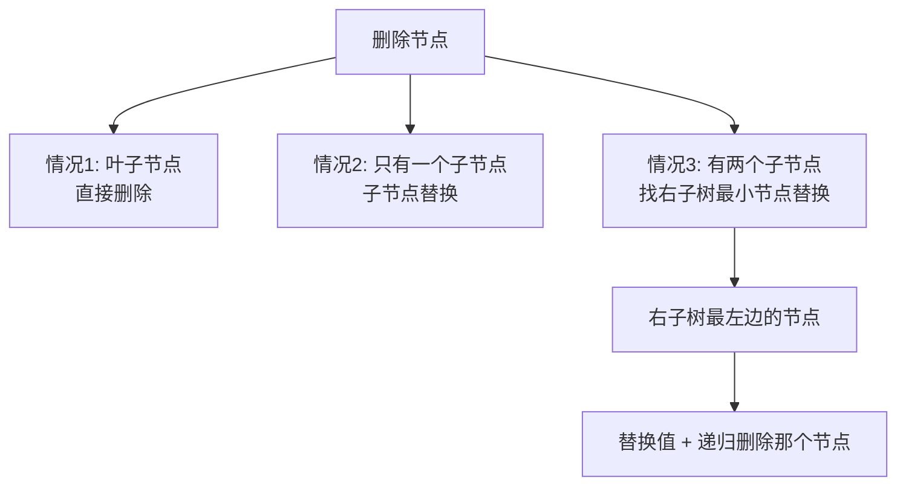

# 二叉树常见操作与 BST

> 核心一句话：**二叉树的操作就是三件事 — 当前节点做什么、什么时候做（前/中/后序）、递归让孩子做同样的事。**
>
> BST（二叉搜索树）的核心性质：**中序遍历 = 升序排列**。

---

## 🎯 经典 LeetCode 题目

| # | 题号 | 题目 | 难度 | 核心考点 | 推荐指数 |
|---|------|------|:----:|----------|:--------:|
| 1 | [100](https://leetcode.cn/problems/same-tree/) | 相同的树 | 🟢 | 递归比较 | ⭐ |
| 2 | [101](https://leetcode.cn/problems/symmetric-tree/) | 对称二叉树 | 🟢 | 对称比较 | ⭐ |
| 3 | [104](https://leetcode.cn/problems/maximum-depth-of-binary-tree/) | 二叉树的最大深度 | 🟢 | 后序求深度 | ⭐ |
| 4 | [110](https://leetcode.cn/problems/balanced-binary-tree/) | 平衡二叉树 | 🟢 | 后序判断 | ⭐⭐ |
| 5 | [112](https://leetcode.cn/problems/path-sum/) | 路径总和 | 🟢 | 递归减 target | ⭐ |
| 6 | [113](https://leetcode.cn/problems/path-sum-ii/) | 路径总和 II | 🟡 | 递归回溯记录路径 | ⭐⭐ |
| 7 | [114](https://leetcode.cn/problems/flatten-binary-tree-to-linked-list/) | 二叉树展开为链表 | 🟡 | 后序 + 前驱连接 | ⭐⭐ |
| 8 | [116](https://leetcode.cn/problems/populating-next-right-pointers-in-each-node/) | 填充每个节点的下一个右侧节点 | 🟡 | 前序 + 跨节点连接 | ⭐⭐ |
| 9 | [124](https://leetcode.cn/problems/binary-tree-maximum-path-sum/) | 二叉树中的最大路径和 | 🔴 | 后序 + 全局最大值 | ⭐⭐⭐ |
| 10 | [199](https://leetcode.cn/problems/binary-tree-right-side-view/) | 二叉树的右视图 | 🟡 | BFS 每层最后一个 | ⭐⭐ |
| 11 | [236](https://leetcode.cn/problems/lowest-common-ancestor-of-a-binary-tree/) | 二叉树的最近公共祖先 | 🟡 | 后序 + 子树判断 | ⭐⭐⭐ |
| 12 | [297](https://leetcode.cn/problems/serialize-and-deserialize-binary-tree/) | 二叉树的序列化与反序列化 | 🔴 | 层序/前序序列化 | ⭐⭐⭐ |
| 13 | [331](https://leetcode.cn/problems/verify-preorder-serialization-of-a-binary-tree/) | 验证二叉树的前序序列化 | 🟡 | slot 计数 | ⭐⭐⭐ |
| 14 | [449](https://leetcode.cn/problems/serialize-and-deserialize-bst/) | 序列化和反序列化二叉搜索树 | 🟡 | BST 前序复原 | ⭐⭐ |
| 15 | [513](https://leetcode.cn/problems/find-bottom-left-tree-value/) | 找树左下角的值 | 🟡 | BFS 最后一层最左 | ⭐⭐ |
| 16 | [652](https://leetcode.cn/problems/find-duplicate-subtrees/) | 寻找重复子树 | 🟡 | 后序 + 序列化 | ⭐⭐⭐ |
| 17 | [98](https://leetcode.cn/problems/validate-binary-search-tree/) | 验证二叉搜索树 | 🟡 | BST 合法性 | ⭐ |
| 18 | [700](https://leetcode.cn/problems/search-in-a-binary-search-tree/) | 二叉搜索树中的搜索 | 🟢 | BST 查找 | ⭐ |
| 19 | [701](https://leetcode.cn/problems/insert-into-a-binary-search-tree/) | 二叉搜索树中的插入操作 | 🟡 | BST 插入 | ⭐⭐ |
| 20 | [450](https://leetcode.cn/problems/delete-node-in-a-bst/) | 删除二叉搜索树中的节点 | 🟡 | BST 删除（最难） | ⭐⭐⭐ |
| 21 | [230](https://leetcode.cn/problems/kth-smallest-element-in-a-bst/) | 二叉搜索树中第 K 小的元素 | 🟡 | 中序 = 升序 | ⭐⭐ |

---

## 📋 目录

1. [二叉树的序列化（后序应用）](#-二叉树的序列化后序应用)
2. [寻找重复子树](#-寻找重复子树)
3. [BST 合法性判断](#-bst-合法性判断)
4. [BST 查找](#-bst-查找)
5. [BST 插入](#-bst-插入)
6. [BST 删除（三种情况）](#-bst-删除三种情况)
7. [BST 遍历框架总结](#-bst-遍历框架总结)
8. [复杂度速查表](#-复杂度速查表)
9. [刷题建议](#-刷题建议)

---

## 🔢 二叉树的序列化（后序应用）

将二叉树序列化为字符串，用于判等、缓存、传输：

```typescript
// serialize-tree.ts

class TreeNode<T> {
  constructor(
    public val: T,
    public left: TreeNode<T> | null = null,
    public right: TreeNode<T> | null = null
  ) {}
}

/**
 * 后序序列化 — 子树结果合并
 * 
 * 空节点用 '#' 表示，节点值用 ',' 分隔
 * 后序：先序列化子树，再合并
 */
function serializePostorder(root: TreeNode<number> | null): string {
  if (root === null) return "#";

  const left = serializePostorder(root.left);
  const right = serializePostorder(root.right);

  // ⭐ 后序位置：左右子树都序列化了，再合并
  return `${left},${right},${root.val}`;
}

// --- 测试 ---
//       1
//      / \
//     2   3
const root = new TreeNode(1, new TreeNode(2), new TreeNode(3));
console.log(serializePostorder(root)); // "#,#,2,#,#,3,1"
```

---

## 🔢 寻找重复子树

> [652. 寻找重复子树](https://leetcode.cn/problems/find-duplicate-subtrees/)
> 需要知道"以我为根的子树长什么样" → 后序位置序列化

```typescript
// find-duplicate-subtrees.ts
/**
 * 寻找重复子树
 * 
 * 思路：
 *   1. 后序遍历序列化每棵子树
 *   2. 用 Map 记录每个序列出现的次数
 *   3. 出现次数 == 2 时加入结果（避免重复添加）
 */
function findDuplicateSubtrees(root: TreeNode<number> | null): TreeNode<number>[] {
  const memo = new Map<string, number>();
  const result: TreeNode<number>[] = [];

  function traverse(node: TreeNode<number> | null): string {
    if (node === null) return "#";

    const left = traverse(node.left);
    const right = traverse(node.right);

    // ⭐ 后序位置：构造当前子树的序列化
    const serialized = `${left},${right},${node.val}`;

    const count = (memo.get(serialized) || 0) + 1;
    memo.set(serialized, count);

    // 第二次出现时加入结果（避免多次重复加入）
    if (count === 2) result.push(node);

    return serialized;
  }

  traverse(root);
  return result;
}
```

---

## 🔢 BST 合法性判断

> [98. 验证二叉搜索树](https://leetcode.cn/problems/validate-binary-search-tree/)
>
> **注意：只比较左右子节点不够！** 需要把整棵子树的上下界传递下去。

```mermaid
flowchart TD
    ROOT((5)) --> LEFT((2<br/>min=-∞, max=5))
    ROOT --> RIGHT((7<br/>min=5, max=+∞))
    
    LEFT --> L1((1<br/>min=-∞, max=2))
    LEFT --> L2((4<br/>min=2, max=5)) 
    L2 --> L2L((3<br/>min=2, max=4 ✅))
    L2 --> L2R((6<br/>❌ 6 > 5? <br/>6 不在 [2,4] 内))
```

```typescript
// validate-bst.ts
/**
 * 验证 BST 合法性
 * 
 * 关键：每个节点都要在 (min, max) 范围内
 * 不能只检查左右子节点 — 右子树的左子树可能小于根节点！
 */
function isValidBST(root: TreeNode<number> | null): boolean {
  function isValid(
    node: TreeNode<number> | null,
    min: TreeNode<number> | null,
    max: TreeNode<number> | null
  ): boolean {
    if (node === null) return true;

    // 当前节点必须在 (min.val, max.val) 范围内
    if (min !== null && node.val <= min.val) return false;
    if (max !== null && node.val >= max.val) return false;

    // 左子树：所有节点 < root.val → max = root
    // 右子树：所有节点 > root.val → min = root
    return (
      isValid(node.left, min, node) &&
      isValid(node.right, node, max)
    );
  }

  return isValid(root, null, null);
}
```

---

## 🔢 BST 查找

```typescript
// search-bst.ts
/**
 * BST 查找
 * 
 * 利用 BST 的性质：左小右大
 * 普通二叉树 O(n)，BST 平均 O(log n)
 */
function searchBST(root: TreeNode<number> | null, target: number): TreeNode<number> | null {
  if (root === null) return null;

  if (root.val === target) return root;
  if (target < root.val) return searchBST(root.left, target);
  // target > root.val
  return searchBST(root.right, target);
}
```

---

## 🔢 BST 插入

```typescript
// insert-bst.ts
/**
 * BST 插入
 * 
 * 思路：找到空位插入（总在叶子节点插入）
 */
function insertIntoBST(root: TreeNode<number> | null, val: number): TreeNode<number> | null {
  if (root === null) return new TreeNode(val);

  if (val < root.val) {
    root.left = insertIntoBST(root.left, val);
  } else if (val > root.val) {
    root.right = insertIntoBST(root.right, val);
  }
  // val === root.val → 已存在，不处理

  return root;
}
```

---

## 🔢 BST 删除（三种情况）

> **最难的操作** — 删除节点后要保持 BST 性质。



```typescript
// delete-bst.ts
/**
 * BST 删除 — 三种情况
 * 
 * 时间复杂度 O(log n) 平均
 */
function deleteNode(root: TreeNode<number> | null, key: number): TreeNode<number> | null {
  if (root === null) return null;

  if (root.val === key) {
    // 情况 1 & 2：叶子 或 只有一个子节点
    if (root.left === null) return root.right;
    if (root.right === null) return root.left;

    // 情况 3：有两个子节点
    // 找到右子树的最小节点（最左边的）
    let minNode = root.right;
    while (minNode.left !== null) minNode = minNode.left;

    // 把最小节点的值赋给当前节点
    root.val = minNode.val;
    // 递归删除右子树中的那个最小节点
    root.right = deleteNode(root.right, minNode.val);

  } else if (key < root.val) {
    root.left = deleteNode(root.left, key);
  } else { // key > root.val
    root.right = deleteNode(root.right, key);
  }

  return root;
}

/** 找 BST 的最小节点（最左边） */
function getMin(root: TreeNode<number>): TreeNode<number> {
  while (root.left !== null) root = root.left;
  return root;
}
```

---

## 📐 BST 遍历框架总结

```typescript
// bst-framework.ts
/**
 * BST 操作统一框架
 * 
 * 增删查改都遵循这个模式：
 *   1. 先判断 root.val 和 target 的关系
 *   2. 去左子树或右子树递归操作
 *   3. 返回 root
 */
function bstTemplate(root: TreeNode<number> | null, target: number): TreeNode<number> | null {
  if (root === null) return null;

  if (root.val === target) {
    // 🎯 找到目标，做操作
    // ...
  } else if (root.val > target) {
    // 去左子树
    root.left = bstTemplate(root.left, target);
  } else {
    // 去右子树
    root.right = bstTemplate(root.right, target);
  }

  return root;
}
```

---

## 📊 复杂度速查表

| 操作 | 时间复杂度 | 空间复杂度 | 说明 |
|------|:--------:|:--------:|------|
| 序列化 | O(n) | O(n) | 后序遍历 |
| 查找重复子树 | O(n) | O(n) | 后序 + Map |
| BST 合法性 | O(n) | O(h) | 传递 min/max |
| BST 查找 | O(log n) 平均 | O(h) | 二分查找思想 |
| BST 插入 | O(log n) 平均 | O(h) | 总是在叶子 |
| BST 删除 | O(log n) 平均 | O(h) | 三种情况中最难 |

---

## 🎯 刷题建议

### 自查清单

```
[ ] 二叉树的题先想清楚：当前节点要做什么？
[ ] 什么时候需要子结果？→ 后序位置
[ ] BST 合法性检查传了 min/max 参数吗？
[ ] BST 删除的三种情况都处理了吗？
[ ] BST 中序是否是升序？
```

---

## 💪 白板挑战

```typescript
// BST 合法性判断
function isValidBST(root: TreeNode<number> | null): boolean {

}

// BST 删除
function deleteNode(root: TreeNode<number> | null, key: number): TreeNode<number> | null {

}
```

---

> **关联阅读：** `12-binary-tree-traversal.md` → `00-data-structures-and-algorithm-thinking.md`
