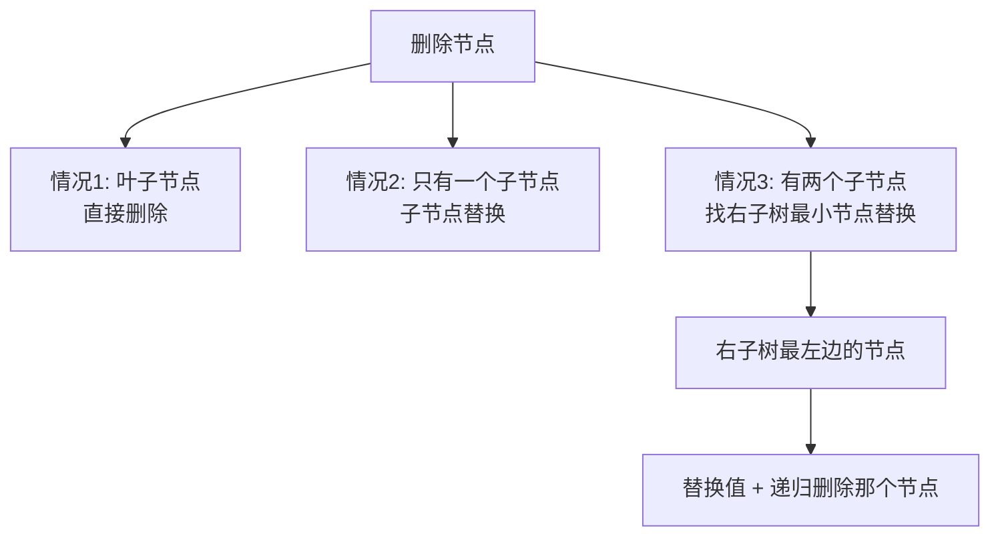

# 二叉树常见操作与 BST

> 核心一句话：**二叉树的操作就是三件事 — 当前节点做什么、什么时候做（前/中/后序）、递归让孩子做同样的事。**
>
> BST（二叉搜索树）的核心性质：**中序遍历 = 升序排列**。

---

## 🎯 经典 LeetCode 题目

| #   | 题号                                                                                | 题目                         | 难度 | 核心考点          | 推荐指数 |
| --- | ----------------------------------------------------------------------------------- | ---------------------------- | :--: | ----------------- | :------: |
| 1   | [100](https://leetcode.cn/problems/same-tree/)                                      | 相同的树                     |  🟢  | 递归比较          |    ⭐    |
| 2   | [101](https://leetcode.cn/problems/symmetric-tree/)                                 | 对称二叉树                   |  🟢  | 对称比较          |    ⭐    |
| 3   | [104](https://leetcode.cn/problems/maximum-depth-of-binary-tree/)                   | 二叉树的最大深度             |  🟢  | 后序求深度        |    ⭐    |
| 4   | [110](https://leetcode.cn/problems/balanced-binary-tree/)                           | 平衡二叉树                   |  🟢  | 后序判断          |   ⭐⭐   |
| 5   | [112](https://leetcode.cn/problems/path-sum/)                                       | 路径总和                     |  🟢  | 递归减 target     |    ⭐    |
| 6   | [113](https://leetcode.cn/problems/path-sum-ii/)                                    | 路径总和 II                  |  🟡  | 递归回溯记录路径  |   ⭐⭐   |
| 7   | [114](https://leetcode.cn/problems/flatten-binary-tree-to-linked-list/)             | 二叉树展开为链表             |  🟡  | 后序 + 前驱连接   |   ⭐⭐   |
| 8   | [116](https://leetcode.cn/problems/populating-next-right-pointers-in-each-node/)    | 填充每个节点的下一个右侧节点 |  🟡  | 前序 + 跨节点连接 |   ⭐⭐   |
| 9   | [124](https://leetcode.cn/problems/binary-tree-maximum-path-sum/)                   | 二叉树中的最大路径和         |  🔴  | 后序 + 全局最大值 |  ⭐⭐⭐  |
| 10  | [199](https://leetcode.cn/problems/binary-tree-right-side-view/)                    | 二叉树的右视图               |  🟡  | BFS 每层最后一个  |   ⭐⭐   |
| 11  | [236](https://leetcode.cn/problems/lowest-common-ancestor-of-a-binary-tree/)        | 二叉树的最近公共祖先         |  🟡  | 后序 + 子树判断   |  ⭐⭐⭐  |
| 12  | [297](https://leetcode.cn/problems/serialize-and-deserialize-binary-tree/)          | 二叉树的序列化与反序列化     |  🔴  | 层序/前序序列化   |  ⭐⭐⭐  |
| 13  | [331](https://leetcode.cn/problems/verify-preorder-serialization-of-a-binary-tree/) | 验证二叉树的前序序列化       |  🟡  | slot 计数         |  ⭐⭐⭐  |
| 14  | [449](https://leetcode.cn/problems/serialize-and-deserialize-bst/)                  | 序列化和反序列化二叉搜索树   |  🟡  | BST 前序复原      |   ⭐⭐   |
| 15  | [513](https://leetcode.cn/problems/find-bottom-left-tree-value/)                    | 找树左下角的值               |  🟡  | BFS 最后一层最左  |   ⭐⭐   |
| 16  | [652](https://leetcode.cn/problems/find-duplicate-subtrees/)                        | 寻找重复子树                 |  🟡  | 后序 + 序列化     |  ⭐⭐⭐  |
| 17  | [98](https://leetcode.cn/problems/validate-binary-search-tree/)                     | 验证二叉搜索树               |  🟡  | BST 合法性        |    ⭐    |
| 18  | [700](https://leetcode.cn/problems/search-in-a-binary-search-tree/)                 | 二叉搜索树中的搜索           |  🟢  | BST 查找          |    ⭐    |
| 19  | [701](https://leetcode.cn/problems/insert-into-a-binary-search-tree/)               | 二叉搜索树中的插入操作       |  🟡  | BST 插入          |   ⭐⭐   |
| 20  | [450](https://leetcode.cn/problems/delete-node-in-a-bst/)                           | 删除二叉搜索树中的节点       |  🟡  | BST 删除（最难）  |  ⭐⭐⭐  |
| 21  | [230](https://leetcode.cn/problems/kth-smallest-element-in-a-bst/)                  | 二叉搜索树中第 K 小的元素    |  🟡  | 中序 = 升序       |   ⭐⭐   |
| 22  | [538](https://leetcode.cn/problems/convert-bst-to-greater-tree/)                    | 把二叉搜索树转换为累加树     |  🟡  | 反序中序遍历      |   ⭐⭐   |
| 23  | [96](https://leetcode.cn/problems/unique-binary-search-trees/)                      | 不同的二叉搜索树             |  🟡  | 递归计数 + 备忘录 |   ⭐⭐   |
| 24  | [95](https://leetcode.cn/problems/unique-binary-search-trees-ii/)                   | 不同的二叉搜索树 II          |  🟡  | 递归构造 + 组合   |  ⭐⭐⭐  |
| 25  | [1373](https://leetcode.cn/problems/maximum-sum-bst-in-binary-tree/)                | 二叉搜索子树的最大键值和     |  🔴  | 后序 + BST 判断   |  ⭐⭐⭐  |

---

## 📋 目录

1. [二叉树的序列化（后序应用）](#-二叉树的序列化后序应用)
2. [寻找重复子树](#-寻找重复子树)
3. [BST 合法性判断](#-bst-合法性判断)
4. [BST 查找](#-bst-查找)
5. [BST 插入](#-bst-插入)
6. [BST 删除（三种情况）](#-bst-删除三种情况)
7. [BST 转为累加树](#-bst-转为累加树)
8. [BST 最大键值和（后序应用）](#-bst-最大键值和后序应用)
9. [BST 遍历框架总结](#-bst-遍历框架总结)
10. [不同的二叉搜索树（计数）](#-不同的二叉搜索树计数)
11. [不同的二叉搜索树 II（构造）](#-不同的二叉搜索树-ii构造)
12. [复杂度速查表](#-复杂度速查表)
13. [刷题建议](#-刷题建议)

---

## 🔢 二叉树的序列化（后序应用）

将二叉树序列化为字符串，用于判等、缓存、传输：

```typescript
// serialize-tree.ts

class TreeNode<T> {
  constructor(
    public val: T,
    public left: TreeNode<T> | null = null,
    public right: TreeNode<T> | null = null
  ) {}
}

/**
 * 后序序列化 — 子树结果合并
 *
 * 空节点用 '#' 表示，节点值用 ',' 分隔
 * 后序：先序列化子树，再合并
 */
function serializePostorder(root: TreeNode<number> | null): string {
  if (root === null) return '#';

  const left = serializePostorder(root.left);
  const right = serializePostorder(root.right);

  // ⭐ 后序位置：左右子树都序列化了，再合并
  return `${left},${right},${root.val}`;
}
```

---

## 🔢 寻找重复子树

> [652. 寻找重复子树](https://leetcode.cn/problems/find-duplicate-subtrees/)
> 需要知道"以我为根的子树长什么样" → 后序位置序列化

```typescript
// find-duplicate-subtrees.ts
/**
 * 寻找重复子树
 *
 * 思路：
 *   1. 后序遍历序列化每棵子树
 *   2. 用 Map 记录每个序列出现的次数
 *   3. 出现次数 == 2 时加入结果（避免重复添加）
 */
function findDuplicateSubtrees(root: TreeNode<number> | null): TreeNode<number>[] {
  const memo = new Map<string, number>();
  const result: TreeNode<number>[] = [];

  function traverse(node: TreeNode<number> | null): string {
    if (node === null) return '#';

    const left = traverse(node.left);
    const right = traverse(node.right);

    // ⭐ 后序位置：构造当前子树的序列化
    const serialized = `${left},${right},${node.val}`;

    const count = (memo.get(serialized) || 0) + 1;
    memo.set(serialized, count);

    // 第二次出现时加入结果（避免多次重复加入）
    if (count === 2) result.push(node);

    return serialized;
  }

  traverse(root);
  return result;
}
```

---

## 🔢 BST 合法性判断

> [98. 验证二叉搜索树](https://leetcode.cn/problems/validate-binary-search-tree/)
>
> **注意：只比较左右子节点不够！** 需要把整棵子树的上下界传递下去。

```mermaid
flowchart TD
    ROOT((5)) --> LEFT((2<br/>min=-∞, max=5))
    ROOT --> RIGHT((7<br/>min=5, max=+∞))

    LEFT --> L1((1<br/>min=-∞, max=2))
    LEFT --> L2((4<br/>min=2, max=5))
    L2 --> L2L((3<br/>min=2, max=4 ✅))
    L2 --> L2R((6<br/>❌ 6 > 5? <br/>6 不在 [2,4] 内))
```

```typescript
// validate-bst.ts
/**
 * 验证 BST 合法性
 *
 * 关键：每个节点都要在 (min, max) 范围内
 * 不能只检查左右子节点 — 右子树的左子树可能小于根节点！
 */
function isValidBST(root: TreeNode<number> | null): boolean {
  function isValid(
    node: TreeNode<number> | null,
    min: TreeNode<number> | null,
    max: TreeNode<number> | null
  ): boolean {
    if (node === null) return true;

    // 当前节点必须在 (min.val, max.val) 范围内
    if (min !== null && node.val <= min.val) return false;
    if (max !== null && node.val >= max.val) return false;

    // 左子树：所有节点 < root.val → max = root
    // 右子树：所有节点 > root.val → min = root
    return isValid(node.left, min, node) && isValid(node.right, node, max);
  }

  return isValid(root, null, null);
}
```

```python
# validate-bst.py
def isValidBST(root: TreeNode | None) -> bool:
    def is_valid(node: TreeNode | None, min_node: TreeNode | None, max_node: TreeNode | None) -> bool:
        if node is None:
            return True
        if min_node is not None and node.val <= min_node.val:
            return False
        if max_node is not None and node.val >= max_node.val:
            return False
        return is_valid(node.left, min_node, node) and is_valid(node.right, node, max_node)

    return is_valid(root, None, None)
```

---

## 🔢 BST 查找

```typescript
// search-bst.ts
/**
 * BST 查找
 *
 * 利用 BST 的性质：左小右大
 * 普通二叉树 O(n)，BST 平均 O(log n)
 */
function searchBST(root: TreeNode<number> | null, target: number): TreeNode<number> | null {
  if (root === null) return null;

  if (root.val === target) return root;
  if (target < root.val) return searchBST(root.left, target);
  // target > root.val
  return searchBST(root.right, target);
}
```

```python
# search-bst.py
def searchBST(root: TreeNode | None, target: int) -> TreeNode | None:
    if root is None:
        return None
    if root.val == target:
        return root
    if target < root.val:
        return searchBST(root.left, target)
    return searchBST(root.right, target)
```

---

## 🔢 BST 插入

```typescript
// insert-bst.ts
/**
 * BST 插入
 *
 * 思路：找到空位插入（总在叶子节点插入）
 */
function insertIntoBST(root: TreeNode<number> | null, val: number): TreeNode<number> | null {
  if (root === null) return new TreeNode(val);

  if (val < root.val) {
    root.left = insertIntoBST(root.left, val);
  } else if (val > root.val) {
    root.right = insertIntoBST(root.right, val);
  }
  // val === root.val → 已存在，不处理

  return root;
}
```

```python
# insert-bst.py
def insertIntoBST(root: TreeNode | None, val: int) -> TreeNode | None:
    if root is None:
        return TreeNode(val)
    if val < root.val:
        root.left = insertIntoBST(root.left, val)
    elif val > root.val:
        root.right = insertIntoBST(root.right, val)
    return root
```

---

## 🔢 BST 转为累加树

> [538. 把二叉搜索树转换为累加树](https://leetcode.cn/problems/convert-bst-to-greater-tree/)
>
> **核心思想：** 反序中序遍历（右→根→左），累加节点值。BST 中序是升序，反序就是降序。

```typescript
// convert-bst.ts
/**
 * 把 BST 转为累加树（Greater Tree）
 *
 * 思路：降序遍历（右 → 根 → 左），维护外部累加和
 * 每个节点的值 = 原值 + 所有比它大的节点值之和
 */
function convertBST(root: TreeNode<number> | null): TreeNode<number> | null {
  let sum = 0;

  function traverse(node: TreeNode<number> | null): void {
    if (node === null) return;

    // 先遍历右子树（更大的值）
    traverse(node.right);

    // ⭐ 中序位置：累加并赋值
    sum += node.val;
    node.val = sum;

    // 再遍历左子树（更小的值）
    traverse(node.left);
  }

  traverse(root);
  return root;
}
```

```python
# convert-bst.py
def convertBST(root: TreeNode | None) -> TreeNode | None:
    total = 0

    def traverse(node: TreeNode | None) -> None:
        nonlocal total
        if node is None:
            return
        # 先右后左的中序遍历（降序）
        traverse(node.right)
        total += node.val
        node.val = total
        traverse(node.left)

    traverse(root)
    return root
```

---

## 🔢 BST 删除（三种情况）

> **最难的操作** — 删除节点后要保持 BST 性质。



```typescript
// delete-bst.ts
/**
 * BST 删除 — 三种情况
 *
 * 时间复杂度 O(log n) 平均
 */
function deleteNode(root: TreeNode<number> | null, key: number): TreeNode<number> | null {
  if (root === null) return null;

  if (root.val === key) {
    // 情况 1 & 2：叶子 或 只有一个子节点
    if (root.left === null) return root.right;
    if (root.right === null) return root.left;

    // 情况 3：有两个子节点
    // 找到右子树的最小节点（最左边的）
    let minNode = root.right;
    while (minNode.left !== null) minNode = minNode.left;

    // 把最小节点的值赋给当前节点
    root.val = minNode.val;
    // 递归删除右子树中的那个最小节点
    root.right = deleteNode(root.right, minNode.val);
  } else if (key < root.val) {
    root.left = deleteNode(root.left, key);
  } else {
    // key > root.val
    root.right = deleteNode(root.right, key);
  }

  return root;
}

/** 找 BST 的最小节点（最左边） */
function getMin(root: TreeNode<number>): TreeNode<number> {
  while (root.left !== null) root = root.left;
  return root;
}
```

```python
# delete-bst.py
def deleteNode(root: TreeNode | None, key: int) -> TreeNode | None:
    if root is None:
        return None

    if root.val == key:
        # 情况 1 & 2: 叶子或只有一个子节点
        if root.left is None:
            return root.right
        if root.right is None:
            return root.left
        # 情况 3: 有两个子节点，找右子树最小节点
        min_node = root.right
        while min_node.left is not None:
            min_node = min_node.left
        root.val = min_node.val
        root.right = deleteNode(root.right, min_node.val)
    elif key < root.val:
        root.left = deleteNode(root.left, key)
    else:
        root.right = deleteNode(root.right, key)

    return root
```

---

## 🔢 BST 最大键值和（后序应用）

> [1373. 二叉搜索子树的最大键值和](https://leetcode.cn/problems/maximum-sum-bst-in-binary-tree/)
>
> **核心思想：** 后序遍历。对每个节点判断左右子树是否为 BST，收集 min/max/sum 信息向上传递。

```typescript
// max-sum-bst.ts
/**
 * 找出所有 BST 子树中，节点值之和的最大值
 *
 * 后序遍历返回 [isBST, min, max, sum]
 *   isBST: 1 表示是 BST，0 表示不是
 *   min: 子树最小值
 *   max: 子树最大值
 *   sum: 子树所有节点之和
 */
function maxSumBST(root: TreeNode<number> | null): number {
  let maxSum = 0;

  function traverse(node: TreeNode<number> | null): number[] {
    if (node === null) {
      return [1, Infinity, -Infinity, 0]; // [是BST, 最小值, 最大值, 和]
    }

    const left = traverse(node.left);
    const right = traverse(node.right);

    // ⭐ 后序位置：判断当前节点为根的树是否为 BST
    if (left[0] === 1 && right[0] === 1 &&
        node.val > left[2] && node.val < right[1]) {
      const sum = left[3] + right[3] + node.val;
      maxSum = Math.max(maxSum, sum);
      return [
        1,
        Math.min(left[1], node.val),
        Math.max(right[2], node.val),
        sum
      ];
    }

    // 不是 BST，标记为 0
    return [0, 0, 0, 0];
  }

  traverse(root);
  return maxSum;
}
```

```python
# max-sum-bst.py
def maxSumBST(root: TreeNode | None) -> int:
    max_sum = 0

    def traverse(node: TreeNode | None) -> list:
        nonlocal max_sum
        if node is None:
            return [True, float('inf'), float('-inf'), 0]

        left = traverse(node.left)
        right = traverse(node.right)

        if (left[0] and right[0] and
                left[2] < node.val < right[1]):
            total = left[3] + right[3] + node.val
            max_sum = max(max_sum, total)
            return [True, min(left[1], node.val), max(right[2], node.val), total]

        return [False, 0, 0, 0]

    traverse(root)
    return max_sum
```

---

## 📐 BST 遍历框架总结

```typescript
// bst-framework.ts
/**
 * BST 操作统一框架
 *
 * 增删查改都遵循这个模式：
 *   1. 先判断 root.val 和 target 的关系
 *   2. 去左子树或右子树递归操作
 *   3. 返回 root
 */
function bstTemplate(root: TreeNode<number> | null, target: number): TreeNode<number> | null {
  if (root === null) return null;

  if (root.val === target) {
    // 🎯 找到目标，做操作
    // ...
  } else if (root.val > target) {
    // 去左子树
    root.left = bstTemplate(root.left, target);
  } else {
    // 去右子树
    root.right = bstTemplate(root.right, target);
  }

  return root;
}
```

---

## 🔢 不同的二叉搜索树（计数）

> [96. 不同的二叉搜索树](https://leetcode.cn/problems/unique-binary-search-trees/)
>
> **核心思想：** 以每个数字为根，左右子树分别计数，乘积求和。用备忘录避免重复计算。

```typescript
// num-trees.ts
/**
 * 计算 1..n 能构成多少种不同的 BST
 *
 * 思路：对每个数字 i 作为根节点
 *   左子树由 [1..i-1] 构成 → count(lo, i-1)
 *   右子树由 [i+1..hi] 构成 → count(i+1, hi)
 *   组合数 = 左 × 右
 *   总和 = Σ(左 × 右) 对每个 i
 */
function numTrees(n: number): number {
  // memo[lo][hi] 缓存区间 [lo, hi] 的结果
  const memo: number[][] = Array.from({ length: n + 1 }, () => new Array(n + 1).fill(0));

  function count(lo: number, hi: number): number {
    if (lo > hi) return 1; // 空树也算一种

    if (memo[lo][hi] !== 0) return memo[lo][hi];

    let res = 0;
    for (let i = lo; i <= hi; i++) {
      const left = count(lo, i - 1);
      const right = count(i + 1, hi);
      res += left * right;
    }

    memo[lo][hi] = res;
    return res;
  }

  return count(1, n);
}
```

```python
# num-trees.py
def numTrees(n: int) -> int:
    memo = [[0] * (n + 1) for _ in range(n + 1)]

    def count(lo: int, hi: int) -> int:
        if lo > hi:
            return 1
        if memo[lo][hi] != 0:
            return memo[lo][hi]

        res = 0
        for i in range(lo, hi + 1):
            left = count(lo, i - 1)
            right = count(i + 1, hi)
            res += left * right

        memo[lo][hi] = res
        return res

    return count(1, n)
```

---

## 🔢 不同的二叉搜索树 II（构造）

> [95. 不同的二叉搜索树 II](https://leetcode.cn/problems/unique-binary-search-trees-ii/)
>
> **核心思想：** 穷举每个数字作为根节点，递归构造所有可能的左右子树，然后组合。

```typescript
// generate-trees.ts
/**
 * 构造 1..n 所有不同的 BST
 *
 * 思路：
 *   1. 穷举 root 节点的所有可能 (i from lo to hi)
 *   2. 递归构造左右子树的所有合法 BST
 *   3. 给 root 节点组合所有左右子树
 */
function generateTrees(n: number): Array<TreeNode<number> | null> {
  if (n === 0) return [];

  function build(lo: number, hi: number): Array<TreeNode<number> | null> {
    const res: Array<TreeNode<number> | null> = [];

    if (lo > hi) {
      res.push(null);
      return res;
    }

    for (let i = lo; i <= hi; i++) {
      const leftTrees = build(lo, i - 1);
      const rightTrees = build(i + 1, hi);

      for (const left of leftTrees) {
        for (const right of rightTrees) {
          const root = new TreeNode(i);
          root.left = left;
          root.right = right;
          res.push(root);
        }
      }
    }

    return res;
  }

  return build(1, n);
}
```

```python
# generate-trees.py
def generateTrees(n: int) -> list[TreeNode | None]:
    if n == 0:
        return []

    def build(lo: int, hi: int) -> list[TreeNode | None]:
        res = []
        if lo > hi:
            res.append(None)
            return res

        for i in range(lo, hi + 1):
            left_trees = build(lo, i - 1)
            right_trees = build(i + 1, hi)

            for left in left_trees:
                for right in right_trees:
                    root = TreeNode(i)
                    root.left = left
                    root.right = right
                    res.append(root)

        return res

    return build(1, n)
```

---

## 📊 复杂度速查表

| 操作         |  时间复杂度   | 空间复杂度 | 说明           |
| ------------ | :-----------: | :--------: | -------------- |
| 序列化       |     O(n)      |    O(n)    | 后序遍历       |
| 查找重复子树 |     O(n)      |    O(n)    | 后序 + Map     |
| BST 合法性   |     O(n)      |    O(h)    | 传递 min/max   |
| BST 查找     | O(log n) 平均 |    O(h)    | 二分查找思想   |
| BST 插入     | O(log n) 平均 |    O(h)    | 总是在叶子     |
| BST 删除     | O(log n) 平均 |    O(h)    | 三种情况中最难 |
| BST 转为累加树   |     O(n)    |    O(h)    | 反序中序遍历   |
| BST 最大键值和   |     O(n)    |    O(h)    | 后序 + BST 判断 |
| 不同 BST（计数）  |  O(n²)      |    O(n²)   | 递归 + 备忘录  |
| 不同 BST II（构造）| 卡特兰数   |    O(n²)   | 递归构造 + 组合 |

---

## 🎯 刷题建议

### 自查清单

```
[ ] 二叉树的题先想清楚：当前节点要做什么？
[ ] 什么时候需要子结果？→ 后序位置
[ ] BST 合法性检查传了 min/max 参数吗？
[ ] BST 删除的三种情况都处理了吗？
[ ] BST 中序是否是升序？
```

---

## 💪 白板挑战

```typescript
// BST 合法性判断
function isValidBST(root: TreeNode<number> | null): boolean {}

// BST 删除
function deleteNode(root: TreeNode<number> | null, key: number): TreeNode<number> | null {}
```

---

> **关联阅读：** `12-binary-tree-traversal.md` → `00-data-structures-and-algorithm-thinking.md`
