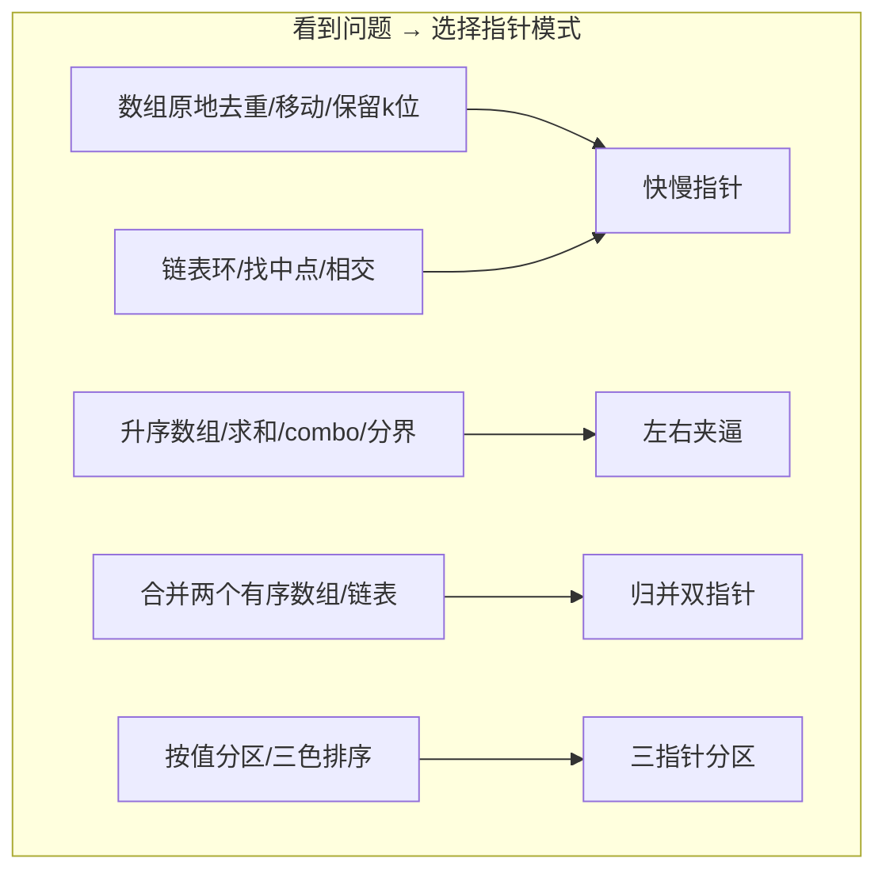
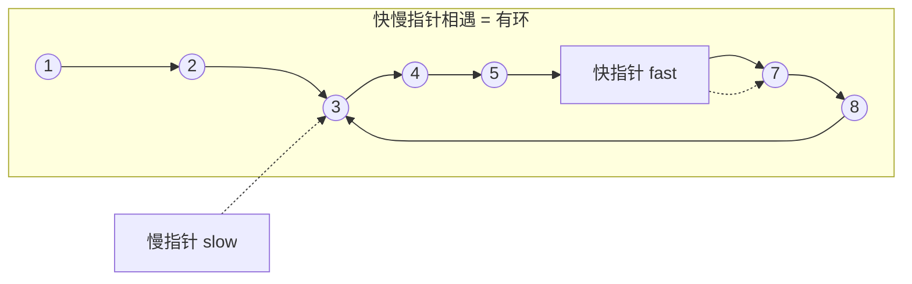
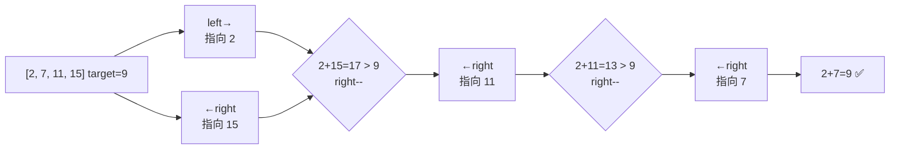
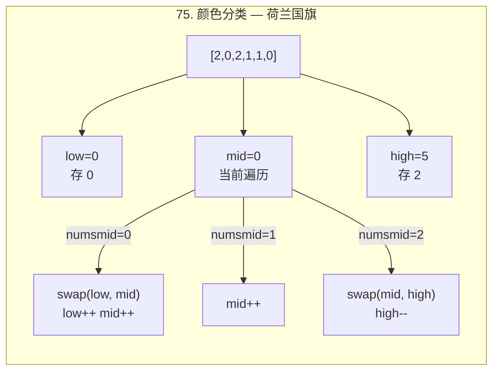

# 双指针技巧

> 核心一句话：**双指针是优化暴力 O(n²) 为 O(n) 的最常用手段 — 快慢指针去重判环，左右指针夹逼求和，归并指针合并有序序列。**
>
> 规律：「升序数组/求和/分界」→ 左右夹逼，「数组原地去重/移动」→ 快慢指针，「链表环/中点/相交」→ 快慢指针。

---

## 📋 模式速查

| 模式           | 指针移动方式             | 典型场景               | 时间复杂度 |
| -------------- | ------------------------ | ---------------------- | :--------: |
| **快慢指针**   | 一个走两步，一个走一步   | 判环、找中点、去重     |    O(n)    |
| **左右夹逼**   | left→, ←right 向中间靠拢 | 有序数组两数之和、反转 |    O(n)    |
| **归并双指针** | 各遍历一个有序序列       | 合并有序数组/链表      |   O(n+m)   |
| **三指针分区** | low/mid/high 三个指针    | 荷兰国旗、按值分区     |    O(n)    |

---

## 🎯 经典 LeetCode 题目

> 以下题目全部来自 `leetcode-questions-summary.md`「多指针」分类

### 快慢指针

| #   | 题号                                                                       | 题目                      | 难度 | 核心思路                         | 推荐指数 |
| --- | -------------------------------------------------------------------------- | ------------------------- | :--: | -------------------------------- | :------: |
| 1   | [141](https://leetcode.cn/problems/linked-list-cycle/)                     | 环形链表                  |  🟢  | 快慢指针相遇判环                 |    ⭐    |
| 2   | [142](https://leetcode.cn/problems/linked-list-cycle-ii/)                  | 环形链表 II               |  🟡  | 相遇后从头同步走找入口           |   ⭐⭐   |
| 3   | [876](https://leetcode.cn/problems/middle-of-the-linked-list/)             | 链表中间结点              |  🟢  | 快指针到末尾时慢指针在中点       |    ⭐    |
| 4   | [160](https://leetcode.cn/problems/intersection-of-two-linked-lists/)      | 相交链表                  |  🟢  | 双指针各走 A+B                   |    ⭐    |
| 5   | [234](https://leetcode.cn/problems/palindrome-linked-list/)                | 回文链表                  |  🟢  | 快慢找中点 + 反转后半            |    ⭐    |
| 6   | [328](https://leetcode.cn/problems/odd-even-linked-list/)                  | 奇偶链表                  |  🟡  | 奇偶双指针分离再合并             |   ⭐⭐   |
| 7   | [287](https://leetcode.cn/problems/find-the-duplicate-number/)             | 寻找重复数                |  🟡  | 值域映射为链表，快慢指针找环入口 |  ⭐⭐⭐  |
| 8   | [26](https://leetcode.cn/problems/remove-duplicates-from-sorted-array/)    | 删除有序数组中的重复项    |  🟢  | 快指针读，慢指针写               |    ⭐    |
| 6   | [80](https://leetcode.cn/problems/remove-duplicates-from-sorted-array-ii/) | 删除有序数组中的重复项 II |  🟡  | 允许最多两个重复                 |   ⭐⭐   |
| 7   | [283](https://leetcode.cn/problems/move-zeroes/)                           | 移动零                    |  🟢  | 快慢指针非零前移，末尾补零       |    ⭐    |

### 左右指针

| #   | 题号                                                                  | 题目                   | 难度 | 核心思路               | 推荐指数 |
| --- | --------------------------------------------------------------------- | ---------------------- | :--: | ---------------------- | :------: |
| 8   | [167](https://leetcode.cn/problems/two-sum-ii-input-array-is-sorted/) | 两数之和 II            |  🟢  | 有序数组，左右夹逼     |    ⭐    |
| 9   | [125](https://leetcode.cn/problems/valid-palindrome/)                 | 验证回文串             |  🟢  | 左右指针忽略非字母数字 |    ⭐    |
| 10  | [345](https://leetcode.cn/problems/reverse-vowels-of-a-string/)       | 反转字符串中的元音字母 |  🟢  | 左右指针找元音互换     |    ⭐    |
| 11  | [680](https://leetcode.cn/problems/valid-palindrome-ii/)              | 验证回文串 II          |  🟢  | 最多跳过一个字符       |   ⭐⭐   |
| 12  | [5](https://leetcode.cn/problems/longest-palindromic-substring/)      | 最长回文子串           |  🟡  | 中心扩展双指针         |   ⭐⭐   |
| 13  | [11](https://leetcode.cn/problems/container-with-most-water/)         | 盛最多水的容器         |  🟡  | 左右指针，短板决定高度 |   ⭐⭐   |
| 14  | [42](https://leetcode.cn/problems/trapping-rain-water/)               | 接雨水                 |  🔴  | 左右最大高度夹逼       |  ⭐⭐⭐  |
| 15  | [845](https://leetcode.cn/problems/longest-mountain-in-array/)        | 数组中的最长山脉       |  🟡  | 双指针向左右扩展       |   ⭐⭐   |

### 归并双指针

| #   | 题号                                                            | 题目             | 难度 | 核心思路               | 推荐指数 |
| --- | --------------------------------------------------------------- | ---------------- | :--: | ---------------------- | :------: |
| 14  | [88](https://leetcode.cn/problems/merge-sorted-array/)          | 合并两个有序数组 |  🟢  | 从后往前双指针         |    ⭐    |
| 15  | [21](https://leetcode.cn/problems/merge-two-sorted-lists/)      | 合并两个有序链表 |  🟢  | dummy 头 + 双指针      |    ⭐    |
| 16  | [349](https://leetcode.cn/problems/intersection-of-two-arrays/) | 两个数组的交集   |  🟢  | 排序 + 双指针 / 哈希集 |    ⭐    |

### 三指针分区

| #   | 题号                                               | 题目     | 难度 | 核心思路                     | 推荐指数 |
| --- | -------------------------------------------------- | -------- | :--: | ---------------------------- | :------: |
| 17  | [75](https://leetcode.cn/problems/sort-colors/)    | 颜色分类 |  🟡  | 三指针 low/mid/high 荷兰国旗 |   ⭐⭐   |
| 18  | [86](https://leetcode.cn/problems/partition-list/) | 分隔链表 |  🟡  | 双链表分别收集，再合并       |   ⭐⭐   |

---

## 📋 目录

1. [模式一：快慢指针](#-模式一快慢指针)
2. [模式二：左右夹逼](#-模式二左右夹逼)
3. [模式三：归并双指针](#-模式三归并双指针)
4. [模式四：三指针分区](#-模式四三指针分区)
5. [接雨水（综合应用）](#-接雨水综合应用)
6. [复杂度速查表](#-复杂度速查表)
7. [刷题建议](#-刷题建议)

---

## 🧠 核心规律（抽象自题库）



---

## 🔢 模式一：快慢指针

> 一个指针走得快（每次两步），一个指针走得慢（每次一步）。
>
> 适用：判环、找中点、数组原地去重

### 链表环检测



```typescript
// linked-list-cycle.ts

class ListNode<T> {
  constructor(
    public val: T,
    public next: ListNode<T> | null = null
  ) {}
}

/**
 * 141. 环形链表 — 快慢指针判环
 *
 * 思路：快指针每次两步，慢指针每次一步
 *       如果相遇 → 有环；快指针到末尾 → 无环
 *
 * 为什么一定相遇？ 进入环后，快指针每次比慢指针多一步，
 * 相对速度 1 步，一定会追上。
 */
function hasCycle<T>(head: ListNode<T> | null): boolean {
  let slow = head;
  let fast = head;

  while (fast !== null && fast.next !== null) {
    slow = slow!.next; // 一步
    fast = fast.next.next; // 两步
    if (slow === fast) return true; // 相遇 → 有环
  }

  return false;
}

/**
 * 142. 环形链表 II — 找环入口
 *
 * 思路：相遇后，让一个指针从头开始，两个指针同步走
 *       再次相遇的点就是环入口
 *
 * 数学证明：设 head 到入口 = a，入口到相遇点 = b，环长 = L
 *           slow 走了 a+b，fast 走了 a+b+kL
 *           2(a+b) = a+b+kL → a = kL - b（即从头到入口 = 相遇点绕圈到入口）
 */
function detectCycle<T>(head: ListNode<T> | null): ListNode<T> | null {
  let slow = head;
  let fast = head;

  // 第一次相遇
  while (fast !== null && fast.next !== null) {
    slow = slow!.next;
    fast = fast.next.next;
    if (slow === fast) break;
  }

  if (fast === null || fast.next === null) return null; // 无环

  // 从头同步走，再次相遇就是入口
  let ptr = head;
  while (ptr !== slow) {
    ptr = ptr!.next;
    slow = slow!.next;
  }

  return ptr;
}

/**
 * 876. 链表的中间结点
 *
 * 快指针到末尾时，慢指针正好在中点
 */
function middleNode<T>(head: ListNode<T> | null): ListNode<T> | null {
  let slow = head;
  let fast = head;

  while (fast !== null && fast.next !== null) {
    slow = slow!.next;
    fast = fast.next.next;
  }

  return slow;
}
```

### 数组原地去重

```typescript
// remove-duplicates.ts
/**
 * 26. 删除有序数组中的重复项
 *
 * 快慢指针：快指针遍历，慢指针写不重复的元素
 * 保证 [0..slow] 都是不重复的
 */
function removeDuplicates(nums: number[]): number {
  if (nums.length === 0) return 0;

  let slow = 0; // 慢指针 — 最后一个不重复元素的位置

  for (let fast = 1; fast < nums.length; fast++) {
    if (nums[fast] !== nums[slow]) {
      slow++;
      nums[slow] = nums[fast];
    }
  }

  return slow + 1; // 不重复元素的个数
}

/**
 * 80. 删除有序数组中的重复项 II — 最多保留两个
 *
 * 扩展：比较 nums[fast] 和 nums[slow-1]（隔一个比）
 */
function removeDuplicatesII(nums: number[]): number {
  if (nums.length <= 2) return nums.length;

  let slow = 1; // 从第二个位置开始

  for (let fast = 2; fast < nums.length; fast++) {
    if (nums[fast] !== nums[slow - 1]) {
      slow++;
      nums[slow] = nums[fast];
    }
  }

  return slow + 1;
}

// --- 测试 ---
console.log(removeDuplicates([0, 0, 1, 1, 1, 2, 2, 3, 3, 4])); // 5
console.log(removeDuplicatesII([1, 1, 1, 2, 2, 3])); // 5
```

### 移动零

```typescript
// move-zeroes.ts
/**
 * 283. 移动零
 *
 * 快慢指针：非零往前移，最后补零
 */
function moveZeroes(nums: number[]): void {
  let slow = 0;

  // 把所有非零元素移到前面
  for (let fast = 0; fast < nums.length; fast++) {
    if (nums[fast] !== 0) {
      [nums[slow], nums[fast]] = [nums[fast], nums[slow]]; // 交换
      slow++;
    }
  }
}

// --- 测试 ---
const arr = [0, 1, 0, 3, 12];
moveZeroes(arr);
console.log(arr); // [1, 3, 12, 0, 0]
```

---

## 🔢 模式二：左右夹逼

> 两个指针从数组两端向中间移动。
>
> 适用：有序数组两数之和、回文串验证、容器盛水



```typescript
// two-pointers-left-right.ts
/**
 * 167. 两数之和 II — 有序数组左右夹逼
 *
 * 思路：left=0, right=n-1
 *       sum > target → right--（和太大了）
 *       sum < target → left++（和太小了）
 */
function twoSumSorted(numbers: number[], target: number): number[] {
  let left = 0;
  let right = numbers.length - 1;

  while (left < right) {
    const sum = numbers[left] + numbers[right];
    if (sum === target) {
      return [left + 1, right + 1]; // 题目要求从 1 开始
    } else if (sum < target) {
      left++;
    } else {
      right--;
    }
  }

  return [-1, -1];
}

/**
 * 125. 验证回文串 — 左右指针
 *
 * 忽略非字母数字，统一小写
 */
function isPalindrome(s: string): boolean {
  let left = 0;
  let right = s.length - 1;

  while (left < right) {
    // 跳过非字母数字
    while (left < right && !isAlphanumeric(s[left])) left++;
    while (left < right && !isAlphanumeric(s[right])) right--;

    if (s[left].toLowerCase() !== s[right].toLowerCase()) return false;

    left++;
    right--;
  }

  return true;
}

function isAlphanumeric(c: string): boolean {
  return /[a-zA-Z0-9]/.test(c);
}

/**
 * 680. 验证回文串 II — 最多删一个字符
 *
 * 思路：遇到不匹配时，尝试跳过左边或跳过右边
 */
function validPalindrome(s: string): boolean {
  let left = 0;
  let right = s.length - 1;

  while (left < right) {
    if (s[left] !== s[right]) {
      // 尝试跳过 left 或跳过 right
      return isSubPalindrome(s, left + 1, right) || isSubPalindrome(s, left, right - 1);
    }
    left++;
    right--;
  }

  return true;
}

function isSubPalindrome(s: string, left: number, right: number): boolean {
  while (left < right) {
    if (s[left] !== s[right]) return false;
    left++;
    right--;
  }
  return true;
}

/**
 * 11. 盛最多水的容器
 *
 * 思路：左右指针，面积 = (r-l) × min(height[left], height[right])
 *       每次移动较短的那一边（因为移动长边面积只会变小）
 */
function maxArea(height: number[]): number {
  let left = 0;
  let right = height.length - 1;
  let max = 0;

  while (left < right) {
    const area = (right - left) * Math.min(height[left], height[right]);
    max = Math.max(max, area);

    // 移动短的那一边
    if (height[left] < height[right]) {
      left++;
    } else {
      right--;
    }
  }

  return max;
}

// --- 测试 ---
console.log(twoSumSorted([2, 7, 11, 15], 9)); // [1, 2]
console.log(isPalindrome('A man, a plan, a canal: Panama')); // true
console.log(validPalindrome('abca')); // true（删除 'c'）
console.log(maxArea([1, 8, 6, 2, 5, 4, 8, 3, 7])); // 49
```

---

## 🔢 模式三：归并双指针

> 两个指针分别走两个有序序列，取较小（或较大）的元素放入结果。
>
> 适用：合并有序数组/链表

```typescript
// merge-two-sorted.ts
/**
 * 88. 合并两个有序数组 — 从后往前
 *
 * 思路：从后往前放最大的，避免覆盖 nums1 的原有元素
 */
function merge(nums1: number[], m: number, nums2: number[], n: number): void {
  let p1 = m - 1; // nums1 的最后一个有效元素
  let p2 = n - 1; // nums2 的最后一个元素
  let p = m + n - 1; // 合并后的最后一个位置

  while (p2 >= 0) {
    if (p1 >= 0 && nums1[p1] > nums2[p2]) {
      nums1[p] = nums1[p1];
      p1--;
    } else {
      nums1[p] = nums2[p2];
      p2--;
    }
    p--;
  }
}

/**
 * 21. 合并两个有序链表
 */
function mergeTwoLists<T>(
  list1: ListNode<T> | null,
  list2: ListNode<T> | null
): ListNode<T> | null {
  const dummy = new ListNode<T>(null as unknown as T);
  let curr = dummy;

  while (list1 !== null && list2 !== null) {
    if (list1.val < list2.val) {
      curr.next = list1;
      list1 = list1.next;
    } else {
      curr.next = list2;
      list2 = list2.next;
    }
    curr = curr.next;
  }

  curr.next = list1 !== null ? list1 : list2;
  return dummy.next;
}
```

---

## 🔢 模式四：三指针分区

> 三个指针将数组分为三部分：< pivot, = pivot, > pivot
>
> 适用：颜色分类、按值分区



```typescript
// sort-colors.ts
/**
 * 75. 颜色分类 — 三指针（荷兰国旗）
 *
 * 三指针：[0, low) 全是 0，[low, mid) 全是 1，(high, n-1] 全是 2
 */
function sortColors(nums: number[]): void {
  let low = 0;
  let mid = 0;
  let high = nums.length - 1;

  while (mid <= high) {
    if (nums[mid] === 0) {
      [nums[low], nums[mid]] = [nums[mid], nums[low]];
      low++;
      mid++;
    } else if (nums[mid] === 1) {
      mid++;
    } else {
      // nums[mid] === 2
      [nums[mid], nums[high]] = [nums[high], nums[mid]];
      high--;
    }
  }
}

/**
 * 86. 分隔链表 — 分成 < x 和 ≥ x 两部分
 *
 * 双指针链表：两个 dummy 头分别收集，最后合并
 */
function partition<T>(head: ListNode<T> | null, x: T): ListNode<T> | null {
  const smallerDummy = new ListNode<T>(null as unknown as T);
  const largerDummy = new ListNode<T>(null as unknown as T);
  let smaller = smallerDummy;
  let larger = largerDummy;

  let curr = head;
  while (curr !== null) {
    if (curr.val < x) {
      smaller.next = curr;
      smaller = smaller.next;
    } else {
      larger.next = curr;
      larger = larger.next;
    }
    curr = curr.next;
  }

  larger.next = null; // 避免环
  smaller.next = largerDummy.next; // 连接两个链表

  return smallerDummy.next;
}

// --- 测试 ---
const colors = [2, 0, 2, 1, 1, 0];
sortColors(colors);
console.log(colors); // [0, 0, 1, 1, 2, 2]
```

---

## 🔢 接雨水（综合应用）

> [42. 接雨水](https://leetcode.cn/problems/trapping-rain-water/) — 双指针最高级应用

```typescript
// trapping-rain-water.ts
/**
 * 42. 接雨水 — 双指针
 *
 * 思路：每个位置能接的雨水 = min(左边最高, 右边最高) - height[i]
 *       双指针法：leftMax 和 rightMax 分别维护左右两边的最高
 *       哪边的 max 更小，就处理哪边（短板效应）
 *
 * 时间复杂度 O(n)  空间复杂度 O(1)
 */
function trap(height: number[]): number {
  let left = 0;
  let right = height.length - 1;
  let leftMax = 0; // 左边遇到的最大值
  let rightMax = 0; // 右边遇到的最大值
  let total = 0;

  while (left < right) {
    if (height[left] < height[right]) {
      // 左边是短板
      if (height[left] >= leftMax) {
        leftMax = height[left];
      } else {
        total += leftMax - height[left];
      }
      left++;
    } else {
      // 右边是短板
      if (height[right] >= rightMax) {
        rightMax = height[right];
      } else {
        total += rightMax - height[right];
      }
      right--;
    }
  }

  return total;
}

// --- 测试 ---
console.log(trap([0, 1, 0, 2, 1, 0, 1, 3, 2, 1, 2, 1])); // 6
```

---

## 📊 复杂度速查表

| 问题            |    模式    | 时间复杂度 | 空间复杂度 | 关键点        |
| --------------- | :--------: | :--------: | :--------: | ------------- |
| 141/142 环检测  |  快慢指针  |    O(n)    |    O(1)    | 相对速度 1 步 |
| 876 链表中点    |  快慢指针  |    O(n)    |    O(1)    | 快两步慢一步  |
| 26/80 去重      |  快慢指针  |    O(n)    |    O(1)    | 慢指针负责写  |
| 283 移动零      |  快慢指针  |    O(n)    |    O(1)    | 交换而非覆盖  |
| 167 两数之和 II |  左右夹逼  |    O(n)    |    O(1)    | 有序才夹逼    |
| 125/680 回文串  |  左右夹逼  |    O(n)    |    O(1)    | 跳字符逻辑    |
| 11 盛水         |  左右夹逼  |    O(n)    |    O(1)    | 移动短板      |
| 42 接雨水       |  左右夹逼  |    O(n)    |    O(1)    | 左右最大高度  |
| 88 合并数组     | 归并双指针 |   O(n+m)   |    O(1)    | 从后往前      |
| 75 颜色分类     |   三指针   |    O(n)    |    O(1)    | 荷兰国旗      |

---

## 🎯 刷题建议

### 规律总结（来自 `leetcode-questions-summary.md` 模式抽象）

```
┌─────────────────────────────────────────────────┐
│              双指针模式速查表                      │
├─────────────────────────────────────────────────┤
│                                                   │
│  数组原地去重 / 移动 / 保留 k 位 → 快慢指针        │
│  链表环问题 / 找中点 / 相交   → 快慢指针           │
│  升序数组 / 求和 / 分界       → 左右夹逼           │
│  合并两个有序数组 / 链表      → 归并双指针          │
│  按值分区 / 三色排序          → 三指针分区          │
│                                                   │
└─────────────────────────────────────────────────┘
```

### 推荐练习路线

| 阶段   | 目标         | 题目                       | 核心考点   |
| ------ | ------------ | -------------------------- | ---------- |
| ⭐     | 快慢指针入门 | 141 环形链表、876 链表中点 | 相对速度   |
| ⭐     | 左右夹逼入门 | 167 两数之和、125 回文串   | 有序/对称  |
| ⭐⭐   | 数组去重     | 26 去重、283 移动零        | 慢指针写   |
| ⭐⭐   | 三指针进阶   | 75 颜色分类                | 三区间划分 |
| ⭐⭐⭐ | 综合应用     | 42 接雨水、11 盛水         | 短板效应   |

### 自查清单

```
[ ] 哪种双指针模式？（快慢/左右/归并/三指针）
[ ] 快慢指针的初始位置正确吗？
[ ] 左右夹逼的条件（有序/回文）满足吗？
[ ] 归并时是从前往后还是从后往前？
[ ] 三指针的区间边界清楚吗？
[ ] 空间复杂度是 O(1) 吗？
```

---

## 💪 白板挑战

```typescript
// 141. 判环
function hasCycle<T>(head: ListNode<T> | null): boolean {}

// 167. 两数之和 II（有序数组）
function twoSum(numbers: number[], target: number): number[] {}

// 26. 去重
function removeDuplicates(nums: number[]): number {}
```

---

## Python 核心模板补充

```python
def remove_duplicates(nums: list[int]) -> int:
    slow = 0
    for fast, x in enumerate(nums):
        if fast == 0 or x != nums[fast - 1]:
            nums[slow] = x
            slow += 1
    return slow

def two_sum_sorted(nums: list[int], target: int) -> tuple[int, int] | None:
    left, right = 0, len(nums) - 1
    while left < right:
        s = nums[left] + nums[right]
        if s == target:
            return left, right
        if s < target:
            left += 1
        else:
            right -= 1
    return None
```

---

> **关联阅读：** `16-sliding-window.md` → `21-n-sum-problems.md` → `22-palindrome-and-string-techniques.md`
