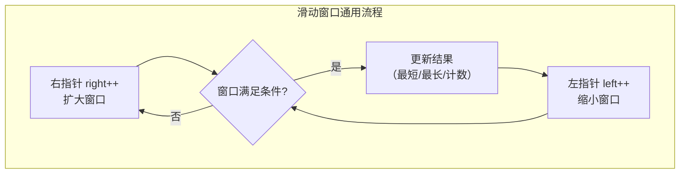
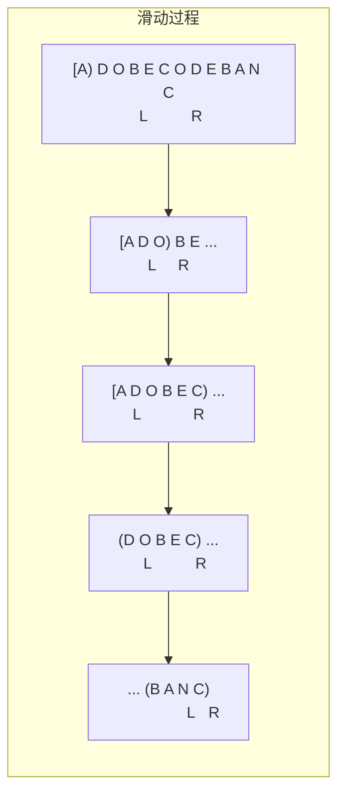

# 滑动窗口

> 核心一句话：**滑动窗口是解决"连续子串/子数组"问题的暴力穷举优化版 — 用两个指针维护一个窗口，右指针扩张找可行解，左指针收缩找最优解。**
>
> 规律：「子串/子数组/子区间」→ 滑动窗口，「需要找最短/最长」→ 收缩/扩张条件

---

## 🎯 经典 LeetCode 题目

> 以下题目全部来自 `leetcode-questions-summary.md`「多指针 / 滑动窗口」分类

| #   | 题号                                                                                        | 题目                          | 难度 | 核心考点              | 推荐指数 |
| --- | ------------------------------------------------------------------------------------------- | ----------------------------- | :--: | --------------------- | :------: |
| 1   | [3](https://leetcode.cn/problems/longest-substring-without-repeating-characters/)           | 无重复字符的最长子串          |  🟡  | 窗口 + 哈希集         |    ⭐    |
| 2   | [76](https://leetcode.cn/problems/minimum-window-substring/)                                | 最小覆盖子串                  |  🔴  | 窗口 + 计数数组       |  ⭐⭐⭐  |
| 3   | [567](https://leetcode.cn/problems/permutation-in-string/)                                  | 字符串的排列                  |  🟡  | 定长滑动窗口          |   ⭐⭐   |
| 4   | [209](https://leetcode.cn/problems/minimum-size-subarray-sum/)                              | 长度最小的子数组              |  🟡  | 和 ≥ target 时收缩    |    ⭐    |
| 5   | [713](https://leetcode.cn/problems/subarray-product-less-than-k/)                           | 乘积小于 K 的子数组           |  🟡  | 乘积 < k 时计数       |   ⭐⭐   |
| 6   | [727](https://leetcode.cn/problems/minimum-window-subsequence/)                             | 最小窗口子序列                |  🔴  | DP / 双指针逐字符匹配 |  ⭐⭐⭐  |
| 7   | [395](https://leetcode.cn/problems/longest-substring-with-at-least-k-repeating-characters/) | 至少有 K 个重复字符的最长子串 |  🟡  | 分治 / 字符种类枚举   |  ⭐⭐⭐  |
| 8   | Lint-604                                                                                    | 滑动窗口内数的和              |  🟢  | 固定窗口求和          |    ⭐    |

---

## 📋 目录

1. [核心规律](#-核心规律)
2. [滑动窗口万能模板](#-滑动窗口万能模板)
3. [问题一：最小覆盖子串（模板题）](#-问题一最小覆盖子串模板题)
4. [问题二：无重复字符的最长子串](#-问题二无重复字符的最长子串)
5. [问题三：字符串的排列（定长窗口）](#-问题三字符串的排列定长窗口)
6. [问题四：长度最小的子数组（数值窗口）](#-问题四长度最小的子数组数值窗口)
7. [复杂度速查表](#-复杂度速查表)
8. [刷题建议](#-刷题建议)

---

## 🧠 核心规律



### 什么样的题可以用滑动窗口？

```
┌───────────────────────────────────────────────────┐
│                 滑动窗口识别指南                      │
├───────────────────────────────────────────────────┤
│                                                     │
│  题目中出现：                                        │
│    · "连续子串 / 子数组"                             │
│    · "最长 / 最短 / 包含 / 覆盖"                     │
│    · 窗口有明确的扩张条件和收缩条件                    │
│                                                     │
│  典型的问法：                                        │
│    · 包含 T 的所有字符的最小子串 → 76                │
│    · 不重复的最长子串 → 3                            │
│    · 和为 target 的最短子数组 → 209                  │
│    · s1 的排列是否是 s2 的子串 → 567                 │
│                                                     │
└───────────────────────────────────────────────────┘
```

---

## 📐 滑动窗口万能模板

```typescript
// sliding-window-template.ts
/**
 * 滑动窗口通用框架（解决子串/子数组问题）
 *
 * 思路：right 扩张直到满足条件，left 收缩优化结果
 *
 * 时间复杂度 O(n)  空间复杂度 O(k) k=字符集大小
 */
function slidingWindowTemplate(s: string): number {
  const window = new Map<string, number>();
  let left = 0, right = 0;
  let result = 0;

  while (right < s.length) {
    // ① 右移窗口，加入一个元素
    const c = s[right];
    right++;
    window.set(c, (window.get(c) || 0) + 1);

    // ② 窗口需要收缩的条件
    while (/* 窗口需要收缩 */) {
      const d = s[left];
      left++;
      // 更新窗口内数据
      window.set(d, window.get(d)! - 1);
    }

    // ③ 在这里更新结果（最长/最短/计数）
    result = Math.max(result, right - left);
  }

  return result;
}
```

### 窗口滑动动画



---

## 🔢 问题一：最小覆盖子串（模板题）

> [76. 最小覆盖子串](https://leetcode.cn/problems/minimum-window-substring/)
> 输入 `S="ADOBECODEBANC", T="ABC"` → 输出 `"BANC"`

```typescript
// minimum-window-substring.ts
/**
 * 76. 最小覆盖子串 — 滑动窗口最经典例题
 *
 * 思路：
 *   1. 用 need 记录 T 中每个字符需要的次数
 *   2. 用 window 记录窗口中字符出现的次数
 *   3. valid 记录满足 need 条件的字符种类数
 *   4. 当 valid === need.size 时，所有字符都覆盖了，开始收缩
 *
 * 时间复杂度 O(n)  空间复杂度 O(k)
 */
function minWindow(s: string, t: string): string {
  const need = new Map<string, number>();
  const window = new Map<string, number>();

  // 统计 t 中每个字符的需求
  for (const c of t) {
    need.set(c, (need.get(c) || 0) + 1);
  }

  let left = 0,
    right = 0;
  let valid = 0; // 满足 need 条件的字符种类数
  let start = 0,
    len = Infinity;

  while (right < s.length) {
    // ① 右移窗口
    const c = s[right];
    right++;

    if (need.has(c)) {
      window.set(c, (window.get(c) || 0) + 1);
      if (window.get(c) === need.get(c)) {
        valid++; // 这个字符的数量达标了
      }
    }

    // ② 所有字符都覆盖了，开始收缩
    while (valid === need.size) {
      // 更新结果
      if (right - left < len) {
        start = left;
        len = right - left;
      }

      // 左移窗口
      const d = s[left];
      left++;

      if (need.has(d)) {
        if (window.get(d) === need.get(d)) {
          valid--;
        }
        window.set(d, window.get(d)! - 1);
      }
    }
  }

  return len === Infinity ? '' : s.substring(start, start + len);
}

// --- 测试 ---
console.log(minWindow('ADOBECODEBANC', 'ABC')); // "BANC"
```

---

## 🔢 问题二：无重复字符的最长子串

> [3. 无重复字符的最长子串](https://leetcode.cn/problems/longest-substring-without-repeating-characters/)
> 输入 `"abcabcbb"` → 输出 3（`"abc"`）

```typescript
// longest-substring-without-repeating.ts
/**
 * 3. 无重复字符的最长子串
 *
 * 收缩条件：窗口内出现重复字符
 * 用 Set 记录窗口内的字符
 */
function lengthOfLongestSubstring(s: string): number {
  const set = new Set<string>();
  let left = 0,
    right = 0;
  let maxLen = 0;

  while (right < s.length) {
    const c = s[right];
    right++;

    // 出现重复，收缩窗口直到不重复
    while (set.has(c)) {
      set.delete(s[left]);
      left++;
    }

    set.add(c);
    maxLen = Math.max(maxLen, right - left);
  }

  return maxLen;
}

// --- 测试 ---
console.log(lengthOfLongestSubstring('abcabcbb')); // 3
console.log(lengthOfLongestSubstring('bbbbb')); // 1
console.log(lengthOfLongestSubstring('pwwkew')); // 3
```

---

## 🔢 问题三：字符串的排列（定长窗口）

> [567. 字符串的排列](https://leetcode.cn/problems/permutation-in-string/)
> 输入 `s1="ab"`, `s2="eidbaooo"` → true（`"ba"` 在 s2 中）

```typescript
// permutation-in-string.ts
/**
 * 567. 字符串的排列
 *
 * 判断 s2 是否包含 s1 的排列 — 定长滑动窗口
 * 窗口长度固定为 s1.length，判断窗口内字符计数是否匹配
 */
function checkInclusion(s1: string, s2: string): boolean {
  const need = new Map<string, number>();
  const window = new Map<string, number>();

  for (const c of s1) {
    need.set(c, (need.get(c) || 0) + 1);
  }

  let left = 0,
    right = 0;
  let valid = 0;

  while (right < s2.length) {
    const c = s2[right];
    right++;

    if (need.has(c)) {
      window.set(c, (window.get(c) || 0) + 1);
      if (window.get(c) === need.get(c)) valid++;
    }

    // 窗口长度超过 s1 时收缩
    while (right - left >= s1.length) {
      if (valid === need.size) return true;

      const d = s2[left];
      left++;

      if (need.has(d)) {
        if (window.get(d) === need.get(d)) valid--;
        window.set(d, window.get(d)! - 1);
      }
    }
  }

  return false;
}

// --- 测试 ---
console.log(checkInclusion('ab', 'eidbaooo')); // true
console.log(checkInclusion('ab', 'eidboaoo')); // false
```

---

## 🔢 问题四：长度最小的子数组（数值窗口）

> [209. 长度最小的子数组](https://leetcode.cn/problems/minimum-size-subarray-sum/)
> 输入 `target=7, nums=[2,3,1,2,4,3]` → 输出 2（`[4,3]`）

```typescript
// minimum-size-subarray-sum.ts
/**
 * 209. 长度最小的子数组
 *
 * 不用哈希表，窗口维护一个数值和
 * 收缩条件：sum >= target
 */
function minSubArrayLen(target: number, nums: number[]): number {
  let left = 0,
    right = 0;
  let sum = 0;
  let minLen = Infinity;

  while (right < nums.length) {
    sum += nums[right];
    right++;

    // 和 ≥ target 时收缩
    while (sum >= target) {
      minLen = Math.min(minLen, right - left);
      sum -= nums[left];
      left++;
    }
  }

  return minLen === Infinity ? 0 : minLen;
}

// --- 测试 ---
console.log(minSubArrayLen(7, [2, 3, 1, 2, 4, 3])); // 2
console.log(minSubArrayLen(11, [1, 1, 1, 1, 1])); // 0
```

### 乘积小于 K 的子数组

```typescript
/**
 * 713. 乘积小于 K 的子数组
 *
 * 收缩条件：乘积 ≥ k
 * 计数方式：每次右移时，新增的子数组个数 = right - left
 */
function numSubarrayProductLessThanK(nums: number[], k: number): number {
  if (k <= 1) return 0;

  let left = 0,
    right = 0;
  let product = 1;
  let count = 0;

  while (right < nums.length) {
    product *= nums[right];
    right++;

    while (product >= k) {
      product /= nums[left];
      left++;
    }

    // 🌟 每次右移，新增的子数组数 = 当前窗口长度
    count += right - left;
  }

  return count;
}

// --- 测试 ---
console.log(numSubarrayProductLessThanK([10, 5, 2, 6], 100)); // 8
```

---

## 📊 复杂度速查表

| 问题            | 收缩条件                  | 时间复杂度 | 空间复杂度 | 关键点                |
| --------------- | ------------------------- | :--------: | :--------: | --------------------- |
| 76 最小覆盖子串 | `valid === need.size`     |    O(n)    |    O(k)    | 计数数组 + valid 标记 |
| 3 无重复子串    | `set.has(c)`              |    O(n)    |    O(k)    | 简单 Set              |
| 567 排列判断    | `right-left >= s1.length` |    O(n)    |    O(k)    | 定长窗口              |
| 209 最短子数组  | `sum >= target`           |    O(n)    |    O(1)    | 数值和                |
| 713 积小于 K    | `product >= k`            |    O(n)    |    O(1)    | 计数技巧              |

---

## 🎯 刷题建议

### 滑动窗口三步走

```
① 右指针移动扩大窗口 → 更新 window 数据
② 判断何时收缩窗口 → 找到可行解后开始优化
③ 在收缩前或收缩后更新结果
```

### 自查清单

```
[ ] 窗口内维护的是什么？（字符计数/数值和/乘积）
[ ] 收缩条件是什么？（覆盖所有字符/出现重复/超过定长/数值超标）
[ ] 结果在什么时候更新？（收缩前/收缩中/收缩后）
[ ] 窗口是固定长度还是可变长度？
[ ] 需要哈希表/数组/Set 来记录窗口数据？
```

---

## 💪 白板挑战

```typescript
// 76. 最小覆盖子串
function minWindow(s: string, t: string): string {}

// 3. 无重复字符的最长子串
function lengthOfLongestSubstring(s: string): number {}
```

---

## Python 核心模板补充

```python
from collections import defaultdict

def min_window(s: str, t: str) -> str:
    need = defaultdict(int)
    for c in t:
        need[c] += 1
    missing = len(t)
    left = start = end = 0
    for right, c in enumerate(s, 1):
        if need[c] > 0:
            missing -= 1
        need[c] -= 1
        while missing == 0:
            if end == 0 or right - left < end - start:
                start, end = left, right
            need[s[left]] += 1
            if need[s[left]] > 0:
                missing += 1
            left += 1
    return s[start:end]
```

---

> **关联阅读：** `18-monotonic-stack.md` → `20-prefix-sum-and-diff-array.md` → `21-n-sum-problems.md`
