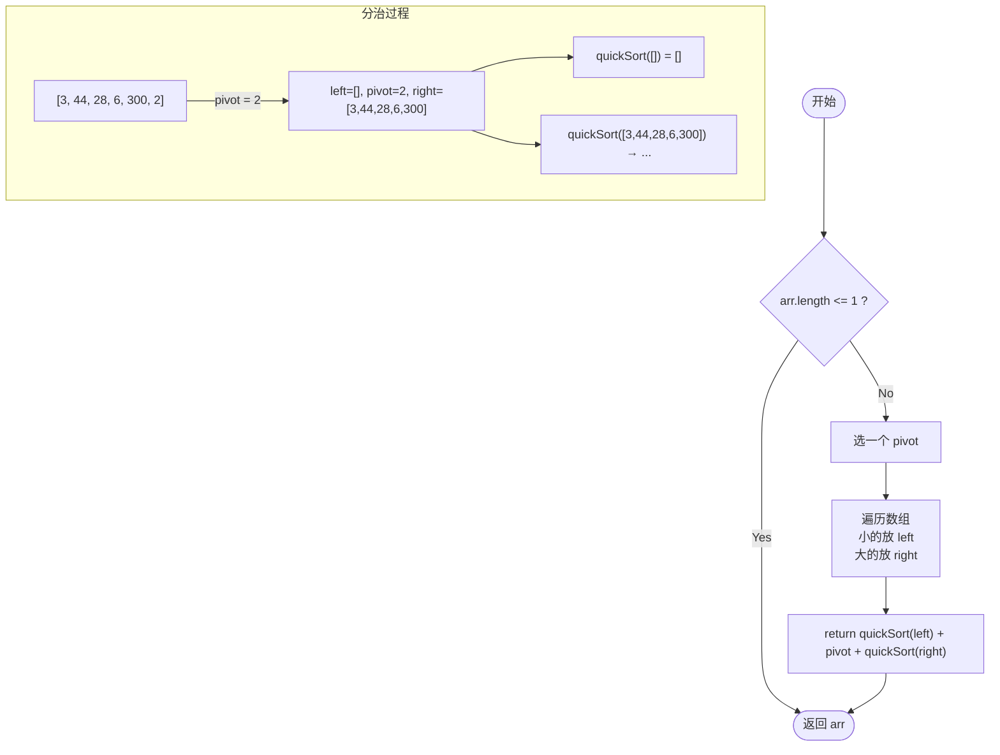
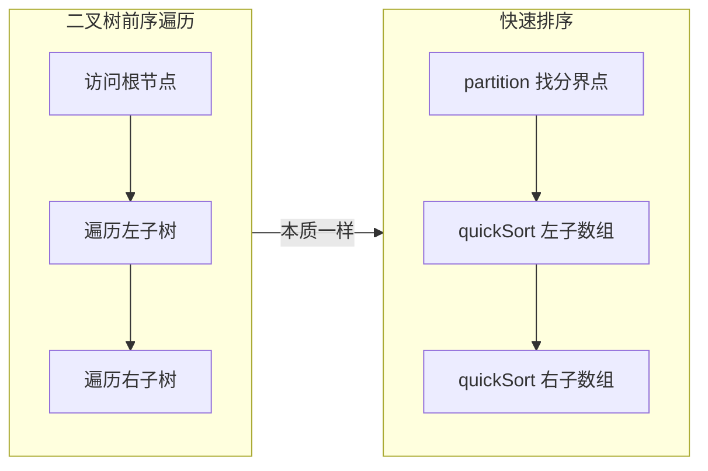
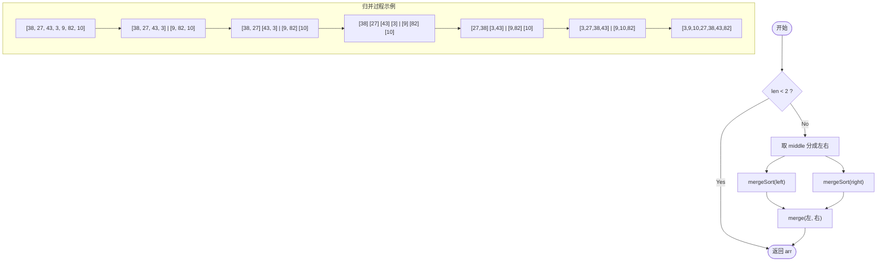
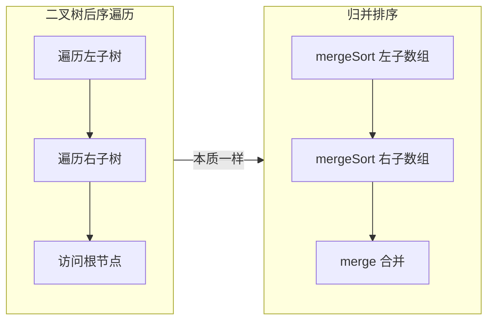
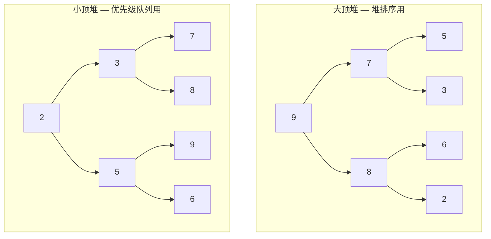
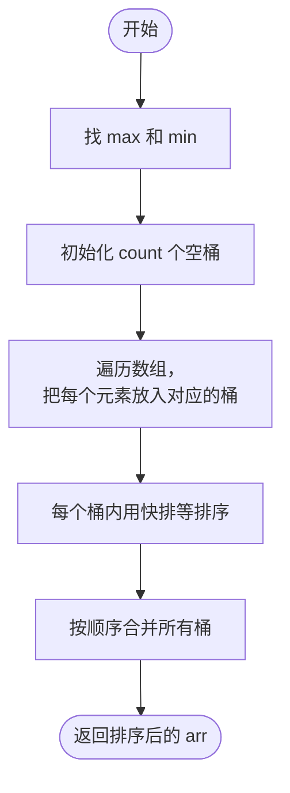
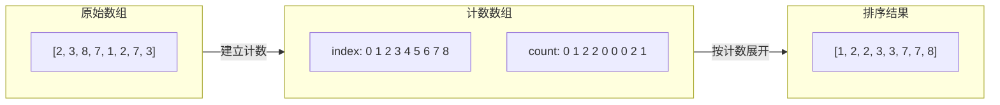
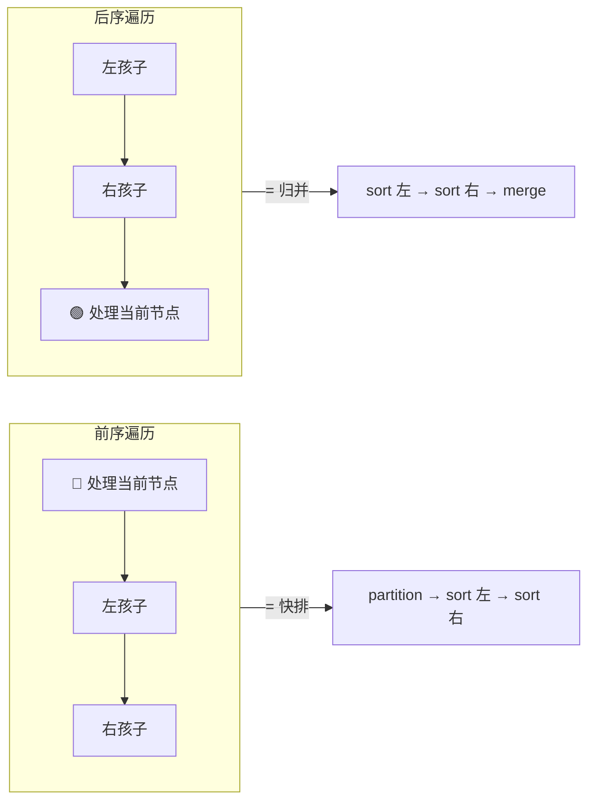

# 排序算法合集

> 核心一句话：**排序的本质是消除逆序对。** 不同的排序算法选择了不同的策略来消除这些逆序对，从而形成了各具特色的 10 大经典算法。
>
> 一句话记所有：**冒选插、快归希、堆桶计基** —— 前三个是 O(n²) 基础排序，中间三个是 O(n log n) 进阶排序，后四个是 O(n + k) 非比较排序。

---

## 🎯 经典 LeetCode 题目

> 💡 刷题顺序：⭐ 必背 → ⭐⭐ 进阶 → ⭐⭐⭐ 挑战

| #   | 题号                                                                                                       | 题目                        | 难度 | 核心考点               | 推荐指数 |
| --- | ---------------------------------------------------------------------------------------------------------- | --------------------------- | :--: | ---------------------- | :------: |
| 1   | [912](https://leetcode.cn/problems/sort-an-array/)                                                         | 排序数组                    |  🟡  | 手撕快排 / 归并        |    ⭐    |
| 2   | [215](https://leetcode.cn/problems/kth-largest-element-in-an-array/)                                       | 数组中的第 K 大元素         |  🟡  | 快速选择（快排思想）   |    ⭐    |
| 3   | [148](https://leetcode.cn/problems/sort-list/)                                                             | 排序链表                    |  🟡  | 归并排序链表版         |   ⭐⭐   |
| 4   | [75](https://leetcode.cn/problems/sort-colors/)                                                            | 颜色分类                    |  🟡  | 三路快排 / 计数排序    |    ⭐    |
| 5   | [179](https://leetcode.cn/problems/largest-number/)                                                        | 最大数                      |  🟡  | 自定义排序比较器       |   ⭐⭐   |
| 6   | [164](https://leetcode.cn/problems/maximum-gap/)                                                           | 最大间距                    |  🔴  | 桶排序思想             |  ⭐⭐⭐  |
| 7   | [493](https://leetcode.cn/problems/reverse-pairs/)                                                         | 翻转对                      |  🔴  | 归并排序 + 计数        |  ⭐⭐⭐  |
| 8   | [315](https://leetcode.cn/problems/count-of-smaller-numbers-after-self/)                                   | 计算右侧小于当前元素的个数  |  🔴  | 归并排序 / 树状数组    |  ⭐⭐⭐  |
| 9   | [347](https://leetcode.cn/problems/top-k-frequent-elements/)                                               | 前 K 个高频元素             |  🟡  | 堆排序 / 桶排序        |    ⭐    |
| 10  | [1122](https://leetcode.cn/problems/relative-sort-array/)                                                  | 数组的相对排序              |  🟢  | 计数排序应用           |   ⭐⭐   |
| 11  | [327](https://leetcode.cn/problems/count-of-range-sum/)                                                    | 区间和的个数                |  🔴  | 归并排序 + 前缀和      |  ⭐⭐⭐  |
| 12  | [56](https://leetcode.cn/problems/merge-intervals/)                                                        | 合并区间                    |  🟡  | 排序预处理 + 合并      |    ⭐    |

---

## 📋 目录

- [排序算法合集](#排序算法合集)
  - [🎯 经典 LeetCode 题目](#-经典-leetcode-题目)
  - [📋 目录](#-目录)
  - [🗺️ 排序算法分类总图](#️-排序算法分类总图)
  - [🔷 比较类排序 — O(n²)](#-比较类排序--on)
    - [1. 冒泡排序 (Bubble Sort)](#1-冒泡排序-bubble-sort)
      - [算法流程](#算法流程)
    - [2. 选择排序 (Selection Sort)](#2-选择排序-selection-sort)
      - [算法流程](#算法流程-1)
    - [3. 插入排序 (Insertion Sort)](#3-插入排序-insertion-sort)
      - [算法流程](#算法流程-2)
  - [🔷 比较类排序 — O(n log n)](#-比较类排序--on-log-n)
    - [4. 快速排序 (Quick Sort)](#4-快速排序-quick-sort)
      - [算法流程](#算法流程-3)
      - [⚡ 快速排序 = 二叉树前序遍历 🧠](#-快速排序--二叉树前序遍历-)
    - [5. 归并排序 (Merge Sort)](#5-归并排序-merge-sort)
      - [算法流程](#算法流程-4)
      - [⚡ 归并排序 = 二叉树后序遍历 🧠](#-归并排序--二叉树后序遍历-)
    - [6. 希尔排序 (Shell Sort)](#6-希尔排序-shell-sort)
      - [算法流程](#算法流程-5)
    - [7. 堆排序 (Heap Sort)](#7-堆排序-heap-sort)
      - [大顶堆 vs 小顶堆](#大顶堆-vs-小顶堆)
      - [算法流程](#算法流程-6)
  - [🔷 非比较类排序 — O(n + k)](#-非比较类排序--on--k)
    - [8. 桶排序 (Bucket Sort)](#8-桶排序-bucket-sort)
      - [算法流程](#算法流程-7)
    - [9. 计数排序 (Counting Sort)](#9-计数排序-counting-sort)
      - [算法流程](#算法流程-8)
    - [10. 基数排序 (Radix Sort)](#10-基数排序-radix-sort)
      - [算法流程](#算法流程-9)
  - [🔬 算法运行详解](#-算法运行详解)
    - [1. 冒泡排序](#1-冒泡排序)
    - [2. 选择排序](#2-选择排序)
    - [3. 插入排序](#3-插入排序)
    - [4. 快速排序](#4-快速排序)
    - [5. 归并排序](#5-归并排序)
    - [6. 希尔排序](#6-希尔排序)
    - [7. 堆排序](#7-堆排序)
    - [8. 桶排序](#8-桶排序)
    - [9. 计数排序](#9-计数排序)
    - [10. 基数排序](#10-基数排序)
  - [🚀 进阶变体](#-进阶变体)
    - [三路快排 (3-Way Quick Sort)](#三路快排-3-way-quick-sort)
    - [Timsort](#timsort)
    - [Introsort](#introsort)
  - [📖 LeetCode 关联题目详解](#-leetcode-关联题目详解)
  - [📊 算法对比总表](#-算法对比总表)
  - [🧭 排序算法选择指南](#-排序算法选择指南)
    - [一句话决策](#一句话决策)
  - [🧠 Labuladong 框架总结](#-labuladong-框架总结)
    - [快排 = 二叉树前序遍历](#快排--二叉树前序遍历)
    - [归并 = 二叉树后序遍历](#归并--二叉树后序遍历)
  - [💡 学习建议](#-学习建议)
    - [对算法学习过程的思考](#对算法学习过程的思考)
  - [📝 快速查表](#-快速查表)

---

## 🗺️ 排序算法分类总图

```mermaid
flowchart TD
    SORT[排序算法] --> COMPARE[比较类排序]
    SORT --> NON_COMPARE[非比较类排序]

    COMPARE --> ON2[O(n²) 简单排序]
    COMPARE --> ONLOGN[O(n log n) 高效排序]

    ON2 --> BUBBLE[冒泡排序<br/>相邻交换]
    ON2 --> SELECT[选择排序<br/>选最小]
    ON2 --> INSERT[插入排序<br/>扑克牌]

    ONLOGN --> QUICK[快速排序<br/>前序遍历分治]
    ONLOGN --> MERGE[归并排序<br/>后序遍历分治]
    ONLOGN --> SHELL[希尔排序<br/>分组插入]
    ONLOGN --> HEAP[堆排序<br/>大顶堆]

    NON_COMPARE --> BUCKET[桶排序<br/>分桶]
    NON_COMPARE --> COUNTING[计数排序<br/>下标计数]
    NON_COMPARE --> RADIX[基数排序<br/>按位分配]

    style SORT fill:#f9f,stroke:#333,stroke-width:3px
    style COMPARE fill:#bbf,stroke:#333
    style NON_COMPARE fill:#bfb,stroke:#333
```

---

## 🔷 比较类排序 — O(n²)

### 1. 冒泡排序 (Bubble Sort)

> **核心思想：** 每一轮依次比较相邻元素，把最大的"冒泡"到末尾。就像气泡从水底浮到水面。
>
> **口诀：** N 个数，N-1 轮；每轮比较 N-i-1 次；相邻比较，大的往后。

#### 算法流程

```mermaid
flowchart TD
    START([开始]) --> INIT[i = 0; arr 待排序]
    INIT --> OUTER{ i < arr.length - 1 ?}
    OUTER -->|No| DONE([返回 arr])
    OUTER -->|Yes| INNER[j = i; 从后往前]
    INNER --> COMPARE{ arr[j-1] > arr[j] ?}
    COMPARE -->|Yes| SWAP[交换 arr[j-1] 和 arr[j]]
    COMPARE -->|No| DEC[j--]
    SWAP --> DEC
    DEC --> JLOOP{ j > 0 ?}
    JLOOP -->|Yes| COMPARE
    JLOOP -->|No| IINC[i++]
    IINC --> OUTER
```


```typescript
// TypeScript — 冒泡排序（带类型 & 提前退出优化）
function bubbleSort<T>(arr: T[]): T[] {
  const n = arr.length;
  for (let i = 0; i < n - 1; i++) {
    let swapped = false;
    for (let j = 0; j < n - 1 - i; j++) {
      if (arr[j] > arr[j + 1]) {
        [arr[j], arr[j + 1]] = [arr[j + 1], arr[j]];
        swapped = true;
      }
    }
    // 优化：没有发生交换说明已经有序
    if (!swapped) break;
  }
  return arr;
}
```

```python
# Python — 冒泡排序
def bubble_sort(arr: list) -> list:
    n = len(arr)
    for i in range(n - 1):
        swapped = False
        for j in range(n - 1 - i):
            if arr[j] > arr[j + 1]:
                arr[j], arr[j + 1] = arr[j + 1], arr[j]
                swapped = True
        if not swapped:  # 优化：提前退出
            break
    return arr
```

| 指标       | 值            |
| ---------- | :------------ |
| 时间复杂度 | O(n²)         |
| 最好情况   | O(n) — 已有序 |
| 最坏情况   | O(n²)         |
| 空间复杂度 | O(1)          |
| 稳定性     | ✅ 稳定       |
| 适用场景   | 教学示范，小数据量 |

---

### 2. 选择排序 (Selection Sort)

> **核心思想：** 每一轮从未排序部分找到最小元素，放到已排序部分的末尾。
>
> **口诀：** 每轮选最小，放到最前面。

#### 算法流程

```mermaid
flowchart TD
    START([开始]) --> INIT[i = 0]
    INIT --> LOOP{i < arr.length ?}
    LOOP -->|No| DONE([返回 arr])
    LOOP -->|Yes| MIN[minIndex = i]
    MIN --> J[j = i + 1]
    J --> JLOOP{ j < arr.length ?}
    JLOOP -->|Yes| CMP{ arr[j] < arr[minIndex] ?}
    CMP -->|Yes| UPDATE[minIndex = j]
    CMP -->|No| JINC[j++]
    UPDATE --> JINC
    JINC --> JLOOP
    JLOOP -->|No| SWAP[交换 arr[i] 和 arr[minIndex]]
    SWAP --> IINC[i++]
    IINC --> LOOP
```

```typescript
// TypeScript — 选择排序
function selectionSort<T>(arr: T[]): T[] {
  const n = arr.length;
  for (let i = 0; i < n - 1; i++) {
    let minIdx = i;
    for (let j = i + 1; j < n; j++) {
      if (arr[j] < arr[minIdx]) {
        minIdx = j;
      }
    }
    if (minIdx !== i) {
      [arr[i], arr[minIdx]] = [arr[minIdx], arr[i]];
    }
  }
  return arr;
}
```

```python
# Python — 选择排序
def selection_sort(arr: list) -> list:
    n = len(arr)
    for i in range(n - 1):
        min_idx = i
        for j in range(i + 1, n):
            if arr[j] < arr[min_idx]:
                min_idx = j
        if min_idx != i:
            arr[i], arr[min_idx] = arr[min_idx], arr[i]
    return arr
```

| 指标       | 值      |
| ---------- | :------ |
| 时间复杂度 | O(n²)   |
| 最好情况   | O(n²)   |
| 最坏情况   | O(n²)   |
| 空间复杂度 | O(1)    |
| 稳定性     | ❌ 不稳定 |
| 适用场景   | 数据量小，对稳定性无要求 |

> 💡 **选择和冒泡的区别：** 冒泡是**相邻比较，多次交换**；选择是**全局找最小，一次交换**。选择排序交换次数少，但无论数据是否有序都执行 O(n²) 次比较。

---

### 3. 插入排序 (Insertion Sort)

> **核心思想：** 像打扑克牌时理牌一样，每次把一张牌插入到已排序部分的正确位置。
>
> **口诀：** 抓一张，插一位；从后往前找位置。

#### 算法流程

```mermaid
flowchart TD
    START([开始]) --> INIT[i = 1]
    INIT --> LOOP{ i < arr.length ?}
    LOOP -->|No| DONE([返回 arr])
    LOOP -->|Yes| SAVE[temp = arr[i]; j = i - 1]
    SAVE --> CMP{ j >= 0 AND temp < arr[j] ?}
    CMP -->|Yes| SHIFT[arr[j+1] = arr[j]; j--]
    SHIFT --> CMP
    CMP -->|No| PLACE[arr[j+1] = temp]
    PLACE --> IINC[i++]
    IINC --> LOOP
```


```typescript
// TypeScript — 插入排序
function insertionSort<T>(arr: T[]): T[] {
  const n = arr.length;
  for (let i = 1; i < n; i++) {
    const temp = arr[i];
    let j = i - 1;
    while (j >= 0 && arr[j] > temp) {
      arr[j + 1] = arr[j];
      j--;
    }
    arr[j + 1] = temp;
  }
  return arr;
}
```

```python
# Python — 插入排序
def insertion_sort(arr: list) -> list:
    for i in range(1, len(arr)):
        temp = arr[i]
        j = i - 1
        while j >= 0 and temp < arr[j]:
            arr[j + 1] = arr[j]
            j -= 1
        arr[j + 1] = temp
    return arr
```

| 指标       | 值               |
| ---------- | :--------------- |
| 时间复杂度 | O(n²)            |
| 最好情况   | O(n) — 已有序    |
| 最坏情况   | O(n²) — 逆序     |
| 空间复杂度 | O(1)             |
| 稳定性     | ✅ 稳定          |
| 适用场景   | 小数据量 / 接近有序的数据 |

> 💡 **插入排序的隐藏优势：** 对于"几乎有序"的数据，插入排序可以逼近 O(n)。这也是希尔排序（插入排序的升级版）能突破 O(n²) 的原因。

---

## 🔷 比较类排序 — O(n log n)

### 4. 快速排序 (Quick Sort)

> **核心思想：** 选一个 pivot（基准），把小于 pivot 的全放左边，大于的全放右边，然后递归排序左右子数组。
>
> **Labuladong 框架：快速排序 = 二叉树的前序遍历** —— 先构造分界点，再去左右子数组构造分界点。

#### 算法流程




```typescript
// TypeScript — 快速排序（原地交换版，更高效）
function quickSort<T>(arr: T[], left = 0, right = arr.length - 1): T[] {
  if (left >= right) return arr;

  const pivot = partition(arr, left, right);
  quickSort(arr, left, pivot - 1);
  quickSort(arr, pivot + 1, right);
  return arr;
}

function partition<T>(arr: T[], left: number, right: number): number {
  const pivot = arr[right]; // 选最后一个元素为基准
  let i = left;

  for (let j = left; j < right; j++) {
    if (arr[j] < pivot) {
      [arr[i], arr[j]] = [arr[j], arr[i]];
      i++;
    }
  }
  [arr[i], arr[right]] = [arr[right], arr[i]];
  return i;
}
```

```python
# Python — 快速排序
def quick_sort(arr: list) -> list:
    if len(arr) <= 1:
        return arr
    pivot = arr.pop()
    left = [x for x in arr if x <= pivot]
    right = [x for x in arr if x > pivot]
    return quick_sort(left) + [pivot] + quick_sort(right)


# 原地分区版（更高效）
def quick_sort_inplace(arr: list, left: int = 0, right: int = None) -> list:
    if right is None:
        right = len(arr) - 1
    if left >= right:
        return arr

    pivot = arr[right]
    i = left
    for j in range(left, right):
        if arr[j] < pivot:
            arr[i], arr[j] = arr[j], arr[i]
            i += 1
    arr[i], arr[right] = arr[right], arr[i]

    quick_sort_inplace(arr, left, i - 1)
    quick_sort_inplace(arr, i + 1, right)
    return arr
```

#### ⚡ 快速排序 = 二叉树前序遍历 🧠

```javascript
// Labuladong 框架：快速排序就是二叉树的前序遍历
function sort(nums, low, high) {
  /****** 前序遍历位置 ******/
  // 通过交换元素构建分界点 p
  const p = partition(nums, low, high);
  /************************/

  sort(nums, low, p - 1);
  sort(nums, p + 1, high);
}
```



| 指标       | 值                 |
| ---------- | :----------------- |
| 时间复杂度 | O(n log n)         |
| 最好情况   | O(n log n)         |
| 最坏情况   | O(n²) — 有序数组   |
| 空间复杂度 | O(log n) — 递归栈  |
| 稳定性     | ❌ 不稳定          |
| 适用场景   | 通用排序，大数据量 |

> 💡 **快排最坏情况优化：** 随机选择 pivot（三数取中法）可以大幅降低最坏情况的概率。

---

### 5. 归并排序 (Merge Sort)

> **核心思想：** 先把数组从中间分成两半，分别排序，然后合并两个有序数组。
>
> **Labuladong 框架：归并排序 = 二叉树的后序遍历** —— 先递归左右子数组，然后合并（类似合并有序链表）。

#### 算法流程



```typescript
// TypeScript — 归并排序
function mergeSort<T>(arr: T[]): T[] {
  if (arr.length < 2) return arr;
  const mid = Math.floor(arr.length / 2);
  const left = arr.slice(0, mid);
  const right = arr.slice(mid);
  return merge(mergeSort(left), mergeSort(right));
}

function merge<T>(left: T[], right: T[]): T[] {
  const result: T[] = [];
  let i = 0, j = 0;

  while (i < left.length && j < right.length) {
    if (left[i] <= right[j]) {
      result.push(left[i++]);
    } else {
      result.push(right[j++]);
    }
  }
  // 剩余部分直接拼接
  return result.concat(left.slice(i)).concat(right.slice(j));
}
```

```python
# Python — 归并排序
def merge_sort(arr: list) -> list:
    if len(arr) < 2:
        return arr
    mid = len(arr) // 2
    left = merge_sort(arr[:mid])
    right = merge_sort(arr[mid:])
    return merge(left, right)


def merge(left: list, right: list) -> list:
    result = []
    i = j = 0
    while i < len(left) and j < len(right):
        if left[i] <= right[j]:
            result.append(left[i])
            i += 1
        else:
            result.append(right[j])
            j += 1
    result.extend(left[i:])
    result.extend(right[j:])
    return result
```

#### ⚡ 归并排序 = 二叉树后序遍历 🧠

```javascript
// Labuladong 框架：归并排序就是二叉树的后序遍历
function sort(nums, low, high) {
  let mid = Math.floor((low + high) / 2);
  sort(nums, low, mid);       // 先排序左半
  sort(nums, mid + 1, high);  // 再排序右半

  /****** 后序遍历位置 ******/
  // 合并两个排好序的子数组
  merge(nums, low, mid, high);
  /************************/
}
```



| 指标       | 值                |
| ---------- | :---------------- |
| 时间复杂度 | O(n log n)        |
| 最好情况   | O(n log n)        |
| 最坏情况   | O(n log n)        |
| 空间复杂度 | O(n) — 辅助数组   |
| 稳定性     | ✅ 稳定           |
| 适用场景   | 大数据量、需要稳定排序、链表排序 |

> 💡 **归并 vs 快排：** 归并是稳定排序但需要额外空间，快排不稳定但空间省。归并适合**链表排序**（LeetCode 148），快排适合**数组原地排序**。
>
> 💡 **归并的逆序对应用：** 归并排序的 merge 过程天然可以统计逆序对（LeetCode 493、315）。

---

### 6. 希尔排序 (Shell Sort)

> **核心思想：** 插入排序的升级版。把数组按下标的一定增量（gap）分组，对每组使用插入排序。随着 gap 逐渐减小到 1，数组接近有序，最后做一次完整的插入排序。
>
> **本质：** 让数据先"大体有序"，避免插入排序在大数据量下的大量移动。

#### 算法流程

```mermaid
flowchart TD
    START([开始]) --> INIT[gap = len/2]
    INIT --> GAP_LOOP{ gap > 0 ?}
    GAP_LOOP -->|No| DONE([返回 arr])
    GAP_LOOP -->|Yes| I[i = gap]
    I --> I_LOOP{ i < len ?}
    I_LOOP -->|No| GAP_DIV[gap = floor(gap/2)]
    GAP_DIV --> GAP_LOOP
    I_LOOP -->|Yes| SAVE[temp = arr[i]; j = i]
    SAVE --> INNER{ j >= gap AND arr[j - gap] > temp ?}
    INNER -->|Yes| SHIFT[arr[j] = arr[j - gap]; j -= gap]
    SHIFT --> INNER
    INNER -->|No| PLACE[arr[j] = temp]
    PLACE --> I_INC[i++]
    I_INC --> I_LOOP
```

```typescript
// TypeScript — 希尔排序
function shellSort<T>(arr: T[]): T[] {
  const n = arr.length;
  for (let gap = Math.floor(n / 2); gap > 0; gap = Math.floor(gap / 2)) {
    for (let i = gap; i < n; i++) {
      const temp = arr[i];
      let j = i;
      while (j >= gap && arr[j - gap] > temp) {
        arr[j] = arr[j - gap];
        j -= gap;
      }
      arr[j] = temp;
    }
  }
  return arr;
}
```

```python
# Python — 希尔排序
def shell_sort(arr: list) -> list:
    n = len(arr)
    gap = n // 2
    while gap > 0:
        for i in range(gap, n):
            temp = arr[i]
            j = i
            while j >= gap and arr[j - gap] > temp:
                arr[j] = arr[j - gap]
                j -= gap
            arr[j] = temp
        gap //= 2
    return arr
```

| 指标       | 值                   |
| ---------- | :------------------- |
| 时间复杂度 | O(n log n) ~ O(n²)   |
| 最好情况   | O(n log n) — 取决于 gap 序列 |
| 最坏情况   | O(n²) — 某些 gap 序列 |
| 空间复杂度 | O(1)                 |
| 稳定性     | ❌ 不稳定            |
| 适用场景   | 中等数据量，对空间要求严格的场景 |

> 💡 希尔排序的 gap 序列选择会影响效率，常用的有 `gap = floor(n/2)`（原始版），更好的序列如 Hibbard 序列 `(2^k - 1)` 可以达到 O(n^(3/2))。

---

### 7. 堆排序 (Heap Sort)

> **核心思想：** 利用大顶堆（最大堆）的特性——堆顶永远是最大元素。先建堆，然后不断交换堆顶和末尾元素，再调整剩余元素为大顶堆。
>
> **本质：** 选择排序的升级版 —— 用堆这种数据结构来高效地"选择"最大/最小元素。

#### 大顶堆 vs 小顶堆



#### 算法流程

```mermaid
flowchart TD
    START([开始]) --> BUILD[buildMaxHeap: 从 iParent 往 0 调整]
    BUILD --> I[i = len - 1]
    I --> LOOP{ i > 0 ?}
    LOOP -->|No| DONE([返回 arr])
    LOOP -->|Yes| SWAP[交换 arr[0] 和 arr[i]]
    SWAP --> ADJUST[adjustMaxHeap: 对 0 到 i-1 重新调整为大顶堆]
    ADJUST --> DEC[i--]
    DEC --> LOOP

    subgraph 调整过程
        A1["父子比较"] --> A2{左子 > 父?}
        A2 -->|Yes| UPDATE[iMax = iLeft]
        A2 -->|No| A3{右子 > 父?}
        A3 -->|Yes| UPDATE2[iMax = iRight]
        UPDATE --> SWAP2[交换]
        UPDATE2 --> SWAP2
        SWAP2 --> CONTINUE[继续检查子树]
    end
```

```typescript
// TypeScript — 堆排序
function heapSort<T>(arr: T[]): T[] {
  const n = arr.length;
  if (n <= 1) return arr;

  // 从最后一个非叶子节点开始调整
  for (let i = Math.floor(n / 2) - 1; i >= 0; i--) {
    heapify(arr, i, n);
  }

  for (let i = n - 1; i > 0; i--) {
    [arr[0], arr[i]] = [arr[i], arr[0]]; // 堆顶移到末尾
    heapify(arr, 0, i);                   // 剩下元素重新堆化
  }
  return arr;
}

function heapify<T>(arr: T[], index: number, heapSize: number): void {
  let largest = index;
  const left = 2 * index + 1;
  const right = 2 * index + 2;

  if (left < heapSize && arr[left] > arr[largest]) largest = left;
  if (right < heapSize && arr[right] > arr[largest]) largest = right;

  if (largest !== index) {
    [arr[index], arr[largest]] = [arr[largest], arr[index]];
    heapify(arr, largest, heapSize); // 递归调整子树
  }
}
```

```python
# Python — 堆排序
def heap_sort(arr: list) -> list:
    n = len(arr)

    def heapify(arr: list, index: int, heap_size: int):
        largest = index
        left = 2 * index + 1
        right = 2 * index + 2

        if left < heap_size and arr[left] > arr[largest]:
            largest = left
        if right < heap_size and arr[right] > arr[largest]:
            largest = right

        if largest != index:
            arr[index], arr[largest] = arr[largest], arr[index]
            heapify(arr, largest, heap_size)

    # 构建大顶堆
    for i in range(n // 2 - 1, -1, -1):
        heapify(arr, i, n)

    # 一个个交换堆顶和末尾
    for i in range(n - 1, 0, -1):
        arr[0], arr[i] = arr[i], arr[0]
        heapify(arr, 0, i)

    return arr
```

| 指标       | 值                |
| ---------- | :---------------- |
| 时间复杂度 | O(n log n)        |
| 最好情况   | O(n log n)        |
| 最坏情况   | O(n log n)        |
| 空间复杂度 | O(1)              |
| 稳定性     | ❌ 不稳定         |
| 适用场景   | Top K 问题、数据量大但不需要稳定排序 |

> 💡 **堆排序的隐藏优势？** 没有 🤣 — 实际工程中快排通常比堆排序快。堆排序的真正价值在于**堆这种数据结构本身**（优先级队列、Top K、中位数等场景）。

---

## 🔷 非比较类排序 — O(n + k)

> 以下三种排序都不需要比较元素之间的大小，而是利用元素本身的数学性质来排序，因此可以突破 O(n log n) 的下界。

### 8. 桶排序 (Bucket Sort)

> **核心思想：** 把数据分到有限数量的桶里，每个桶单独排序（可以用快排/插入排序），然后按顺序合并。
>
> **本质：** 分治思想在排序中的另一种应用 —— 先划分（分桶）、各自排序、再合并。

#### 算法流程



```typescript
// TypeScript — 桶排序
function bucketSort(arr: number[], bucketSize = 5): number[] {
  if (arr.length === 0) return arr;

  const min = Math.min(...arr);
  const max = Math.max(...arr);
  const bucketCount = Math.floor((max - min) / bucketSize) + 1;
  const buckets: number[][] = Array.from({ length: bucketCount }, () => []);

  for (const num of arr) {
    const idx = Math.floor((num - min) / bucketSize);
    buckets[idx].push(num);
  }

  // 每个桶排序后合并
  return buckets.flatMap(bucket => bucket.sort((a, b) => a - b));
}
```

```python
# Python — 桶排序
def bucket_sort(arr: list, bucket_size: int = 5) -> list:
    if not arr:
        return arr

    min_val, max_val = min(arr), max(arr)
    bucket_count = (max_val - min_val) // bucket_size + 1
    buckets = [[] for _ in range(bucket_count)]

    for num in arr:
        idx = (num - min_val) // bucket_size
        buckets[idx].append(num)

    # 每个桶排序后合并
    result = []
    for bucket in buckets:
        result.extend(sorted(bucket))  # 桶内用 TimSort（Python 内置）
    return result
```

| 指标       | 值                   |
| ---------- | :------------------- |
| 时间复杂度 | O(n + k) — 平均      |
| 最好情况   | O(n + k)             |
| 最坏情况   | O(n²) — 所有数据进一个桶 |
| 空间复杂度 | O(n + k)             |
| 稳定性     | ✅ 稳定（桶内排序稳定时） |
| 适用场景   | 数据分布均匀的浮点数/整数 |

> 💡 **桶排序的关键：** 数据要分布均匀，且桶的大小要合适。如果数据全部集中在一个桶里，退化为 O(n²)。

---

### 9. 计数排序 (Counting Sort)

> **核心思想：** 以原数组每个元素的值作为新数组的下标，对应下标数组的元素值作为出现的次数。相当于**通过下标排序**。
>
> **本质：** 桶排序的特例 —— 每个桶只放一种值（桶大小 = 1）。

#### 算法流程



```typescript
// TypeScript — 计数排序
function countingSort(arr: number[], maxValue: number): number[] {
  const count = new Array(maxValue + 1).fill(0);

  for (const num of arr) {
    count[num]++;
  }

  let idx = 0;
  for (let i = 0; i <= maxValue; i++) {
    while (count[i] > 0) {
      arr[idx++] = i;
      count[i]--;
    }
  }
  return arr;
}
```

```python
# Python — 计数排序
def counting_sort(arr: list, max_value: int) -> list:
    count = [0] * (max_value + 1)

    for num in arr:
        count[num] += 1

    idx = 0
    for i in range(max_value + 1):
        while count[i] > 0:
            arr[idx] = i
            idx += 1
            count[i] -= 1

    return arr
```

| 指标       | 值                |
| ---------- | :---------------- |
| 时间复杂度 | O(n + k) — k 是 max-min 范围 |
| 空间复杂度 | O(k)              |
| 稳定性     | ✅ 稳定           |
| 适用场景   | 数据范围有限的整数（如年龄、成绩） |

> ⚠️ **限制：** 计数排序要求输入数据必须是有确定范围的**整数**。如果数据范围很大（比如 1 到 10 亿），会造成极大的空间浪费。

---

### 10. 基数排序 (Radix Sort)

> **核心思想：** 按位（从低位到高位）依次排序。对每一位使用稳定的排序（如计数排序）来保证正确性。
>
> **本质：** 多轮按位排序 —— 个位 → 十位 → 百位 → ...，每一轮保持之前轮次的顺序。

#### 算法流程

```mermaid
flowchart TD
    START([开始]) --> INIT[m = 1; 从个位开始]
    INIT --> LOOP{ m < max ?}
    LOOP -->|No| DONE([返回 arr])
    LOOP -->|Yes| DIGIT[取当前位数字 digit]
    DIGIT --> BUCKET[放入对应桶中<br/>buckets[digit]]
    BUCKET --> COLLECT[按桶顺序收集<br/>先入先出]
    COLLECT --> MULTI[m *= 10; 下一位]
    MULTI --> LOOP

    subgraph 举例 [以 [10, 200, 13, 12, 7, 88, 91, 24] 为例]
        R1["个位: [10, 200, 91, 12, 13, 24, 7, 88]"]
        R2["十位: [200, 7, 10, 12, 13, 24, 88, 91]"]
        R3["百位: [7, 10, 12, 13, 24, 88, 91, 200]"]
        R1 --> R2 --> R3
    end
```

```typescript
// TypeScript — 基数排序
function radixSort(arr: number[]): number[] {
  const max = Math.max(...arr);
  const buckets: number[][] = Array.from({ length: 10 }, () => []);
  let m = 1;

  while (m < max) {
    for (const num of arr) {
      const digit = Math.floor((num % (m * 10)) / m);
      buckets[digit].push(num);
    }

    let idx = 0;
    for (const bucket of buckets) {
      while (bucket.length > 0) {
        arr[idx++] = bucket.shift()!;
      }
    }

    m *= 10;
  }
  return arr;
}
```

```python
# Python — 基数排序
def radix_sort(arr: list) -> list:
    max_val = max(arr)
    m = 1  # 从个位开始

    while m < max_val:
        buckets = [[] for _ in range(10)]

        for num in arr:
            digit = (num // m) % 10
            buckets[digit].append(num)

        # 按桶顺序收集
        arr = [num for bucket in buckets for num in bucket]
        m *= 10

    return arr
```

| 指标       | 值                |
| ---------- | :---------------- |
| 时间复杂度 | O(n × k) — k 是位数 |
| 最好情况   | O(n × k)          |
| 最坏情况   | O(n × k)          |
| 空间复杂度 | O(n + k)          |
| 稳定性     | ✅ 稳定           |
| 适用场景   | 位数固定的正整数排序 |

> ⚠️ **限制：** 基数排序也要求正数（或统一处理负号）且必须为整数，不能有小数。

---

## 🔬 算法运行详解

> 每个算法附运行过程示例、边界情况分析与可视化链接。

### 1. 冒泡排序

**运行过程**

输入: `[6, 2, 8, 3, 1, 9, 4]`

```
第 1 轮: [2, 6, 3, 1, 8, 4, 9]  → 9 冒泡到位
第 2 轮: [2, 3, 1, 6, 4, 8, 9]  → 8 冒泡到位（优化版 swapped=false 提前结束）
```

**边界情况**

| 场景 | 行为 |
|---|---|
| 空数组 `[]` | 直接返回 |
| 单元素 `[1]` | 直接返回 |
| 全部相同 `[5,5,5,5]` | 一轮后无交换，提前退出 |
| 已有序 `[1,2,3,4]` | O(n) 一次遍历完成 |
| 逆序 `[4,3,2,1]` | O(n²) 最坏情况 |

**可视化** 👉 [visualgo.net 冒泡排序动画](https://visualgo.net/en/sorting?mode=Bubble)

### 2. 选择排序

**运行过程**

输入: `[6, 2, 8, 3, 1, 9, 4]`

```
第 1 轮: [1, 2, 8, 3, 6, 9, 4]  → 1 最小，与 6 交换
第 2 轮: [1, 2, 8, 3, 6, 9, 4]  → 2 已在正确位置
第 3 轮: [1, 2, 3, 8, 6, 9, 4]  → 3 与 8 交换
第 4 轮: [1, 2, 3, 4, 6, 9, 8]  → 4 与 8 交换
第 5 轮: [1, 2, 3, 4, 6, 9, 8]  → 6 已在正确位置
第 6 轮: [1, 2, 3, 4, 6, 8, 9]  → 8 与 9 交换
```

**边界情况**

| 场景 | 行为 |
|---|---|
| 空数组 | 直接返回 |
| 全部相同 | 每轮 minIndex=i，无交换，但仍 O(n²) |
| 已有序 | 仍然 O(n²) — 选择排序无提前退出机制 |

> ⚠️ 选择排序是唯一**最好/最坏都是 O(n²)** 的排序。

**可视化** 👉 [visualgo.net 选择排序动画](https://visualgo.net/en/sorting?mode=Selection)

### 3. 插入排序

**运行过程**

输入: `[6, 2, 8, 3, 1, 9, 4]`

```
第 1 步: [2, 6, 8, 3, 1, 9, 4]  → 2 插入到 6 前面
第 2 步: [2, 6, 8, 3, 1, 9, 4]  → 8 已在正确位置，无需移动
第 3 步: [2, 3, 6, 8, 1, 9, 4]  → 3 插入到 2 和 6 之间
第 4 步: [1, 2, 3, 6, 8, 9, 4]  → 1 插入到最前面
第 5 步: [1, 2, 3, 6, 8, 9, 4]  → 9 已在正确位置
第 6 步: [1, 2, 3, 4, 6, 8, 9]  → 4 插入到 3 和 6 之间
```

**边界情况**

| 场景 | 行为 |
|---|---|
| 空数组 | 直接返回 |
| 已有序 | O(n) — 每个元素只需比较 1 次 |
| 逆序 | O(n²) — 每个元素要移动到最前面 |
| 几乎有序 | 接近 O(n) — 插入排序的优势场景 |

**可视化** 👉 [visualgo.net 插入排序动画](https://visualgo.net/en/sorting?mode=Insertion)

### 4. 快速排序

**运行过程**

输入: `[6, 2, 8, 3, 1, 9, 4]` (pivot=4)

```
分区: [2, 3, 1] + [4] + [6, 8, 9]
  → 左 [2,3,1]: pivot=1 → [] + [1] + [2,3]
    → [2,3]: pivot=3 → [2] + [3] + []
  → 右 [6,8,9]: pivot=9 → [6,8] + [9] + []
    → [6,8]: pivot=8 → [6] + [8] + []
结果: [1, 2, 3, 4, 6, 8, 9]
```

**边界情况**

| 场景 | 行为 |
|---|---|
| 空数组 / 单元素 | 直接返回 |
| 已有序（首元素作 pivot） | O(n²) 最坏！选中间/随机 pivot 可避免 |
| 全部相同 | 标准版退化为 O(n²)，应使用三路快排 |
| 大量重复元素 | ⚠️ 标准快排性能急剧下降 |

> 💡 **优化：** 随机选择 pivot（或三数取中法）可避免最坏情况。Java `Arrays.sort()` 对基本类型使用双轴快排。

**可视化** 👉 [visualgo.net 快速排序动画](https://visualgo.net/en/sorting?mode=Quick)

### 5. 归并排序

**运行过程**

输入: `[6, 2, 8, 3, 1, 9, 4]`

```
拆分: [6, 2, 8, 3] | [1, 9, 4]
  左: [6, 2] | [8, 3] → [6][2] | [8][3] → merge→ [2, 6] | [3, 8] → merge→ [2, 3, 6, 8]
  右: [1, 9] | [4]    → [1][9] | [4]    → merge→ [1, 9] | [4]    → merge→ [1, 4, 9]
合并左右 → [1, 2, 3, 4, 6, 8, 9]
```

**边界情况**

| 场景 | 行为 |
|---|---|
| 空数组 / 单元素 | 直接返回 |
| 已有序 | 仍需 O(n log n)，但 merge 过程不会退化 |
| 链表排序 | ✅ 归并排序是链表排序的最佳选择（LeetCode 148） |
| 数据无法全部载入内存 | ✅ 外部归并排序（External Merge Sort）解决 |

**可视化** 👉 [visualgo.net 归并排序动画](https://visualgo.net/en/sorting?mode=Merge)

### 6. 希尔排序

**运行过程**

输入: `[6, 2, 8, 3, 1, 9, 4]` (len=7)

```
gap=3: 分组 [6,3,4] [2,1] [8,9] → 组内插入排序 → [3, 1, 8, 4, 2, 9, 6]
gap=1: 全体插入排序 → [1, 2, 3, 4, 6, 8, 9]
```

**边界情况**

| 场景 | 行为 |
|---|---|
| 空数组 | 直接返回 |
| 已有序 | 接近 O(n log n) |
| gap 序列选择 | 原始 gap=n/2 非最优；Hibbard 序列 (2^k-1) 可达 O(n^(3/2)) |

**可视化** 👉 [visualgo.net 希尔排序动画](https://visualgo.net/en/sorting?mode=Shell)

### 7. 堆排序

**运行过程**

输入: `[6, 2, 8, 3, 1, 9, 4]`

```
建大顶堆: [9, 6, 8, 3, 1, 2, 4]
交换 9↔4 → [4, 6, 8, 3, 1, 2, | 9] → 调整 → [8, 6, 4, 3, 1, 2, | 9]
交换 8↔2 → [2, 6, 4, 3, 1, | 8, 9] → 调整 → [6, 3, 4, 2, 1, | 8, 9]
交换 6↔1 → [1, 3, 4, 2, | 6, 8, 9] → 调整 → [4, 3, 1, 2, | 6, 8, 9]
... 重复直到完成
结果: [1, 2, 3, 4, 6, 8, 9]
```

**边界情况**

| 场景 | 行为 |
|---|---|
| 空数组 | 直接返回 |
| 全部相同 | 建堆 O(n)，交换+调整 O(n log n) |
| 已有序 | 仍然 O(n log n) — 无优化空间 |
| 实际性能 | 虽复杂度 O(n log n)，但实际比快排慢（缓存不友好） |

> 💡 **堆排序的最大价值不在于排序本身**，而在于**堆这种数据结构**（优先级队列、Top K、中位数等场景）。

**可视化** 👉 [visualgo.net 堆排序动画](https://visualgo.net/en/sorting?mode=Heap)

### 8. 桶排序

**运行过程**

输入: `[6, 2, 8, 3, 1, 9, 4]`, bucketSize=3

```
min=1, max=9, bucketCount = floor((9-1)/3)+1 = 3
桶 0 (1~3):   [2, 3, 1] → 排序 → [1, 2, 3]
桶 1 (4~6):   [6, 4]    → 排序 → [4, 6]
桶 2 (7~9):   [8, 9]    → 排序 → [8, 9]
合并: [1, 2, 3, 4, 6, 8, 9]
```

**边界情况**

| 场景 | 行为 |
|---|---|
| 空数组 | 直接返回 |
| 全部数据进一个桶 | 退化为 O(n²) |
| 数据分布极不均匀 | 桶排序性能急剧下降 |
| 包含负数 | 需要用 min 做偏移量处理 |

**可视化** 👉 [visualgo.net 桶排序动画](https://visualgo.net/en/sorting?mode=Bucket)

### 9. 计数排序

**运行过程**

输入: `[2, 3, 8, 7, 1, 2, 7, 3]`, maxValue=8

```
计数数组:
index:  0  1  2  3  4  5  6  7  8
count: [0, 1, 2, 2, 0, 0, 0, 2, 1]

展开: [1, 2, 2, 3, 3, 7, 7, 8]
```

**边界情况**

| 场景 | 行为 |
|---|---|
| 空数组 | 直接返回 |
| 数值范围极大（如 1~10⁹） | 数组过大，不可行 ❌ |
| 浮点数 | ❌ 只能排整数 |
| 负数 | 需要偏移量处理 |

> ⚠️ **限制：** 输入数据必须是有确定范围的整数。当 maxValue 很大时空间消耗巨大。

**可视化** 👉 [visualgo.net 计数排序动画](https://visualgo.net/en/sorting?mode=Counting)

### 10. 基数排序

**运行过程**

输入: `[10, 200, 13, 12, 7, 88, 91, 24]`

```
个位 (m=1):   按个位数字入桶 → 收集 → [10, 200, 91, 12, 13, 24, 7, 88]
十位 (m=10):  按十位数字入桶 → 收集 → [200, 7, 10, 12, 13, 24, 88, 91]
百位 (m=100): 按百位数字入桶 → 收集 → [7, 10, 12, 13, 24, 88, 91, 200]
结果: [7, 10, 12, 13, 24, 88, 91, 200]
```

**边界情况**

| 场景 | 行为 |
|---|---|
| 空数组 | 直接返回 |
| 仅个位数 | 一次遍历即可，O(n) |
| 位数差异大（1 和 10⁶） | 需要按最大位数轮次排序 |
| 浮点数 | ❌ 只能排整数 |
| 负数 | 需要用绝对值或统一偏移处理 |

**可视化** 👉 [visualgo.net 基数排序动画](https://visualgo.net/en/sorting?mode=Radix)

---

## 🚀 进阶变体

### 三路快排 (3-Way Quick Sort)

> **适用场景：** 大量重复元素时替代标准快排。将数组分成 `< pivot`、`= pivot`、`> pivot` 三段。

```python
def quick_sort_3way(arr: list, left: int = 0, right: int = None) -> list:
    if right is None:
        right = len(arr) - 1
    if left >= right:
        return arr

    pivot = arr[left]
    lt, gt = left, right  # lt: < pivot 右边界, gt: > pivot 左边界
    i = left

    while i <= gt:
        if arr[i] < pivot:
            arr[lt], arr[i] = arr[i], arr[lt]
            lt += 1
            i += 1
        elif arr[i] > pivot:
            arr[i], arr[gt] = arr[gt], arr[i]
            gt -= 1
        else:
            i += 1

    quick_sort_3way(arr, left, lt - 1)
    quick_sort_3way(arr, gt + 1, right)
    return arr
```

| 场景 | 标准快排 | 三路快排 |
|---|---|---|
| 全部不同元素 | 两者接近 | 略慢（多一次比较） |
| 大量重复元素 | O(n²) ❌ | O(n log n) ✅ |
| 全部相同 | O(n²) ❌ | O(n) ✅ |

> 🔗 三路快排是 Java `Arrays.sort()` 对基本类型使用的算法。

### Timsort

> **Python 和 Java 对象排序的默认算法。** 结合了归并排序和插入排序的混合算法。

- 利用数据中已有的**有序片段（run）**
- 短 run（< 32/64）用插入排序
- 长 run 用归并排序合并
- 充分利用插入排序在**接近有序数据**上的 O(n) 优势
- **稳定排序** ✅

```python
# Python 的 sorted() 和 list.sort() 底层就是 Timsort
arr = [6, 2, 8, 3, 1, 9, 4]
sorted_arr = sorted(arr)  # Timsort
```

### Introsort

> **C++ `std::sort` 的实现。** 快排 + 堆排的混合算法。

- 开始用快排
- 当递归深度超过 log(n) 时，切换为堆排序（防止快排退化为 O(n²)）
- 小规模数据（< 16）用插入排序
- **不稳定** ❌

| 特性 | Timsort | Introsort |
|---|---|---|
| 使用场景 | Python `sorted()`, Java `Arrays.sort(Object[])` | C++ `std::sort` |
| 基础算法 | 归并 + 插入 | 快排 + 堆排 + 插入 |
| 稳定性 | ✅ 稳定 | ❌ 不稳定 |
| 最坏复杂度 | O(n log n) | O(n log n) |
| 部分有序数据 | 极好（接近 O(n)） | 一般 |

---

## 📖 LeetCode 关联题目详解

| 题号 | 题目 | 排序算法关联 | 解题思路 |
|---|---:|---|---|
| 912 | 排序数组 | 快排 / 归并 | 手撕排序的模板题，练习 in-place partition 和 merge |
| 215 | 数组中的第 K 大元素 | **快速选择**（快排变体） | partition 后只需递归一侧，平均 O(n)，最坏 O(n²) |
| 148 | 排序链表 | **归并排序** | 链表不适合快排（无法随机访问），归并 O(1) 空间 |
| 75 | 颜色分类 | **三路快排** / 计数排序 | 只有 3 种值，一趟三指针分区，O(n) |
| 179 | 最大数 | **自定义比较器** | 排序规则：`x+y > y+x`，注意全 0 的特例 |
| 164 | 最大间距 | **桶排序** | 最大间距不可能在桶内，只需比较桶间距离 |
| 493 | 翻转对 | **归并排序** | merge 过程中统计逆序对，注意 int 溢出 |
| 315 | 右侧小于当前元素个数 | **归并排序** / BIT | 归并时统计右侧小于左侧的元素个数 |
| 347 | 前 K 个高频元素 | **堆排序** / 桶排序 | 最小堆维护 top k，或桶排 O(n) |
| 1122 | 数组的相对排序 | **计数排序** | 先按 arr2 顺序输出，再升序输出剩余 |
| 327 | 区间和的个数 | **归并排序** | 前缀和 + 归并过程中统计 |
| 56 | 合并区间 | 排序预处理 | 按起点排序后贪心合并，O(n log n) |

---

## 📊 算法对比总表

| 排序算法 | 平均时间     | 最好        | 最坏        | 空间     | 稳定 | 核心思想                     | 类比               |
| -------- | :----------- | :---------- | :---------- | :------- | :--- | :--------------------------- | :----------------- |
| 冒泡排序 | O(n²)        | O(n)        | O(n²)       | O(1)     | ✅   | 相邻比较，大的往后           | 气泡上浮          |
| 选择排序 | O(n²)        | O(n²)       | O(n²)       | O(1)     | ❌   | 每轮选最小的放前面           | 选秀               |
| 插入排序 | O(n²)        | O(n)        | O(n²)       | O(1)     | ✅   | 像抓扑克牌一样插入           | 打牌理牌           |
| 快速排序 | O(n log n)   | O(n log n)  | O(n²)       | O(log n) | ❌   | 选 pivot，分左右，递归       | 二叉树前序遍历     |
| 归并排序 | O(n log n)   | O(n log n)  | O(n log n)  | O(n)     | ✅   | 分两半，分别排序，合并       | 二叉树后序遍历     |
| 希尔排序 | O(n^(1.3))   | O(n log n)  | O(n²)       | O(1)     | ❌   | 分组插入，逐步缩小 gap       | 分组理牌           |
| 堆排序   | O(n log n)   | O(n log n)  | O(n log n)  | O(1)     | ❌   | 大顶堆不断取最大             | 擂台赛冠军轮流    |
| 桶排序   | O(n + k)     | O(n + k)    | O(n²)       | O(n + k) | ✅   | 分桶 → 桶内排序 → 合并      | 分班考试           |
| 计数排序 | O(n + k)     | O(n + k)    | O(n + k)    | O(k)     | ✅   | 值当下标，统计次数           | 点名               |
| 基数排序 | O(n × k)     | O(n × k)    | O(n × k)    | O(n + k) | ✅   | 按位排序，低位到高位         | 快递分拣           |

---

## 🧭 排序算法选择指南

```mermaid
flowchart TD
    START([要排序了]) --> QUESTION{数据规模?}

    QUESTION -->|很小 < 50| SIMPLE[O(n²) 简单排序]
    QUESTION -->|中等或很大| BETTER[O(n log n) 高效排序]

    SIMPLE --> Q1{数据几乎有序?}
    Q1 -->|Yes| INSERT[插入排序]
    Q1 -->|No| Q2{代码简单最重要?}
    Q2 -->|Yes| BUBBLE[冒泡排序]
    Q2 -->|No| SELECT[选择排序]

    BETTER --> Q3{需要稳定?}
    Q3 -->|Yes| MERGE[归并排序]
    Q3 -->|No| Q4{对空间敏感?}
    Q4 -->|Yes| HEAP[堆排序]
    Q4 -->|No| QUICK[快速排序]

    START --> Q5{数据有特殊性质?}
    Q5 -->|整数 范围小| COUNTING[计数排序]
    Q5 -->|整数 位数少| RADIX[基数排序]
    Q5 -->|浮点数 分布均匀| BUCKET[桶排序]
    Q5 -->|无特殊| COMPARE[比较类排序]

    style START fill:#f9f,stroke:#333,stroke-width:2px
    style INSERT fill:#bfb
    style QUICK fill:#bfb
    style MERGE fill:#bfb
```

### 一句话决策

| 场景                                     | 选哪个？       |
| ---------------------------------------- | :------------- |
| 面试手撕算法                             | 快排 / 归并    |
| 数据基本有序                             | 插入排序       |
| 需要稳定排序                             | 归并排序       |
| 空间有限（嵌入式）                       | 堆排序         |
| 找第 K 大（不需要全排序）                | 快速选择（快排变体） |
| 链表排序                                 | 归并排序       |
| 成绩/年龄排序（整数小范围）              | 计数排序       |
| 浮点数（均匀分布）                       | 桶排序         |
| 长整数（固定位数）                       | 基数排序       |
| 实际工程中                              | 快排（优化版） 或 混合排序 |

---

## 🧠 Labuladong 框架总结

### 快排 = 二叉树前序遍历

```javascript
function sort(nums, low, high) {
  // 前序位置：构造分界点
  const p = partition(nums, low, high);
  sort(nums, low, p - 1);     // 左子数组
  sort(nums, p + 1, high);    // 右子数组
}
```

### 归并 = 二叉树后序遍历

```javascript
function sort(nums, low, high) {
  const mid = (low + high) >> 1;
  sort(nums, low, mid);       // 左子数组
  sort(nums, mid + 1, high);  // 右子数组
  // 后序位置：合并
  merge(nums, low, mid, high);
}
```



---

## 💡 学习建议

### 对算法学习过程的思考

你问我"是否还有更好的方式"来学习这些排序算法，我的建议是：

**1. 不要死背代码，要理解"为什么"**

- 冒泡排序为什么慢？因为每次只能消除一个逆序对。
- 快排为什么快？因为 pivot 一次性消除了跨区间的逆序对。
- 归并为什么稳定？因为合并时遇到相等的值优先取左边的。
- 堆排序为什么不稳定？因为堆调整会打乱相同元素的相对顺序。

**2. 掌握算法之间的关系网**

排序算法不是一个孤立的列表，而是一张关系网：

```
插入排序  → 希尔排序（分组插入）
选择排序  → 堆排序（用堆优化"选最小"）
冒泡排序  → 快速排序（从相邻交换到跳跃交换）
递归分治  → 快速排序（前序）、归并排序（后序）
桶排序    → 计数排序（桶大小=1）、基数排序（按位分桶）
```

**3. 实践出真知**

- 先用纸笔画一遍算法流程（特别是快排的 partition 过程）
- 用 LeetCode 912 排序数组来测试你的实现
- 对比不同算法在 [10, 100, 1000, 10000] 个数据上的实际时间
- 尝试用排序算法解决实际问题（如 LeetCode 215、347、315）

**4. 学习路径建议**

| 阶段 | 学习内容 | 目标 |
| :--- | :------- | :--- |
| 第 1 周 | 冒泡、选择、插入 | 理解 O(n²) 的基础，手写 bug free |
| 第 2 周 | 快排 + 归并 | 理解分治思想，做 912、215 |
| 第 3 周 | 堆排序 + 优先级队列 | 理解堆结构，做 347、23 |
| 第 4 周 | 非比较排序 | 理解空间换时间，做 75、164 |
| 持续   | 对比 + 实战 | 每个算法刷 2-3 道关联题 |

---

## 📝 快速查表

```
冒泡：  相邻交换    → O(n²)  稳定   | 每轮最大的冒泡到末尾
选择：  每轮选最小  → O(n²)  不稳定 | 找到最小元素交换到前面
插入：  扑克牌      → O(n²)  稳定   | 当前元素插入已排序部分
快速：  pivot分治   → O(nlogn)不稳定| 前序遍历式分治
归并：  分成两半    → O(nlogn)稳定  | 后序遍历式分治
希尔：  分组插入    → O(n^1.3)不稳定| 逐步缩小gap
堆排：  大顶堆      → O(nlogn)不稳定| 建堆+交换+调整
桶排：  分桶排序    → O(n+k)  稳定  | 按范围分桶
计数：  值当下标    → O(n+k)  稳定  | 统计每个值出现次数
基数：  按位分配    → O(n*k)  稳定  | 从低位到高位排序
```

---

> **最终心法：** 理解排序的本质是**消除逆序对**。冒泡和插入每次消除 1 个，快排消除一片，归并平整消除。掌握了这个视角，10 种算法不再是一个个孤立的点，而是一张关于"如何消除逆序"的策略地图。🚀
