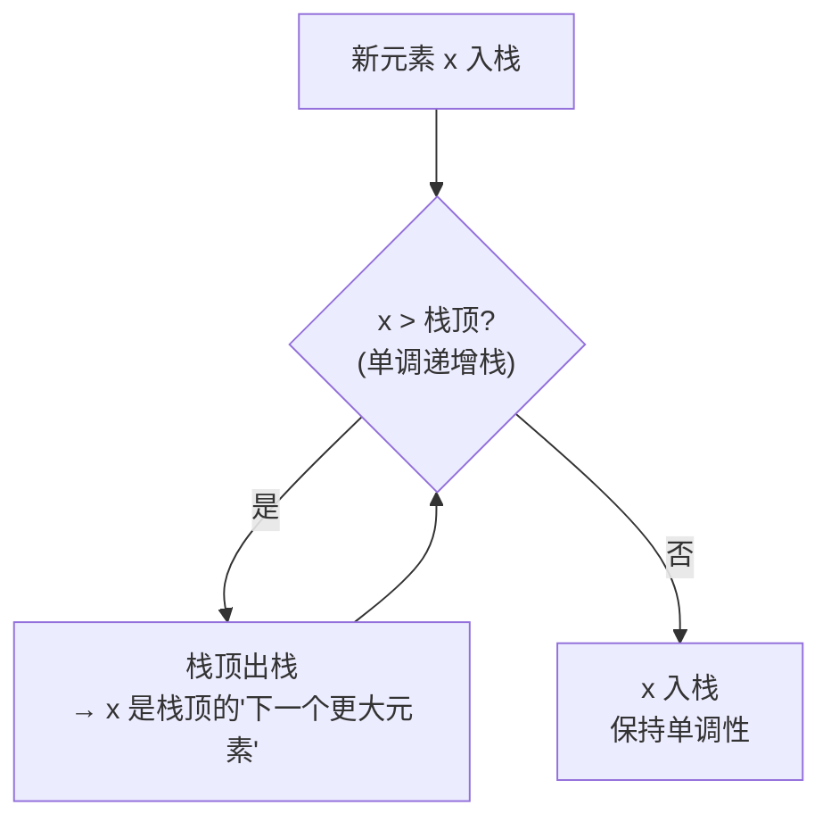
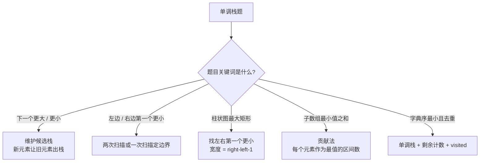

# 单调栈

> 核心一句话：**单调栈是"下一个更大/更小元素"问题的标准解法 — 栈内元素保持单调递增或递减，新元素破坏单调性时弹出旧元素。**
>
> 规律：「下一个更大 / 更小 / 左边更大 / 右边更小」→ 单调栈

---

## 🎯 经典 LeetCode 题目

| #   | 题号                                                                   | 题目                   | 难度 | 核心考点           | 推荐指数 |
| --- | ---------------------------------------------------------------------- | ---------------------- | :--: | ------------------ | :------: |
| 1   | [496](https://leetcode.cn/problems/next-greater-element-i/)            | 下一个更大元素 I       |  🟢  | 单调栈模板         |    ⭐    |
| 2   | [503](https://leetcode.cn/problems/next-greater-element-ii/)           | 下一个更大元素 II      |  🟡  | 环形数组 + 单调栈  |   ⭐⭐   |
| 3   | [739](https://leetcode.cn/problems/daily-temperatures/)                | 每日温度               |  🟡  | 单调栈存索引       |    ⭐    |
| 4   | [1019](https://leetcode.cn/problems/next-greater-node-in-linked-list/) | 链表中的下一个更大节点 |  🟡  | 链表 + 单调栈      |   ⭐⭐   |
| 5   | [84](https://leetcode.cn/problems/largest-rectangle-in-histogram/)     | 柱状图中最大的矩形     |  🔴  | 单调栈（左右扩展） |  ⭐⭐⭐  |
| 6   | [42](https://leetcode.cn/problems/trapping-rain-water/)                | 接雨水                 |  🔴  | 单调栈 / 双指针    |  ⭐⭐⭐  |
| 7   | [901](https://leetcode.cn/problems/online-stock-span/)                 | 股票价格跨度           |  🟡  | 单调栈存跨度       |   ⭐⭐   |
| 8   | [907](https://leetcode.cn/problems/sum-of-subarray-minimums/)          | 子数组的最小值之和     |  🟡  | 单调栈 + 贡献法    |  ⭐⭐⭐  |
| 9   | [316](https://leetcode.cn/problems/remove-duplicate-letters/)          | 去除重复字母           |  🟡  | 单调栈 + 贪心      |  ⭐⭐⭐  |

---

## 📋 目录

1. [核心规律](#-核心规律)
2. [单调栈模板](#-单调栈模板)
3. [问题一：下一个更大元素](#-问题一下一个更大元素)
4. [问题二：每日温度（存索引）](#-问题二每日温度存索引)
5. [问题三：环形数组处理](#-问题三环形数组处理)
6. [复杂度速查表](#-复杂度速查表)
7. [刷题建议](#-刷题建议)

---

## 🧠 核心规律





```
相邻问题 → 单调栈（下一个更大/更小元素）
区间最值 → 单调栈（左右扩展确定范围）
贡献计算 → 单调栈（每个元素作为最值被使用的次数）
```

---

## 📐 单调栈模板

```typescript
// monotonic-stack-template.ts
/**
 * 单调栈通用模板 — 找下一个更大元素
 *
 * 原理：从右向左遍历，维护一个单调递减栈
 *       栈顶元素比当前元素小 → 弹出（小值不配做大值的"下一个更大"）
 *       栈顶元素比当前元素大 → 它就是当前元素的"下一个更大元素"
 */
function nextGreaterElementTemplate(nums: number[]): number[] {
  const n = nums.length;
  const result: number[] = new Array(n);
  const stack: number[] = []; // 单调递减栈

  // 倒着遍历（从后往前），是因为"下一个更大"在右边
  // 从右向左遍历，右边元素已经入栈了，可以快速定位
  for (let i = n - 1; i >= 0; i--) {
    // 栈顶元素比当前小 → 弹出（小值不会成为前面元素的"下一个更大"）
    while (stack.length > 0 && stack[stack.length - 1] <= nums[i]) {
      stack.pop();
    }

    // 栈顶就是当前元素的"下一个更大元素"
    result[i] = stack.length > 0 ? stack[stack.length - 1] : -1;

    // 当前元素入栈
    stack.push(nums[i]);
  }

  return result;
}

// --- 测试 ---
console.log(nextGreaterElementTemplate([2, 1, 2, 4, 3])); // [4, 2, 4, -1, -1]
```

---

## 🔢 问题一：下一个更大元素

> [496. 下一个更大元素 I](https://leetcode.cn/problems/next-greater-element-i/)

```typescript
// next-greater-element.ts
/**
 * 496. 下一个更大元素 I
 *
 * 思路：用单调栈预处理 nums2 中每个元素的下一个更大元素
 *       存到 Map 中，然后查表
 */
function nextGreaterElement(nums1: number[], nums2: number[]): number[] {
  const map = new Map<number, number>();
  const stack: number[] = [];

  // 遍历 nums2，用单调栈找每个元素的下一个更大
  for (let i = nums2.length - 1; i >= 0; i--) {
    while (stack.length > 0 && stack[stack.length - 1] <= nums2[i]) {
      stack.pop();
    }
    map.set(nums2[i], stack.length > 0 ? stack[stack.length - 1] : -1);
    stack.push(nums2[i]);
  }

  // 查表返回结果
  return nums1.map((n) => map.get(n)!);
}

// --- 测试 ---
console.log(nextGreaterElement([4, 1, 2], [1, 3, 4, 2])); // [-1, 3, -1]
```

---

## 🔢 问题二：每日温度（存索引）

> [739. 每日温度](https://leetcode.cn/problems/daily-temperatures/)
> 求每个温度之后第几天会遇到更高的温度

```typescript
// daily-temperatures.ts
/**
 * 739. 每日温度
 *
 * 和下一个更大元素的区别：存索引而不是值
 * 结果 = 索引差（天数）
 */
function dailyTemperatures(temperatures: number[]): number[] {
  const n = temperatures.length;
  const result: number[] = new Array(n).fill(0);
  const stack: number[] = []; // 存索引，保持温度递减

  for (let i = n - 1; i >= 0; i--) {
    // 栈顶温度 ≤ 当前温度 → 弹出（不够热）
    while (stack.length > 0 && temperatures[stack[stack.length - 1]] <= temperatures[i]) {
      stack.pop();
    }

    // 栈顶索引 - 当前索引 = 需要等几天
    result[i] = stack.length > 0 ? stack[stack.length - 1] - i : 0;

    stack.push(i);
  }

  return result;
}

// --- 测试 ---
console.log(dailyTemperatures([73, 74, 75, 71, 69, 72, 76, 73]));
// [1, 1, 4, 2, 1, 1, 0, 0]
```

---

## 🔢 问题三：环形数组处理

> [503. 下一个更大元素 II](https://leetcode.cn/problems/next-greater-element-ii/)
> 数组是环形的，最后一个元素可以绕到开头找更大值

```typescript
// next-greater-element-ii.ts
/**
 * 503. 下一个更大元素 II — 环形数组
 *
 * 技巧：数组长度翻倍（虚拟），i 从 2n-1 遍历到 0
 *       用 i % n 访问实际元素
 */
function nextGreaterElements(nums: number[]): number[] {
  const n = nums.length;
  const result: number[] = new Array(n);
  const stack: number[] = [];

  // 假装数组长度翻倍了，从 2n-1 遍历到 0
  for (let i = 2 * n - 1; i >= 0; i--) {
    const idx = i % n;

    while (stack.length > 0 && stack[stack.length - 1] <= nums[idx]) {
      stack.pop();
    }

    // 只在 i < n 时记录结果（避免重复）
    if (i < n) {
      result[idx] = stack.length > 0 ? stack[stack.length - 1] : -1;
    }

    stack.push(nums[idx]);
  }

  return result;
}

// --- 测试 ---
console.log(nextGreaterElements([2, 1, 2, 4, 3])); // [4, 2, 4, -1, 4]
```

---

## 📊 复杂度速查表

| 问题              | 时间复杂度 | 空间复杂度 | 关键点            |
| ----------------- | :--------: | :--------: | ----------------- |
| 496 下一个更大 I  |   O(n+m)   |    O(n)    | 单调栈 + Map 查询 |
| 503 下一个更大 II |    O(n)    |    O(n)    | 数组翻倍技巧      |
| 739 每日温度      |    O(n)    |    O(n)    | 栈存索引          |
| 84 最大矩形       |    O(n)    |    O(n)    | 左右各一次单调栈  |
| 42 接雨水         |    O(n)    |    O(n)    | 单调递减栈        |
| 907 子数组最小值  |    O(n)    |    O(n)    | 贡献法            |

---

## 🎯 刷题建议

### 自查清单

```
[ ] 找的是下一个更大还是更小元素？（决定栈的单调性）
[ ] 栈里存的是值还是索引？
[ ] 数组是环形的吗？（翻倍技巧）
[ ] 是正向遍历还是反向遍历？
[ ] 单调递增还是递减？
```

---

## 💪 白板挑战

```typescript
// 496. 下一个更大元素
function nextGreaterElement(nums1: number[], nums2: number[]): number[] {}

// 739. 每日温度
function dailyTemperatures(temperatures: number[]): number[] {}
```

---

> **关联阅读：** `16-sliding-window.md` → `21-n-sum-problems.md` → `22-palindrome-and-string-techniques.md`
