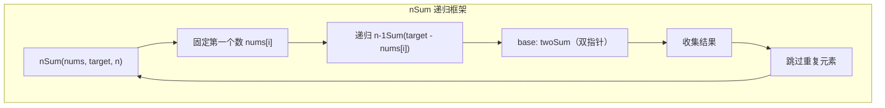

# nSum 问题（两数之和 → 三数之和 → 四数之和）

> 核心一句话：**nSum 问题统一解法：排序 + 固定 n-2 个数 + 双指针夹逼最后两个数。框架递归，从 highSum 递归到 twoSum。**
>
> 规律：「求和 / combo / 分界」→ 排序 + 双指针，「去重」→ 跳过重复元素

---

## 🎯 经典 LeetCode 题目

> 以下题目全部来自 `leetcode-questions-summary.md`「多指针 / 和差问题」分类

| #   | 题号                                                                   | 题目              | 难度 | 核心考点          | 推荐指数 |
| --- | ---------------------------------------------------------------------- | ----------------- | :--: | ----------------- | :------: |
| 1   | [1](https://leetcode.cn/problems/two-sum/)                             | 两数之和          |  🟢  | 哈希表 / 双指针   |    ⭐    |
| 2   | [167](https://leetcode.cn/problems/two-sum-ii-input-array-is-sorted/)  | 两数之和 II       |  🟢  | 有序数组双指针    |    ⭐    |
| 3   | [15](https://leetcode.cn/problems/3sum/)                               | 三数之和          |  🟡  | 固定一个 + 双指针 |   ⭐⭐   |
| 4   | [18](https://leetcode.cn/problems/4sum/)                               | 四数之和          |  🟡  | 固定两个 + 双指针 |   ⭐⭐   |
| 5   | [170](https://leetcode.cn/problems/two-sum-iii-data-structure-design/) | 两数之和 III      |  🟢  | 哈希表设计        |    ⭐    |
| 6   | [653](https://leetcode.cn/problems/two-sum-iv-input-is-a-bst/)         | 两数之和 IV       |  🟢  | BST + 哈希集      |    ⭐    |
| 7   | [1099](https://leetcode.cn/problems/two-sum-less-than-k/)              | 小于 K 的两数之和 |  🟢  | 排序 + 双指针     |   ⭐⭐   |
| 8   | [259](https://leetcode.cn/problems/3sum-smaller/)                      | 较小的三数之和    |  🟡  | 排序 + 双指针计数 |   ⭐⭐   |

---

## 📋 目录

1. [核心规律](#-核心规律)
2. [nSum 递归统一框架](#-nsum-递归统一框架)
3. [问题一：两数之和（有序 + 双指针）](#-问题一两数之和有序--双指针)
4. [问题二：三数之和（去重版本）](#-问题二三数之和去重版本)
5. [问题三：四数之和](#-问题三四数之和)
6. [复杂度速查表](#-复杂度速查表)
7. [刷题建议](#-刷题建议)

---

## 🧠 核心规律

```
"两数之和" → 哈希表 / 排序双指针
"三数之和" → 排序 + 固定一个 + 双指针
"四数之和" → 排序 + 固定两个 + 双指针
"n数之和"  → 递归：nSum → (n-1)Sum → ... → 2Sum
```



---

## 📐 nSum 递归统一框架

```typescript
// nsum-template.ts
/**
 * nSum 通用递归框架
 *
 * 思路：
 *   1. 先排序
 *   2. 递归：固定一个数 → 找 (n-1)Sum
 *   3. base case: twoSum 用双指针
 *   4. 结果去重：跳过相同元素
 *
 * 时间复杂度 O(n^(k-1))  空间复杂度 O(n)
 */
function nSum(nums: number[], target: number, n: number): number[][] {
  nums.sort((a, b) => a - b);
  return nSumSorted(nums, target, n, 0);
}

function nSumSorted(nums: number[], target: number, n: number, start: number): number[][] {
  const result: number[][] = [];

  // base case: twoSum — 双指针
  if (n === 2) {
    let left = start;
    let right = nums.length - 1;

    while (left < right) {
      const sum = nums[left] + nums[right];

      if (sum < target) {
        left++;
      } else if (sum > target) {
        right--;
      } else {
        result.push([nums[left], nums[right]]);

        // 去重
        while (left < right && nums[left] === nums[left + 1]) left++;
        while (left < right && nums[right] === nums[right - 1]) right--;
        left++;
        right--;
      }
    }

    return result;
  }

  // 递归：固定一个数，找 (n-1)Sum
  for (let i = start; i < nums.length; i++) {
    // 跳过重复的固定数
    if (i > start && nums[i] === nums[i - 1]) continue;

    // 剪枝：剩余元素不够凑 n 个数
    if (nums.length - i < n) break;

    // 剪枝：最小的 n 个数之和已经 > target
    if (i + n - 1 < nums.length) {
      let minSum = nums[i];
      for (let j = 1; j < n; j++) minSum += nums[i + j];
      if (minSum > target) break;
    }

    // 递归找 (n-1)Sum
    const subResults = nSumSorted(nums, target - nums[i], n - 1, i + 1);

    // 把当前固定数加到子结果前面
    for (const sub of subResults) {
      result.push([nums[i], ...sub]);
    }
  }

  return result;
}

// --- 测试 ---
console.log(nSum([1, 0, -1, 0, -2, 2], 0, 4));
// [[-2,-1,1,2],[-2,0,0,2],[-1,0,0,1]]
```

---

## 🔢 问题一：两数之和（有序 + 双指针）

> [167. 两数之和 II](https://leetcode.cn/problems/two-sum-ii-input-array-is-sorted/)
> 有序数组，找两个数使和 = target

```typescript
// two-sum-ii.ts
/**
 * 167. 两数之和 II — 有序数组双指针
 *
 * 思路：left 指向开头，right 指向结尾
 *       sum > target → right--（减小和）
 *       sum < target → left++（增大和）
 *
 * 时间复杂度 O(n)  空间复杂度 O(1)
 */
function twoSum(numbers: number[], target: number): number[] {
  let left = 0;
  let right = numbers.length - 1;

  while (left < right) {
    const sum = numbers[left] + numbers[right];

    if (sum === target) {
      return [left + 1, right + 1]; // 题目要求从 1 开始
    } else if (sum < target) {
      left++;
    } else {
      right--;
    }
  }

  return [-1, -1];
}

// --- 测试 ---
console.log(twoSum([2, 7, 11, 15], 9)); // [1, 2]
```

---

## 🔢 问题二：三数之和（去重版本）

> [15. 三数之和](https://leetcode.cn/problems/3sum/)
> 找出所有和为 0 且不重复的三元组

```typescript
// three-sum.ts
/**
 * 15. 三数之和 — 排序 + 固定一个 + 双指针
 *
 * 去重关键：
 *   1. 固定数去重：if (i > 0 && nums[i] === nums[i-1]) continue
 *   2. 双指针去重：找到一个结果后，跳过相同元素
 */
function threeSum(nums: number[]): number[][] {
  nums.sort((a, b) => a - b);
  const result: number[][] = [];

  for (let i = 0; i < nums.length - 2; i++) {
    // 去重：固定数
    if (i > 0 && nums[i] === nums[i - 1]) continue;

    let left = i + 1;
    let right = nums.length - 1;

    while (left < right) {
      const sum = nums[i] + nums[left] + nums[right];

      if (sum < 0) {
        left++;
      } else if (sum > 0) {
        right--;
      } else {
        result.push([nums[i], nums[left], nums[right]]);

        // 去重：跳过相同元素
        while (left < right && nums[left] === nums[left + 1]) left++;
        while (left < right && nums[right] === nums[right - 1]) right--;

        left++;
        right--;
      }
    }
  }

  return result;
}

// --- 测试 ---
console.log(threeSum([-1, 0, 1, 2, -1, -4]));
// [[-1, -1, 2], [-1, 0, 1]]
```

---

## 🔢 问题三：四数之和

> [18. 四数之和](https://leetcode.cn/problems/4sum/)

```typescript
// four-sum.ts
/**
 * 18. 四数之和
 *
 * 思路：两层固定 + 双指针
 *       i 从 0 遍历，j 从 i+1 遍历
 *       内部用双指针找剩下的两个数
 */
function fourSum(nums: number[], target: number): number[][] {
  nums.sort((a, b) => a - b);
  const result: number[][] = [];
  const n = nums.length;

  for (let i = 0; i < n - 3; i++) {
    if (i > 0 && nums[i] === nums[i - 1]) continue; // 去重

    for (let j = i + 1; j < n - 2; j++) {
      if (j > i + 1 && nums[j] === nums[j - 1]) continue; // 去重

      let left = j + 1;
      let right = n - 1;

      while (left < right) {
        const sum = nums[i] + nums[j] + nums[left] + nums[right];

        if (sum < target) {
          left++;
        } else if (sum > target) {
          right--;
        } else {
          result.push([nums[i], nums[j], nums[left], nums[right]]);

          while (left < right && nums[left] === nums[left + 1]) left++;
          while (left < right && nums[right] === nums[right - 1]) right--;

          left++;
          right--;
        }
      }
    }
  }

  return result;
}
```

---

## 📊 复杂度速查表

| 问题               | 时间复杂度 | 空间复杂度 | 关键点是          |
| ------------------ | :--------: | :--------: | ----------------- |
| 两数之和（哈希）   |    O(n)    |    O(n)    | 哈希表存补数      |
| 两数之和（双指针） | O(n log n) |    O(1)    | 需要先排序        |
| 三数之和           |   O(n²)    |    O(1)    | 固定 + 双指针     |
| 四数之和           |   O(n³)    |    O(1)    | 双层固定 + 双指针 |
| nSum 通用框架      | O(n^(k-1)) |    O(n)    | 递归到 twoSum     |

---

## 🎯 刷题建议

### 自查清单

```
[ ] 先排序了吗？
[ ] 固定数的去重加了吗？（i > start && nums[i] === nums[i-1]）
[ ] 双指针的去重加了吗？（找到结果后跳过相同元素）
[ ] 剪枝加了没？（最小和 > target 提前结束）
[ ] twoSum 用的是什么方法？（哈希 / 双指针取决于是否有序）
```

---

## 💪 白板挑战

```typescript
// 15. 三数之和
function threeSum(nums: number[]): number[][] {}
```

---

> **关联阅读：** `14-two-pointers.md` → `19-prefix-sum-and-diff-array.md` → `21-palindrome-and-string-techniques.md`
