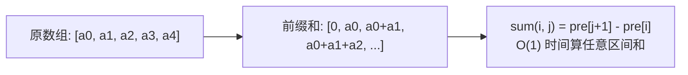
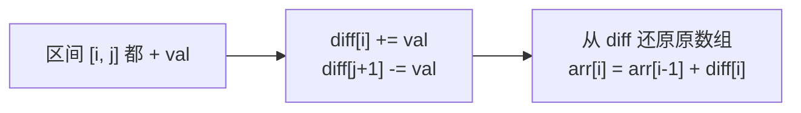

# 前缀和与差分数组

> 核心一句话：**前缀和是"区间求和"的 O(1) 查询工具，差分数组是"区间增减"的 O(1) 更新工具。一个求静态区间和，一个做批量区间修改。**
>
> 规律：「子数组和 / 区间求和」→ 前缀和，「区间内每个数都 +val」→ 差分数组

---

## 🎯 经典 LeetCode 题目

> 以下题目来自 `leetcode-questions-summary.md`「多指针 / 前项和」和「多指针 / 数组」分类

| #   | 题号                                                                    | 题目                    | 难度 | 核心考点             | 推荐指数 |
| --- | ----------------------------------------------------------------------- | ----------------------- | :--: | -------------------- | :------: |
| 1   | [303](https://leetcode.cn/problems/range-sum-query-immutable/)          | 区域和检索 - 数组不可变 |  🟢  | 前缀和模板           |    ⭐    |
| 2   | [560](https://leetcode.cn/problems/subarray-sum-equals-k/)              | 和为 K 的子数组         |  🟡  | 前缀和 + 哈希表      |   ⭐⭐   |
| 3   | [325](https://leetcode.cn/problems/maximum-size-subarray-sum-equals-k/) | 和为 K 的最长子数组     |  🟡  | 前缀和 + 存最早下标  |  ⭐⭐⭐  |
| 4   | [528](https://leetcode.cn/problems/random-pick-with-weight/)            | 按权重随机选择          |  🟡  | 前缀和 + 二分搜索    |  ⭐⭐⭐  |
| 5   | [238](https://leetcode.cn/problems/product-of-array-except-self/)       | 除自身以外数组的乘积    |  🟡  | 前缀积 + 后缀积      |   ⭐⭐   |
| 6   | [53](https://leetcode.cn/problems/maximum-subarray/)                    | 最大子数组和            |  🟡  | Kadane（前缀和最值） |    ⭐    |
| 7   | [1109](https://leetcode.cn/problems/corporate-flight-bookings/)         | 航班预订统计            |  🟡  | 差分数组模板         |   ⭐⭐   |
| 8   | [1094](https://leetcode.cn/problems/car-pooling/)                       | 拼车                    |  🟡  | 差分数组             |   ⭐⭐   |

---

## 📋 目录

1. [前缀和核心思想](#-前缀和核心思想)
2. [问题一：一维前缀和模板](#-问题一一维前缀和模板)
3. [问题二：和为 K 的子数组](#-问题二和为-k-的子数组)
4. [问题三：前缀积（除自身以外）](#-问题三前缀积除自身以外)
5. [差分数组核心思想](#-差分数组核心思想)
6. [问题四：航班预订统计（差分模板）](#-问题四航班预订统计差分模板)
7. [复杂度速查表](#-复杂度速查表)
8. [刷题建议](#-刷题建议)

---

## 🧠 前缀和核心思想



```
pre[0] = 0
pre[i] = nums[0] + nums[1] + ... + nums[i-1]    (i 从 1 开始)

sum(i, j) = pre[j+1] - pre[i]   ← O(1) 区间和查询
```

---

## 📐 问题一：一维前缀和模板

> [303. 区域和检索 - 数组不可变](https://leetcode.cn/problems/range-sum-query-immutable/)

```typescript
// prefix-sum-template.ts
/**
 * 前缀和模板
 *
 * pre[i] = nums[0..i-1] 的和
 * sum(i, j) = pre[j+1] - pre[i]
 */
class NumArray {
  private pre: number[];

  constructor(nums: number[]) {
    this.pre = new Array(nums.length + 1).fill(0);
    for (let i = 0; i < nums.length; i++) {
      this.pre[i + 1] = this.pre[i] + nums[i];
    }
  }

  /** 查询 [left, right] 的区间和 */
  sumRange(left: number, right: number): number {
    return this.pre[right + 1] - this.pre[left];
  }
}

// --- 测试 ---
const arr = new NumArray([-2, 0, 3, -5, 2, -1]);
console.log(arr.sumRange(0, 2)); // 1  (-2 + 0 + 3)
console.log(arr.sumRange(2, 5)); // -1 (3 + (-5) + 2 + (-1))
```

---

## 🔢 问题二：和为 K 的子数组

> [560. 和为 K 的子数组](https://leetcode.cn/problems/subarray-sum-equals-k/)

```typescript
// subarray-sum-equals-k.ts
/**
 * 560. 和为 K 的子数组
 *
 * 思路：遍历数组时计算前缀和 pre
 *       用 Map 记录每个前缀和出现的次数
 *       当 pre - k 存在于 Map 中时，说明有子数组和为 k
 *
 * 时间复杂度 O(n)  空间复杂度 O(n)
 */
function subarraySum(nums: number[], k: number): number {
  const map = new Map<number, number>();
  map.set(0, 1); // 前缀和为 0 出现 1 次（空数组）

  let pre = 0;
  let count = 0;

  for (const num of nums) {
    pre += num;

    // pre - k 出现过 → 说明中间有一段和为 k
    if (map.has(pre - k)) {
      count += map.get(pre - k)!;
    }

    map.set(pre, (map.get(pre) || 0) + 1);
  }

  return count;
}

// --- 测试 ---
console.log(subarraySum([1, 1, 1], 2)); // 2 ([1,1] 和 [1,1])
console.log(subarraySum([1, 2, 3], 3)); // 2 ([1,2], [3])
```

---

## 🔢 问题三：前缀积（除自身以外）

> [238. 除自身以外数组的乘积](https://leetcode.cn/problems/product-of-array-except-self/)
> 不能使用除法

```typescript
// product-of-array-except-self.ts
/**
 * 238. 除自身以外数组的乘积
 *
 * 思路：每个位置的结果 = 左边所有数的乘积 × 右边所有数的乘积
 *       先算前缀积，再算后缀积
 *
 * 时间复杂度 O(n)  空间复杂度 O(1)（不算输出数组）
 */
function productExceptSelf(nums: number[]): number[] {
  const n = nums.length;
  const result: number[] = new Array(n).fill(1);

  // ① 算每个位置左边的乘积
  let left = 1;
  for (let i = 0; i < n; i++) {
    result[i] = left; // result[i] = 左边乘积
    left *= nums[i]; // 更新左边乘积
  }

  // ② 乘上右边的乘积
  let right = 1;
  for (let i = n - 1; i >= 0; i--) {
    result[i] *= right; // result[i] = 左边 × 右边
    right *= nums[i]; // 更新右边乘积
  }

  return result;
}

// --- 测试 ---
console.log(productExceptSelf([1, 2, 3, 4])); // [24, 12, 8, 6]
```

---

## 🧠 差分数组核心思想



```
差分数组 diff 的定义：
  diff[i] = nums[i] - nums[i-1]  (i ≥ 1)
  diff[0] = nums[0]

区间 [i, j] 全部 + val：
  diff[i] += val
  diff[j+1] -= val

还原数组：
  nums[i] = nums[i-1] + diff[i]
```

---

## 🔢 问题四：航班预订统计（差分模板）

> [1109. 航班预订统计](https://leetcode.cn/problems/corporate-flight-bookings/)

```typescript
// corporate-flight-bookings.ts
/**
 * 1109. 航班预订统计 — 差分数组模板
 *
 * 输入：bookings = [[1,2,10], [2,3,20], [2,5,25]], n = 5
 * 输出：[10, 55, 45, 25, 25]
 *
 * 解释：
 *   航班 1: 10
 *   航班 2: 10+20+25 = 55
 *   航班 3: 20+25 = 45
 *   航班 4: 25
 *   航班 5: 25
 */
function corpFlightBookings(bookings: number[][], n: number): number[] {
  const diff: number[] = new Array(n + 1).fill(0); // n+1 为了越界安全

  // ① 构建差分数组
  for (const [first, last, seats] of bookings) {
    diff[first - 1] += seats; // 起始航班 + seats（⚠️ 题目从 1 开始）
    diff[last] -= seats; // 结束航班的下一个 -seats
  }

  // ② 还原结果
  const result: number[] = new Array(n);
  result[0] = diff[0];
  for (let i = 1; i < n; i++) {
    result[i] = result[i - 1] + diff[i];
  }

  return result;
}

// --- 测试 ---
console.log(
  corpFlightBookings(
    [
      [1, 2, 10],
      [2, 3, 20],
      [2, 5, 25],
    ],
    5
  )
);
// [10, 55, 45, 25, 25]
```

---

## 📊 复杂度速查表

| 问题             |        时间复杂度         | 空间复杂度 | 核心思路        |
| ---------------- | :-----------------------: | :--------: | --------------- |
| 303 区域和       |   O(n) 构建 / O(1) 查询   |    O(n)    | 前缀和模板      |
| 560 和为 K       |           O(n)            |    O(n)    | 前缀和 + 哈希表 |
| 238 除自身外乘积 |           O(n)            |    O(1)    | 前缀积 × 后缀积 |
| 528 权重随机     | O(n) 构建 / O(log n) 查询 |    O(n)    | 前缀和 + 二分   |
| 1109 航班        |          O(n+m)           |    O(n)    | 差分数组        |
| 1094 拼车        |          O(n+m)           |    O(n)    | 差分数组        |

---

## 🎯 刷题建议

### 模式识别

```
"区间求和 / 子数组和"        → 前缀和
"区间每个数都 +val"          → 差分数组
"连续子数组 / 和为 K / 乘积" → 前缀和 + 哈希表
"不能使用除法求乘积"          → 前缀积 × 后缀积
```

### 自查清单

```
[ ] 是前缀和还是差分数组？
[ ] 前缀和 pre[0] 初始化为 0 了吗？
[ ] Map 里存的是什么？（次数/最早下标/最晚下标）
[ ] 差分数组的长度是 n+1 吗？（防止越界）
[ ] 差分还原时是从左到右累加吗？
```

---

## 💪 白板挑战

```typescript
// 303. 前缀和
class NumArray {
  constructor(nums: number[]) {}

  sumRange(left: number, right: number): number {}
}

// 560. 和为 K
function subarraySum(nums: number[], k: number): number {}
```

---

> **关联阅读：** `16-sliding-window.md` → `21-n-sum-problems.md` → `22-palindrome-and-string-techniques.md`
