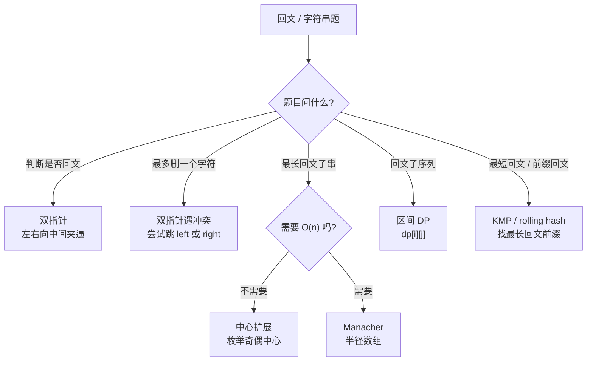
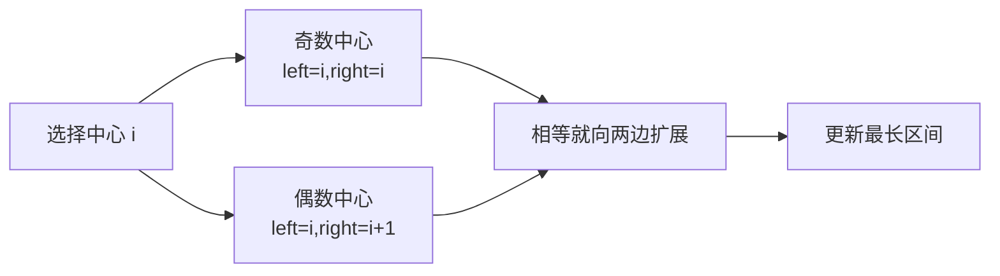

# 回文串与字符串技巧

> 核心一句话：**回文串问题两大解法：中心扩展（O(n²)）和 Manacher（O(n)）。字符串匹配双指针 + 哈希表是万能组合。**

---

## 🗺️ 回文题型决策图



## 🔍 中心扩展流程



---

## 🎯 经典 LeetCode 题目

| #   | 题号                                                                 | 题目                   | 难度 | 核心考点            | 推荐指数 |
| --- | -------------------------------------------------------------------- | ---------------------- | :--: | ------------------- | :------: |
| 1   | [5](https://leetcode.cn/problems/longest-palindromic-substring/)     | 最长回文子串           |  🟡  | 中心扩展 / Manacher |    ⭐    |
| 2   | [125](https://leetcode.cn/problems/valid-palindrome/)                | 验证回文串             |  🟢  | 双指针              |    ⭐    |
| 3   | [345](https://leetcode.cn/problems/reverse-vowels-of-a-string/)      | 反转字符串中的元音字母 |  🟢  | 双指针              |    ⭐    |
| 4   | [680](https://leetcode.cn/problems/valid-palindrome-ii/)             | 验证回文串 II          |  🟢  | 最多跳过一个字符    |   ⭐⭐   |
| 5   | [516](https://leetcode.cn/problems/longest-palindromic-subsequence/) | 最长回文子序列         |  🟡  | 区间 DP             |  ⭐⭐⭐  |
| 6   | [647](https://leetcode.cn/problems/palindromic-substrings/)          | 回文子串               |  🟡  | 中心扩展 / Manacher |   ⭐⭐   |
| 7   | [214](https://leetcode.cn/problems/shortest-palindrome/)             | 最短回文串             |  🔴  | KMP / 双指针        |  ⭐⭐⭐  |

### 字符串基础

| #   | 题号                                                           | 题目               | 难度 | 核心考点            | 推荐指数 |
| --- | -------------------------------------------------------------- | ------------------ | :--: | ------------------- | :------: |
| 8   | [13](https://leetcode.cn/problems/roman-to-integer/)           | 罗马数字转整数     |  🟢  | 哈希映射 + 特殊情况 |    ⭐    |
| 9   | [14](https://leetcode.cn/problems/longest-common-prefix/)      | 最长公共前缀       |  🟢  | 纵向扫描            |    ⭐    |
| 10  | [43](https://leetcode.cn/problems/multiply-strings/)           | 字符串相乘         |  🟡  | 竖式模拟            |   ⭐⭐   |
| 11  | [151](https://leetcode.cn/problems/reverse-words-in-a-string/) | 反转字符串中的单词 |  🟡  | 双端队列 / 原地反转 |   ⭐⭐   |

---

## 📐 中心扩展模板

```typescript
// longest-palindromic-substring.ts
/**
 * 5. 最长回文子串 — 中心扩展
 * 时间复杂度 O(n²)  空间复杂度 O(1)
 */
function longestPalindrome(s: string): string {
  let start = 0,
    maxLen = 0;

  for (let i = 0; i < s.length; i++) {
    // 奇数长度回文（中心是一个字符）
    expandAroundCenter(s, i, i);
    // 偶数长度回文（中心是两个字符之间）
    expandAroundCenter(s, i, i + 1);
  }

  function expandAroundCenter(s: string, left: number, right: number): void {
    while (left >= 0 && right < s.length && s[left] === s[right]) {
      if (right - left + 1 > maxLen) {
        start = left;
        maxLen = right - left + 1;
      }
      left--;
      right++;
    }
  }

  return s.substring(start, start + maxLen);
}
```

```python
def longest_palindrome(s: str) -> str:
    start = 0
    max_len = 0

    def expand(left: int, right: int) -> None:
        nonlocal start, max_len
        while left >= 0 and right < len(s) and s[left] == s[right]:
            if right - left + 1 > max_len:
                start = left
                max_len = right - left + 1
            left -= 1
            right += 1

    for i in range(len(s)):
        expand(i, i)
        expand(i, i + 1)

    return s[start:start + max_len]
```

## 🔢 验证回文串 II

```typescript
function validPalindrome(s: string): boolean {
  function isPal(left: number, right: number): boolean {
    while (left < right) {
      if (s[left++] !== s[right--]) return false;
    }
    return true;
  }

  let left = 0;
  let right = s.length - 1;
  while (left < right) {
    if (s[left] !== s[right]) {
      return isPal(left + 1, right) || isPal(left, right - 1);
    }
    left++;
    right--;
  }
  return true;
}
```

```python
def valid_palindrome(s: str) -> bool:
    def is_pal(left: int, right: int) -> bool:
        while left < right:
            if s[left] != s[right]:
                return False
            left += 1
            right -= 1
        return True

    left, right = 0, len(s) - 1
    while left < right:
        if s[left] != s[right]:
            return is_pal(left + 1, right) or is_pal(left, right - 1)
        left += 1
        right -= 1
    return True
```

## 🎯 易错点

```
[ ] 回文子串是连续的，回文子序列可以不连续。
[ ] 中心扩展要枚举奇数中心和偶数中心。
[ ] 最多删除一个字符时，只在第一次冲突处分两种情况。
[ ] 区间 DP 通常按长度从短到长枚举。
```

---

> **关联阅读：** `15-two-pointers.md` → `21-n-sum-problems.md`
