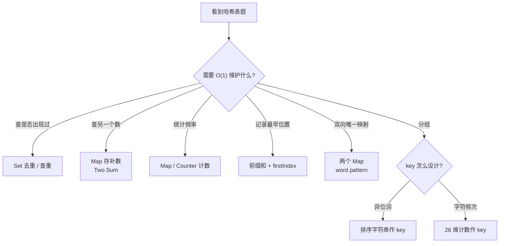

# 哈希表技巧

> 核心一句话：**哈希表是"以空间换时间"的经典工具，核心用于 O(1) 查重、计数、索引映射。**
>
> 规律：「查重 / 计数 / 存补数」→ 哈希表

---

## 🗺️ 哈希表模式决策图



---

## 🎯 经典 LeetCode 题目

| #   | 题号                                                               | 题目                             | 难度 | 核心考点          | 推荐指数 |
| --- | ------------------------------------------------------------------ | -------------------------------- | :--: | ----------------- | :------: |
| 1   | [1](https://leetcode.cn/problems/two-sum/)                         | 两数之和                         |  🟢  | 存补数 ✅         |    ⭐    |
| 2   | [49](https://leetcode.cn/problems/group-anagrams/)                 | 字母异位词分组                   |  🟡  | 排序/计数作为 key |   ⭐⭐   |
| 3   | [128](https://leetcode.cn/problems/longest-consecutive-sequence/)  | 最长连续序列                     |  🟡  | Set 查前后        |   ⭐⭐   |
| 4   | [136](https://leetcode.cn/problems/single-number/)                 | 只出现一次的数字                 |  🟢  | 异或 / 哈希       |    ⭐    |
| 5   | [290](https://leetcode.cn/problems/word-pattern/)                  | 单词规律                         |  🟢  | 双向映射          |    ⭐    |
| 6   | [347](https://leetcode.cn/problems/top-k-frequent-elements/)       | 前K个高频元素                    |  🟡  | 哈希+桶/堆        |   ⭐⭐   |
| 7   | [380](https://leetcode.cn/problems/insert-delete-getrandom-o1/)    | O(1)时间插入、删除和获取随机元素 |  🟡  | 哈希+数组         |  ⭐⭐⭐  |
| 8   | [560](https://leetcode.cn/problems/subarray-sum-equals-k/)         | 和为 K 的子数组                  |  🟡  | 前缀和+哈希 ✅    |   ⭐⭐   |
| 9   | [706](https://leetcode.cn/problems/design-hashmap/)                | 设计哈希映射                     |  🟢  | 链地址法          |   ⭐⭐   |
| 10  | [953](https://leetcode.cn/problems/verifying-an-alien-dictionary/) | 验证外星语词典                   |  🟢  | 哈希表存字典序    |   ⭐⭐   |

---

## 📐 哈希表常用模式

```typescript
// ① 两数之和 — 存补数
function twoSum(nums: number[], target: number): number[] {
  const map = new Map<number, number>();
  for (let i = 0; i < nums.length; i++) {
    const complement = target - nums[i];
    if (map.has(complement)) return [map.get(complement)!, i];
    map.set(nums[i], i);
  }
  return [-1, -1];
}

// ② 最长连续序列 — Set 前后查找
function longestConsecutive(nums: number[]): number {
  const set = new Set(nums);
  let maxLen = 0;
  for (const num of set) {
    if (!set.has(num - 1)) {
      // 是连续序列的开头
      let curr = num,
        len = 1;
      while (set.has(curr + 1)) {
        curr++;
        len++;
      }
      maxLen = Math.max(maxLen, len);
    }
  }
  return maxLen;
}

// ③ 字母异位词分组 — 排序后作为 key
function groupAnagrams(strs: string[]): string[][] {
  const map = new Map<string, string[]>();
  for (const s of strs) {
    const key = s.split('').sort().join('');
    map.set(key, [...(map.get(key) || []), s]);
  }
  return [...map.values()];
}
```

```python
# ① 两数之和 — 存补数
def two_sum(nums: list[int], target: int) -> list[int]:
    seen: dict[int, int] = {}
    for i, num in enumerate(nums):
        complement = target - num
        if complement in seen:
            return [seen[complement], i]
        seen[num] = i
    return [-1, -1]


# ② 最长连续序列 — Set 前后查找
def longest_consecutive(nums: list[int]) -> int:
    num_set = set(nums)
    max_len = 0

    for num in num_set:
        if num - 1 not in num_set:
            curr = num
            length = 1
            while curr + 1 in num_set:
                curr += 1
                length += 1
            max_len = max(max_len, length)

    return max_len


# ③ 字母异位词分组 — 排序后作为 key
def group_anagrams(strs: list[str]) -> list[list[str]]:
    groups: dict[str, list[str]] = {}
    for s in strs:
        key = "".join(sorted(s))
        groups.setdefault(key, []).append(s)
    return list(groups.values())
```

## 🧠 Key 设计原则

| 场景 | Key 怎么设计 | 例子 |
|---|---|---|
| 两数之和 | 数值本身 / 补数 | `target - nums[i]` |
| 异位词分组 | 排序字符串或 26 维计数 | `"aet"` / `(1,0,...)` |
| 前缀和统计 | 当前前缀和 | `pre - k` |
| 双向映射 | 两个 Map 同时校验 | word pattern |
| 坐标去重 | 字符串或整数编码 | `"r,c"` / `r * n + c` |

## 🎯 易错点

```
[ ] Map 存的是值、索引、次数，还是最早出现位置？
[ ] 统计子数组数量时，先查 pre-k，再更新当前 pre。
[ ] 分组题的 key 必须能唯一表达“同一类”。
[ ] 双向映射需要同时检查 a->b 和 b->a。
[ ] Set 遍历最长连续序列时，只从 num-1 不存在的起点开始。
```

---

> **关联阅读：** `21-n-sum-problems.md` → `20-prefix-sum-and-diff-array.md`
