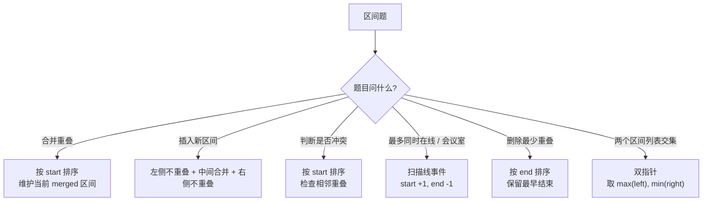
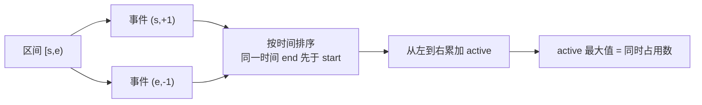

# 区间与扫描线

> 核心一句话：**区间问题统一解法：按起点排序 + 遍历维护当前区间。扫描线是将时间轴事件化：起点+1，终点-1。**

---

## 🗺️ 区间题型决策图



## 🌊 扫描线事件流



---

## 🎯 经典 LeetCode 题目

| #   | 题号                                                                            | 题目         | 难度 | 核心考点        | 推荐指数 |
| --- | ------------------------------------------------------------------------------- | ------------ | :--: | --------------- | :------: |
| 1   | [56](https://leetcode.cn/problems/merge-intervals/)                             | 合并区间     |  🟡  | 排序 + 合并     |    ⭐    |
| 2   | [57](https://leetcode.cn/problems/insert-interval/)                             | 插入区间     |  🟡  | 三段式插入      |   ⭐⭐   |
| 3   | [252](https://leetcode.cn/problems/meeting-rooms/)                              | 会议室       |  🟢  | 排序判重叠      |    ⭐    |
| 4   | [253](https://leetcode.cn/problems/meeting-rooms-ii/)                           | 会议室 II    |  🟡  | 扫描线 / 最小堆 |   ⭐⭐   |
| 5   | [435](https://leetcode.cn/problems/non-overlapping-intervals/)                  | 无重叠区间   |  🟡  | 最早结束优先    |   ⭐⭐   |
| 6   | [452](https://leetcode.cn/problems/minimum-number-of-arrows-to-burst-balloons/) | 气球引爆     |  🟡  | 区间交集        |   ⭐⭐   |
| 7   | [986](https://leetcode.cn/problems/interval-list-intersections/)                | 区间列表交集 |  🟡  | 双指针          |   ⭐⭐   |

---

## 📐 模板

```typescript
// merge-intervals.ts
function merge(intervals: number[][]): number[][] {
  if (intervals.length === 0) return [];
  intervals.sort((a, b) => a[0] - b[0]);

  const result: number[][] = [intervals[0]];

  for (let i = 1; i < intervals.length; i++) {
    const [start, end] = intervals[i];
    const last = result[result.length - 1];

    if (start <= last[1]) {
      last[1] = Math.max(last[1], end); // 重叠 → 合并
    } else {
      result.push([start, end]); // 不重叠 → 直接加入
    }
  }

  return result;
}

// meeting-rooms-ii.ts — 扫描线
function minMeetingRooms(intervals: number[][]): number {
  const events: number[][] = [];
  for (const [start, end] of intervals) {
    events.push([start, 1]); // 开始 → +1
    events.push([end, -1]); // 结束 → -1
  }

  events.sort((a, b) => a[0] - b[0] || a[1] - b[1]);

  let maxRooms = 0,
    curr = 0;
  for (const [, delta] of events) {
    curr += delta;
    maxRooms = Math.max(maxRooms, curr);
  }

  return maxRooms;
}
```

```python
def merge(intervals: list[list[int]]) -> list[list[int]]:
    if not intervals:
        return []
    intervals.sort(key=lambda x: x[0])
    result = [intervals[0]]

    for start, end in intervals[1:]:
        last = result[-1]
        if start <= last[1]:
            last[1] = max(last[1], end)
        else:
            result.append([start, end])

    return result


def min_meeting_rooms(intervals: list[list[int]]) -> int:
    events = []
    for start, end in intervals:
        events.append((start, 1))
        events.append((end, -1))

    events.sort(key=lambda x: (x[0], x[1]))
    curr = max_rooms = 0
    for _, delta in events:
        curr += delta
        max_rooms = max(max_rooms, curr)

    return max_rooms
```

## 🧠 区间排序策略

| 问题 | 排序方式 | 维护什么 |
|---|---|---|
| 合并区间 | start 升序 | 当前合并区间右端点 |
| 插入区间 | 原本有序 | 左侧 / 重叠 / 右侧三段 |
| 无重叠区间 | end 升序 | 已选区间的 end |
| 气球引爆 | end 升序 | 当前箭的位置 |
| 会议室 II | 事件时间升序 | active 会议数 |
| 区间交集 | 两列表各自有序 | 双指针移动较早结束者 |

## 🎯 易错点

```
[ ] 区间是闭区间还是半开区间？会议室通常 [start, end)。
[ ] 扫描线同一时间排序：end(-1) 应该在 start(+1) 前。
[ ] 合并区间用 start 排序，区间调度用 end 排序。
[ ] 判断重叠时确认条件是 start <= lastEnd 还是 start < lastEnd。
```

---

> **关联阅读：** `33-greedy.md` → `15-two-pointers.md`
