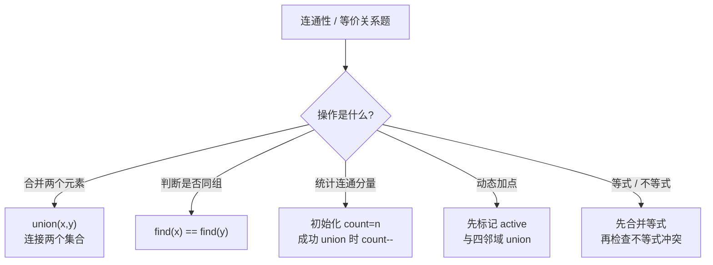
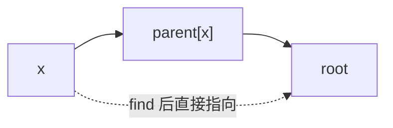

# 并查集 (Union-Find)

> 核心一句话：**并查集解决"连通性"问题 — 合并两个集合，查询两个元素是否连通。优化核心：路径压缩 + 按秩合并。**

---

## 🗺️ 并查集决策图



## 🧬 路径压缩示意



---

## 🎯 经典 LeetCode 题目

| #   | 题号                                                                                       | 题目               | 难度 | 核心考点      | 推荐指数 |
| --- | ------------------------------------------------------------------------------------------ | ------------------ | :--: | ------------- | :------: |
| 1   | [200](https://leetcode.cn/problems/number-of-islands/)                                     | 岛屿数量           |  🟡  | 并查集 / DFS  |    ⭐    |
| 2   | [547](https://leetcode.cn/problems/number-of-provinces/)                                   | 省份数量           |  🟡  | 连通分量计数  |    ⭐    |
| 3   | [721](https://leetcode.cn/problems/accounts-merge/)                                        | 账户合并           |  🟡  | 并查集 + 映射 |  ⭐⭐⭐  |
| 4   | [990](https://leetcode.cn/problems/satisfiability-of-equality-equations/)                  | 等式方程的可满足性 |  🟡  | 并查集 + 分类 |   ⭐⭐   |
| 5   | [128](https://leetcode.cn/problems/longest-consecutive-sequence/)                          | 最长连续序列       |  🟡  | 并查集 / 哈希 |   ⭐⭐   |
| 6   | [323](https://leetcode.cn/problems/number-of-connected-components-in-an-undirected-graph/) | 连通分量           |  🟡  | 基础并查集    |   ⭐⭐   |
| 7   | [305](https://leetcode.cn/problems/number-of-islands-ii/)                                  | 岛屿数量 II        |  🔴  | 动态并查集    |  ⭐⭐⭐  |

---

## 📐 模板

```typescript
// union-find.ts
class UnionFind {
  parent: number[];
  rank: number[];
  count: number; // 连通分量数

  constructor(n: number) {
    this.parent = Array.from({ length: n }, (_, i) => i);
    this.rank = new Array(n).fill(1);
    this.count = n;
  }

  /** 查找根节点（路径压缩） */
  find(x: number): number {
    if (this.parent[x] !== x) {
      this.parent[x] = this.find(this.parent[x]); // 路径压缩
    }
    return this.parent[x];
  }

  /** 合并两个集合（按秩合并） */
  union(x: number, y: number): void {
    const rootX = this.find(x);
    const rootY = this.find(y);

    if (rootX === rootY) return;

    if (this.rank[rootX] < this.rank[rootY]) {
      this.parent[rootX] = rootY;
    } else if (this.rank[rootX] > this.rank[rootY]) {
      this.parent[rootY] = rootX;
    } else {
      this.parent[rootY] = rootX;
      this.rank[rootX]++;
    }

    this.count--; // 两个集合合并，连通分量减一
  }

  /** 判断两个元素是否连通 */
  connected(x: number, y: number): boolean {
    return this.find(x) === this.find(y);
  }
}
```

```python
class UnionFind:
    def __init__(self, n: int):
        self.parent = list(range(n))
        self.rank = [1] * n
        self.count = n

    def find(self, x: int) -> int:
        if self.parent[x] != x:
            self.parent[x] = self.find(self.parent[x])
        return self.parent[x]

    def union(self, x: int, y: int) -> None:
        root_x = self.find(x)
        root_y = self.find(y)
        if root_x == root_y:
            return

        if self.rank[root_x] < self.rank[root_y]:
            self.parent[root_x] = root_y
        elif self.rank[root_x] > self.rank[root_y]:
            self.parent[root_y] = root_x
        else:
            self.parent[root_y] = root_x
            self.rank[root_x] += 1

        self.count -= 1

    def connected(self, x: int, y: int) -> bool:
        return self.find(x) == self.find(y)
```

## 🧠 常见应用模板

### 等式方程可满足性

```typescript
function equationsPossible(equations: string[]): boolean {
  const uf = new UnionFind(26);
  for (const eq of equations) {
    if (eq[1] === '=') {
      uf.union(eq.charCodeAt(0) - 97, eq.charCodeAt(3) - 97);
    }
  }
  for (const eq of equations) {
    if (eq[1] === '!' && uf.connected(eq.charCodeAt(0) - 97, eq.charCodeAt(3) - 97)) {
      return false;
    }
  }
  return true;
}
```

```python
def equations_possible(equations: list[str]) -> bool:
    uf = UnionFind(26)
    for eq in equations:
        if eq[1] == "=":
            uf.union(ord(eq[0]) - ord("a"), ord(eq[3]) - ord("a"))

    for eq in equations:
        if eq[1] == "!" and uf.connected(ord(eq[0]) - ord("a"), ord(eq[3]) - ord("a")):
            return False

    return True
```

## 🎯 易错点

```
[ ] union 前必须先 find 根节点，不能直接 parent[x] = y。
[ ] count 只有在两个不同集合成功合并时才减少。
[ ] 网格题要把 (r,c) 映射成 id = r * cols + c。
[ ] 动态岛屿题要先判断格子是否已经 active，避免重复加岛。
[ ] 等式/不等式题先 union 所有等式，再检查不等式。
```

---

## 📊 复杂度

| 操作              | 时间复杂度 | 说明             |
| ----------------- | :--------: | ---------------- |
| 初始化            |    O(n)    | 创建 parent 数组 |
| find（路径压缩）  |  O(α(n))   | 近乎 O(1)        |
| union（按秩合并） |  O(α(n))   | 近乎 O(1)        |

> α(n) 为反阿克曼函数，增长极慢，可视为常数。

---

> **关联阅读：** `27-graph-algorithms.md` → `03-bfs-framework.md`
