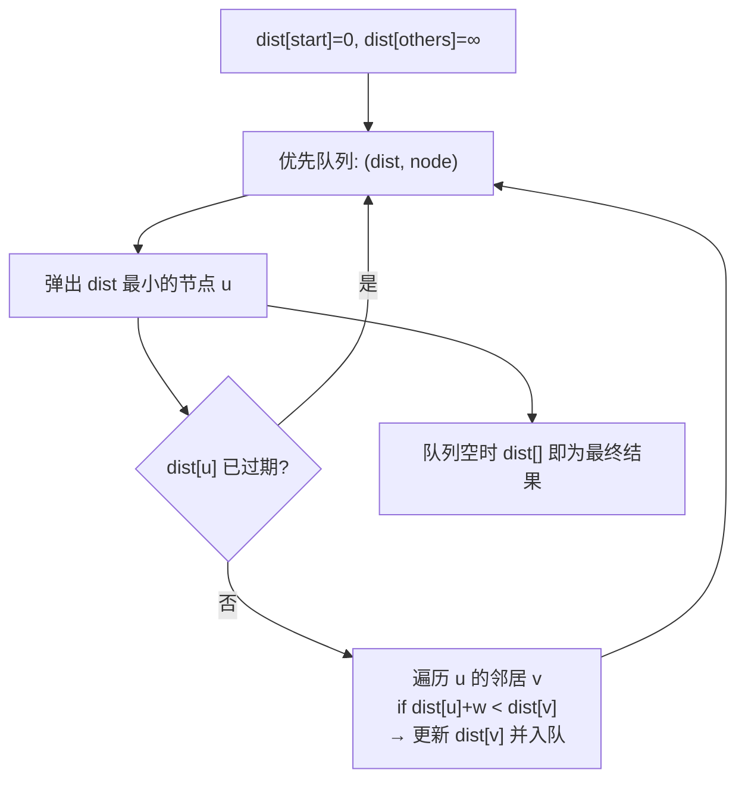
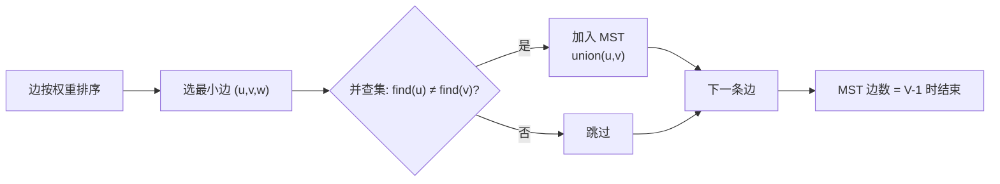
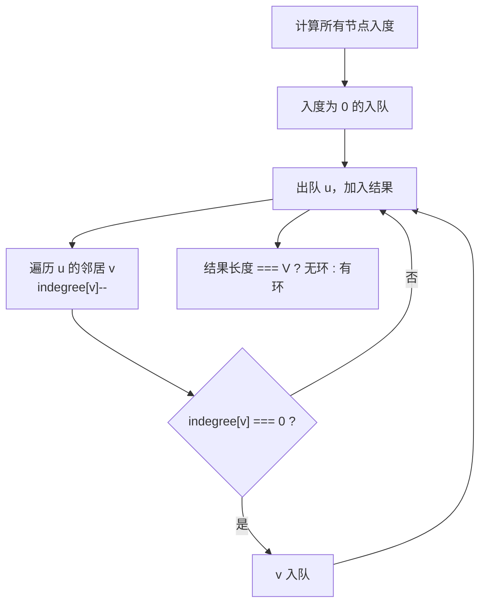

# 图算法

> 核心一句话：**图的算法围绕三种基本遍历展开 — Dijkstra（最短路径）、拓扑排序（DAG 依赖）、并查集（连通分量）。大部分题目是这三种的变体。**
>
> 规律：「最短路径」→ BFS / Dijkstra / Bellman-Ford / Floyd，「依赖顺序」→ 拓扑排序，「连通性」→ 并查集 / DFS

---

## 🎯 经典 LeetCode 题目

| #   | 题号                                                                    | 题目               | 难度 | 核心考点                 | 推荐指数 |
| --- | ----------------------------------------------------------------------- | ------------------ | :--: | ------------------------ | :------: |
| 1   | [743](https://leetcode.cn/problems/network-delay-time/)                 | 网络延迟时间       |  🟡  | **Dijkstra**（模板题）   |    ⭐    |
| 2   | [1514](https://leetcode.cn/problems/path-with-maximum-probability/)     | 概率最大的路径     |  🟡  | **Dijkstra** 最大概率    |   ⭐⭐   |
| 3   | [1631](https://leetcode.cn/problems/path-with-minimum-effort/)          | 最小体力消耗路径   |  🟡  | **Dijkstra** 变种        |  ⭐⭐⭐  |
| 4   | [787](https://leetcode.cn/problems/cheapest-flights-within-k-stops/)    | K 站中转内最便宜   |  🟡  | Bellman-Ford / BFS+DP    |  ⭐⭐⭐  |
| 5   | [207](https://leetcode.cn/problems/course-schedule/)                    | 课程表             |  🟡  | 拓扑排序判环             |    ⭐    |
| 6   | [210](https://leetcode.cn/problems/course-schedule-ii/)                 | 课程表 II          |  🟡  | 拓扑排序顺序             |   ⭐⭐   |
| 7   | [269](https://leetcode.cn/problems/alien-dictionary/)                   | 火星词典           |  🔴  | 拓扑排序建图             |  ⭐⭐⭐  |
| 8   | [785](https://leetcode.cn/problems/is-graph-bipartite/)                 | 判断二分图         |  🟡  | DFS/BFS 染色             |   ⭐⭐   |
| 9   | [886](https://leetcode.cn/problems/possible-bipartition/)               | 可能的二分法       |  🟡  | 染色法                   |   ⭐⭐   |
| 10  | [684](https://leetcode.cn/problems/redundant-connection/)               | 冗余连接           |  🟡  | **并查集** 判环          |   ⭐⭐   |
| 11  | [1584](https://leetcode.cn/problems/min-cost-to-connect-all-points/)    | 连接所有点的最小   |  🟡  | **Kruskal / Prim**       |   ⭐⭐   |
| 12  | [399](https://leetcode.cn/problems/evaluate-division/)                  | 除法求值           |  🟡  | **Floyd** / 带权并查集   |  ⭐⭐⭐  |
| 13  | [1334](https://leetcode.cn/problems/find-the-city-with-the-smallest/)   | 阈值距离内邻城最少 |  🟡  | **Floyd-Warshall**       |   ⭐⭐   |
| 14  | [1192](https://leetcode.cn/problems/critical-connections-in-a-network/) | 查找集群内的连接   |  🔴  | **Tarjan** 桥             |  ⭐⭐⭐  |
| 15  | [277](https://leetcode.cn/problems/find-the-celebrity/)                 | 搜寻名人           |  🟡  | 两遍遍历                 |   ⭐⭐   |

---

## 📋 目录

1. [图的表示](#图的表示)
2. [Dijkstra 最短路径](#dijkstra-最短路径)
3. [Bellman-Ford（负权 + 判负环）](#bellman-ford负权--判负环)
4. [Floyd-Warshall（全源最短路径）](#floyd-warshall全源最短路径)
5. [Kruskal 最小生成树](#kruskal-最小生成树)
6. [Prim 最小生成树](#prim-最小生成树)
7. [拓扑排序（Kahn）](#拓扑排序kahn)
8. [二分图染色](#二分图染色)
9. [环检测](#环检测)
10. [Tarjan：桥与割点](#tarjan桥与割点)
11. [复杂度速查表](#-复杂度速查表)

---

## 图的表示

```typescript
// 邻接表（最常用）
const graph: [number, number][][] = Array.from({ length: n }, () => []);
graph[u].push([v, weight]); // 有向边 u → v
graph[v].push([u, weight]); // 无向图加这行

// 邻接矩阵（适合稠密图）
const matrix: number[][] = Array.from({ length: n }, () => new Array(n).fill(Infinity));
matrix[u][v] = weight;

// 边列表（适合 Kruskal）
interface Edge { from: number; to: number; weight: number; }
```

---

## Dijkstra 最短路径

> **思路：** 贪心 — 每次选距离最短的未处理节点，松弛其邻边。**不能处理负权边。**
>
> **堆优化：** 用优先队列（小顶堆）每次取最小距离节点，复杂度 O(E log V)。



```typescript
// dijkstra.ts
/** 使用最小堆的 Dijkstra — 参考 24-heap-and-priority-queue.md 的 MinHeap */
function dijkstra(graph: [number, number][][], start: number): number[] {
  const n = graph.length;
  const dist = new Array(n).fill(Infinity);
  dist[start] = 0;

  // 小顶堆: [distance, node]
  const heap: [number, number][] = [[0, start]];

  while (heap.length > 0) {
    heap.sort((a, b) => a[0] - b[0]); // 工程中应使用真正的堆
    const [d, u] = heap.shift()!;
    if (d > dist[u]) continue; // 过期条目

    for (const [v, w] of graph[u]) {
      if (dist[u] + w < dist[v]) {
        dist[v] = dist[u] + w;
        heap.push([dist[v], v]);
      }
    }
  }

  return dist;
}
```

```python
import heapq

def dijkstra(graph: list[list[tuple[int, int]]], start: int) -> list[int]:
    n = len(graph)
    dist = [float('inf')] * n
    dist[start] = 0
    pq = [(0, start)]  # (distance, node)

    while pq:
        d, u = heapq.heappop(pq)
        if d > dist[u]: continue
        for v, w in graph[u]:
            if dist[u] + w < dist[v]:
                dist[v] = dist[u] + w
                heapq.heappush(pq, (dist[v], v))

    return dist
```

> **Dijkstra 的三种变体：**
> - **最大概率路径**（1514）：`dist` 初始为 0，`dist[start]=1`，松弛时用乘法 `dist[u] * w > dist[v]`
> - **最小体力消耗**（1631）：`dist` 为路径上的最大边权，松弛用 `max(dist[u], w) < dist[v]`
> - **K 次中转限制**（787）：不能用标准 Dijkstra，应用 **Bellman-Ford** 或 BFS + DP

---

## Bellman-Ford（负权 + 判负环）

> **思路：** 对每条边做 V-1 次松弛。第 V 次如果还能松弛说明存在负环。
>
> **适用：** 负权边、检测负环、K 次中转限制。

```typescript
function bellmanFord(n: number, edges: [number, number, number][], start: number): number[] | null {
  const dist = new Array(n).fill(Infinity);
  dist[start] = 0;

  // V-1 轮松弛
  for (let i = 1; i < n; i++) {
    for (const [u, v, w] of edges) {
      if (dist[u] !== Infinity && dist[u] + w < dist[v]) {
        dist[v] = dist[u] + w;
      }
    }
  }

  // 第 V 轮 — 检测负环
  for (const [u, v, w] of edges) {
    if (dist[u] !== Infinity && dist[u] + w < dist[v]) {
      return null; // 存在负环
    }
  }

  return dist;
}
```

```python
def bellman_ford(n: int, edges: list[tuple[int,int,int]], start: int) -> list[int] | None:
    dist = [float('inf')] * n
    dist[start] = 0

    for _ in range(n - 1):
        for u, v, w in edges:
            if dist[u] != float('inf') and dist[u] + w < dist[v]:
                dist[v] = dist[u] + w

    # 检测负环
    for u, v, w in edges:
        if dist[u] != float('inf') and dist[u] + w < dist[v]:
            return None

    return dist
```

---

## Floyd-Warshall（全源最短路径）

> **思路：** 动态规划 — `dp[i][j] = min(dp[i][j], dp[i][k] + dp[k][j])`，三层循环枚举 k,i,j。
>
> **适用：** 全源最短路、传递闭包、小图（V ≤ 500）。

```typescript
function floydWarshall(n: number, edges: [number, number, number][]): number[][] {
  const INF = Infinity;
  const dist = Array.from({ length: n }, () => new Array(n).fill(INF));
  for (let i = 0; i < n; i++) dist[i][i] = 0;
  for (const [u, v, w] of edges) dist[u][v] = w; // 有向图

  for (let k = 0; k < n; k++)
    for (let i = 0; i < n; i++)
      for (let j = 0; j < n; j++)
        if (dist[i][k] + dist[k][j] < dist[i][j])
          dist[i][j] = dist[i][k] + dist[k][j];

  return dist;
}
```

```python
def floyd_warshall(n: int, edges: list[tuple[int,int,int]]) -> list[list[int]]:
    INF = float('inf')
    dist = [[INF] * n for _ in range(n)]
    for i in range(n): dist[i][i] = 0
    for u, v, w in edges: dist[u][v] = w

    for k in range(n):
        for i in range(n):
            for j in range(n):
                if dist[i][k] + dist[k][j] < dist[i][j]:
                    dist[i][j] = dist[i][k] + dist[k][j]
    return dist
```

> **应用：** 1334.阈值距离内邻城最少、399.除法求值（带权并查集也能做）

---

## Kruskal 最小生成树

> **思路：** 对所有边按权重排序，从小到大选取，若两端不在同一连通分量则加入。用并查集判连通。



```typescript
// kruskal.ts
class UnionFind {
  parent: number[]; rank: number[];
  constructor(n: number) {
    this.parent = Array.from({ length: n }, (_, i) => i);
    this.rank = new Array(n).fill(0);
  }
  find(x: number): number {
    if (this.parent[x] !== x) this.parent[x] = this.find(this.parent[x]);
    return this.parent[x];
  }
  union(a: number, b: number): boolean {
    let pa = this.find(a), pb = this.find(b);
    if (pa === pb) return false;
    if (this.rank[pa] < this.rank[pb]) [pa, pb] = [pb, pa];
    this.parent[pb] = pa;
    if (this.rank[pa] === this.rank[pb]) this.rank[pa]++;
    return true;
  }
}

function kruskal(n: number, edges: [number, number, number][]): number {
  edges.sort((a, b) => a[2] - b[2]);
  const uf = new UnionFind(n);
  let mstCost = 0, edgeCount = 0;

  for (const [u, v, w] of edges) {
    if (uf.union(u, v)) {
      mstCost += w;
      edgeCount++;
      if (edgeCount === n - 1) break;
    }
  }

  return edgeCount === n - 1 ? mstCost : -1; // -1 表示不连通
}
```

```python
def kruskal(n: int, edges: list[tuple[int,int,int]]) -> int:
    parent = list(range(n))
    rank = [0] * n

    def find(x):
        while parent[x] != x:
            parent[x] = parent[parent[x]]
            x = parent[x]
        return x

    def union(a, b):
        pa, pb = find(a), find(b)
        if pa == pb: return False
        if rank[pa] < rank[pb]: pa, pb = pb, pa
        parent[pb] = pa
        if rank[pa] == rank[pb]: rank[pa] += 1
        return True

    edges.sort(key=lambda e: e[2])
    cost, cnt = 0, 0
    for u, v, w in edges:
        if union(u, v):
            cost += w
            cnt += 1
            if cnt == n - 1: break
    return cost if cnt == n - 1 else -1
```

---

## Prim 最小生成树

> **思路：** 从任意节点开始，每次选"已连接集合"到"未连接集合"的最小边加入。

```typescript
function prim(graph: [number, number][][], start = 0): number {
  const n = graph.length;
  const visited = new Array(n).fill(false);
  const minDist = new Array(n).fill(Infinity);
  minDist[start] = 0;
  let cost = 0;

  for (let i = 0; i < n; i++) {
    // 找未访问且 dist 最小的节点
    let u = -1;
    for (let j = 0; j < n; j++) {
      if (!visited[j] && (u === -1 || minDist[j] < minDist[u])) u = j;
    }
    if (minDist[u] === Infinity) return -1; // 不连通
    visited[u] = true;
    cost += minDist[u];

    for (const [v, w] of graph[u]) {
      if (!visited[v] && w < minDist[v]) minDist[v] = w;
    }
  }

  return cost;
}
```

```python
import heapq

def prim(graph: list[list[tuple[int,int]]], start=0) -> int:
    n = len(graph)
    visited = [False] * n
    pq = [(0, start)]  # (weight, node)
    cost, count = 0, 0

    while pq:
        w, u = heapq.heappop(pq)
        if visited[u]: continue
        visited[u] = True
        cost += w
        count += 1
        for v, w2 in graph[u]:
            if not visited[v]:
                heapq.heappush(pq, (w2, v))

    return cost if count == n else -1
```

> **Kruskal vs Prim：** Kruskal 适合边稀疏的图（`E << V²`），Prim 适合边稠密的图。

---

## 拓扑排序（Kahn）

> **思路：** 统计所有节点的入度，入度为 0 的节点入队。逐个出队并将其邻接节点的入度减 1，新的入度为 0 的节点入队。



```typescript
function topologicalSort(n: number, edges: number[][]): number[] {
  const indegree = new Array(n).fill(0);
  const graph: number[][] = Array.from({ length: n }, () => []);

  for (const [from, to] of edges) {
    graph[from].push(to);
    indegree[to]++;
  }

  const queue: number[] = [];
  for (let i = 0; i < n; i++) if (indegree[i] === 0) queue.push(i);

  const result: number[] = [];
  while (queue.length) {
    const u = queue.shift()!;
    result.push(u);
    for (const v of graph[u]) {
      if (--indegree[v] === 0) queue.push(v);
    }
  }

  return result.length === n ? result : []; // 有环返回 []
}
```

```python
from collections import deque

def topological_sort(n: int, edges: list[tuple[int,int]]) -> list[int]:
    indeg = [0] * n
    graph = [[] for _ in range(n)]
    for f, t in edges:
        graph[f].append(t)
        indeg[t] += 1

    q = deque([i for i in range(n) if indeg[i] == 0])
    res = []
    while q:
        u = q.popleft()
        res.append(u)
        for v in graph[u]:
            indeg[v] -= 1
            if indeg[v] == 0: q.append(v)

    return res if len(res) == n else []
```

---

## 二分图染色

> **思路：** 用两种颜色（1 / -1）给节点染色，相邻节点必须不同色。BFS/DFS 遍历染色，冲突则不是二分图。

```typescript
function isBipartite(graph: number[][]): boolean {
  const n = graph.length;
  const color = new Array(n).fill(0); // 0=未染, 1=红, -1=蓝

  for (let i = 0; i < n; i++) {
    if (color[i] !== 0) continue;
    color[i] = 1;
    const queue: number[] = [i];

    while (queue.length) {
      const u = queue.shift()!;
      for (const v of graph[u]) {
        if (color[v] === 0) { color[v] = -color[u]; queue.push(v); }
        else if (color[v] === color[u]) return false;
      }
    }
  }

  return true;
}
```

```python
def is_bipartite(graph: list[list[int]]) -> bool:
    n = len(graph)
    color = [0] * n
    for i in range(n):
        if color[i] != 0: continue
        color[i] = 1
        q = [i]
        while q:
            u = q.pop()
            for v in graph[u]:
                if color[v] == 0:
                    color[v] = -color[u]
                    q.append(v)
                elif color[v] == color[u]:
                    return False
    return True
```

---

## 环检测

### 无向图判环（DFS）

```typescript
function hasCycleUndirected(graph: number[][]): boolean {
  const n = graph.length;
  const visited = new Array(n).fill(false);

  function dfs(u: number, parent: number): boolean {
    visited[u] = true;
    for (const v of graph[u]) {
      if (!visited[v]) { if (dfs(v, u)) return true; }
      else if (v !== parent) return true; // 遇到已访问的非父节点 → 有环
    }
    return false;
  }

  for (let i = 0; i < n; i++) if (!visited[i] && dfs(i, -1)) return true;
  return false;
}
```

### 有向图判环（DFS + 三色标记）

```typescript
function hasCycleDirected(graph: number[][]): boolean {
  const n = graph.length;
  const state = new Array(n).fill(0); // 0=未访问, 1=访问中, 2=已结束

  function dfs(u: number): boolean {
    if (state[u] === 1) return true;  // 访问中 → 有环
    if (state[u] === 2) return false; // 已结束 → 无需再搜
    state[u] = 1;
    for (const v of graph[u]) if (dfs(v)) return true;
    state[u] = 2;
    return false;
  }

  for (let i = 0; i < n; i++) if (dfs(i)) return true;
  return false;
}
```

---

## Tarjan：桥与割点

> **思路：** DFS 遍历时记录 `disc[u]`（发现时间）和 `low[u]`（能回溯到的最早时间）。若 `low[v] > disc[u]` 则 `(u,v)` 是桥。

```typescript
/** 找无向图中的所有桥（割边） */
function findBridges(n: number, edges: [number, number][]): [number, number][] {
  const graph: number[][] = Array.from({ length: n }, () => []);
  for (const [u, v] of edges) { graph[u].push(v); graph[v].push(u); }

  const disc = new Array(n).fill(-1);
  const low = new Array(n).fill(-1);
  const bridges: [number, number][] = [];
  let time = 0;

  function dfs(u: number, parent: number) {
    disc[u] = low[u] = ++time;
    for (const v of graph[u]) {
      if (v === parent) continue;
      if (disc[v] === -1) {
        dfs(v, u);
        low[u] = Math.min(low[u], low[v]);
        if (low[v] > disc[u]) bridges.push([u, v]); // 桥
      } else {
        low[u] = Math.min(low[u], disc[v]); // 回边
      }
    }
  }

  for (let i = 0; i < n; i++) if (disc[i] === -1) dfs(i, -1);
  return bridges;
}
```

> **应用：** 1192.查找集群内的关键连接（Tarjan 求桥的模板题）

---

## 📊 复杂度速查表

| 算法 | 时间复杂度 | 空间复杂度 | 适用场景 |
|---|---|---|---|
| Dijkstra（堆优化） | O(E log V) | O(V) | 正权单源最短路径 |
| Bellman-Ford | O(V·E) | O(V) | 负权 / K 次中转 / 判负环 |
| Floyd-Warshall | O(V³) | O(V²) | 全源最短路（小图） |
| Kruskal | O(E log E) | O(V) | 稀疏图最小生成树 |
| Prim（堆优化） | O(E log V) | O(V) | 稠密图最小生成树 |
| 拓扑排序（Kahn） | O(V+E) | O(V) | DAG 排序 / 判环 |
| 二分图染色 | O(V+E) | O(V) | 相邻异色 |
| 环检测（无向） | O(V+E) | O(V) | DFS parent 法 |
| 环检测（有向） | O(V+E) | O(V) | 三色标记法 |
| Tarjan（桥） | O(V+E) | O(V) | 关键连接 / 割点 |

---

> **关联阅读：** `26-union-find.md` → `03-bfs-framework.md` → `24-heap-and-priority-queue.md`
