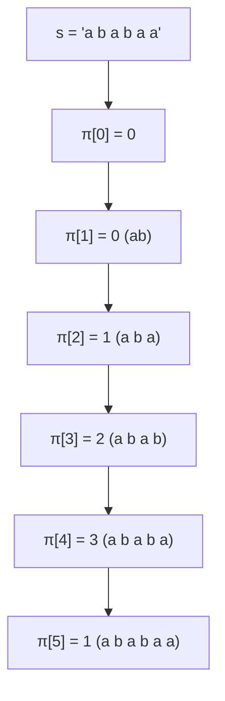

# 字符串匹配算法

> 核心一句话：**字符串匹配三大算法 — KMP（前缀函数）、Rabin-Karp（滚动哈希）、Z-Algorithm（Z 数组）。KMP 是面试最高频。**
>
> 规律：「单模式串匹配」→ KMP / Z，「多模式串匹配」→ Trie / AC 自动机

---

## 🎯 经典 LeetCode 题目

| #   | 题号                                                                                          | 题目                 | 难度 | 核心考点            | 推荐指数 |
| --- | --------------------------------------------------------------------------------------------- | -------------------- | :--: | ------------------- | :------: |
| 1   | [28](https://leetcode.cn/problems/find-the-index-of-the-first-occurrence-in-a-string/)        | 找出字符串中第一个匹配项 |  🟢  | KMP / 内置函数      |    ⭐    |
| 2   | [1392](https://leetcode.cn/problems/longest-happy-prefix/)                                    | 最长快乐前缀         |  🔴  | KMP 前缀函数 / Z    |  ⭐⭐⭐  |
| 3   | [686](https://leetcode.cn/problems/repeated-string-match/)                                    | 重复叠加字符串匹配   |  🟡  | KMP / 滚动哈希      |   ⭐⭐   |
| 4   | [459](https://leetcode.cn/problems/repeated-substring-pattern/)                               | 重复的子字符串       |  🟢  | KMP 前缀函数应用    |   ⭐⭐   |
| 5   | [214](https://leetcode.cn/problems/shortest-palindrome/)                                      | 最短回文串           |  🔴  | KMP / Manacher      |  ⭐⭐⭐  |
| 6   | [1044](https://leetcode.cn/problems/longest-duplicate-substring/)                              | 最长重复子串         |  🔴  | 滚动哈希 + 二分     |  ⭐⭐⭐  |

---

## 📋 目录

1. [KMP 算法](#kmp-算法)
2. [Rabin-Karp 滚动哈希](#rabin-karp-滚动哈希)
3. [Z-Algorithm](#z-algorithm)
4. [复杂度速查表](#-复杂度速查表)

---

## KMP 算法

> **核心思想：** 利用匹配失败后的信息（前缀函数），减少模式串与文本串的匹配次数。

### 前缀函数（π 数组）

`π[i]` = 子串 `s[0..i]` 的最长相等真前缀和真后缀的长度。



```typescript
/** 计算前缀函数（π 数组） O(n) */
function computePrefix(pattern: string): number[] {
  const pi = new Array(pattern.length).fill(0);
  for (let i = 1; i < pattern.length; i++) {
    let j = pi[i - 1];
    while (j > 0 && pattern[i] !== pattern[j]) j = pi[j - 1];
    if (pattern[i] === pattern[j]) j++;
    pi[i] = j;
  }
  return pi;
}
```

```python
def compute_prefix(pattern: str) -> list[int]:
    pi = [0] * len(pattern)
    for i in range(1, len(pattern)):
        j = pi[i - 1]
        while j > 0 and pattern[i] != pattern[j]:
            j = pi[j - 1]
        if pattern[i] == pattern[j]:
            j += 1
        pi[i] = j
    return pi
```

### KMP 主算法

```typescript
/** KMP 字符串匹配，返回所有匹配起始下标 */
function kmpSearch(text: string, pattern: string): number[] {
  if (!pattern) return [0];
  const pi = computePrefix(pattern);
  const res: number[] = [];
  let j = 0;
  for (let i = 0; i < text.length; i++) {
    while (j > 0 && text[i] !== pattern[j]) j = pi[j - 1];
    if (text[i] === pattern[j]) j++;
    if (j === pattern.length) {
      res.push(i - j + 1);
      j = pi[j - 1];
    }
  }
  return res;
}
```

```python
def kmp_search(text: str, pattern: str) -> list[int]:
    if not pattern: return [0]
    pi = compute_prefix(pattern)
    res, j = [], 0
    for i, c in enumerate(text):
        while j > 0 and c != pattern[j]:
            j = pi[j - 1]
        if c == pattern[j]:
            j += 1
        if j == len(pattern):
            res.append(i - j + 1)
            j = pi[j - 1]
    return res
```

> **应用：**
> - `28.strStr()` — KMP 直接匹配
> - `459.重复子串` — `s` 长度为 `n`，若 `n % (n - π[n-1]) === 0` 则有重复子串
> - `1392.最长快乐前缀` — `π[n-1]` 即为答案
> - `214.最短回文串` — 将 `s + '#' + reverse(s)` 求 π 数组

---

## Rabin-Karp 滚动哈希

> **核心思想：** 用哈希值表示子串，通过滚动计算（减去最高位 + 乘以基数 + 加上新位）将比较从 O(n) 降为 O(1)。

```typescript
/** 滚动哈希匹配，返回所有匹配起始下标 */
function rabinKarp(text: string, pattern: string): number[] {
  const BASE = 31n, MOD = 1000000007n;
  const n = text.length, m = pattern.length;
  if (m > n) return [];

  // 计算 pattern 哈希和最高位权重
  let patHash = 0n, pow = 1n;
  for (let i = 0; i < m; i++) {
    patHash = (patHash * BASE + BigInt(text.charCodeAt(i))) % MOD;
    pow = (pow * BASE) % MOD;
  }

  let curHash = 0n;
  for (let i = 0; i < n; i++) {
    curHash = (curHash * BASE + BigInt(text.charCodeAt(i))) % MOD;
    if (i >= m - 1) {
      if (i >= m) {
        curHash = (curHash - BigInt(text.charCodeAt(i - m)) * pow % MOD + MOD) % MOD;
      }
      if (curHash === patHash) {
        // 哈希冲突时需逐个字符比较确认（此处省略）
        // if (text.slice(i - m + 1, i + 1) === pattern) ...
      }
    }
  }
  return [];
}
```

```python
def rabin_karp(text: str, pattern: str) -> list[int]:
    BASE, MOD = 31, 10**9 + 7
    n, m = len(text), len(pattern)
    if m > n: return []

    pat_hash = 0
    for c in pattern:
        pat_hash = (pat_hash * BASE + ord(c)) % MOD

    pow_base = pow(BASE, m - 1, MOD)
    cur_hash = 0
    res = []

    for i, c in enumerate(text):
        cur_hash = (cur_hash * BASE + ord(c)) % MOD
        if i >= m - 1:
            if i >= m:
                cur_hash = (cur_hash - ord(text[i - m]) * pow_base % MOD + MOD) % MOD
            if cur_hash == pat_hash:
                if text[i - m + 1 : i + 1] == pattern:
                    res.append(i - m + 1)
    return res
```

> **应用：** 1044.最长重复子串 — 二分长度 + 滚动哈希检查是否有重复
>
> ⚠️ **哈希冲突：** 简单模数可能碰撞，工程中常用双哈希（两个不同 BASE/MOD）或直接比较原串。

---

## Z-Algorithm

> **核心思想：** `Z[i]` = s 和 s[i..] 的最长公共前缀长度。可在 O(n) 内计算。

```typescript
/** 计算 Z 数组 O(n) */
function zFunction(s: string): number[] {
  const n = s.length;
  const z = new Array(n).fill(0);
  let l = 0, r = 0;
  for (let i = 1; i < n; i++) {
    if (i <= r) z[i] = Math.min(r - i + 1, z[i - l]);
    while (i + z[i] < n && s[z[i]] === s[i + z[i]]) z[i]++;
    if (i + z[i] - 1 > r) { l = i; r = i + z[i] - 1; }
  }
  return z;
}
```

```python
def z_function(s: str) -> list[int]:
    n = len(s)
    z = [0] * n
    l = r = 0
    for i in range(1, n):
        if i <= r: z[i] = min(r - i + 1, z[i - l])
        while i + z[i] < n and s[z[i]] == s[i + z[i]]:
            z[i] += 1
        if i + z[i] - 1 > r:
            l, r = i, i + z[i] - 1
    return z
```

> **KMP vs Z 对比：** KMP 的 π 数组是"已经匹配了多少"；Z 数组是"从当前位置能匹配多长"。两者可以互相转化。

---

## 📊 复杂度速查表

| 算法 | 预处理 | 匹配 | 空间 | 说明 |
|---|---|---|---|---|
| KMP | O(m) | O(n) | O(m) | π 数组是核心 |
| Rabin-Karp | O(m) | O(n) 平均 | O(1) | 最坏 O(nm) — 哈希冲突 |
| Z-Algorithm | O(n) | — | O(n) | Z 数组可做匹配（拼串） |
