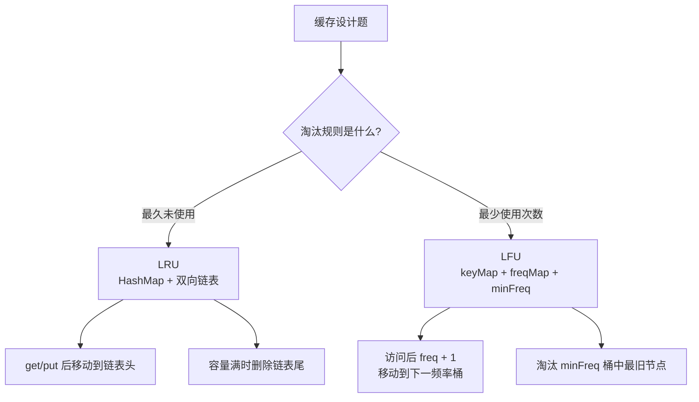
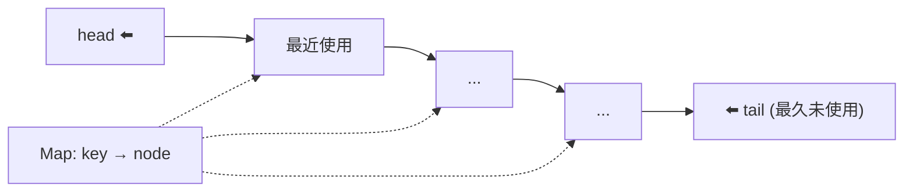
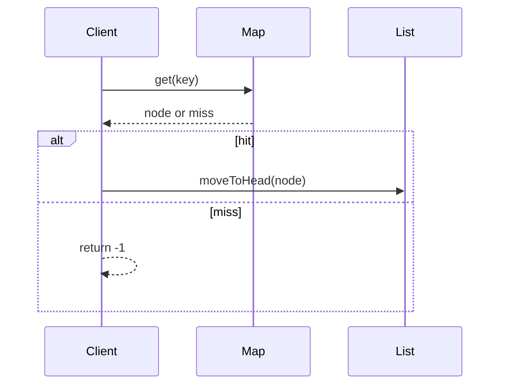

# LRU & LFU 缓存

> 核心一句话：**LRU = 淘汰最久未使用的；LFU = 淘汰使用次数最少的。两者的关键都是用哈希表把访问定位降到 O(1)。**
>
> 面试最高频的设计题，核心都是 **哈希表 + 双向链表** 的组合。

---

## 🎯 经典 LeetCode 题目

| #   | 题号                                           | 题目     | 难度 | 核心考点          | 推荐指数 |
| --- | ---------------------------------------------- | -------- | :--: | ----------------- | :------: |
| 1   | [146](https://leetcode.cn/problems/lru-cache/) | LRU 缓存 |  🟡  | 哈希表 + 双向链表 |  ⭐⭐⭐  |
| 2   | [460](https://leetcode.cn/problems/lfu-cache/) | LFU 缓存 |  🔴  | 哈希表 + 频率链表 |  ⭐⭐⭐  |

---

## 🗺️ 缓存淘汰策略图



---

## 📋 目录

1. [LRU 完整实现](#lru-完整实现)
2. [LRU 简易版（Map）](#lru-简易版map)
3. [LFU 实现](#lfu-实现)
4. [复杂度速查表](#-复杂度速查表)

---

## LRU 完整实现

> **思路：** 哈希表 `Map<key, ListNode>` + 双向链表（哨兵头尾节点）。每次访问将节点移到链表头部，淘汰时删除链表尾部。





```typescript
class ListNode {
  constructor(
    public key: number,
    public val: number,
    public prev: ListNode | null = null,
    public next: ListNode | null = null
  ) {}
}

class LRUCache {
  private capacity: number;
  private cache: Map<number, ListNode> = new Map();
  private head: ListNode; // 哨兵头（最近使用的在 head.next）
  private tail: ListNode; // 哨兵尾（最久未使用的在 tail.prev）

  constructor(capacity: number) {
    this.capacity = capacity;
    this.head = new ListNode(0, 0);
    this.tail = new ListNode(0, 0);
    this.head.next = this.tail;
    this.tail.prev = this.head;
  }

  get(key: number): number {
    const node = this.cache.get(key);
    if (!node) return -1;
    this.moveToHead(node);
    return node.val;
  }

  put(key: number, value: number): void {
    const node = this.cache.get(key);
    if (node) {
      node.val = value;
      this.moveToHead(node);
      return;
    }
    if (this.cache.size >= this.capacity) {
      const lru = this.tail.prev!;
      this.removeNode(lru);
      this.cache.delete(lru.key);
    }
    const newNode = new ListNode(key, value);
    this.cache.set(key, newNode);
    this.addToHead(newNode);
  }

  private addToHead(node: ListNode): void {
    node.prev = this.head;
    node.next = this.head.next;
    this.head.next!.prev = node;
    this.head.next = node;
  }

  private removeNode(node: ListNode): void {
    node.prev!.next = node.next;
    node.next!.prev = node.prev;
  }

  private moveToHead(node: ListNode): void {
    this.removeNode(node);
    this.addToHead(node);
  }
}
```

```python
class ListNode:
    def __init__(self, key=0, val=0):
        self.key = key
        self.val = val
        self.prev = None
        self.next = None

class LRUCache:
    def __init__(self, capacity: int):
        self.cap = capacity
        self.cache = {}
        self.head = ListNode()
        self.tail = ListNode()
        self.head.next = self.tail
        self.tail.prev = self.head

    def get(self, key: int) -> int:
        if key not in self.cache: return -1
        node = self.cache[key]
        self._move_to_head(node)
        return node.val

    def put(self, key: int, value: int) -> None:
        if key in self.cache:
            node = self.cache[key]
            node.val = value
            self._move_to_head(node)
            return
        if len(self.cache) >= self.cap:
            lru = self.tail.prev
            self._remove_node(lru)
            del self.cache[lru.key]
        new_node = ListNode(key, value)
        self.cache[key] = new_node
        self._add_to_head(new_node)

    def _add_to_head(self, node):
        node.prev = self.head
        node.next = self.head.next
        self.head.next.prev = node
        self.head.next = node

    def _remove_node(self, node):
        node.prev.next = node.next
        node.next.prev = node.prev

    def _move_to_head(self, node):
        self._remove_node(node)
        self._add_to_head(node)
```

---

## LRU 简易版（Map）

> JavaScript `Map` 的 `keys().next()` 能拿到最早插入的 key，利用这个特性可以实现简易 LRU。

```typescript
class LRUCacheSimple {
  private capacity: number;
  private cache: Map<number, number>;

  constructor(capacity: number) {
    this.capacity = capacity;
    this.cache = new Map();
  }

  get(key: number): number {
    if (!this.cache.has(key)) return -1;
    const value = this.cache.get(key)!;
    this.cache.delete(key);
    this.cache.set(key, value); // 重新插入到最后（最近使用）
    return value;
  }

  put(key: number, value: number): void {
    if (this.cache.has(key)) {
      this.cache.delete(key);
    } else if (this.cache.size >= this.capacity) {
      const oldestKey = this.cache.keys().next().value!;
      this.cache.delete(oldestKey);
    }
    this.cache.set(key, value);
  }
}
```

```python
# Python 可以用 OrderedDict
from collections import OrderedDict

class LRUCache:
    def __init__(self, capacity: int):
        self.cap = capacity
        self.cache = OrderedDict()

    def get(self, key: int) -> int:
        if key not in self.cache: return -1
        self.cache.move_to_end(key)
        return self.cache[key]

    def put(self, key: int, value: int) -> None:
        if key in self.cache:
            self.cache.move_to_end(key)
        elif len(self.cache) >= self.cap:
            self.cache.popitem(last=False)
        self.cache[key] = value
```

---

## LFU 实现

> **思路：** 每个频率一个双向链表（`Map<freq, Linked List>`）+ `Map<key, Node>`。访问节点时频率 +1，移到下一个频率链表头部。
>
> 淘汰时从最低频率链表的尾部删除。

```typescript
class LFUCache {
  private capacity: number;
  private minFreq: number;
  private keyToNode: Map<number, LFUNode>;
  private freqToList: Map<number, LFUList>;

  constructor(capacity: number) {
    this.capacity = capacity;
    this.minFreq = 0;
    this.keyToNode = new Map();
    this.freqToList = new Map();
  }

  get(key: number): number {
    if (!this.keyToNode.has(key)) return -1;
    const node = this.keyToNode.get(key)!;
    this.increaseFreq(node);
    return node.val;
  }

  put(key: number, value: number): void {
    if (this.capacity === 0) return;
    if (this.keyToNode.has(key)) {
      const node = this.keyToNode.get(key)!;
      node.val = value;
      this.increaseFreq(node);
      return;
    }
    if (this.keyToNode.size >= this.capacity) {
      const list = this.freqToList.get(this.minFreq)!;
      const evicted = list.removeLast();
      this.keyToNode.delete(evicted.key);
    }
    const node = new LFUNode(key, value);
    this.keyToNode.set(key, node);
    this.minFreq = 1;
    this.getList(1).addFirst(node);
  }

  private increaseFreq(node: LFUNode): void {
    const oldFreq = node.freq;
    this.getList(oldFreq).remove(node);
    if (oldFreq === this.minFreq && this.getList(oldFreq).isEmpty()) this.minFreq++;
    node.freq++;
    this.getList(node.freq).addFirst(node);
  }

  private getList(freq: number): LFUList {
    if (!this.freqToList.has(freq)) this.freqToList.set(freq, new LFUList());
    return this.freqToList.get(freq)!;
  }
}

class LFUNode {
  freq = 1;
  prev: LFUNode | null = null;
  next: LFUNode | null = null;
  constructor(public key: number, public val: number) {}
}

class LFUList {
  head: LFUNode;
  tail: LFUNode;
  constructor() {
    this.head = new LFUNode(0, 0);
    this.tail = new LFUNode(0, 0);
    this.head.next = this.tail;
    this.tail.prev = this.head;
  }

  addFirst(node: LFUNode): void {
    node.next = this.head.next;
    node.prev = this.head;
    this.head.next!.prev = node;
    this.head.next = node;
  }

  remove(node: LFUNode): void {
    node.prev!.next = node.next;
    node.next!.prev = node.prev;
  }

  removeLast(): LFUNode {
    const node = this.tail.prev!;
    this.remove(node);
    return node;
  }

  isEmpty(): boolean {
    return this.head.next === this.tail;
  }
}
```

```python
class LFUNode:
    def __init__(self, key=0, val=0):
        self.key = key
        self.val = val
        self.freq = 1
        self.prev = None
        self.next = None

class LFUList:
    def __init__(self):
        self.head = LFUNode()
        self.tail = LFUNode()
        self.head.next = self.tail
        self.tail.prev = self.head

    def add_first(self, node):
        node.next = self.head.next
        node.prev = self.head
        self.head.next.prev = node
        self.head.next = node

    def remove(self, node):
        node.prev.next = node.next
        node.next.prev = node.prev

    def remove_last(self):
        node = self.tail.prev
        self.remove(node)
        return node

    def is_empty(self):
        return self.head.next == self.tail

class LFUCache:
    def __init__(self, capacity: int):
        self.cap = capacity
        self.min_freq = 0
        self.key_node = {}
        self.freq_list = {}

    def _get_list(self, freq):
        if freq not in self.freq_list:
            self.freq_list[freq] = LFUList()
        return self.freq_list[freq]

    def _increase_freq(self, node):
        old_freq = node.freq
        self._get_list(old_freq).remove(node)
        if old_freq == self.min_freq and self._get_list(old_freq).is_empty():
            self.min_freq += 1
        node.freq += 1
        self._get_list(node.freq).add_first(node)

    def get(self, key):
        if key not in self.key_node: return -1
        node = self.key_node[key]
        self._increase_freq(node)
        return node.val

    def put(self, key, value):
        if self.cap == 0: return
        if key in self.key_node:
            node = self.key_node[key]
            node.val = value
            self._increase_freq(node)
            return
        if len(self.key_node) >= self.cap:
            lfu = self._get_list(self.min_freq).remove_last()
            del self.key_node[lfu.key]
        node = LFUNode(key, value)
        self.key_node[key] = node
        self.min_freq = 1
        self._get_list(1).add_first(node)
```

---

## 📊 复杂度速查表

| 结构 | get | put | 空间 | 核心思路 |
|---|---|---|---|---|
| LRU（双向链表） | O(1) | O(1) | O(cap) | Map 找节点，链表维护顺序 |
| LRU（Map 简易） | O(1) | O(1) | O(cap) | Map.keys().next() 取最旧 |
| LFU | O(1) | O(1) | O(cap) | 频率链表组 + minFreq 追踪 |

---

> **关联阅读：** `30-trie-prefix-tree.md` → `32-design-and-ood.md` → `../reference/95-basic-coding-challenges.md`
