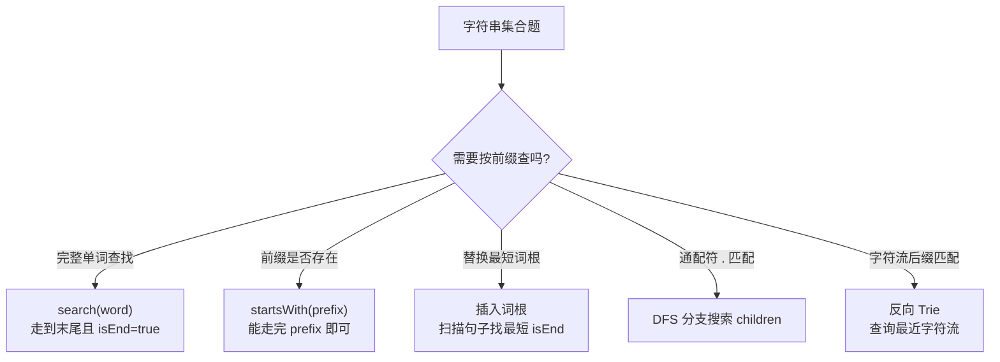
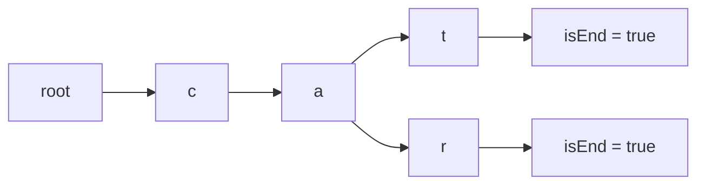

# Trie（前缀树）

> 核心一句话：**Trie 用树形结构存储字符串集合，支持前缀匹配。核心操作：插入、搜索、前缀搜索。**

---

## 🗺️ Trie 使用决策图



## 🌲 Trie 插入路径



---

## 🎯 经典 LeetCode 题目

| #   | 题号                                                                            | 题目           | 难度 | 核心考点      | 推荐指数 |
| --- | ------------------------------------------------------------------------------- | -------------- | :--: | ------------- | :------: |
| 1   | [208](https://leetcode.cn/problems/implement-trie-prefix-tree/)                 | 实现 Trie      |  🟡  | Trie 模板     |    ⭐    |
| 2   | [211](https://leetcode.cn/problems/design-add-and-search-words-data-structure/) | 添加与搜索单词 |  🟡  | Trie + 通配符 |   ⭐⭐   |
| 3   | [648](https://leetcode.cn/problems/replace-words/)                              | 单词替换       |  🟡  | Trie 前缀匹配 |   ⭐⭐   |
| 4   | [1032](https://leetcode.cn/problems/stream-of-characters/)                      | 字符流         |  🔴  | 后缀 Trie     |  ⭐⭐⭐  |

---

## 📐 Trie 模板

```typescript
// trie.ts
class TrieNode {
  children: Map<string, TrieNode> = new Map();
  isEnd: boolean = false;
}

class Trie {
  private root: TrieNode = new TrieNode();

  insert(word: string): void {
    let node = this.root;
    for (const c of word) {
      if (!node.children.has(c)) {
        node.children.set(c, new TrieNode());
      }
      node = node.children.get(c)!;
    }
    node.isEnd = true;
  }

  search(word: string): boolean {
    const node = this.find(word);
    return node !== null && node.isEnd;
  }

  startsWith(prefix: string): boolean {
    return this.find(prefix) !== null;
  }

  private find(prefix: string): TrieNode | null {
    let node = this.root;
    for (const c of prefix) {
      if (!node.children.has(c)) return null;
      node = node.children.get(c)!;
    }
    return node;
  }
}
```

```python
class TrieNode:
    def __init__(self):
        self.children: dict[str, TrieNode] = {}
        self.is_end = False


class Trie:
    def __init__(self):
        self.root = TrieNode()

    def insert(self, word: str) -> None:
        node = self.root
        for c in word:
            if c not in node.children:
                node.children[c] = TrieNode()
            node = node.children[c]
        node.is_end = True

    def search(self, word: str) -> bool:
        node = self._find(word)
        return node is not None and node.is_end

    def starts_with(self, prefix: str) -> bool:
        return self._find(prefix) is not None

    def _find(self, prefix: str) -> TrieNode | None:
        node = self.root
        for c in prefix:
            if c not in node.children:
                return None
            node = node.children[c]
        return node
```

## 🔍 通配符搜索

```typescript
function searchWithDot(root: TrieNode, word: string): boolean {
  function dfs(node: TrieNode, i: number): boolean {
    if (i === word.length) return node.isEnd;
    const c = word[i];
    if (c !== '.') {
      const next = node.children.get(c);
      return next ? dfs(next, i + 1) : false;
    }
    for (const child of node.children.values()) {
      if (dfs(child, i + 1)) return true;
    }
    return false;
  }
  return dfs(root, 0);
}
```

```python
def search_with_dot(root: TrieNode, word: str) -> bool:
    def dfs(node: TrieNode, i: int) -> bool:
        if i == len(word):
            return node.is_end
        c = word[i]
        if c != ".":
            return c in node.children and dfs(node.children[c], i + 1)
        return any(dfs(child, i + 1) for child in node.children.values())

    return dfs(root, 0)
```

## 🎯 易错点

```
[ ] search 必须要求 isEnd=true；startsWith 不需要。
[ ] 通配符搜索遇到 "." 要枚举所有 children。
[ ] 替换词根时，一旦遇到 isEnd=true 就可以停止，取最短词根。
[ ] 字符流后缀匹配通常要建反向 Trie。
```

---

> **关联阅读：** `29-lru-and-lfu-cache.md` → `32-design-and-ood.md`
