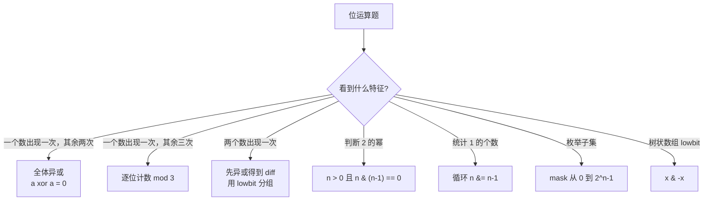

# 位运算

> 核心一句话：**位运算常考技巧：判断奇偶（x&1）、消除最低位1（x&(x-1)）、取最低位1（x&-x）、异或性质（x^x=0, x^0=x）。**

---

## 🗺️ 位运算题型决策图



---

## 🎯 经典 LeetCode 题目

| #   | 题号                                                   | 题目                 | 难度 | 核心考点          | 推荐指数 |
| --- | ------------------------------------------------------ | -------------------- | :--: | ----------------- | :------: |
| 1   | [136](https://leetcode.cn/problems/single-number/)     | 只出现一次的数字     |  🟢  | a⊕a=0             |    ⭐    |
| 2   | [137](https://leetcode.cn/problems/single-number-ii/)  | 只出现一次的数字 II  |  🟡  | 位计数 mod 3      |   ⭐⭐   |
| 3   | [260](https://leetcode.cn/problems/single-number-iii/) | 只出现一次的数字 III |  🟡  | 分组异或          |   ⭐⭐   |
| 4   | [191](https://leetcode.cn/problems/number-of-1-bits/)  | 位1的个数            |  🟢  | n&(n-1)           |    ⭐    |
| 5   | [231](https://leetcode.cn/problems/power-of-two/)      | 2 的幂               |  🟢  | n>0 && n&(n-1)==0 |    ⭐    |
| 6   | [78](https://leetcode.cn/problems/subsets/)            | 子集                 |  🟡  | 位掩码枚举        |   ⭐⭐   |

---

## 📐 常用技巧

```typescript
// bit-manipulation-tricks.ts

// ① 判断奇偶
function isOdd(x: number): boolean {
  return (x & 1) === 1;
}

// ② 消除最低位的 1
function removeLowestBit(x: number): number {
  return x & (x - 1);
}

// ③ 取最低位的 1
function lowestBit(x: number): number {
  return x & -x;
}

// ④ 判断 2 的幂
function isPowerOfTwo(n: number): boolean {
  return n > 0 && (n & (n - 1)) === 0;
}

// ⑤ 统计 1 的个数
function countBits(n: number): number {
  let count = 0;
  while (n) {
    n &= n - 1;
    count++;
  }
  return count;
}

// ⑥ 异或找只出现一次的数
function singleNumber(nums: number[]): number {
  return nums.reduce((a, b) => a ^ b, 0);
}

// ⑦ 用位掩码枚举子集
function subsetsBitmask(nums: number[]): number[][] {
  const result: number[][] = [];
  for (let mask = 0; mask < 1 << nums.length; mask++) {
    const subset: number[] = [];
    for (let i = 0; i < nums.length; i++) {
      if (mask & (1 << i)) subset.push(nums[i]);
    }
    result.push(subset);
  }
  return result;
}
```

```python
def is_odd(x: int) -> bool:
    return (x & 1) == 1


def remove_lowest_bit(x: int) -> int:
    return x & (x - 1)


def lowest_bit(x: int) -> int:
    return x & -x


def is_power_of_two(n: int) -> bool:
    return n > 0 and (n & (n - 1)) == 0


def count_bits(n: int) -> int:
    count = 0
    while n:
        n &= n - 1
        count += 1
    return count


def single_number(nums: list[int]) -> int:
    ans = 0
    for num in nums:
        ans ^= num
    return ans


def subsets_bitmask(nums: list[int]) -> list[list[int]]:
    result = []
    for mask in range(1 << len(nums)):
        subset = []
        for i, num in enumerate(nums):
            if mask & (1 << i):
                subset.append(num)
        result.append(subset)
    return result
```

## 🎯 易错点

```
[ ] JavaScript/TypeScript 位运算会转成 32-bit signed int，大数要小心。
[ ] 判断 2 的幂必须先检查 n > 0。
[ ] x & -x 取最低位 1，常用于树状数组。
[ ] 子集枚举复杂度是 O(n * 2^n)，n 通常不能太大。
```

---

> **关联阅读：** `34-algorithm-pattern-recognition.md`
