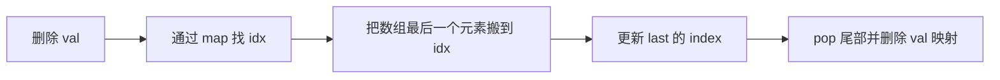

# 设计与 OOD

> 核心一句话：**设计题考察对数据结构的组合能力 — LRU = 哈希表 + 双向链表，O(1)随机访问 = 哈希表 + 动态数组。**

---

## 🗺️ 设计题数据结构组合图

```mermaid
flowchart TD
    START["设计题"] --> NEED{"要保证什么复杂度?"}
    NEED -->|O(1) 查找 + 最近使用淘汰| LRU["LRU<br/>HashMap + 双向链表"]
    NEED -->|O(1) 查找 + 最少频率淘汰| LFU["LFU<br/>keyMap + freqMap + minFreq"]
    NEED -->|O(1) 插入删除随机| RAND["RandomizedSet<br/>数组 + value->index"]
    NEED -->|O(1) 获取最小值| MINSTACK["MinStack<br/>普通栈 + 最小栈"]
    NEED -->|按时间查询历史值| TIME["TimeMap<br/>key -> 有序数组 + 二分"]
    NEED -->|路径 / 文件系统| FS["Trie 树节点<br/>目录 children + 内容"]
```

## 🔀 O(1) 随机集合删除



---

## 🎯 经典 LeetCode 题目

| #   | 题号                                                                 | 题目                  | 难度 | 核心数据结构           | 推荐指数 |
| --- | -------------------------------------------------------------------- | --------------------- | :--: | ---------------------- | :------: |
| 1   | [146](https://leetcode.cn/problems/lru-cache/)                       | LRU 缓存              |  🟡  | 哈希表 + 双向链表      |  ⭐⭐⭐  |
| 2   | [155](https://leetcode.cn/problems/min-stack/)                       | 最小栈                |  🟢  | 辅助栈                 |    ⭐    |
| 3   | [173](https://leetcode.cn/problems/binary-search-tree-iterator/)     | BST 迭代器            |  🟡  | 栈模拟中序             |  ⭐⭐⭐  |
| 4   | [208](https://leetcode.cn/problems/implement-trie-prefix-tree/)      | 实现 Trie             |  🟡  | 字典树                 |    ⭐    |
| 5   | [380](https://leetcode.cn/problems/insert-delete-getrandom-o1/)      | O(1) 插入删除随机获取 |  🟡  | 哈希表 + 数组          |  ⭐⭐⭐  |
| 6   | [460](https://leetcode.cn/problems/lfu-cache/)                       | LFU 缓存              |  🔴  | 哈希表 + 频率桶        |  ⭐⭐⭐  |
| 7   | [588](https://leetcode.cn/problems/design-in-memory-file-system/)    | 设计内存文件系统      |  🔴  | Trie                   |  ⭐⭐⭐  |
| 8   | [703](https://leetcode.cn/problems/kth-largest-element-in-a-stream/) | 数据流第 K 大         |  🟢  | 小顶堆                 |    ⭐    |
| 9   | [706](https://leetcode.cn/problems/design-hashmap/)                  | 设计哈希映射          |  🟢  | 链地址法               |   ⭐⭐   |
| 10  | [895](https://leetcode.cn/problems/maximum-frequency-stack/)         | 最大频率栈            |  🔴  | 频率 + 栈映射          |  ⭐⭐⭐  |
| 11  | [981](https://leetcode.cn/problems/time-based-key-value-store/)      | 基于时间的键值存储    |  🟡  | 哈希 + 有序数组 + 二分 |  ⭐⭐⭐  |
| 12  | [1396](https://leetcode.cn/problems/design-underground-system/)      | 设计地铁系统          |  🟡  | 哈希表                 |   ⭐⭐   |

---

## 📐 常用模式

```typescript
// 155. 最小栈
class MinStack {
  private stack: number[] = [];
  private minStack: number[] = [Infinity];

  push(val: number): void {
    this.stack.push(val);
    this.minStack.push(Math.min(val, this.minStack[this.minStack.length - 1]));
  }
  pop(): void {
    this.stack.pop();
    this.minStack.pop();
  }
  top(): number {
    return this.stack[this.stack.length - 1];
  }
  getMin(): number {
    return this.minStack[this.minStack.length - 1];
  }
}

// 380. O(1) 随机访问
class RandomizedSet {
  private nums: number[] = [];
  private map = new Map<number, number>();

  insert(val: number): boolean {
    if (this.map.has(val)) return false;
    this.map.set(val, this.nums.length);
    this.nums.push(val);
    return true;
  }

  remove(val: number): boolean {
    if (!this.map.has(val)) return false;
    const idx = this.map.get(val)!;
    const last = this.nums[this.nums.length - 1];
    this.nums[idx] = last; // 用最后一个元素覆盖
    this.map.set(last, idx); // 更新最后一个元素的索引
    this.nums.pop();
    this.map.delete(val);
    return true;
  }

  getRandom(): number {
    return this.nums[Math.floor(Math.random() * this.nums.length)];
  }
}
```

```python
class MinStack:
    def __init__(self):
        self.stack: list[int] = []
        self.min_stack: list[int] = [float("inf")]

    def push(self, val: int) -> None:
        self.stack.append(val)
        self.min_stack.append(min(val, self.min_stack[-1]))

    def pop(self) -> None:
        self.stack.pop()
        self.min_stack.pop()

    def top(self) -> int:
        return self.stack[-1]

    def getMin(self) -> int:
        return self.min_stack[-1]


class RandomizedSet:
    def __init__(self):
        self.nums: list[int] = []
        self.pos: dict[int, int] = {}

    def insert(self, val: int) -> bool:
        if val in self.pos:
            return False
        self.pos[val] = len(self.nums)
        self.nums.append(val)
        return True

    def remove(self, val: int) -> bool:
        if val not in self.pos:
            return False
        idx = self.pos[val]
        last = self.nums[-1]
        self.nums[idx] = last
        self.pos[last] = idx
        self.nums.pop()
        del self.pos[val]
        return True

    def getRandom(self) -> int:
        import random
        return random.choice(self.nums)
```

## 🧠 设计题拆解步骤

```
1. 先列 API：constructor / get / put / insert / remove。
2. 写复杂度目标：哪些操作必须 O(1)，哪些可以 O(log n)。
3. 反推数据结构组合：查找用 Map，顺序用链表，随机用数组，历史查询用有序数组。
4. 明确同步点：每次更新时，多个结构都必须同时维护。
5. 处理边界：容量为 0、重复插入、删除不存在、时间戳相等。
```

## 📊 设计模式速查表

| 目标 | 数据结构组合 | 代表题 |
|---|---|---|
| 最近使用淘汰 | HashMap + 双向链表 | LRU |
| 最少频率淘汰 | HashMap + freq buckets | LFU |
| O(1) 随机 | Array + value->index | RandomizedSet |
| 历史版本查询 | HashMap + sorted list + binary search | TimeMap |
| 文件路径 | Trie / tree node | FileSystem |
| 最大频率栈 | freq map + freq->stack | FreqStack |

---

> **关联阅读：** `29-lru-and-lfu-cache.md` → `30-trie-prefix-tree.md`
