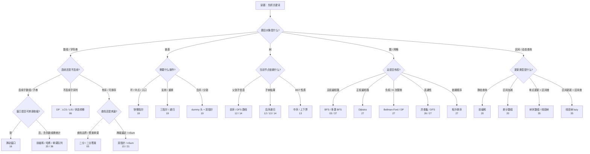
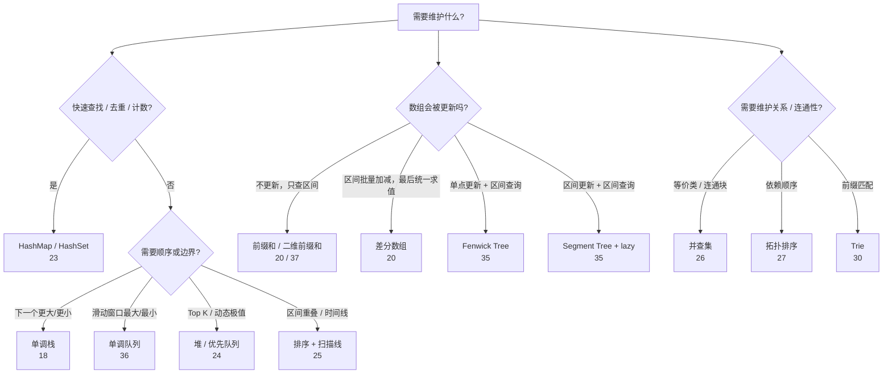
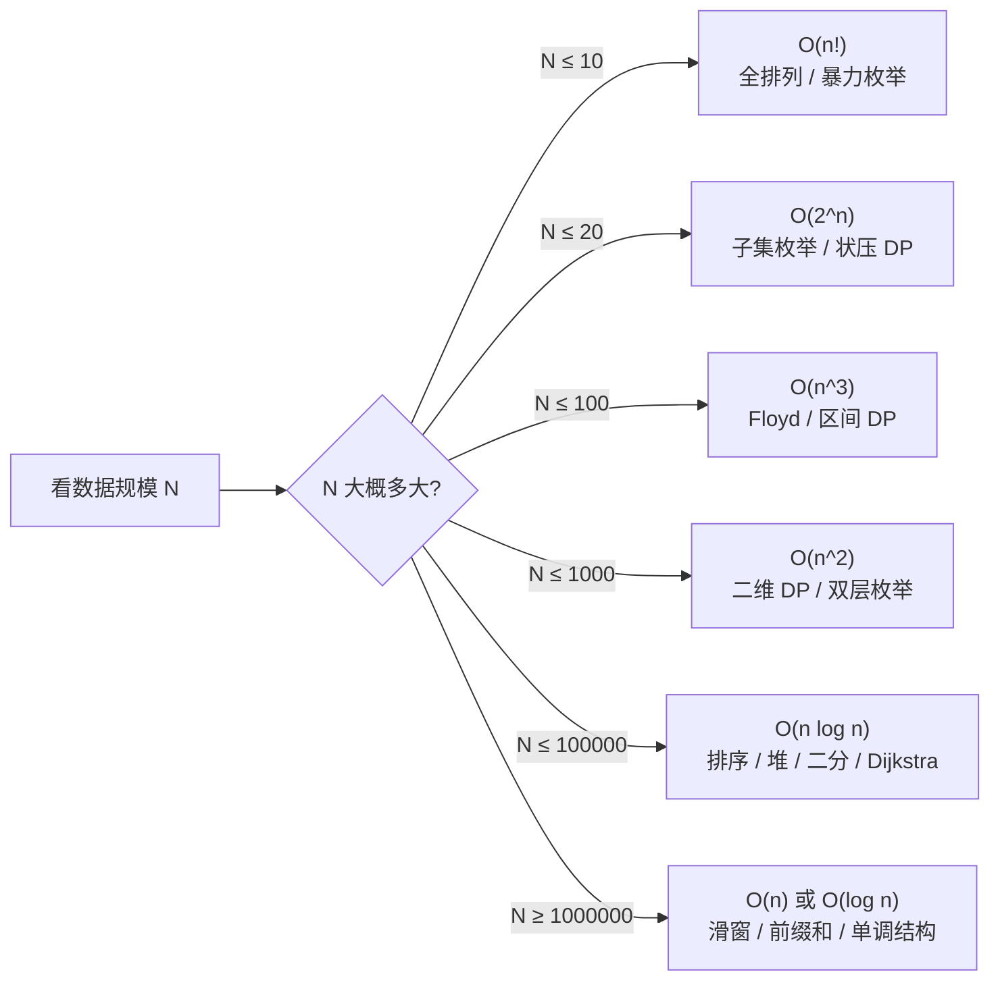
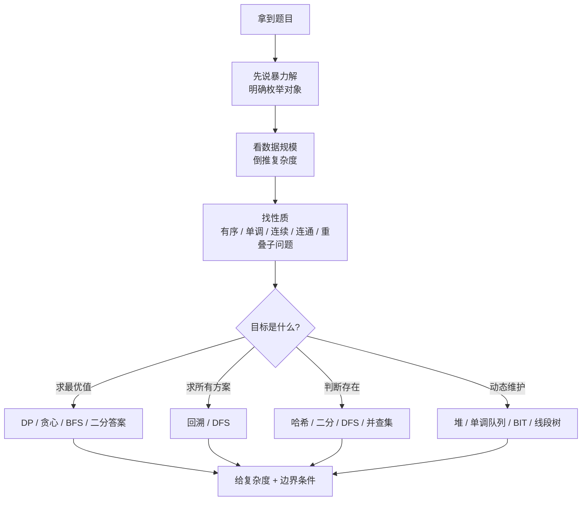

# 算法模式识别 — 综合总结

> 核心一句话：**看到什么 → 想到什么。这道题考的是哪个模式？用什么数据结构？什么算法框架？**

---

## 🗺️ 解题决策总图



---

## 🎯 完整模式速查表

### 按问题类型快速定位

| 问题问什么 | 想到什么 | 对应文件 |
|---|---|---|
| **最大值 / 最小值 / 最优解** | DP / 贪心 / 二分答案 | `06` / `33` / `05` |
| **方案总数 / 多少种方式** | DP / 组合数学 / 回溯 | `06` / `04` |
| **是否存在 / 是否可能** | 哈希表 / DFS / 二分搜索 | `23` / `02` / `05` |
| **所有解 / 所有路径 / 所有组合** | 回溯（DFS） | `02` / `04` |
| **最短步数 / 最少次数 / 最短路径** | BFS / Dijkstra | `03` / `27` |
| **第 K 大 / 第 K 小 / Top K** | 堆 / 快速选择 | `24` / `05` |
| **最长 / 最大子数组 / 子串** | DP / 滑动窗口 / 前缀和 | `06` / `16` / `20` |
| **子串 / 子数组（连续）** | 滑动窗口 / 前缀和 | `16` / `20` |
| **子序列（可不连续）** | DP（LCS / LIS） | `06` |
| **排列 / 组合 / 子集** | 回溯模板 | `04` |
| **回文判断 / 回文子串** | 中心扩展 / Manacher / DP | `22` |
| **区间合并 / 交集 / 重叠** | 排序 + 贪心 / 扫描线 | `25` |
| **区间内全部加减** | 差分数组 | `20` |
| **动态区间查询 / 单点更新** | 树状数组 / 线段树 | `35` |
| **滑动窗口最大/最小值** | 单调队列 | `36` |
| **网格连通块 / 矩阵距离** | DFS/BFS / 多源 BFS | `37` / `03` |
| **循环节 / 重复模式** | KMP 前缀函数 / 数学 | `28` |
| **括号匹配 / 表达式求值** | 栈 | `32` |

### 一、数组/字符串

| 看到什么 | 想到什么 | 对应文件 |
|---|---|---|
| **有序数组 + 搜索** | 二分搜索 | `05` |
| **子串 / 子数组 / 连续区间** | 滑动窗口 / 前缀和 | `16` / `20` |
| **升序数组 + 两数之和** | 双指针左右夹逼 | `15` |
| **数组原地去重 / 移动 / 保留 k 位** | 快慢指针 | `15` |
| **合并两个有序数组/链表** | 归并双指针 | `15` |
| **按值分区 / 三色排序** | 三指针（荷兰国旗） | `15` |
| **接雨水 / 最大面积 / 柱状图** | 双指针 / 单调栈 | `15` / `18` |
| **下一个更大/更小元素** | 单调栈 | `18` |
| **固定窗口最大/最小值** | 单调队列 | `36` |
| **含负数的最短子数组和 ≥ K** | 前缀和 + 单调队列 | `36` |
| **单点更新 + 区间和查询** | 树状数组 / 线段树 | `35` |
| **逆序对 / 右侧小于当前元素** | 离散化 + 树状数组 | `35` |
| **区间重叠 / 合并 / 交集** | 排序 + 遍历 / 扫描线 | `25` |
| **排列 / 组合 / 子集** | 回溯（DFS） | `04` |
| **所有解 / 路径 / 棋盘** | 回溯 / DFS | `02` |
| **最短路径 / 最少步数** | BFS | `03` |
| **最值 + 重叠子问题** | 动态规划 | `06` |
| **背包 / 子集和 / 组合数** | 0-1 / 完全背包 | `07` |
| **股票 / 状态机** | 三维 DP + 状态压缩 | `08` |
| **最大子数组和** | Kadane（前缀和最值） | `20` |
| **最大值最小化 / 最小值最大化** | 二分答案 | `05` |
| **字符串单模式匹配** | KMP / Rabin-Karp | `28` |
| **字符串多模式匹配** | Trie / AC 自动机 | `30` |
| **数组中有重复 / 找缺失数** | 原地交换 / 位运算 | `31` |

### 二、链表

| 看到什么 | 想到什么 | 对应文件 |
|---|---|---|
| **链表环 / 环入口 / 中点** | 快慢指针 | `19` |
| **相交链表** | 双指针走 A+B | `19` |
| **反转 / 重排 / 区间反转** | 三指针迭代 / 递归 | `19` |
| **合并 / 分割 / 排序** | dummy 头 + 双指针 | `19` |
| **K 个一组反转** | 递归 + 迭代 | `19` |
| **回文链表** | 快慢找中点 + 反转后半 | `19` |
| **复制带随机指针** | 三步法：复制→设random→拆分 | `99` |

### 三、树

| 看到什么 | 想到什么 | 对应文件 |
|---|---|---|
| **二叉树的遍历 / 属性** | 递归（前/中/后序位置） | `12` |
| **BST 性质** | 中序 = 升序 + 左小右大 | `13` |
| **需要子树信息才能算当前** | 后序遍历 | `12` |
| **LCA / 公共祖先** | 后序 + 子树判断 | `14` |
| **序列化 / 反序列化** | 前序/层序 + 分隔符 | `14` |
| **路径总和 / 路径记录** | DFS 回溯 / 递归减 target | `14` |
| **最大路径和** | 后序 + 全局变量 | `14` |
| **树的子结构 / 子树匹配** | 双递归匹配 | `99` |
| **构造二叉树（前+中 / 后+中）** | 分治递归 | `12` |
| **右视图 / 层序遍历** | BFS 每层最后一个 | `14` / `12` |

### 四、图

| 看到什么 | 想到什么 | 对应文件 |
|---|---|---|
| **连通块 / 冗余连接 / 合并账户** | 并查集（DSU） | `26` |
| **有向无环 / 先修关系 / 依赖顺序** | 拓扑排序（Kahn） | `27` |
| **单源最短路径（正权）** | Dijkstra（堆优化） | `27` |
| **单源最短路径（负权 / K 次中转）** | Bellman-Ford | `27` |
| **全源最短路（小图）** | Floyd-Warshall | `27` |
| **最小生成树（稀疏图）** | Kruskal（并查集） | `27` |
| **最小生成树（稠密图）** | Prim（堆优化） | `27` |
| **二分图 / 双色问题** | DFS/BFS 染色 | `27` |
| **关键连接 / 割点** | Tarjan（low 数组） | `27` |
| **多模式匹配 / 前缀词典** | Trie | `30` |
| **图判环（有向）** | 三色标记 / 拓扑排序 | `27` |
| **图判环（无向）** | DFS parent 法 | `27` |

### 五、矩阵 / 网格

| 看到什么 | 想到什么 | 对应文件 |
|---|---|---|
| **岛屿数量 / 最大岛屿面积** | 网格 DFS/BFS | `37` |
| **所有腐烂橘子 / 到最近 0 的距离** | 多源 BFS | `37` / `03` |
| **子矩阵区域和频繁查询** | 二维前缀和 | `37` |
| **旋转图像 / 原地矩阵变换** | 坐标映射 / 转置翻转 | `37` |
| **螺旋遍历 / 边界收缩** | 四边界模拟 | `37` |

### 六、设计类

| 看到什么 | 想到什么 | 对应文件 |
|---|---|---|
| **O(1) 查增删 + 最近使用** | LRU = 哈希表 + 双向链表 | `29` |
| **O(1) 查增删 + 最少使用** | LFU = 频率链表组 | `29` |
| **O(1) 插入删除随机获取** | 哈希表 + 动态数组 | `32` |
| **O(1) 求最大/最小** | 堆（优先队列） | `24` |
| **数据流中位数** | 双堆（大顶堆+小顶堆） | `24` |
| **最小栈（O(1) 取 min）** | 辅助栈 | `32` |
| **BST 迭代器** | 栈模拟中序 | `14` |

### 七、技巧类

| 看到什么 | 想到什么 | 对应文件 |
|---|---|---|
| **出现一次 / 其余两次** | 异或（a⊕a=0） | `31` |
| **出现一次 / 其余三次** | 位计数 mod 3 | `31` |
| **区间全部加减** | 差分数组 | `20` |
| **字符串单模式匹配** | KMP / Rabin-Karp | `28` |
| **字符串多模式匹配** | Trie / AC 自动机 | `30` |
| **几何 / 最大面积** | 双指针 / 单调栈 | `15` / `18` |
| **等差数列 / 等比 / 规律** | 数学推导 / 双指针 | — |

---

## 🧭 数据结构选型图



---

## 🧠 二分答案识别指南

> 当题目要求"最大值最小化"或"最小值最大化"时，考虑二分答案。

| 特征 | 示例题 | 二分什么 |
|---|---|---|
| 把数组分成 m 份，求每份和的最大值最小 | 410.分割数组最大值 | 最大和 |
| 在 D 天内运完，求最小运力 | 1011.运包裹 | 每天运力 |
| h 小时内吃完，求最小速度 | 875.吃香蕉 | 每小时吃几个 |
| 求第 K 小的距离 / 第 K 小的数 | 719.第 K 小的距离对 | 距离值 |
| 求最小的满足条件的值 | 1283.最小除数 | 除数 |

判断方法：**如果答案 x 满足条件，那么 >x 也一定满足（单调性）** → 可二分。

---

## 📊 复杂度速查



```
O(1):     数组随机访问、哈希表查增删
O(log n): 二分搜索、平衡树操作
O(n):     线性遍历、前缀和、单调栈
O(n log n): 排序、Dijkstra、分治
O(n²):    双层循环、朴素 DP、Floyd
O(2ⁿ):    回溯、子集枚举（n ≤ 20）
O(n!):    全排列（n ≤ 10）
```

### 数据规模 → 可接受算法

| N ≤ | 可接受复杂度 | 算法类型 |
|---|---|---|
| 10 | O(n!) | 全排列、暴力搜索 |
| 20 | O(2ⁿ) | 回溯、子集枚举 |
| 10² | O(n³) | Floyd、三重循环 |
| 10³ | O(n²) | 朴素 DP、双层循环 |
| 10⁵ | O(n log n) | 排序、Dijkstra、分治 |
| 10⁶ | O(n) | 线性扫描、前缀和 |
| 10⁹ | O(log n) | 二分搜索、数学公式 |

---

## 💡 面试通用策略



```
面对一道题，按这个顺序思考：

① 暴力解是什么？（别跳步，先想最简单的）
② 数据规模是多少？（决定可接受的复杂度）
③ 有没有重复计算？（有 → DP/备忘录）
④ 数据有什么性质？（有序？单调？有环？BST？）
⑤ 需要最优解还是所有解？
   最优 → DP / BFS / 贪心 / 二分答案
   所有 → 回溯 / DFS
   判断是否存在 → 哈希 / 二分
⑥ 时间空间复杂度要求？需要原地吗？
```

### 常见思考框架

```
看到「连续子数组」:
  → 最大/最小 → 滑动窗口 / DP
  → 求和/积   → 前缀和
  → 统计个数   → 前缀和 + 哈希表

看到「树」:
  → 遍历顺序有关 → 前/中/后序
  → 子树有关    → 后序（需要子结果）
  → BST        → 中序 = 升序
  → 路径       → DFS + 回溯

看到「两个数组/字符串」:
  → 比较 / 匹配 → 双指针
  → 最长公共   → DP（LCS）
  → 合并       → 归并

看到「矩阵 / 网格」:
  → 最短路径 / 最少步数 → BFS / 多源 BFS
  → 路径条数 → DP
  → 岛屿 / 连通块 → DFS / BFS / 并查集
  → 子矩阵求和 → 二维前缀和
  → 顺时针/螺旋遍历 → 四边界收缩
```

---

> **关联阅读：** `00` 到 `37` 所有文件 — 这就是它们的综合总结。
