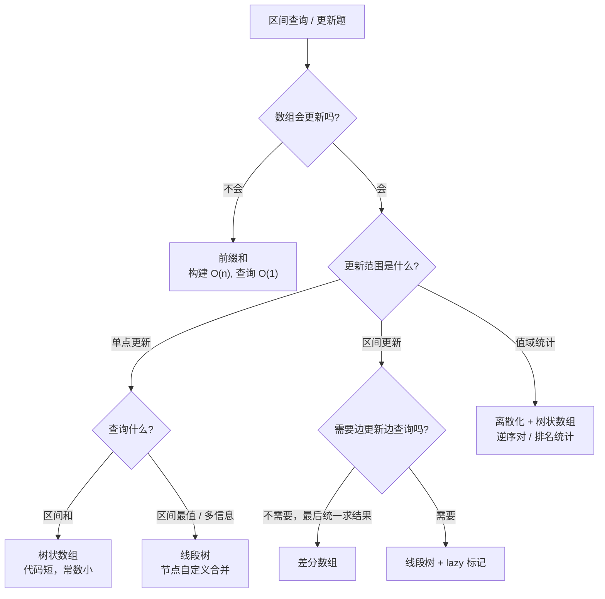
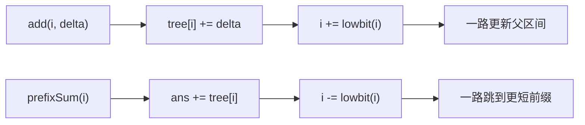
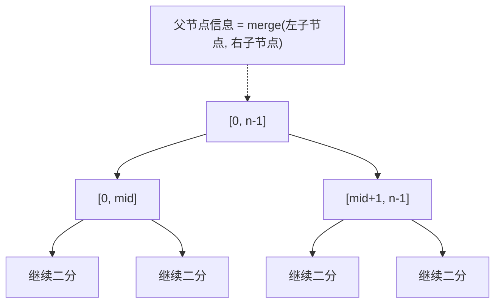

# 线段树与树状数组

> 核心一句话：**树状数组解决「前缀和 + 单点更新」，线段树解决更通用的「区间查询 + 区间更新」。**
>
> 规律：「动态数组区间和」优先树状数组；「区间最值 / 区间修改 / 多信息维护」用线段树。

---

## 🎯 经典 LeetCode 题目

| # | 题号 | 题目 | 难度 | 核心考点 | 推荐指数 |
|---|---|---|:---:|---|:---:|
| 1 | [307](https://leetcode.cn/problems/range-sum-query-mutable/) | 区域和检索 - 数组可修改 | 🟡 | BIT / 线段树模板 | ⭐⭐⭐ |
| 2 | [315](https://leetcode.cn/problems/count-of-smaller-numbers-after-self/) | 计算右侧小于当前元素的个数 | 🔴 | 离散化 + BIT | ⭐⭐⭐ |
| 3 | [493](https://leetcode.cn/problems/reverse-pairs/) | 翻转对 | 🔴 | 离散化 + BIT / 归并 | ⭐⭐⭐ |
| 4 | [218](https://leetcode.cn/problems/the-skyline-problem/) | 天际线问题 | 🔴 | 扫描线 + 有序结构 | ⭐⭐ |
| 5 | [327](https://leetcode.cn/problems/count-of-range-sum/) | 区间和的个数 | 🔴 | 前缀和 + BIT / 归并 | ⭐⭐⭐ |

---

## 🗺️ 区间数据结构选型图



## 🌲 Fenwick Tree 更新 / 查询方向



---

## 📋 目录

1. [选型判断](#选型判断)
2. [树状数组 Fenwick Tree](#树状数组-fenwick-tree)
3. [问题一：可修改数组区间和](#问题一可修改数组区间和)
4. [问题二：右侧小于当前元素个数](#问题二右侧小于当前元素个数)
5. [线段树 Segment Tree](#线段树-segment-tree)
6. [线段树懒标记](#线段树懒标记)
7. [复杂度速查表](#-复杂度速查表)
8. [刷题建议](#-刷题建议)

---

## 选型判断

| 场景 | 推荐结构 | 原因 |
|---|---|---|
| 单点更新 + 区间和查询 | 树状数组 | 代码短，常数小 |
| 前缀频次统计 / 逆序对 | 树状数组 + 离散化 | 把值域映射成排名 |
| 区间最小值 / 最大值 / 多字段合并 | 线段树 | 节点可以存任意信息 |
| 区间加值 + 区间查询 | 线段树 + lazy | 延迟下推避免逐点更新 |

---

## 树状数组 Fenwick Tree

```text
lowbit(x) = x & -x
tree[i] 维护一段以 i 结尾、长度为 lowbit(i) 的区间和
update(i, delta): i += lowbit(i)
query(i): i -= lowbit(i)
```

```typescript
class FenwickTree {
  private tree: number[];

  constructor(size: number) {
    this.tree = new Array(size + 1).fill(0);
  }

  add(index: number, delta: number): void {
    for (let i = index; i < this.tree.length; i += i & -i) {
      this.tree[i] += delta;
    }
  }

  prefixSum(index: number): number {
    let sum = 0;
    for (let i = index; i > 0; i -= i & -i) {
      sum += this.tree[i];
    }
    return sum;
  }

  rangeSum(left: number, right: number): number {
    return this.prefixSum(right) - this.prefixSum(left - 1);
  }
}
```

```python
class FenwickTree:
    def __init__(self, size: int):
        self.tree = [0] * (size + 1)

    def add(self, index: int, delta: int) -> None:
        i = index
        while i < len(self.tree):
            self.tree[i] += delta
            i += i & -i

    def prefix_sum(self, index: int) -> int:
        total = 0
        i = index
        while i > 0:
            total += self.tree[i]
            i -= i & -i
        return total

    def range_sum(self, left: int, right: int) -> int:
        return self.prefix_sum(right) - self.prefix_sum(left - 1)
```

---

## 问题一：可修改数组区间和

> [307. 区域和检索 - 数组可修改](https://leetcode.cn/problems/range-sum-query-mutable/)

```typescript
class NumArray {
  private nums: number[];
  private bit: FenwickTree;

  constructor(nums: number[]) {
    this.nums = nums.slice();
    this.bit = new FenwickTree(nums.length);
    for (let i = 0; i < nums.length; i++) {
      this.bit.add(i + 1, nums[i]);
    }
  }

  update(index: number, val: number): void {
    const delta = val - this.nums[index];
    this.nums[index] = val;
    this.bit.add(index + 1, delta);
  }

  sumRange(left: number, right: number): number {
    return this.bit.rangeSum(left + 1, right + 1);
  }
}
```

```python
class NumArray:
    def __init__(self, nums: list[int]):
        self.nums = nums[:]
        self.bit = FenwickTree(len(nums))
        for i, num in enumerate(nums):
            self.bit.add(i + 1, num)

    def update(self, index: int, val: int) -> None:
        delta = val - self.nums[index]
        self.nums[index] = val
        self.bit.add(index + 1, delta)

    def sumRange(self, left: int, right: int) -> int:
        return self.bit.range_sum(left + 1, right + 1)
```

---

## 问题二：右侧小于当前元素个数

> [315. 计算右侧小于当前元素的个数](https://leetcode.cn/problems/count-of-smaller-numbers-after-self/)
>
> 思路：从右往左扫描。当前数 `x` 的答案等于已经出现过的、排名小于 `x` 的数量。

```typescript
function countSmaller(nums: number[]): number[] {
  const sorted = Array.from(new Set(nums)).sort((a, b) => a - b);
  const rank = new Map<number, number>();
  sorted.forEach((num, i) => rank.set(num, i + 1));

  const bit = new FenwickTree(sorted.length);
  const ans = new Array(nums.length).fill(0);

  for (let i = nums.length - 1; i >= 0; i--) {
    const r = rank.get(nums[i])!;
    ans[i] = bit.prefixSum(r - 1);
    bit.add(r, 1);
  }

  return ans;
}
```

```python
def count_smaller(nums: list[int]) -> list[int]:
    sorted_nums = sorted(set(nums))
    rank = {num: i + 1 for i, num in enumerate(sorted_nums)}
    bit = FenwickTree(len(sorted_nums))
    ans = [0] * len(nums)

    for i in range(len(nums) - 1, -1, -1):
        r = rank[nums[i]]
        ans[i] = bit.prefix_sum(r - 1)
        bit.add(r, 1)

    return ans
```

---

## 线段树 Segment Tree

> 线段树把数组不断二分，每个节点维护一个区间的信息。下面模板维护区间和，支持单点更新。



```typescript
class SegmentTree {
  private tree: number[];
  private n: number;

  constructor(nums: number[]) {
    this.n = nums.length;
    this.tree = new Array(this.n * 4).fill(0);
    if (this.n > 0) this.build(nums, 1, 0, this.n - 1);
  }

  private build(nums: number[], node: number, left: number, right: number): void {
    if (left === right) {
      this.tree[node] = nums[left];
      return;
    }
    const mid = Math.floor((left + right) / 2);
    this.build(nums, node * 2, left, mid);
    this.build(nums, node * 2 + 1, mid + 1, right);
    this.tree[node] = this.tree[node * 2] + this.tree[node * 2 + 1];
  }

  update(index: number, val: number): void {
    this.updateNode(1, 0, this.n - 1, index, val);
  }

  private updateNode(node: number, left: number, right: number, index: number, val: number): void {
    if (left === right) {
      this.tree[node] = val;
      return;
    }
    const mid = Math.floor((left + right) / 2);
    if (index <= mid) this.updateNode(node * 2, left, mid, index, val);
    else this.updateNode(node * 2 + 1, mid + 1, right, index, val);
    this.tree[node] = this.tree[node * 2] + this.tree[node * 2 + 1];
  }

  query(qLeft: number, qRight: number): number {
    return this.queryNode(1, 0, this.n - 1, qLeft, qRight);
  }

  private queryNode(node: number, left: number, right: number, qLeft: number, qRight: number): number {
    if (qLeft <= left && right <= qRight) return this.tree[node];
    const mid = Math.floor((left + right) / 2);
    let sum = 0;
    if (qLeft <= mid) sum += this.queryNode(node * 2, left, mid, qLeft, qRight);
    if (qRight > mid) sum += this.queryNode(node * 2 + 1, mid + 1, right, qLeft, qRight);
    return sum;
  }
}
```

```python
class SegmentTree:
    def __init__(self, nums: list[int]):
        self.n = len(nums)
        self.tree = [0] * (self.n * 4)
        if self.n:
            self._build(nums, 1, 0, self.n - 1)

    def _build(self, nums: list[int], node: int, left: int, right: int) -> None:
        if left == right:
            self.tree[node] = nums[left]
            return
        mid = (left + right) // 2
        self._build(nums, node * 2, left, mid)
        self._build(nums, node * 2 + 1, mid + 1, right)
        self.tree[node] = self.tree[node * 2] + self.tree[node * 2 + 1]

    def update(self, index: int, val: int) -> None:
        self._update(1, 0, self.n - 1, index, val)

    def _update(self, node: int, left: int, right: int, index: int, val: int) -> None:
        if left == right:
            self.tree[node] = val
            return
        mid = (left + right) // 2
        if index <= mid:
            self._update(node * 2, left, mid, index, val)
        else:
            self._update(node * 2 + 1, mid + 1, right, index, val)
        self.tree[node] = self.tree[node * 2] + self.tree[node * 2 + 1]

    def query(self, q_left: int, q_right: int) -> int:
        return self._query(1, 0, self.n - 1, q_left, q_right)

    def _query(self, node: int, left: int, right: int, q_left: int, q_right: int) -> int:
        if q_left <= left and right <= q_right:
            return self.tree[node]
        mid = (left + right) // 2
        total = 0
        if q_left <= mid:
            total += self._query(node * 2, left, mid, q_left, q_right)
        if q_right > mid:
            total += self._query(node * 2 + 1, mid + 1, right, q_left, q_right)
        return total
```

---

## 线段树懒标记

> 当更新是「整个区间 + delta」时，不要递归到每个叶子。先把增量记在当前节点，等未来访问子节点时再下推。

```typescript
class LazySegmentTree {
  private tree: number[];
  private lazy: number[];

  constructor(private n: number) {
    this.tree = new Array(n * 4).fill(0);
    this.lazy = new Array(n * 4).fill(0);
  }

  private pushDown(node: number, left: number, right: number): void {
    const delta = this.lazy[node];
    if (delta === 0 || left === right) return;
    const mid = Math.floor((left + right) / 2);
    const l = node * 2;
    const r = node * 2 + 1;
    this.tree[l] += delta * (mid - left + 1);
    this.tree[r] += delta * (right - mid);
    this.lazy[l] += delta;
    this.lazy[r] += delta;
    this.lazy[node] = 0;
  }

  addRange(qLeft: number, qRight: number, delta: number): void {
    this.add(1, 0, this.n - 1, qLeft, qRight, delta);
  }

  private add(node: number, left: number, right: number, qLeft: number, qRight: number, delta: number): void {
    if (qLeft <= left && right <= qRight) {
      this.tree[node] += delta * (right - left + 1);
      this.lazy[node] += delta;
      return;
    }
    this.pushDown(node, left, right);
    const mid = Math.floor((left + right) / 2);
    if (qLeft <= mid) this.add(node * 2, left, mid, qLeft, qRight, delta);
    if (qRight > mid) this.add(node * 2 + 1, mid + 1, right, qLeft, qRight, delta);
    this.tree[node] = this.tree[node * 2] + this.tree[node * 2 + 1];
  }
}
```

```python
class LazySegmentTree:
    def __init__(self, n: int):
        self.n = n
        self.tree = [0] * (n * 4)
        self.lazy = [0] * (n * 4)

    def _push_down(self, node: int, left: int, right: int) -> None:
        delta = self.lazy[node]
        if delta == 0 or left == right:
            return
        mid = (left + right) // 2
        l, r = node * 2, node * 2 + 1
        self.tree[l] += delta * (mid - left + 1)
        self.tree[r] += delta * (right - mid)
        self.lazy[l] += delta
        self.lazy[r] += delta
        self.lazy[node] = 0

    def add_range(self, q_left: int, q_right: int, delta: int) -> None:
        self._add(1, 0, self.n - 1, q_left, q_right, delta)

    def _add(self, node: int, left: int, right: int, q_left: int, q_right: int, delta: int) -> None:
        if q_left <= left and right <= q_right:
            self.tree[node] += delta * (right - left + 1)
            self.lazy[node] += delta
            return
        self._push_down(node, left, right)
        mid = (left + right) // 2
        if q_left <= mid:
            self._add(node * 2, left, mid, q_left, q_right, delta)
        if q_right > mid:
            self._add(node * 2 + 1, mid + 1, right, q_left, q_right, delta)
        self.tree[node] = self.tree[node * 2] + self.tree[node * 2 + 1]
```

---

## 📊 复杂度速查表

| 结构 | 构建 | 单点更新 | 区间查询 | 区间更新 | 空间 |
|---|:---:|:---:|:---:|:---:|:---:|
| 前缀和 | O(n) | O(n) | O(1) | 不适合 | O(n) |
| 树状数组 | O(n log n) | O(log n) | O(log n) | 需差分变形 | O(n) |
| 线段树 | O(n) | O(log n) | O(log n) | O(log n) lazy | O(n) |

---

## 🎯 刷题建议

```
[ ] 查询是否动态？静态区间和用前缀和，不要上树。
[ ] 只是求和 + 单点更新？优先树状数组。
[ ] 值域很大但只关心大小关系？先离散化。
[ ] 区间更新是否会覆盖很多点？用 lazy 标记。
[ ] 线段树节点维护的信息是否能由左右子节点合并？
```

---

> **关联阅读：** `20-prefix-sum-and-diff-array.md` → `36-monotonic-queue.md` → `37-matrix-techniques.md`
