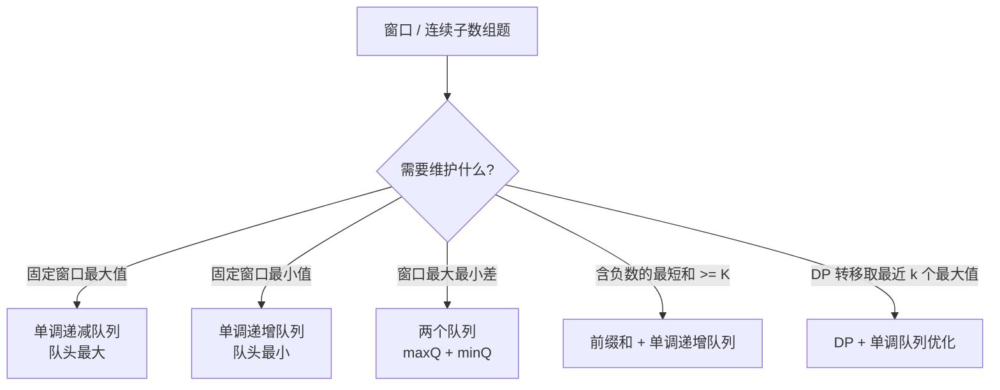

# 单调队列

> 核心一句话：**单调队列是滑动窗口最值问题的标准解法，队列里存候选下标，并保持对应值单调。**
>
> 规律：「固定窗口最大/最小」「窗口内极值随左右端移动」→ 单调队列。

---

## 🎯 经典 LeetCode 题目

| # | 题号 | 题目 | 难度 | 核心考点 | 推荐指数 |
|---|---|---|:---:|---|:---:|
| 1 | [239](https://leetcode.cn/problems/sliding-window-maximum/) | 滑动窗口最大值 | 🔴 | 单调递减队列 | ⭐⭐⭐ |
| 2 | [862](https://leetcode.cn/problems/shortest-subarray-with-sum-at-least-k/) | 和至少为 K 的最短子数组 | 🔴 | 前缀和 + 单调队列 | ⭐⭐⭐ |
| 3 | [1438](https://leetcode.cn/problems/longest-continuous-subarray-with-absolute-diff-less-than-or-equal-to-limit/) | 绝对差不超过限制的最长连续子数组 | 🟡 | 双单调队列 | ⭐⭐⭐ |
| 4 | [1696](https://leetcode.cn/problems/jump-game-vi/) | 跳跃游戏 VI | 🟡 | DP + 单调队列优化 | ⭐⭐ |

---

## 🗺️ 单调队列决策图



## 🧹 入队与过期流程


---

## 📋 目录

1. [单调队列 vs 单调栈](#单调队列-vs-单调栈)
2. [滑动窗口最大值模板](#滑动窗口最大值模板)
3. [问题一：滑动窗口最大值](#问题一滑动窗口最大值)
4. [问题二：和至少为 K 的最短子数组](#问题二和至少为-k-的最短子数组)
5. [问题三：绝对差不超过限制的最长子数组](#问题三绝对差不超过限制的最长子数组)
6. [复杂度速查表](#-复杂度速查表)

---

## 单调队列 vs 单调栈

| 结构 | 解决问题 | 删除位置 | 常见关键词 |
|---|---|---|---|
| 单调栈 | 下一个更大 / 更小 | 只从栈顶删 | 下一个、左边第一个、贡献 |
| 单调队列 | 滑动窗口最值 | 队头过期，队尾维护单调 | 窗口、连续子数组、区间最值 |

---

## 滑动窗口最大值模板

```typescript
function maxSlidingWindowTemplate(nums: number[], k: number): number[] {
  const deque: number[] = []; // 存下标，对应值递减
  const ans: number[] = [];

  for (let right = 0; right < nums.length; right++) {
    while (deque.length && nums[deque[deque.length - 1]] <= nums[right]) {
      deque.pop();
    }
    deque.push(right);

    const left = right - k + 1;
    if (deque[0] < left) deque.shift();
    if (left >= 0) ans.push(nums[deque[0]]);
  }

  return ans;
}
```

```python
from collections import deque

def max_sliding_window_template(nums: list[int], k: int) -> list[int]:
    q = deque()  # 存下标，对应值递减
    ans = []

    for right, num in enumerate(nums):
        while q and nums[q[-1]] <= num:
            q.pop()
        q.append(right)

        left = right - k + 1
        if q[0] < left:
            q.popleft()
        if left >= 0:
            ans.append(nums[q[0]])

    return ans
```

---

## 问题一：滑动窗口最大值

> [239. 滑动窗口最大值](https://leetcode.cn/problems/sliding-window-maximum/)

```typescript
function maxSlidingWindow(nums: number[], k: number): number[] {
  const deque: number[] = [];
  const result: number[] = [];

  for (let i = 0; i < nums.length; i++) {
    while (deque.length && nums[deque[deque.length - 1]] <= nums[i]) {
      deque.pop();
    }
    deque.push(i);

    if (deque[0] <= i - k) deque.shift();
    if (i >= k - 1) result.push(nums[deque[0]]);
  }

  return result;
}
```

```python
from collections import deque

def max_sliding_window(nums: list[int], k: int) -> list[int]:
    q = deque()
    result = []

    for i, num in enumerate(nums):
        while q and nums[q[-1]] <= num:
            q.pop()
        q.append(i)

        if q[0] <= i - k:
            q.popleft()
        if i >= k - 1:
            result.append(nums[q[0]])

    return result
```

---

## 问题二：和至少为 K 的最短子数组

> [862. 和至少为 K 的最短子数组](https://leetcode.cn/problems/shortest-subarray-with-sum-at-least-k/)
>
> 前缀和不单调，不能普通滑窗。维护前缀和下标队列，队列中的前缀和值递增。

```typescript
function shortestSubarray(nums: number[], k: number): number {
  const pre = new Array(nums.length + 1).fill(0);
  for (let i = 0; i < nums.length; i++) pre[i + 1] = pre[i] + nums[i];

  const deque: number[] = [];
  let ans = Infinity;

  for (let i = 0; i < pre.length; i++) {
    while (deque.length && pre[i] - pre[deque[0]] >= k) {
      ans = Math.min(ans, i - deque.shift()!);
    }
    while (deque.length && pre[deque[deque.length - 1]] >= pre[i]) {
      deque.pop();
    }
    deque.push(i);
  }

  return ans === Infinity ? -1 : ans;
}
```

```python
from collections import deque

def shortest_subarray(nums: list[int], k: int) -> int:
    pre = [0]
    for num in nums:
        pre.append(pre[-1] + num)

    q = deque()
    ans = float('inf')

    for i, value in enumerate(pre):
        while q and value - pre[q[0]] >= k:
            ans = min(ans, i - q.popleft())
        while q and pre[q[-1]] >= value:
            q.pop()
        q.append(i)

    return -1 if ans == float('inf') else ans
```

---

## 问题三：绝对差不超过限制的最长子数组

> [1438. 绝对差不超过限制的最长连续子数组](https://leetcode.cn/problems/longest-continuous-subarray-with-absolute-diff-less-than-or-equal-to-limit/)

```typescript
function longestSubarray(nums: number[], limit: number): number {
  const maxQ: number[] = [];
  const minQ: number[] = [];
  let left = 0;
  let ans = 0;

  for (let right = 0; right < nums.length; right++) {
    while (maxQ.length && nums[maxQ[maxQ.length - 1]] <= nums[right]) maxQ.pop();
    while (minQ.length && nums[minQ[minQ.length - 1]] >= nums[right]) minQ.pop();
    maxQ.push(right);
    minQ.push(right);

    while (nums[maxQ[0]] - nums[minQ[0]] > limit) {
      if (maxQ[0] === left) maxQ.shift();
      if (minQ[0] === left) minQ.shift();
      left++;
    }

    ans = Math.max(ans, right - left + 1);
  }

  return ans;
}
```

```python
from collections import deque

def longest_subarray(nums: list[int], limit: int) -> int:
    max_q, min_q = deque(), deque()
    left = 0
    ans = 0

    for right, num in enumerate(nums):
        while max_q and nums[max_q[-1]] <= num:
            max_q.pop()
        while min_q and nums[min_q[-1]] >= num:
            min_q.pop()
        max_q.append(right)
        min_q.append(right)

        while nums[max_q[0]] - nums[min_q[0]] > limit:
            if max_q[0] == left:
                max_q.popleft()
            if min_q[0] == left:
                min_q.popleft()
            left += 1

        ans = max(ans, right - left + 1)

    return ans
```

---

## 📊 复杂度速查表

| 问题 | 时间复杂度 | 空间复杂度 | 关键点 |
|---|:---:|:---:|---|
| 239 滑动窗口最大值 | O(n) | O(k) | 队头是窗口最大值 |
| 862 最短子数组 | O(n) | O(n) | 前缀和递增队列 |
| 1438 最长连续子数组 | O(n) | O(n) | 最大队列 + 最小队列 |
| 1696 跳跃游戏 VI | O(n) | O(k) | DP 转移取窗口最大 |

---

## 🎯 刷题建议

```
[ ] 队列里存下标，不要只存值，否则无法判断过期。
[ ] 求最大值时队列递减；求最小值时队列递增。
[ ] 先处理队尾单调性，再处理队头过期，顺序要稳定。
[ ] 含负数的子数组和问题，普通滑动窗口通常失效，考虑前缀和 + 单调队列。
```

---

> **关联阅读：** `16-sliding-window.md` → `18-monotonic-stack.md` → `20-prefix-sum-and-diff-array.md`
