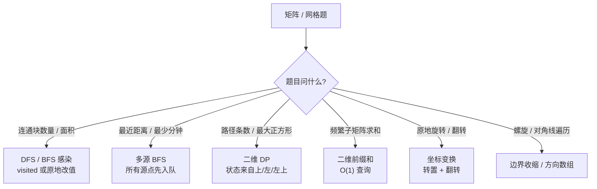
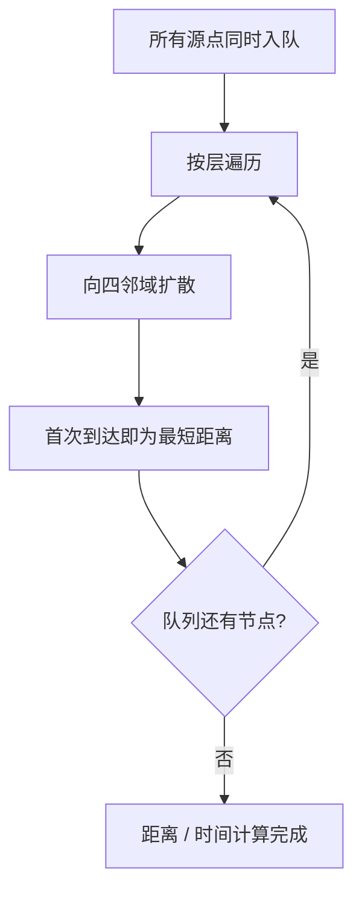

# 矩阵技巧

> 核心一句话：**矩阵题本质是数组题加上二维坐标，核心工具是方向数组、边界控制、BFS/DFS、二维前缀和。**
>
> 规律：「网格连通块」→ DFS/BFS；「最近距离」→ 多源 BFS；「子矩阵求和」→ 二维前缀和；「原地变换」→ 坐标映射。

---

## 🎯 经典 LeetCode 题目

| # | 题号 | 题目 | 难度 | 核心考点 | 推荐指数 |
|---|---|---|:---:|---|:---:|
| 1 | [200](https://leetcode.cn/problems/number-of-islands/) | 岛屿数量 | 🟡 | 网格 DFS/BFS | ⭐⭐⭐ |
| 2 | [695](https://leetcode.cn/problems/max-area-of-island/) | 岛屿的最大面积 | 🟡 | 连通块计数 | ⭐⭐ |
| 3 | [994](https://leetcode.cn/problems/rotting-oranges/) | 腐烂的橘子 | 🟡 | 多源 BFS | ⭐⭐⭐ |
| 4 | [542](https://leetcode.cn/problems/01-matrix/) | 01 矩阵 | 🟡 | 多源 BFS 距离 | ⭐⭐⭐ |
| 5 | [48](https://leetcode.cn/problems/rotate-image/) | 旋转图像 | 🟡 | 原地坐标变换 | ⭐⭐ |
| 6 | [54](https://leetcode.cn/problems/spiral-matrix/) | 螺旋矩阵 | 🟡 | 边界模拟 | ⭐⭐ |
| 7 | [304](https://leetcode.cn/problems/range-sum-query-2d-immutable/) | 二维区域和检索 | 🟡 | 二维前缀和 | ⭐⭐ |

---

## 🗺️ 矩阵题型决策图



## 🌊 多源 BFS 扩散模型



---

## 📋 目录

1. [方向数组模板](#方向数组模板)
2. [网格 DFS：岛屿数量](#网格-dfs岛屿数量)
3. [多源 BFS：腐烂的橘子](#多源-bfs腐烂的橘子)
4. [二维前缀和](#二维前缀和)
5. [原地旋转矩阵](#原地旋转矩阵)
6. [螺旋遍历](#螺旋遍历)
7. [复杂度速查表](#-复杂度速查表)

---

## 方向数组模板

```typescript
const DIRS = [
  [1, 0],
  [-1, 0],
  [0, 1],
  [0, -1],
];

function inBounds(grid: unknown[][], r: number, c: number): boolean {
  return r >= 0 && r < grid.length && c >= 0 && c < grid[0].length;
}
```

```python
DIRS = [(1, 0), (-1, 0), (0, 1), (0, -1)]

def in_bounds(grid: list[list[object]], r: int, c: int) -> bool:
    return 0 <= r < len(grid) and 0 <= c < len(grid[0])
```

---

## 网格 DFS：岛屿数量

> [200. 岛屿数量](https://leetcode.cn/problems/number-of-islands/)

```typescript
function numIslands(grid: string[][]): number {
  if (grid.length === 0) return 0;
  const rows = grid.length;
  const cols = grid[0].length;
  let count = 0;

  function dfs(r: number, c: number): void {
    if (r < 0 || r >= rows || c < 0 || c >= cols || grid[r][c] !== "1") return;
    grid[r][c] = "0";
    for (const [dr, dc] of DIRS) dfs(r + dr, c + dc);
  }

  for (let r = 0; r < rows; r++) {
    for (let c = 0; c < cols; c++) {
      if (grid[r][c] === "1") {
        count++;
        dfs(r, c);
      }
    }
  }

  return count;
}
```

```python
def num_islands(grid: list[list[str]]) -> int:
    if not grid:
        return 0

    rows, cols = len(grid), len(grid[0])

    def dfs(r: int, c: int) -> None:
        if r < 0 or r >= rows or c < 0 or c >= cols or grid[r][c] != "1":
            return
        grid[r][c] = "0"
        for dr, dc in DIRS:
            dfs(r + dr, c + dc)

    count = 0
    for r in range(rows):
        for c in range(cols):
            if grid[r][c] == "1":
                count += 1
                dfs(r, c)

    return count
```

---

## 多源 BFS：腐烂的橘子

> [994. 腐烂的橘子](https://leetcode.cn/problems/rotting-oranges/)
>
> 多源 BFS 的关键：先把所有起点一起入队，按层扩散。

```typescript
function orangesRotting(grid: number[][]): number {
  const rows = grid.length;
  const cols = grid[0].length;
  const queue: [number, number][] = [];
  let fresh = 0;

  for (let r = 0; r < rows; r++) {
    for (let c = 0; c < cols; c++) {
      if (grid[r][c] === 2) queue.push([r, c]);
      if (grid[r][c] === 1) fresh++;
    }
  }

  let minutes = 0;
  let head = 0;
  while (head < queue.length && fresh > 0) {
    const size = queue.length - head;
    for (let i = 0; i < size; i++) {
      const [r, c] = queue[head++];
      for (const [dr, dc] of DIRS) {
        const nr = r + dr;
        const nc = c + dc;
        if (nr < 0 || nr >= rows || nc < 0 || nc >= cols || grid[nr][nc] !== 1) continue;
        grid[nr][nc] = 2;
        fresh--;
        queue.push([nr, nc]);
      }
    }
    minutes++;
  }

  return fresh === 0 ? minutes : -1;
}
```

```python
from collections import deque

def oranges_rotting(grid: list[list[int]]) -> int:
    rows, cols = len(grid), len(grid[0])
    q = deque()
    fresh = 0

    for r in range(rows):
        for c in range(cols):
            if grid[r][c] == 2:
                q.append((r, c))
            elif grid[r][c] == 1:
                fresh += 1

    minutes = 0
    while q and fresh > 0:
        for _ in range(len(q)):
            r, c = q.popleft()
            for dr, dc in DIRS:
                nr, nc = r + dr, c + dc
                if nr < 0 or nr >= rows or nc < 0 or nc >= cols or grid[nr][nc] != 1:
                    continue
                grid[nr][nc] = 2
                fresh -= 1
                q.append((nr, nc))
        minutes += 1

    return minutes if fresh == 0 else -1
```

---

## 二维前缀和

> [304. 二维区域和检索 - 矩阵不可变](https://leetcode.cn/problems/range-sum-query-2d-immutable/)

```text
pre[r+1][c+1] = matrix[0..r][0..c] 的总和
sumRegion(r1,c1,r2,c2)
  = pre[r2+1][c2+1] - pre[r1][c2+1] - pre[r2+1][c1] + pre[r1][c1]
```

```typescript
class NumMatrix {
  private pre: number[][];

  constructor(matrix: number[][]) {
    const rows = matrix.length;
    const cols = rows ? matrix[0].length : 0;
    this.pre = Array.from({ length: rows + 1 }, () => new Array(cols + 1).fill(0));

    for (let r = 0; r < rows; r++) {
      for (let c = 0; c < cols; c++) {
        this.pre[r + 1][c + 1] =
          this.pre[r][c + 1] + this.pre[r + 1][c] - this.pre[r][c] + matrix[r][c];
      }
    }
  }

  sumRegion(row1: number, col1: number, row2: number, col2: number): number {
    return (
      this.pre[row2 + 1][col2 + 1] -
      this.pre[row1][col2 + 1] -
      this.pre[row2 + 1][col1] +
      this.pre[row1][col1]
    );
  }
}
```

```python
class NumMatrix:
    def __init__(self, matrix: list[list[int]]):
        rows = len(matrix)
        cols = len(matrix[0]) if rows else 0
        self.pre = [[0] * (cols + 1) for _ in range(rows + 1)]

        for r in range(rows):
            for c in range(cols):
                self.pre[r + 1][c + 1] = (
                    self.pre[r][c + 1]
                    + self.pre[r + 1][c]
                    - self.pre[r][c]
                    + matrix[r][c]
                )

    def sumRegion(self, row1: int, col1: int, row2: int, col2: int) -> int:
        return (
            self.pre[row2 + 1][col2 + 1]
            - self.pre[row1][col2 + 1]
            - self.pre[row2 + 1][col1]
            + self.pre[row1][col1]
        )
```

---

## 原地旋转矩阵

> [48. 旋转图像](https://leetcode.cn/problems/rotate-image/)
>
> 顺时针旋转 90 度 = 先沿主对角线转置，再左右翻转每一行。

```typescript
function rotate(matrix: number[][]): void {
  const n = matrix.length;

  for (let r = 0; r < n; r++) {
    for (let c = r + 1; c < n; c++) {
      [matrix[r][c], matrix[c][r]] = [matrix[c][r], matrix[r][c]];
    }
  }

  for (const row of matrix) {
    row.reverse();
  }
}
```

```python
def rotate(matrix: list[list[int]]) -> None:
    n = len(matrix)

    for r in range(n):
        for c in range(r + 1, n):
            matrix[r][c], matrix[c][r] = matrix[c][r], matrix[r][c]

    for row in matrix:
        row.reverse()
```

---

## 螺旋遍历

> [54. 螺旋矩阵](https://leetcode.cn/problems/spiral-matrix/)

```typescript
function spiralOrder(matrix: number[][]): number[] {
  const ans: number[] = [];
  let top = 0;
  let bottom = matrix.length - 1;
  let left = 0;
  let right = matrix[0].length - 1;

  while (top <= bottom && left <= right) {
    for (let c = left; c <= right; c++) ans.push(matrix[top][c]);
    top++;
    for (let r = top; r <= bottom; r++) ans.push(matrix[r][right]);
    right--;
    if (top <= bottom) {
      for (let c = right; c >= left; c--) ans.push(matrix[bottom][c]);
      bottom--;
    }
    if (left <= right) {
      for (let r = bottom; r >= top; r--) ans.push(matrix[r][left]);
      left++;
    }
  }

  return ans;
}
```

```python
def spiral_order(matrix: list[list[int]]) -> list[int]:
    ans = []
    top, bottom = 0, len(matrix) - 1
    left, right = 0, len(matrix[0]) - 1

    while top <= bottom and left <= right:
        for c in range(left, right + 1):
            ans.append(matrix[top][c])
        top += 1
        for r in range(top, bottom + 1):
            ans.append(matrix[r][right])
        right -= 1
        if top <= bottom:
            for c in range(right, left - 1, -1):
                ans.append(matrix[bottom][c])
            bottom -= 1
        if left <= right:
            for r in range(bottom, top - 1, -1):
                ans.append(matrix[r][left])
            left += 1

    return ans
```

---

## 📊 复杂度速查表

| 问题 | 时间复杂度 | 空间复杂度 | 关键点 |
|---|:---:|:---:|---|
| 岛屿 DFS/BFS | O(mn) | O(mn) | 每个格子最多访问一次 |
| 多源 BFS | O(mn) | O(mn) | 所有源点先入队 |
| 二维前缀和构建 | O(mn) | O(mn) | 查询 O(1) |
| 原地旋转 | O(n²) | O(1) | 转置 + 翻转 |
| 螺旋遍历 | O(mn) | O(1) | 四边界收缩 |

---

## 🎯 刷题建议

```
[ ] 坐标是否越界？先写 inBounds。
[ ] 需要最短距离还是所有连通块？最短距离优先 BFS。
[ ] 是否有多个起点同时扩散？多源 BFS。
[ ] 能否修改原矩阵作为 visited？不能就单独开 visited。
[ ] 子矩阵和是否被频繁查询？二维前缀和。
```

---

> **关联阅读：** `03-bfs-framework.md` → `20-prefix-sum-and-diff-array.md` → `35-segment-tree-and-bit.md`
