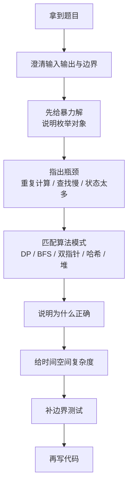

# 面试表达模板

> 核心一句话：**面试不是只写出代码，而是把“怎么想到、为什么对、复杂度多少、边界怎么处理”讲清楚。**
>
> 规律：先讲暴力，再讲瓶颈，再讲优化结构，最后讲正确性与复杂度。

---

## 🗺️ 面试讲题流程



---

## 📋 通用回答骨架

```text
1. 我先确认一下题意：输入是 ...，输出是 ...，边界包括 ...
2. 暴力做法是 ...，复杂度是 ...，瓶颈在 ...
3. 这里的关键特征是 ...，所以我会用 ...
4. 核心状态 / 数据结构 / 不变量是 ...
5. 每一步转移 / 更新规则是 ...
6. 正确性来自 ...
7. 时间复杂度 ...，空间复杂度 ...
8. 我会用 ... 这些 case 测一下。
```

---

## 动态规划怎么讲

```text
这题有重叠子问题和最优子结构，所以考虑 DP。

状态定义：
  dp[i] / dp[i][j] 表示 ...

转移：
  如果选择 ...，来自 ...
  如果不选择 ...，来自 ...
  所以 dp[...] = ...

初始化：
  空状态 / 第一个元素 / 对角线 是 ...

遍历顺序：
  因为当前状态依赖 ...，所以要按 ... 遍历。

复杂度：
  状态数是 ...，每个状态转移 ...，总时间 ...，空间 ...
```

### 示例：最长公共子序列

```text
dp[i][j] 表示 text1 前 i 个字符与 text2 前 j 个字符的 LCS 长度。
如果 text1[i-1] == text2[j-1]，这个字符可以接到公共子序列后面：
  dp[i][j] = dp[i-1][j-1] + 1
否则只能丢掉其中一个末尾字符：
  dp[i][j] = max(dp[i-1][j], dp[i][j-1])
```

---

## BFS / 最短路怎么讲

```text
这题要求最少步数 / 最短距离，并且每一步代价相同，所以 BFS。

队列里存 ...
visited 用来避免重复访问。
每一层代表走了相同步数。
第一次到达目标时就是最短路径，因为 BFS 按距离从小到大扩展。
```

如果有多个起点：

```text
这是多源 BFS。把所有起点一起入队，相当于从一个虚拟源点同时出发。
第一次到达每个格子的层数就是离最近源点的距离。
```

---

## 二分答案怎么讲

```text
这题不是在数组里找值，而是在答案空间里找最小可行值 / 最大可行值。

关键是单调性：
  如果答案 x 可行，那么更大的 x 也可行。
  或者如果答案 x 可行，那么更小的 x 也可行。

所以可以二分答案。check(mid) 用来判断 mid 是否满足条件。
```

### 常用表达

```text
left 是绝对不可能更小的下界，right 是一定足够的上界。
每次 mid 进入 check：
  如果可行，说明答案可以尝试更优，收缩右边界。
  如果不可行，说明答案太小 / 太大，移动左边界。
```

---

## 双指针 / 滑动窗口怎么讲

```text
这题是连续子数组 / 子串问题，可以维护一个窗口 [left, right]。

right 负责扩张窗口，把新元素加入状态。
当窗口不满足条件时，left 收缩窗口，把旧元素移出状态。
在窗口满足条件的时机更新答案。

每个元素最多进窗口一次、出窗口一次，所以时间复杂度 O(n)。
```

注意含负数时：

```text
如果数组有负数，窗口和不再随 right 增大而单调增加，普通滑动窗口可能失效。
这时要考虑前缀和 + 哈希表 / 单调队列。
```

---

## 贪心怎么讲

```text
贪心的关键不是选择当前最优，而是证明当前最优不会破坏全局最优。

我会用交换论证：
  假设存在一个最优解没有选择当前贪心项。
  把它的某个选择替换成贪心项，结果不会更差。
  替换后剩余子问题结构不变，所以存在一个包含贪心选择的最优解。
```

---

## 数据结构设计题怎么讲

```text
先看 API 和复杂度要求。
如果要求 O(1) 查找，需要哈希表。
如果还要求维护顺序，需要链表 / 数组。
如果要求动态最值，需要堆。
如果要求前缀匹配，需要 Trie。

然后说明每个操作如何同时维护多个结构。
```

### LRU 示例

```text
get(key):
  哈希表 O(1) 找节点。
  找到后移动到链表头，表示最近使用。

put(key, value):
  如果 key 已存在，更新值并移动到头部。
  如果不存在，插入新节点到头部。
  如果超容量，删除链表尾部节点，并从哈希表删除。
```

---

## 边界测试清单

```text
[ ] 空输入：[], "", null root
[ ] 单元素：长度 1、单节点树、单节点链表
[ ] 全相同：重复值、重复字符
[ ] 全不同：无重复、无交集
[ ] 极端有序：升序、降序
[ ] 边界数值：0、负数、最大值、溢出风险
[ ] 题目特殊约束：重复元素、环、不可修改原数组
```

---

## 高频表达句

```text
我先从暴力解开始，确认搜索空间。
这个暴力解的瓶颈是 ...
这里有一个单调性，所以可以二分答案。
这里需要动态维护窗口最值，所以用单调队列。
这个状态只依赖上一行 / 上一个状态，所以可以做空间压缩。
这个结构要同时支持查找和顺序更新，所以用哈希表加双向链表。
```

---

> **关联阅读：** `34-algorithm-pattern-recognition.md` → `../training/90-review-and-pattern-training.md`
