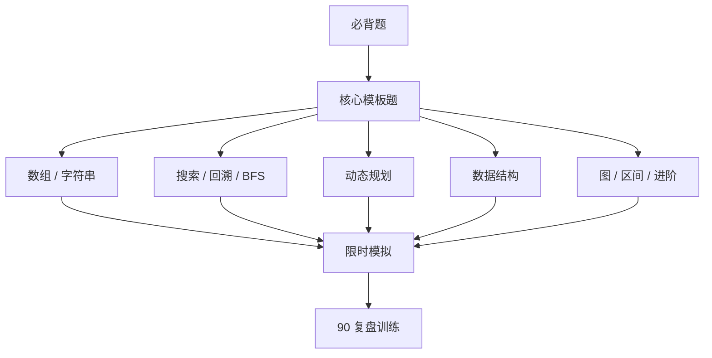

# 必背题清单

> 核心一句话：**面试前不要平均用力，先把每个模式最能代表模板的题打穿。**
>
> 这份清单不是完整题库，而是压缩复习题单。每题都应该能独立讲出：模式识别、核心模板、复杂度、边界条件。

---

## 🗺️ 必背题复习路线

---

## 核心必背 50 题

| 模式 | 题号 | 题目 | 为什么必背 |
|---|---|---|---|
| 二分 | 704 | Binary Search | 基础闭区间模板 |
| 二分边界 | 34 | Find First and Last Position | 左右边界模板 |
| 二分答案 | 875 | Koko Eating Bananas | `check(mid)` 入门 |
| 二分答案 | 410 | Split Array Largest Sum | 最大值最小化 |
| 旋转数组 | 33 | Search in Rotated Sorted Array | 判断哪半有序 |
| 双指针 | 11 | Container With Most Water | 短板移动 |
| 双指针 | 42 | Trapping Rain Water | 左右最大值 |
| nSum | 15 | 3Sum | 排序 + 去重 + 双指针 |
| 原地分区 | 75 | Sort Colors | 荷兰国旗 |
| 快慢指针 | 141 | Linked List Cycle | 链表环 |
| 链表反转 | 206 | Reverse Linked List | 三指针基本功 |
| 链表区间 | 92 | Reverse Linked List II | 局部指针重连 |
| 链表合并 | 21 | Merge Two Sorted Lists | dummy 头 |
| 滑动窗口 | 3 | Longest Substring Without Repeating Characters | 可变窗口入门 |
| 滑动窗口 | 76 | Minimum Window Substring | 需求计数模板 |
| 单调队列 | 239 | Sliding Window Maximum | 窗口最值 |
| 前缀和 | 560 | Subarray Sum Equals K | 前缀和 + 哈希计数 |
| 差分数组 | 1109 | Corporate Flight Bookings | 区间批量更新 |
| 单调栈 | 739 | Daily Temperatures | 下一个更大元素 |
| 单调栈 | 84 | Largest Rectangle in Histogram | 左右边界 |
| 哈希表 | 1 | Two Sum | 存补数 |
| 哈希表 | 49 | Group Anagrams | key 设计 |
| 哈希表 | 128 | Longest Consecutive Sequence | Set 起点扩展 |
| 堆 | 347 | Top K Frequent Elements | Top K |
| 双堆 | 295 | Find Median from Data Stream | 数据流中位数 |
| Trie | 208 | Implement Trie | 前缀树模板 |
| LRU | 146 | LRU Cache | HashMap + 双向链表 |
| 并查集 | 547 | Number of Provinces | 连通分量 |
| 并查集 | 721 | Accounts Merge | 映射 + union |
| 图 BFS | 127 | Word Ladder | 无权最短路 |
| 多源 BFS | 994 | Rotting Oranges | 多起点扩散 |
| 网格 DFS | 200 | Number of Islands | 感染法 |
| 拓扑排序 | 207 | Course Schedule | DAG 判环 |
| Dijkstra | 743 | Network Delay Time | 正权最短路 |
| 最小生成树 | 1584 | Min Cost to Connect All Points | Kruskal / Prim |
| 树遍历 | 102 | Binary Tree Level Order Traversal | BFS 层序 |
| 树递归 | 226 | Invert Binary Tree | 前序/后序都可 |
| BST | 98 | Validate Binary Search Tree | 上下界 / 中序 |
| LCA | 236 | Lowest Common Ancestor | 后序返回命中 |
| 树路径 | 124 | Binary Tree Maximum Path Sum | 后序贡献 |
| 回溯 | 46 | Permutations | `used` 数组 |
| 回溯 | 78 | Subsets | `start` 参数 |
| 回溯 | 39 | Combination Sum | 可重复选择 |
| 回溯 | 51 | N-Queens | 约束剪枝 |
| DP | 322 | Coin Change | 最值 DP |
| DP | 300 | Longest Increasing Subsequence | DP + 二分 |
| DP | 1143 | Longest Common Subsequence | 双序列 DP |
| DP | 72 | Edit Distance | 二维编辑 DP |
| 背包 | 416 | Partition Equal Subset Sum | 0-1 背包 |
| 股票 | 121/122/309 | Stock Series | 状态机 DP |

---

## 每章 5 题压缩版

| 专题 | 必背题 |
|---|---|
| 搜索 / 回溯 | 46, 78, 39, 51, 200 |
| BFS | 102, 127, 752, 994, 207 |
| 二分 | 704, 34, 33, 875, 410 |
| DP | 322, 300, 1143, 72, 139 |
| 背包 | 416, 494, 322, 518, 377 |
| 树 | 102, 98, 236, 124, 297 |
| 链表 | 206, 92, 21, 141, 25 |
| 双指针 / 滑窗 | 11, 42, 3, 76, 239 |
| 前缀和 / 单调结构 | 560, 1109, 739, 84, 862 |
| 哈希 / 堆 / Trie | 1, 49, 128, 347, 208 |
| 图 / 并查集 | 547, 721, 207, 743, 1584 |
| 区间 / 贪心 | 56, 253, 435, 452, 55 |
| 设计题 | 146, 460, 155, 380, 981 |

---

## 打卡表

| 题号 | 题目 | 模式 | 一刷 | 只看题名能否说出模式 | 15 分钟能否写出 | 二刷 | 三刷 | 能否讲清楚 |
|---|---|---|---|---|---|---|---|---|
| 704 | Binary Search | 二分模板 |  |  |  |  |  |  |
| 34 | Find First and Last Position | 二分边界 |  |  |  |  |  |  |
| 875 | Koko Eating Bananas | 二分答案 |  |  |  |  |  |  |
| 15 | 3Sum | 排序 + 双指针 |  |  |  |  |  |  |
| 76 | Minimum Window Substring | 可变滑动窗口 |  |  |  |  |  |  |
| 239 | Sliding Window Maximum | 单调队列 |  |  |  |  |  |  |
| 560 | Subarray Sum Equals K | 前缀和 + 哈希 |  |  |  |  |  |  |
| 84 | Largest Rectangle in Histogram | 单调栈 |  |  |  |  |  |  |
| 146 | LRU Cache | HashMap + 双向链表 |  |  |  |  |  |  |
| 236 | Lowest Common Ancestor | 树后序递归 |  |  |  |  |  |  |
| 322 | Coin Change | 最值 DP |  |  |  |  |  |  |
| 72 | Edit Distance | 双序列 DP |  |  |  |  |  |  |

---

## 只看题名训练法

| 步骤 | 训练动作 | 不通过信号 |
|---|---|---|
| 1 | 只看英文题名，先说模式，不看标签 | 只能回忆题解，不能说出触发词 |
| 2 | 30 秒内说出暴力解和优化方向 | 直接背模板，不知道为什么优化 |
| 3 | 2 分钟写出状态、指针或数据结构定义 | 变量含义混乱 |
| 4 | 15 分钟写出 TypeScript 或 Python | 边界条件反复错 |
| 5 | 口述复杂度和一个反例 | 只能说 Big-O，讲不出瓶颈 |

---

> **关联阅读：** `34-algorithm-pattern-recognition.md` → `90-review-and-pattern-training.md` → `38-interview-explanation-patterns.md`
