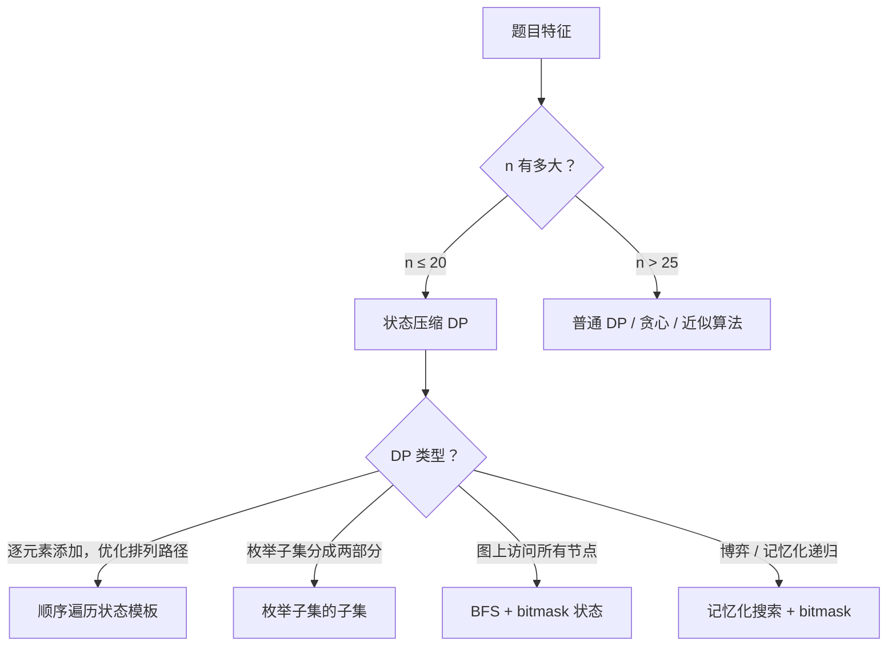

# 状态压缩 DP（Bitmask DP）

> 核心一句话：**用整数的二进制位表示集合状态，把"哪些元素已被选/访问过"压缩成一个整数，在 2^n 个状态上做 DP。**
>
> 规律：n ≤ 20、需要枚举所有子集的最优解、访问所有节点/覆盖所有任务 → 考虑 Bitmask DP。

---

## 🗺️ 决策图



---

## 🎯 经典 LeetCode 题目

| #   | 题号 | 题目 | 难度 | 核心考点 | 推荐指数 |
| --- | ---- | ---- | :--: | -------- | :------: |
| 1   | [526](https://leetcode.cn/problems/beautiful-arrangement/)                                          | 优美的排列               |  🟡  | bitmask 排列计数        |   ⭐⭐   |
| 2   | [698](https://leetcode.cn/problems/partition-to-k-equal-sum-subsets/)                               | 划分为k个相等的子集      |  🟡  | bitmask DP 子集划分     |  ⭐⭐⭐  |
| 3   | [847](https://leetcode.cn/problems/shortest-path-visiting-all-nodes/)                               | 访问所有节点的最短路径   |  🔴  | BFS + bitmask 状态      |  ⭐⭐⭐  |
| 4   | [943](https://leetcode.cn/problems/find-the-shortest-superstring/)                                  | 最短超级串               |  🔴  | TSP + bitmask DP        |   ⭐⭐   |
| 5   | [464](https://leetcode.cn/problems/can-i-win/)                                                      | 我能赢吗                 |  🟡  | 博弈 + bitmask 记忆化   |   ⭐⭐   |
| 6   | [1125](https://leetcode.cn/problems/smallest-sufficient-team/)                                      | 最小的必要团队           |  🔴  | bitmask DP 技能覆盖     |   ⭐⭐   |
| 7   | [1986](https://leetcode.cn/problems/minimum-number-of-work-sessions-to-finish-the-tasks/)           | 完成工作的最少工作时间段 |  🟡  | bitmask DP 任务分配     |   ⭐⭐   |

---

## 📋 目录

1. [核心位操作速查](#核心位操作速查)
2. [模板一：顺序遍历状态（最常见）](#模板一顺序遍历状态最常见)
3. [枚举子集的子集（O(3^n)）](#枚举子集的子集o3n)
4. [问题一：优美的排列](#问题一优美的排列)
5. [问题二：划分为k个相等的子集](#问题二划分为k个相等的子集)
6. [问题三：访问所有节点的最短路径（BFS）](#问题三访问所有节点的最短路径bfs)
7. [问题四：我能赢吗（记忆化博弈）](#问题四我能赢吗记忆化博弈)
8. [复杂度速查表](#-复杂度速查表)

---

## 核心位操作速查

```typescript
const n = 4;
const full = (1 << n) - 1;      // 1111：全选状态

// 判断元素 i 是否已被选
(mask & (1 << i)) !== 0;

// 选入元素 i
const next = mask | (1 << i);

// 移除元素 i
const removed = mask & ~(1 << i);

// 统计已选元素个数（popcount）
function popcount(mask: number): number {
  let count = 0;
  let m = mask;
  while (m) { m &= m - 1; count++; }
  return count;
}

// 枚举 mask 中所有已选元素
for (let i = 0; i < n; i++) {
  if (mask & (1 << i)) {
    // 元素 i 在 mask 中
  }
}
```

```python
n = 4
full = (1 << n) - 1    # 全选状态

# 判断元素 i 是否已被选
(mask >> i) & 1 == 1

# 选入 / 移除元素 i
next_mask = mask | (1 << i)
removed   = mask & ~(1 << i)

# 统计已选元素个数（Python 3.10+ 有 int.bit_count()）
bit_count = bin(mask).count('1')
```

---

## 模板一：顺序遍历状态（最常见）

> **思路：** 从 `0` 到 `(1<<n)-1` 枚举所有状态。对每个状态尝试加入一个未选元素，计算新状态的最优值。

```typescript
function bitmaskDpTemplate(n: number, costFn: (pos: number, elem: number) => number): number {
  const full = (1 << n) - 1;
  const dp = new Array(1 << n).fill(Infinity);
  dp[0] = 0;

  for (let mask = 0; mask <= full; mask++) {
    if (dp[mask] === Infinity) continue;
    const pos = popcount(mask);        // 当前已填了几个位置

    for (let i = 0; i < n; i++) {
      if (mask & (1 << i)) continue;  // 元素 i 已被选
      const next = mask | (1 << i);
      dp[next] = Math.min(dp[next], dp[mask] + costFn(pos, i));
    }
  }

  return dp[full];
}
```

```python
def bitmask_dp_template(n: int, cost_fn) -> int:
    full = (1 << n) - 1
    dp = [float('inf')] * (1 << n)
    dp[0] = 0

    for mask in range(1 << n):
        if dp[mask] == float('inf'):
            continue
        pos = bin(mask).count('1')     # 已填位置数

        for i in range(n):
            if mask & (1 << i):
                continue
            dp[mask | (1 << i)] = min(
                dp[mask | (1 << i)],
                dp[mask] + cost_fn(pos, i)
            )

    return dp[full]
```

---

## 枚举子集的子集（O(3^n)）

> 对 mask 的每个非空子集 sub 做处理，使用 `sub = (sub - 1) & mask` 技巧，总复杂度 O(3^n)（三项式定理）。

```typescript
function enumerateSubsets(mask: number): void {
  for (let sub = mask; sub > 0; sub = (sub - 1) & mask) {
    const complement = mask ^ sub; // sub 在 mask 内的补集
    // 处理 sub 和 complement
  }
}
```

```python
def enumerate_subsets(mask: int) -> None:
    sub = mask
    while sub > 0:
        complement = mask ^ sub
        # 处理 sub 和 complement
        sub = (sub - 1) & mask
```

---

## 问题一：优美的排列

> [526. 优美的排列](https://leetcode.cn/problems/beautiful-arrangement/)
>
> n 个整数 1..n 放在位置 1..n，要求位置 i 上的数能整除 i 或被 i 整除。求方案总数。
>
> **状态：** `dp[mask]` = 用 mask 中的数填满前 `popcount(mask)` 个位置的方案数。

```typescript
function countArrangement(n: number): number {
  const dp = new Array(1 << n).fill(0);
  dp[0] = 1;

  for (let mask = 0; mask < (1 << n); mask++) {
    if (dp[mask] === 0) continue;
    const pos = popcount(mask) + 1;  // 下一个要填的位置（1-indexed）

    for (let i = 0; i < n; i++) {
      if (mask & (1 << i)) continue;
      const num = i + 1;
      if (num % pos === 0 || pos % num === 0) {
        dp[mask | (1 << i)] += dp[mask];
      }
    }
  }

  return dp[(1 << n) - 1];
}
```

```python
def count_arrangement(n: int) -> int:
    dp = [0] * (1 << n)
    dp[0] = 1

    for mask in range(1 << n):
        if not dp[mask]:
            continue
        pos = bin(mask).count('1') + 1  # 1-indexed 位置

        for i in range(n):
            if mask & (1 << i):
                continue
            num = i + 1
            if num % pos == 0 or pos % num == 0:
                dp[mask | (1 << i)] += dp[mask]

    return dp[(1 << n) - 1]
```

---

## 问题二：划分为k个相等的子集

> [698. 划分为k个相等的子集](https://leetcode.cn/problems/partition-to-k-equal-sum-subsets/)
>
> 将数组划分为 k 个子集，每个子集的元素之和相等。
>
> **状态：** `dp[mask]` = 使用 mask 中所有元素后，当前正在填充的桶的已有和（-1 表示不可达）。  
> 填满一桶（和 = target）时 `dp[next] = 0`，否则 `dp[next] = new_sum`。

```typescript
function canPartitionKSubsets(nums: number[], k: number): boolean {
  const total = nums.reduce((a, b) => a + b, 0);
  if (total % k !== 0) return false;
  const target = total / k;
  const n = nums.length;

  const dp = new Array(1 << n).fill(-1);
  dp[0] = 0;

  for (let mask = 0; mask < (1 << n); mask++) {
    if (dp[mask] === -1) continue;
    for (let i = 0; i < n; i++) {
      if (mask & (1 << i)) continue;
      const newSum = dp[mask] + nums[i];
      if (newSum <= target) {
        dp[mask | (1 << i)] = newSum % target; // 填满一桶则归零
      }
    }
  }

  return dp[(1 << n) - 1] === 0;
}
```

```python
def can_partition_k_subsets(nums: list[int], k: int) -> bool:
    total = sum(nums)
    if total % k != 0:
        return False
    target = total // k
    n = len(nums)

    dp = [-1] * (1 << n)
    dp[0] = 0

    for mask in range(1 << n):
        if dp[mask] == -1:
            continue
        for i in range(n):
            if mask & (1 << i):
                continue
            new_sum = dp[mask] + nums[i]
            if new_sum <= target:
                dp[mask | (1 << i)] = new_sum % target

    return dp[(1 << n) - 1] == 0
```

---

## 问题三：访问所有节点的最短路径（BFS）

> [847. 访问所有节点的最短路径](https://leetcode.cn/problems/shortest-path-visiting-all-nodes/)
>
> 无向图，从任意节点出发，访问所有节点的最短路径长度。
>
> **关键：** 状态 = (当前节点, 已访问节点集合的 bitmask)，同时从所有节点出发做 BFS。

```typescript
function shortestPathLength(graph: number[][]): number {
  const n = graph.length;
  const full = (1 << n) - 1;
  const dist: number[][] = Array.from({ length: n }, () =>
    new Array(1 << n).fill(Infinity)
  );
  const queue: [number, number][] = [];

  for (let i = 0; i < n; i++) {
    dist[i][1 << i] = 0;
    queue.push([i, 1 << i]);
  }

  let head = 0;
  while (head < queue.length) {
    const [node, mask] = queue[head++];
    const d = dist[node][mask];
    if (mask === full) return d;

    for (const next of graph[node]) {
      const nextMask = mask | (1 << next);
      if (dist[next][nextMask] > d + 1) {
        dist[next][nextMask] = d + 1;
        queue.push([next, nextMask]);
      }
    }
  }

  return -1;
}
```

```python
from collections import deque

def shortest_path_length(graph: list[list[int]]) -> int:
    n = len(graph)
    full = (1 << n) - 1
    dist = [[float('inf')] * (1 << n) for _ in range(n)]
    q = deque()

    for i in range(n):
        dist[i][1 << i] = 0
        q.append((i, 1 << i))

    while q:
        node, mask = q.popleft()
        d = dist[node][mask]
        if mask == full:
            return d
        for nxt in graph[node]:
            nxt_mask = mask | (1 << nxt)
            if dist[nxt][nxt_mask] > d + 1:
                dist[nxt][nxt_mask] = d + 1
                q.append((nxt, nxt_mask))

    return -1
```

---

## 问题四：我能赢吗（记忆化博弈）

> [464. 我能赢吗](https://leetcode.cn/problems/can-i-win/)
>
> 两人轮流从 1..maxChoosableInteger 中选一个未选的数，先让累计和 ≥ desiredTotal 的获胜。
>
> **状态：** mask = 已被选走的数字集合（bitmask）。当前玩家从未选的数中选一个，若直接达到目标或对手无法赢则当前玩家胜。

```typescript
function canIWin(maxChoosableInteger: number, desiredTotal: number): boolean {
  const sum = (1 + maxChoosableInteger) * maxChoosableInteger / 2;
  if (sum < desiredTotal) return false;
  if (desiredTotal <= 0) return true;

  const memo = new Map<number, boolean>();

  function dfs(mask: number, remaining: number): boolean {
    if (memo.has(mask)) return memo.get(mask)!;
    for (let i = 1; i <= maxChoosableInteger; i++) {
      if (mask & (1 << i)) continue;
      // 选 i 后直接赢，或对手从下一个状态赢不了
      if (i >= remaining || !dfs(mask | (1 << i), remaining - i)) {
        memo.set(mask, true);
        return true;
      }
    }
    memo.set(mask, false);
    return false;
  }

  return dfs(0, desiredTotal);
}
```

```python
from functools import lru_cache

def can_i_win(max_choosable: int, desired_total: int) -> bool:
    total = (1 + max_choosable) * max_choosable // 2
    if total < desired_total:
        return False
    if desired_total <= 0:
        return True

    @lru_cache(maxsize=None)
    def dfs(mask: int, remaining: int) -> bool:
        for i in range(1, max_choosable + 1):
            if mask & (1 << i):
                continue
            if i >= remaining or not dfs(mask | (1 << i), remaining - i):
                return True
        return False

    return dfs(0, desired_total)
```

---

## 📊 复杂度速查表

| 问题 | 时间复杂度 | 空间复杂度 | 关键点 |
| ---- | :--------: | :--------: | ------ |
| 526 优美的排列       | O(n · 2^n) | O(2^n)     | 每个状态枚举 n 个候选数 |
| 698 划分 k 等份      | O(n · 2^n) | O(2^n)     | 当前桶和 % target 归零 |
| 847 访问所有节点     | O(n² · 2^n) | O(n · 2^n) | BFS + 二维 (节点, mask) 状态 |
| 464 我能赢吗         | O(n · 2^n) | O(2^n)     | 记忆化防止重复搜索 |
| 枚举子集的子集       | O(3^n)     | O(1)       | 三项式定理：每位有"在超集/在子集/均不在"三种情况 |

---

## 🎯 易错点

```
[ ] n 通常需要 ≤ 20 才适合 bitmask DP，否则 2^n 超时或超内存。
[ ] 枚举未选元素：if (mask & (1 << i)) continue。
[ ] BFS + bitmask 时，state 是 (node, mask) 二元组，两个维度都要记录 dist。
[ ] 子集枚举 sub = (sub - 1) & mask，最后会到 0，注意 while 的终止条件（> 0）。
[ ] TS/JS 位运算限于 32-bit signed int，元素下标从 0 开始但移位最多到 30。
[ ] 博弈记忆化时 remaining（累计和剩余）也是状态的一部分，可以一起 memoize。
```

---

> **关联阅读：** `31-bit-manipulation-and-math.md`（位操作基础）→ `06-dp-framework.md`（DP 框架）→ `04-backtracking-subsets-permutations-combinations.md`（枚举思想对比）
