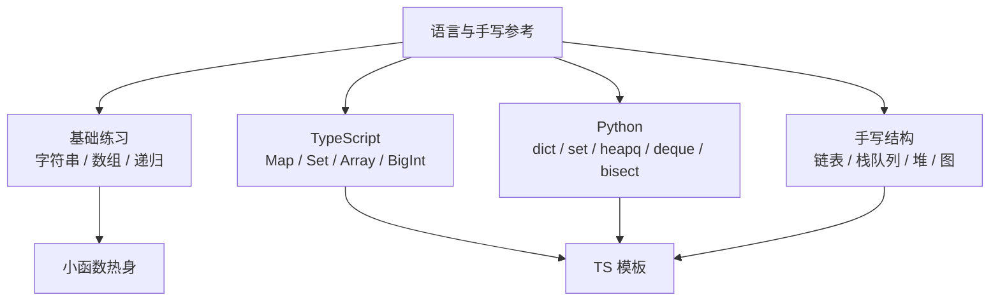

# 语言基础与手写结构参考

> 核心一句话：**语言参考只服务一个目标：刷题时 TypeScript / Python 语法不拖后腿，基础函数和手写数据结构能稳定落地。**

---

## 🗺️ 语言与手写参考路线图



---

## TypeScript 刷题速查

| 场景 | 写法 |
|---|---|
| 哈希计数 | `const cnt = new Map<string, number>()` |
| 去重 | `const set = new Set<number>()` |
| 数组排序 | `nums.sort((a, b) => a - b)` |
| 栈 | `const stack: number[] = []; stack.push(x); stack.pop()` |
| 队列 | 用数组 + head 指针，避免频繁 `shift()` |
| 大整数 | `BigInt`, `123n` |
| 字符编码 | `s.charCodeAt(i)`, `String.fromCharCode(x)` |

```typescript
// TypeScript 常用刷题骨架
function countByKey(items: string[]): Map<string, number> {
  const count = new Map<string, number>();
  for (const item of items) {
    count.set(item, (count.get(item) ?? 0) + 1);
  }
  return count;
}

class Queue<T> {
  private data: T[] = [];
  private head = 0;

  push(x: T): void {
    this.data.push(x);
  }

  pop(): T | undefined {
    if (this.head >= this.data.length) return undefined;
    return this.data[this.head++];
  }

  get length(): number {
    return this.data.length - this.head;
  }
}
```

---

## Python 刷题速查

| 场景 | 写法 |
|---|---|
| 哈希计数 | `dict`, `defaultdict(int)`, `Counter` |
| 去重 | `set()` |
| 队列 / BFS | `collections.deque` |
| 堆 | `heapq`，默认小顶堆 |
| 二分位置 | `bisect_left`, `bisect_right` |
| 记忆化 | `functools.cache` / `lru_cache` |
| 排序 key | `arr.sort(key=lambda x: x[0])` |

```python
# Python 常用刷题骨架
from collections import Counter, defaultdict, deque
from functools import cache
import heapq
import bisect

def count_by_key(items: list[str]) -> dict[str, int]:
    count = defaultdict(int)
    for item in items:
        count[item] += 1
    return count

def bfs(start: int, graph: dict[int, list[int]]) -> list[int]:
    q = deque([start])
    seen = {start}
    order = []
    while q:
        node = q.popleft()
        order.append(node)
        for nxt in graph.get(node, []):
            if nxt not in seen:
                seen.add(nxt)
                q.append(nxt)
    return order
```

---

## 手写数据结构最小模板

| 结构 | TypeScript / Python 重点 | 关联专题 |
|---|---|---|
| 链表 | dummy 头、前后指针、反转顺序 | `19` |
| 双向链表 | `prev/next` 同步更新 | `29` |
| 栈 | 数组尾部 push/pop | `18` |
| 队列 | TS 用 head 指针，Python 用 `deque` | `03`, `36` |
| 堆 | TS 需要手写，Python 用 `heapq` | `24` |
| Trie | children + isEnd | `30` |
| 并查集 | parent + size/rank + path compression | `26` |
| 图 | 邻接表 + visited / indegree / dist | `27` |

```typescript
// TypeScript 最小堆模板
class MinHeap {
  private heap: number[] = [];

  push(x: number): void {
    this.heap.push(x);
    this.swim(this.heap.length - 1);
  }

  pop(): number | undefined {
    if (this.heap.length === 0) return undefined;
    const top = this.heap[0];
    const last = this.heap.pop()!;
    if (this.heap.length > 0) {
      this.heap[0] = last;
      this.sink(0);
    }
    return top;
  }

  private swim(i: number): void {
    while (i > 0) {
      const p = Math.floor((i - 1) / 2);
      if (this.heap[p] <= this.heap[i]) break;
      [this.heap[p], this.heap[i]] = [this.heap[i], this.heap[p]];
      i = p;
    }
  }

  private sink(i: number): void {
    const n = this.heap.length;
    while (true) {
      let smallest = i;
      const l = i * 2 + 1, r = i * 2 + 2;
      if (l < n && this.heap[l] < this.heap[smallest]) smallest = l;
      if (r < n && this.heap[r] < this.heap[smallest]) smallest = r;
      if (smallest === i) break;
      [this.heap[i], this.heap[smallest]] = [this.heap[smallest], this.heap[i]];
      i = smallest;
    }
  }
}
```

```python
# Python 堆和并查集最小模板
import heapq

heap: list[int] = []
heapq.heappush(heap, 3)
heapq.heappush(heap, 1)
smallest = heapq.heappop(heap)

class UnionFind:
    def __init__(self, n: int):
        self.parent = list(range(n))
        self.size = [1] * n

    def find(self, x: int) -> int:
        if self.parent[x] != x:
            self.parent[x] = self.find(self.parent[x])
        return self.parent[x]

    def union(self, a: int, b: int) -> bool:
        ra, rb = self.find(a), self.find(b)
        if ra == rb:
            return False
        if self.size[ra] < self.size[rb]:
            ra, rb = rb, ra
        self.parent[rb] = ra
        self.size[ra] += self.size[rb]
        return True
```

---

## 字符串

### 反转字符串

```typescript
function reverseString(s: string): string {
  return s.split('').reverse().join('');
}
```

```python
def reverse_string(s: str) -> str:
    return s[::-1]
```

### 单词回文判断

```typescript
function isPalindrome(word: string): boolean {
  return word === word.split('').reverse().join('');
}
```

```python
def is_palindrome(word: str) -> bool:
    return word == word[::-1]
```

### 字符串出现次数最多的字母

```typescript
function mostFrequentChar(s: string): string {
  const count = new Map<string, number>();
  for (const c of s) count.set(c, (count.get(c) || 0) + 1);
  let maxChar = '', maxCount = 0;
  for (const [c, n] of count) {
    if (n > maxCount) { maxCount = n; maxChar = c; }
  }
  return maxChar;
}
```

```python
from collections import Counter

def most_frequent_char(s: str) -> str:
    return Counter(s).most_common(1)[0][0]
```

### 随机生成指定长度的字符串

```typescript
function randomString(length: number): string {
  const chars = 'ABCDEFGHIJKLMNOPQRSTUVWXYZabcdefghijklmnopqrstuvwxyz0123456789';
  let result = '';
  for (let i = 0; i < length; i++) {
    result += chars[Math.floor(Math.random() * chars.length)];
  }
  return result;
}
```

```python
import random
import string

def random_string(length: int) -> str:
    return ''.join(random.choices(string.ascii_letters + string.digits, k=length))
```

### 字符串加密解密（凯撒密码）

```typescript
function caesarEncrypt(s: string, shift: number): string {
  return s.split('').map(c => {
    if (c >= 'a' && c <= 'z') return String.fromCharCode((c.charCodeAt(0) - 97 + shift) % 26 + 97);
    if (c >= 'A' && c <= 'Z') return String.fromCharCode((c.charCodeAt(0) - 65 + shift) % 26 + 65);
    return c;
  }).join('');
}

function caesarDecrypt(s: string, shift: number): string {
  return caesarEncrypt(s, 26 - shift);
}
```

```python
def caesar_encrypt(s: str, shift: int) -> str:
    result = []
    for c in s:
        if 'a' <= c <= 'z': result.append(chr((ord(c) - 97 + shift) % 26 + 97))
        elif 'A' <= c <= 'Z': result.append(chr((ord(c) - 65 + shift) % 26 + 65))
        else: result.append(c)
    return ''.join(result)

def caesar_decrypt(s: str, shift: int) -> str:
    return caesar_encrypt(s, 26 - shift)
```

### URL 编码 / 解码

```typescript
function urlEncode(str: string): string {
  return encodeURIComponent(str);
}

function urlDecode(str: string): string {
  return decodeURIComponent(str);
}
```

```python
from urllib.parse import quote, unquote

def url_encode(s: str) -> str:
    return quote(s)

def url_decode(s: str) -> str:
    return unquote(s)
```

### 字符串前后匹配

```typescript
function matchStartEnd(s: string, pattern: string): boolean {
  return s.startsWith(pattern) || s.endsWith(pattern);
}
```

```python
def match_start_end(s: str, pattern: str) -> bool:
    return s.startswith(pattern) or s.endswith(pattern)
```

### 正则验证密码

密码至少 8 位，包含大写字母、小写字母、数字、特殊字符。

```typescript
function validatePassword(password: string): boolean {
  const regex = /^(?=.*[a-z])(?=.*[A-Z])(?=.*\d)(?=.*[!@#$%^&*]).{8,}$/;
  return regex.test(password);
}
```

```python
import re

def validate_password(password: str) -> bool:
    pattern = r'^(?=.*[a-z])(?=.*[A-Z])(?=.*\d)(?=.*[!@#$%^&*]).{8,}$'
    return bool(re.match(pattern, password))
```

---

## 数组

### 数组最大值

```typescript
function arrayMax(arr: number[]): number {
  return Math.max(...arr);
}
```

```python
def array_max(arr: list) -> int:
    return max(arr)
```

### 数组最小值之和

```typescript
function arrayPairSum(nums: number[]): number {
  nums.sort((a, b) => a - b);
  let sum = 0;
  for (let i = 0; i < nums.length; i += 2) sum += nums[i];
  return sum;
}
```

```python
def array_pair_sum(nums: list[int]) -> int:
    nums.sort()
    return sum(nums[::2])
```

### 数组去重

```typescript
function uniqueArray<T>(arr: T[]): T[] {
  return [...new Set(arr)];
}
```

```python
def unique_array(arr: list) -> list:
    return list(set(arr))
```

### 无重复字符的最长子串（基础版）

```typescript
function lengthOfLongestSubstring(s: string): number {
  let maxLen = 0, str = '';
  for (const c of s) {
    const idx = str.indexOf(c);
    if (idx !== -1) str = str.slice(idx + 1);
    str += c;
    maxLen = Math.max(maxLen, str.length);
  }
  return maxLen;
}
```

```python
def length_of_longest_substring(s: str) -> int:
    max_len = 0
    sub = ''
    for c in s:
        if c in sub:
            sub = sub[sub.index(c) + 1:]
        sub += c
        max_len = max(max_len, len(sub))
    return max_len
```

### 种花问题

相邻地块不能同时种花。

```typescript
function canPlaceFlowers(flowerbed: number[], n: number): boolean {
  let count = 0;
  for (let i = 0; i < flowerbed.length; i++) {
    if (flowerbed[i] === 0 && flowerbed[i - 1] !== 1 && flowerbed[i + 1] !== 1) {
      count++;
      i++; // 跳过下一个位置，因为不能相邻
    }
  }
  return count >= n;
}
```

```python
def can_place_flowers(flowerbed: list[int], n: int) -> bool:
    count = 0
    for i in range(len(flowerbed)):
        if (flowerbed[i] == 0 and
            (i == 0 or flowerbed[i-1] == 0) and
            (i == len(flowerbed)-1 or flowerbed[i+1] == 0)):
            count += 1
            flowerbed[i] = 1
    return count >= n
```

### 卡牌分组

将一副牌分成若干组，每组牌数相同且数字相同。

```typescript
function hasGroupsSizeX(deck: number[]): boolean {
  const count = new Map<number, number>();
  for (const n of deck) count.set(n, (count.get(n) || 0) + 1);
  const gcd = (a: number, b: number): number => b === 0 ? a : gcd(b, a % b);
  let g = 0;
  for (const c of count.values()) g = gcd(g, c);
  return g >= 2;
}
```

```python
from math import gcd
from collections import Counter

def has_groups_size_x(deck: list[int]) -> bool:
    count = Counter(deck)
    g = 0
    for c in count.values():
        g = gcd(g, c)
    return g >= 2
```

---

## 递归与数学

### 斐波那契数列

```typescript
function fibonacci(n: number): number {
  if (n <= 1) return n;
  let a = 0, b = 1;
  for (let i = 2; i <= n; i++) [a, b] = [b, a + b];
  return b;
}
```

```python
def fibonacci(n: int) -> int:
    if n <= 1: return n
    a, b = 0, 1
    for _ in range(2, n + 1):
        a, b = b, a + b
    return b
```

### 阶乘

```typescript
function factorial(n: number): number {
  if (n <= 1) return 1;
  return n * factorial(n - 1);
}
```

```python
def factorial(n: int) -> int:
    return 1 if n <= 1 else n * factorial(n - 1)
```

### 任意进制转换

```typescript
function baseConvert(num: number, base: number): string {
  return num.toString(base);
}

function baseParse(str: string, base: number): number {
  return parseInt(str, base);
}
```

```python
def base_convert(num: int, base: int) -> str:
    chars = '0123456789ABCDEF'
    if num < base: return chars[num]
    return base_convert(num // base, base) + chars[num % base]

def base_parse(s: str, base: int) -> int:
    return int(s, base)
```

---

## 深浅拷贝

```typescript
/** 浅拷贝 */
function shallowClone<T>(obj: T): T {
  return { ...obj };
}

/** 深拷贝（简单结构） */
function deepClone<T>(obj: T): T {
  return JSON.parse(JSON.stringify(obj));
}

/** 深拷贝（完整版，处理循环引用） */
function deepCloneFull<T>(obj: T, map = new WeakMap()): T {
  if (obj === null || typeof obj !== 'object') return obj;
  if (map.has(obj)) return map.get(obj);
  const clone = Array.isArray(obj) ? [] : {};
  map.set(obj, clone);
  for (const key in obj) {
    if (Object.prototype.hasOwnProperty.call(obj, key)) {
      clone[key] = deepCloneFull(obj[key], map);
    }
  }
  return clone as T;
}
```

```python
import copy

# 浅拷贝
shallow = copy.copy(obj)

# 深拷贝
deep = copy.deepcopy(obj)

# 简单结构的深拷贝
import json
deep_simple = json.loads(json.dumps(obj))
```

---

## 矩阵操作

### 矩阵转置

```typescript
function transpose(matrix: number[][]): number[][] {
  return matrix[0].map((_, i) => matrix.map(row => row[i]));
}
```

```python
def transpose(matrix: list[list[int]]) -> list[list[int]]:
    return list(map(list, zip(*matrix)))
```

---

## 贪心 / 回溯 / DP（极简示例）

> 以下为极简示例，完整实现在各自专题的 markdown 中。

### 贪心：人民币找零

```typescript
function minCoins(amount: number, coins: number[]): number {
  coins.sort((a, b) => b - a);
  let count = 0;
  for (const coin of coins) {
    count += Math.floor(amount / coin);
    amount %= coin;
  }
  return count;
}
```

```python
def min_coins(amount: int, coins: list[int]) -> int:
    coins.sort(reverse=True)
    count = 0
    for coin in coins:
        count += amount // coin
        amount %= coin
    return count
```

### DP：分糖果

```typescript
function candy(ratings: number[]): number {
  const n = ratings.length;
  const left = new Array(n).fill(1);
  const right = new Array(n).fill(1);
  for (let i = 1; i < n; i++) {
    if (ratings[i] > ratings[i - 1]) left[i] = left[i - 1] + 1;
  }
  for (let i = n - 2; i >= 0; i--) {
    if (ratings[i] > ratings[i + 1]) right[i] = right[i + 1] + 1;
  }
  let sum = 0;
  for (let i = 0; i < n; i++) sum += Math.max(left[i], right[i]);
  return sum;
}
```

```python
def candy(ratings: list[int]) -> int:
    n = len(ratings)
    left = [1] * n
    right = [1] * n
    for i in range(1, n):
        if ratings[i] > ratings[i-1]: left[i] = left[i-1] + 1
    for i in range(n-2, -1, -1):
        if ratings[i] > ratings[i+1]: right[i] = right[i+1] + 1
    return sum(max(left[i], right[i]) for i in range(n))
```

### 回溯：装载集装箱

```typescript
function maxLoading(weights: number[], capacity: number): number {
  let max = 0;
  function dfs(idx: number, current: number) {
    if (current > capacity) return;
    if (idx === weights.length) { max = Math.max(max, current); return; }
    dfs(idx + 1, current + weights[idx]); // 装
    dfs(idx + 1, current); // 不装
  }
  dfs(0, 0);
  return max;
}
```

```python
def max_loading(weights: list[int], capacity: int) -> int:
    max_w = 0
    def dfs(idx: int, cur: int):
        nonlocal max_w
        if cur > capacity: return
        if idx == len(weights):
            max_w = max(max_w, cur)
            return
        dfs(idx + 1, cur + weights[idx])
        dfs(idx + 1, cur)
    dfs(0, 0)
    return max_w
```

---

> **关联阅读：** `24-heap-and-priority-queue.md` → `26-union-find.md` → `29-lru-and-lfu-cache.md` → `30-trie-prefix-tree.md`
