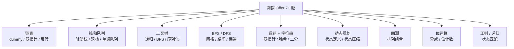

# 剑指 Offer 题解

> 核心一句话：**剑指 Offer 是中文面试高频题的压缩题库，适合按数据结构、搜索、DP、位运算做最后一轮查漏。**
>
> 题号格式：`剑指 XX` 对应原书题号，`LeetCode XXX` 为 LeetCode 对应编号。

---

## 🗺️ 剑指 Offer 分类路线图



## 🧭 复习顺序建议


---

## 总表

| 分类 | 题目数 |
| --- | :---: |
| [链表](#-链表) | 5 |
| [栈和队列](#-栈和队列) | 6 |
| [二叉树](#-二叉树) | 3 |
| [BFS 广度遍历](#-bfs-广度遍历) | 4 |
| [DFS 深度遍历](#-dfs-深度遍历) | 8 |
| [数组 + 字符串](#-数组--字符串) | 20 |
| [动态规划](#-动态规划) | 13 |
| [回溯法](#-回溯法) | 1 |
| [位运算](#-位运算) | 4 |
| [哈希表](#-哈希表) | 3 |
| [正则表达式 / 递归](#-正则表达式--递归) | 4 |
| **总计** | **71** |

---

## 🔗 链表

### 剑指 18. 删除链表的节点

> LeetCode 237. Delete Node in a Linked List
>
> **思路：** 用哨兵节点 dummy head，遍历找到目标值后跳过该节点。

```typescript
function deleteNode(head: ListNode | null, val: number): ListNode | null {
  const dummy = new ListNode(-1);
  dummy.next = head;
  let cur: ListNode | null = dummy;
  while (cur.next) {
    if (cur.next.val === val) {
      cur.next = cur.next.next;
      break;
    }
    cur = cur.next;
  }
  return dummy.next;
}
```

```python
def deleteNode(head: ListNode | None, val: int) -> ListNode | None:
    dummy = ListNode(-1)
    dummy.next = head
    cur = dummy
    while cur.next:
        if cur.next.val == val:
            cur.next = cur.next.next
            break
        cur = cur.next
    return dummy.next
```

### 剑指 22. 链表中倒数第 K 个节点

> LeetCode 19. Remove Nth Node From End of List（变体）
>
> **思路：** 双指针法 — 快指针先走 k 步，然后快慢一起走，快指针到末尾时慢指针即为目标。

```typescript
function getKthFromEnd(head: ListNode | null, k: number): ListNode | null {
  let fast = head, slow = head;
  for (let i = 0; i < k; i++) {
    if (!fast) return null;
    fast = fast.next;
  }
  while (fast) {
    fast = fast.next;
    slow = slow!.next;
  }
  return slow;
}
```

```python
def getKthFromEnd(head: ListNode | None, k: int) -> ListNode | None:
    fast = slow = head
    for _ in range(k):
        if not fast:
            return None
        fast = fast.next
    while fast:
        fast = fast.next
        slow = slow.next
    return slow
```

### 剑指 24. 反转链表

> LeetCode 206. Reverse Linked List
>
> **思路：** 迭代，三指针（prev/cur/temp）原地反转。

```typescript
function reverseList(head: ListNode | null): ListNode | null {
  let prev: ListNode | null = null;
  let cur = head;
  while (cur) {
    const temp = cur.next;
    cur.next = prev;
    prev = cur;
    cur = temp;
  }
  return prev;
}
```

```python
def reverseList(head: ListNode | None) -> ListNode | None:
    prev, cur = None, head
    while cur:
        temp = cur.next
        cur.next = prev
        prev = cur
        cur = temp
    return prev
```

### 剑指 25. 合并两个排序的链表

> LeetCode 21. Merge Two Sorted Lists
>
> **思路：** 递归比较头节点，取较小的作为当前节点，指针递归前进。

```typescript
function mergeTwoLists(l1: ListNode | null, l2: ListNode | null): ListNode | null {
  if (!l1) return l2;
  if (!l2) return l1;
  if (l1.val < l2.val) {
    l1.next = mergeTwoLists(l1.next, l2);
    return l1;
  } else {
    l2.next = mergeTwoLists(l1, l2.next);
    return l2;
  }
}
```

```python
def mergeTwoLists(l1: ListNode | None, l2: ListNode | None) -> ListNode | None:
    if not l1: return l2
    if not l2: return l1
    if l1.val < l2.val:
        l1.next = mergeTwoLists(l1.next, l2)
        return l1
    else:
        l2.next = mergeTwoLists(l1, l2.next)
        return l2
```

### 剑指 52. 两个链表的第一个公共节点

> LeetCode 160. Intersection of Two Linked Lists
>
> **思路：** 双指针各自走 A+B 路程，相遇点即为第一个公共节点。

```typescript
function getIntersectionNode(headA: ListNode | null, headB: ListNode | null): ListNode | null {
  let a = headA, b = headB;
  while (a !== b) {
    a = a ? a.next : headB;
    b = b ? b.next : headA;
  }
  return a;
}
```

```python
def getIntersectionNode(headA: ListNode | None, headB: ListNode | None) -> ListNode | None:
    a, b = headA, headB
    while a is not b:
        a = a.next if a else headB
        b = b.next if b else headA
    return a
```

---

## 📦 栈和队列

### 剑指 06. 从尾到头打印链表

> **思路：** 栈 / 递归 — 利用栈先进后出或递归回溯实现逆序。

```typescript
function reversePrint(head: ListNode | null): number[] {
  const stack: number[] = [];
  while (head) {
    stack.push(head.val);
    head = head.next;
  }
  return stack.reverse();
}
```

```python
def reversePrint(head: ListNode | None) -> list[int]:
    stack = []
    while head:
        stack.append(head.val)
        head = head.next
    return stack[::-1]
```

### 剑指 09. 用两个栈实现队列

> LeetCode 232. Implement Queue using Stacks
>
> **思路：** stack1 负责入队，stack2 负责出队；出队时若 stack2 为空则将 stack1 全部倒过来。

```typescript
class CQueue {
  stack1: number[] = [];
  stack2: number[] = [];

  appendTail(value: number): void {
    this.stack1.push(value);
  }

  deleteHead(): number {
    if (this.stack2.length) return this.stack2.pop()!;
    if (!this.stack1.length) return -1;
    while (this.stack1.length) {
      this.stack2.push(this.stack1.pop()!);
    }
    return this.stack2.pop()!;
  }
}
```

```python
class CQueue:
    def __init__(self):
        self.s1, self.s2 = [], []

    def appendTail(self, value: int) -> None:
        self.s1.append(value)

    def deleteHead(self) -> int:
        if self.s2: return self.s2.pop()
        if not self.s1: return -1
        while self.s1:
            self.s2.append(self.s1.pop())
        return self.s2.pop()
```

### 剑指 30. 包含 min 函数的栈

> LeetCode 155. Min Stack
>
> **思路：** 辅助栈同步存储最小值 — 每次 push 时 minStack 也 push 当前最小值。

```typescript
class MinStack {
  stack: number[] = [];
  minStack: number[] = [];

  push(x: number): void {
    this.stack.push(x);
    this.minStack.push(this.minStack.length ? Math.min(this.minStack[this.minStack.length - 1], x) : x);
  }

  pop(): void {
    this.stack.pop();
    this.minStack.pop();
  }

  top(): number {
    return this.stack[this.stack.length - 1];
  }

  min(): number {
    return this.minStack[this.minStack.length - 1];
  }
}
```

```python
class MinStack:
    def __init__(self):
        self.stack = []
        self.min_stack = []

    def push(self, x: int) -> None:
        self.stack.append(x)
        if not self.min_stack:
            self.min_stack.append(x)
        else:
            self.min_stack.append(min(self.min_stack[-1], x))

    def pop(self) -> None:
        self.stack.pop()
        self.min_stack.pop()

    def top(self) -> int:
        return self.stack[-1]

    def min(self) -> int:
        return self.min_stack[-1]
```

### 剑指 31. 栈的压入、弹出序列

> LeetCode 946. Validate Stack Sequences
>
> **思路：** 模拟入栈，同时检查栈顶是否匹配弹出序列。

```typescript
function validateStackSequences(pushed: number[], popped: number[]): boolean {
  const stack: number[] = [];
  let i = 0;
  for (const num of pushed) {
    stack.push(num);
    while (stack.length && stack[stack.length - 1] === popped[i]) {
      stack.pop();
      i++;
    }
  }
  return stack.length === 0;
}
```

```python
def validateStackSequences(pushed: list[int], popped: list[int]) -> bool:
    stack, i = [], 0
    for num in pushed:
        stack.append(num)
        while stack and stack[-1] == popped[i]:
            stack.pop()
            i += 1
    return len(stack) == 0
```

### 剑指 59 - I. 滑动窗口的最大值

> LeetCode 239. Sliding Window Maximum
>
> **思路：** 单调队列（双端队列存下标），保持队首为当前窗口最大值。

```typescript
function maxSlidingWindow(nums: number[], k: number): number[] {
  const deque: number[] = []; // 存下标
  const res: number[] = [];
  for (let i = 0; i < nums.length; i++) {
    while (deque.length && nums[deque[deque.length - 1]] < nums[i]) deque.pop();
    deque.push(i);
    if (deque[0] <= i - k) deque.shift();
    if (i >= k - 1) res.push(nums[deque[0]]);
  }
  return res;
}
```

```python
def maxSlidingWindow(nums: list[int], k: int) -> list[int]:
    from collections import deque
    dq = deque()
    res = []
    for i, v in enumerate(nums):
        while dq and nums[dq[-1]] < v: dq.pop()
        dq.append(i)
        if dq[0] <= i - k: dq.popleft()
        if i >= k - 1: res.append(nums[dq[0]])
    return res
```

### 剑指 59 - II. 队列的最大值

> LeetCode 面试题59-II. 队列的最大值
>
> **思路：** 双端队列维护递减序列，保证 max 操作 O(1)。

```typescript
class MaxQueue {
  queue: number[] = [];
  maxDeque: number[] = [];

  push_back(value: number): void {
    this.queue.push(value);
    while (this.maxDeque.length && this.maxDeque[this.maxDeque.length - 1] < value) {
      this.maxDeque.pop();
    }
    this.maxDeque.push(value);
  }

  pop_front(): number {
    if (!this.queue.length) return -1;
    const val = this.queue.shift()!;
    if (val === this.maxDeque[0]) this.maxDeque.shift();
    return val;
  }

  max_value(): number {
    return this.maxDeque.length ? this.maxDeque[0] : -1;
  }
}
```

```python
class MaxQueue:
    def __init__(self):
        from collections import deque
        self.q = deque()
        self.dq = deque()

    def push_back(self, value: int) -> None:
        self.q.append(value)
        while self.dq and self.dq[-1] < value:
            self.dq.pop()
        self.dq.append(value)

    def pop_front(self) -> int:
        if not self.q: return -1
        val = self.q.popleft()
        if val == self.dq[0]: self.dq.popleft()
        return val

    def max_value(self) -> int:
        return self.dq[0] if self.dq else -1
```

---

## 🌳 二叉树

### 剑指 07. 重建二叉树

> LeetCode 105. Construct Binary Tree from Preorder and Inorder Traversal
>
> **思路：** 前序定根，中序分左右，递归构建。

```typescript
function buildTree(preorder: number[], inorder: number[]): TreeNode | null {
  if (!preorder.length) return null;
  const root = new TreeNode(preorder[0]);
  const mid = inorder.indexOf(preorder[0]);
  root.left = buildTree(preorder.slice(1, mid + 1), inorder.slice(0, mid));
  root.right = buildTree(preorder.slice(mid + 1), inorder.slice(mid + 1));
  return root;
}
```

```python
def buildTree(preorder: list[int], inorder: list[int]) -> TreeNode | None:
    if not preorder: return None
    root = TreeNode(preorder[0])
    mid = inorder.index(preorder[0])
    root.left = buildTree(preorder[1:mid+1], inorder[:mid])
    root.right = buildTree(preorder[mid+1:], inorder[mid+1:])
    return root
```

### 剑指 68 - I. 二叉搜索树的最近公共祖先

> LeetCode 235. LCA in BST
>
> **思路：** 利用 BST 性质 — 若 p/q 在 root 两侧则 root 为 LCA；否则往一侧走。

```typescript
function lowestCommonAncestor(root: TreeNode | null, p: TreeNode, q: TreeNode): TreeNode | null {
  if (!root) return null;
  if (p.val < root.val && q.val < root.val) return lowestCommonAncestor(root.left, p, q);
  if (p.val > root.val && q.val > root.val) return lowestCommonAncestor(root.right, p, q);
  return root;
}
```

```python
def lowestCommonAncestor(root: TreeNode, p: TreeNode, q: TreeNode) -> TreeNode:
    if p.val < root.val and q.val < root.val:
        return lowestCommonAncestor(root.left, p, q)
    if p.val > root.val and q.val > root.val:
        return lowestCommonAncestor(root.right, p, q)
    return root
```

### 剑指 68 - II. 二叉树的最近公共祖先

> LeetCode 236. LCA in Binary Tree
>
> **思路：** 后序遍历，若 root 匹配 p/q 或左右子树各返回一个，则 root 为 LCA。

```typescript
function lowestCommonAncestor(root: TreeNode | null, p: TreeNode, q: TreeNode): TreeNode | null {
  if (!root || root === p || root === q) return root;
  const left = lowestCommonAncestor(root.left, p, q);
  const right = lowestCommonAncestor(root.right, p, q);
  if (left && right) return root;
  return left || right;
}
```

```python
def lowestCommonAncestor(root: TreeNode, p: TreeNode, q: TreeNode) -> TreeNode:
    if not root or root == p or root == q: return root
    left = lowestCommonAncestor(root.left, p, q)
    right = lowestCommonAncestor(root.right, p, q)
    if left and right: return root
    return left or right
```

---

## 🌊 BFS 广度遍历

### 剑指 32 - I. 从上到下打印二叉树

> LeetCode 102. Binary Tree Level Order Traversal
>
> **思路：** 队列 BFS，逐层打印。

```typescript
function levelOrder(root: TreeNode | null): number[] {
  if (!root) return [];
  const queue: TreeNode[] = [root];
  const res: number[] = [];
  while (queue.length) {
    const node = queue.shift()!;
    res.push(node.val);
    if (node.left) queue.push(node.left);
    if (node.right) queue.push(node.right);
  }
  return res;
}
```

```python
def levelOrder(root: TreeNode | None) -> list[int]:
    if not root: return []
    from collections import deque
    q, res = deque([root]), []
    while q:
        node = q.popleft()
        res.append(node.val)
        if node.left: q.append(node.left)
        if node.right: q.append(node.right)
    return res
```

### 剑指 32 - II. 从上到下打印二叉树 II

> LeetCode 107. Level Order Traversal II
>
> **思路：** BFS 分层收集，一次性处理当前队列所有节点。

```typescript
function levelOrderBottom(root: TreeNode | null): number[][] {
  if (!root) return [];
  const queue: TreeNode[] = [root];
  const res: number[][] = [];
  while (queue.length) {
    const level: number[] = [];
    const len = queue.length;
    for (let i = 0; i < len; i++) {
      const node = queue.shift()!;
      level.push(node.val);
      if (node.left) queue.push(node.left);
      if (node.right) queue.push(node.right);
    }
    res.push(level);
  }
  return res;
}
```

```python
def levelOrderBottom(root: TreeNode | None) -> list[list[int]]:
    if not root: return []
    from collections import deque
    q, res = deque([root]), []
    while q:
        level = []
        for _ in range(len(q)):
            node = q.popleft()
            level.append(node.val)
            if node.left: q.append(node.left)
            if node.right: q.append(node.right)
        res.append(level)
    return res
```

### 剑指 32 - III. 从上到下打印二叉树 III

> LeetCode 103. Zigzag Level Order Traversal
>
> **思路：** BFS + 奇偶层反转顺序。

```typescript
function zigzagLevelOrder(root: TreeNode | null): number[][] {
  if (!root) return [];
  const queue: TreeNode[] = [root];
  const res: number[][] = [];
  let leftToRight = true;
  while (queue.length) {
    const level: number[] = [];
    const len = queue.length;
    for (let i = 0; i < len; i++) {
      const node = queue.shift()!;
      level.push(node.val);
      if (node.left) queue.push(node.left);
      if (node.right) queue.push(node.right);
    }
    if (!leftToRight) level.reverse();
    res.push(level);
    leftToRight = !leftToRight;
  }
  return res;
}
```

```python
def zigzagLevelOrder(root: TreeNode | None) -> list[list[int]]:
    if not root: return []
    from collections import deque
    q, res, ltr = deque([root]), [], True
    while q:
        level = []
        for _ in range(len(q)):
            node = q.popleft()
            level.append(node.val)
            if node.left: q.append(node.left)
            if node.right: q.append(node.right)
        if not ltr: level.reverse()
        res.append(level)
        ltr = not ltr
    return res
```

### 剑指 13. 机器人的运动范围

> **思路：** BFS/DFS 从 (0,0) 出发，检查每个可达格子的数位和是否 ≤ k。

```typescript
function movingCount(m: number, n: number, k: number): number {
  const visited = Array.from({ length: m }, () => new Array(n).fill(false));
  let count = 0;
  const queue: [number, number][] = [[0, 0]];
  visited[0][0] = true;
  const dirs = [[0, 1], [1, 0]];
  while (queue.length) {
    const [x, y] = queue.shift()!;
    count++;
    for (const [dx, dy] of dirs) {
      const nx = x + dx, ny = y + dy;
      if (nx < m && ny < n && !visited[nx][ny] && digitSum(nx) + digitSum(ny) <= k) {
        visited[nx][ny] = true;
        queue.push([nx, ny]);
      }
    }
  }
  return count;
}

function digitSum(x: number): number {
  let sum = 0;
  while (x) { sum += x % 10; x = Math.floor(x / 10); }
  return sum;
}
```

```python
def movingCount(m: int, n: int, k: int) -> int:
    def digit_sum(x): return sum(int(c) for c in str(x))
    from collections import deque
    visited = [[False] * n for _ in range(m)]
    q = deque([(0, 0)])
    visited[0][0] = True
    cnt = 0
    while q:
        x, y = q.popleft()
        cnt += 1
        for dx, dy in [(0, 1), (1, 0)]:
            nx, ny = x + dx, y + dy
            if nx < m and ny < n and not visited[nx][ny] and digit_sum(nx) + digit_sum(ny) <= k:
                visited[nx][ny] = True
                q.append((nx, ny))
    return cnt
```

---

## 🔍 DFS 深度遍历

### 剑指 27. 二叉树的镜像

> LeetCode 226. Invert Binary Tree
>
> **思路：** 前序位置交换左右子节点，递归。

```typescript
function mirrorTree(root: TreeNode | null): TreeNode | null {
  if (!root) return null;
  [root.left, root.right] = [root.right, root.left];
  mirrorTree(root.left);
  mirrorTree(root.right);
  return root;
}
```

```python
def mirrorTree(root: TreeNode | None) -> TreeNode | None:
    if not root: return None
    root.left, root.right = root.right, root.left
    mirrorTree(root.left)
    mirrorTree(root.right)
    return root
```

### 剑指 28. 对称的二叉树

> LeetCode 101. Symmetric Tree
>
> **思路：** 递归比较镜像位置的两节点。

```typescript
function isSymmetric(root: TreeNode | null): boolean {
  function check(a: TreeNode | null, b: TreeNode | null): boolean {
    if (!a && !b) return true;
    if (!a || !b) return false;
    return a.val === b.val && check(a.left, b.right) && check(a.right, b.left);
  }
  return check(root, root);
}
```

```python
def isSymmetric(root: TreeNode | None) -> bool:
    def check(a, b):
        if not a and not b: return True
        if not a or not b: return False
        return a.val == b.val and check(a.left, b.right) and check(a.right, b.left)
    return check(root, root)
```

### 剑指 33. 二叉搜索树的后序遍历序列

> **思路：** 后序序列的最后一个为根，递归检查是否符合 BST 性质。

```typescript
function verifyPostorder(postorder: number[]): boolean {
  function check(l: number, r: number): boolean {
    if (l >= r) return true;
    const root = postorder[r];
    let p = l;
    while (postorder[p] < root) p++;
    const mid = p;
    while (postorder[p] > root) p++;
    return p === r && check(l, mid - 1) && check(mid, r - 1);
  }
  return check(0, postorder.length - 1);
}
```

```python
def verifyPostorder(postorder: list[int]) -> bool:
    def check(l, r):
        if l >= r: return True
        root = postorder[r]
        p = l
        while postorder[p] < root: p += 1
        mid = p
        while postorder[p] > root: p += 1
        return p == r and check(l, mid - 1) and check(mid, r - 1)
    return check(0, len(postorder) - 1)
```

### 剑指 34. 二叉树中和为某一值的路径

> LeetCode 113. Path Sum II
>
> **思路：** 回溯法，前序记录路径，到叶子时判断是否满足 target。

```typescript
function pathSum(root: TreeNode | null, target: number): number[][] {
  const res: number[][] = [];
  function dfs(node: TreeNode | null, sum: number, path: number[]) {
    if (!node) return;
    path.push(node.val);
    sum += node.val;
    if (!node.left && !node.right && sum === target) res.push([...path]);
    dfs(node.left, sum, path);
    dfs(node.right, sum, path);
    path.pop();
  }
  dfs(root, 0, []);
  return res;
}
```

```python
def pathSum(root: TreeNode | None, target: int) -> list[list[int]]:
    res = []
    def dfs(node, s, path):
        if not node: return
        path.append(node.val)
        s += node.val
        if not node.left and not node.right and s == target:
            res.append(path[:])
        dfs(node.left, s, path)
        dfs(node.right, s, path)
        path.pop()
    dfs(root, 0, [])
    return res
```

### 剑指 35. 复杂链表的复制

> LeetCode 138. Copy List with Random Pointer
>
> **思路：** 三步法：原节点后复制 → 设置 random → 拆分。

```typescript
function copyRandomList(head: Node | null): Node | null {
  if (!head) return null;
  // 1. 复制节点 A → A' → B → B'
  let cur: Node | null = head;
  while (cur) {
    const copy = new Node(cur.val);
    copy.next = cur.next;
    cur.next = copy;
    cur = copy.next;
  }
  // 2. 设置 random
  cur = head;
  while (cur) {
    if (cur.random) cur.next!.random = cur.random.next;
    cur = cur.next!.next;
  }
  // 3. 拆分
  const dummy = new Node(0);
  let copyCur = dummy;
  cur = head;
  while (cur) {
    copyCur.next = cur.next;
    copyCur = copyCur.next;
    cur.next = cur.next!.next;
    cur = cur.next;
  }
  return dummy.next;
}
```

```python
def copyRandomList(head: 'Node') -> 'Node':
    if not head: return None
    cur = head
    while cur:
        cp = Node(cur.val)
        cp.next = cur.next
        cur.next = cp
        cur = cp.next
    cur = head
    while cur:
        if cur.random: cur.next.random = cur.random.next
        cur = cur.next.next
    dummy = Node(0)
    cp_cur, cur = dummy, head
    while cur:
        cp_cur.next = cur.next
        cp_cur = cp_cur.next
        cur.next = cur.next.next
        cur = cur.next
    return dummy.next
```

### 剑指 36. 二叉搜索树与双向链表

> **思路：** 中序遍历 BST 得到有序序列，遍历时修改指针为双向链表。

```typescript
function treeToDoublyList(root: TreeNode | null): TreeNode | null {
  if (!root) return null;
  let head: TreeNode | null = null, prev: TreeNode | null = null;
  function dfs(node: TreeNode | null) {
    if (!node) return;
    dfs(node.left);
    if (!head) head = node;
    if (prev) { prev.right = node; node.left = prev; }
    prev = node;
    dfs(node.right);
  }
  dfs(root);
  head!.left = prev;
  prev!.right = head;
  return head;
}
```

```python
def treeToDoublyList(root: 'Node') -> 'Node':
    if not root: return None
    head = prev = None
    def dfs(node):
        nonlocal head, prev
        if not node: return
        dfs(node.left)
        if not head: head = node
        if prev: prev.right, node.left = node, prev
        prev = node
        dfs(node.right)
    dfs(root)
    head.left = prev
    prev.right = head
    return head
```

### 剑指 38. 字符串的排列

> LeetCode 47. Permutations II
>
> **思路：** 回溯 + visited 数组 + 同层去重。

```typescript
function permutation(s: string): string[] {
  const chars = s.split('').sort();
  const res: string[] = [];
  const visited = new Array(s.length).fill(false);
  function backtrack(path: string[]) {
    if (path.length === s.length) { res.push(path.join('')); return; }
    for (let i = 0; i < chars.length; i++) {
      if (visited[i] || (i > 0 && chars[i] === chars[i - 1] && !visited[i - 1])) continue;
      visited[i] = true;
      path.push(chars[i]);
      backtrack(path);
      path.pop();
      visited[i] = false;
    }
  }
  backtrack([]);
  return res;
}
```

```python
def permutation(s: str) -> list[str]:
    chars = sorted(s)
    res, n = [], len(s)
    visited = [False] * n
    def backtrack(path):
        if len(path) == n: res.append(''.join(path)); return
        for i in range(n):
            if visited[i] or (i > 0 and chars[i] == chars[i-1] and not visited[i-1]): continue
            visited[i] = True
            backtrack(path + [chars[i]])
            visited[i] = False
    backtrack([])
    return res
```

### 剑指 54. 二叉搜索树的第 k 大节点

> LeetCode 230. Kth Smallest Element in a BST（反序）
>
> **思路：** 反序中序遍历（右→根→左），第 k 个即为第 k 大。

```typescript
function kthLargest(root: TreeNode | null, k: number): number {
  let res = 0;
  function dfs(node: TreeNode | null) {
    if (!node) return;
    dfs(node.right);
    if (--k === 0) { res = node.val; return; }
    dfs(node.left);
  }
  dfs(root);
  return res;
}
```

```python
def kthLargest(root: TreeNode, k: int) -> int:
    def dfs(node):
        nonlocal k
        if not node: return
        dfs(node.right)
        k -= 1
        if k == 0: return node.val
        dfs(node.left)
    return dfs(root)
```

### 剑指 55 - I. 二叉树的深度

> LeetCode 104. Maximum Depth of Binary Tree
>
> **思路：** 后序，max(left, right) + 1。

```typescript
function maxDepth(root: TreeNode | null): number {
  if (!root) return 0;
  return Math.max(maxDepth(root.left), maxDepth(root.right)) + 1;
}
```

```python
def maxDepth(root: TreeNode | None) -> int:
    if not root: return 0
    return max(maxDepth(root.left), maxDepth(root.right)) + 1
```

### 剑指 55 - II. 平衡二叉树

> LeetCode 110. Balanced Binary Tree
>
> **思路：** 后序遍历检查高度差。

```typescript
function isBalanced(root: TreeNode | null): boolean {
  function height(node: TreeNode | null): number {
    if (!node) return 0;
    const l = height(node.left);
    const r = height(node.right);
    if (l === -1 || r === -1 || Math.abs(l - r) > 1) return -1;
    return Math.max(l, r) + 1;
  }
  return height(root) !== -1;
}
```

```python
def isBalanced(root: TreeNode | None) -> bool:
    def height(node):
        if not node: return 0
        l = height(node.left)
        r = height(node.right)
        if l == -1 or r == -1 or abs(l - r) > 1: return -1
        return max(l, r) + 1
    return height(root) != -1
```

---

## 📐 数组 + 字符串

### 剑指 05. 替换空格

> **思路：** 遍历字符串，遇到空格替换为 `%20`。

```typescript
function replaceSpace(s: string): string {
  return s.replace(/ /g, '%20');
}
```

```python
def replaceSpace(s: str) -> str:
    return s.replace(' ', '%20')
```

### 剑指 11. 旋转数组的最小数字

> LeetCode 154. Find Minimum in Rotated Sorted Array II
>
> **思路：** 二分，比较 mid 与 right。

```typescript
function minArray(numbers: number[]): number {
  let l = 0, r = numbers.length - 1;
  while (l < r) {
    const mid = Math.floor((l + r) / 2);
    if (numbers[mid] > numbers[r]) l = mid + 1;
    else if (numbers[mid] < numbers[r]) r = mid;
    else r--;
  }
  return numbers[l];
}
```

```python
def minArray(numbers: list[int]) -> int:
    l, r = 0, len(numbers) - 1
    while l < r:
        mid = (l + r) // 2
        if numbers[mid] > numbers[r]: l = mid + 1
        elif numbers[mid] < numbers[r]: r = mid
        else: r -= 1
    return numbers[l]
```

### 剑指 17. 打印从 1 到最大的 n 位数

> **思路：** 大数问题，直接用 Math.pow 或字符串模拟。

```typescript
function printNumbers(n: number): number[] {
  const max = Math.pow(10, n) - 1;
  return Array.from({ length: max }, (_, i) => i + 1);
}
```

```python
def printNumbers(n: int) -> list[int]:
    return list(range(1, 10 ** n))
```

### 剑指 20. 表示数值的字符串

> **思路：** 有限状态自动机 / 正则。合法数字: `+/-` (可选) + 数字 + `.` + 数字 + `e/E` + `+/-` + 数字。

```typescript
function isNumber(s: string): boolean {
  return !isNaN(Number(s.trim())) && s.trim().length > 0;
}
```

```python
def isNumber(s: str) -> bool:
    s = s.strip()
    if not s: return False
    try:
        float(s)
        return True
    except:
        return False
```

### 剑指 21. 调整数组顺序使奇数位于偶数前面

> **思路：** 双指针，左找偶数，右找奇数，交换。

```typescript
function exchange(nums: number[]): number[] {
  let l = 0, r = nums.length - 1;
  while (l < r) {
    while (l < r && nums[l] % 2 === 1) l++;
    while (l < r && nums[r] % 2 === 0) r--;
    [nums[l], nums[r]] = [nums[r], nums[l]];
  }
  return nums;
}
```

```python
def exchange(nums: list[int]) -> list[int]:
    l, r = 0, len(nums) - 1
    while l < r:
        while l < r and nums[l] % 2: l += 1
        while l < r and not nums[r] % 2: r -= 1
        nums[l], nums[r] = nums[r], nums[l]
    return nums
```

### 剑指 29. 顺时针打印矩阵

> LeetCode 54. Spiral Matrix
>
> **思路：** 四边界遍历（上右下左），收缩边界。

```typescript
function spiralOrder(matrix: number[][]): number[] {
  if (!matrix.length) return [];
  let top = 0, bottom = matrix.length - 1, left = 0, right = matrix[0].length - 1;
  const res: number[] = [];
  while (top <= bottom && left <= right) {
    for (let i = left; i <= right; i++) res.push(matrix[top][i]);
    top++;
    for (let i = top; i <= bottom; i++) res.push(matrix[i][right]);
    right--;
    if (top <= bottom) for (let i = right; i >= left; i--) res.push(matrix[bottom][i]);
    bottom--;
    if (left <= right) for (let i = bottom; i >= top; i--) res.push(matrix[i][left]);
    left++;
  }
  return res;
}
```

```python
def spiralOrder(matrix: list[list[int]]) -> list[int]:
    if not matrix: return []
    t, b, l, r = 0, len(matrix)-1, 0, len(matrix[0])-1
    res = []
    while t <= b and l <= r:
        for i in range(l, r+1): res.append(matrix[t][i])
        t += 1
        for i in range(t, b+1): res.append(matrix[i][r])
        r -= 1
        if t <= b:
            for i in range(r, l-1, -1): res.append(matrix[b][i])
            b -= 1
        if l <= r:
            for i in range(b, t-1, -1): res.append(matrix[i][l])
            l += 1
    return res
```

### 剑指 39. 数组中出现次数超过一半的数字

> LeetCode 169. Majority Element
>
> **思路：** 摩尔投票法（Boyer-Moore）。

```typescript
function majorityElement(nums: number[]): number {
  let candidate = 0, count = 0;
  for (const num of nums) {
    if (count === 0) candidate = num;
    count += num === candidate ? 1 : -1;
  }
  return candidate;
}
```

```python
def majorityElement(nums: list[int]) -> int:
    candidate = count = 0
    for num in nums:
        if count == 0: candidate = num
        count += 1 if num == candidate else -1
    return candidate
```

### 剑指 40. 最小的 k 个数

> LeetCode 215. Kth Largest Element / 面试题 17.14
>
> **思路：** 快速选择（partition）/ 最大堆。

```typescript
function getLeastNumbers(arr: number[], k: number): number[] {
  return arr.sort((a, b) => a - b).slice(0, k);
}
```

```python
def getLeastNumbers(arr: list[int], k: int) -> list[int]:
    return sorted(arr)[:k]
```

### 剑指 44. 数字序列中某一位的数字

> **思路：** 找规律，先定位数字位数，再定位具体数字。

```typescript
function findNthDigit(n: number): number {
  let digit = 1, start = 1, count = 9;
  while (n > count) {
    n -= count;
    digit++;
    start *= 10;
    count = 9 * start * digit;
  }
  const num = start + Math.floor((n - 1) / digit);
  return Number(String(num)[(n - 1) % digit]);
}
```

```python
def findNthDigit(n: int) -> int:
    digit, start, count = 1, 1, 9
    while n > count:
        n -= count
        digit += 1
        start *= 10
        count = 9 * start * digit
    num = start + (n - 1) // digit
    return int(str(num)[(n - 1) % digit])
```

### 剑指 45. 把数组排成最小的数

> LeetCode 179. Largest Number（变体 — 最小数）
>
> **思路：** 自定义排序 `a+b < b+a`。

```typescript
function minNumber(nums: number[]): string {
  return nums.sort((a, b) => `${a}${b}`.localeCompare(`${b}${a}`)).join('');
}
```

```python
def minNumber(nums: list[int]) -> str:
    from functools import cmp_to_key
    def cmp(a, b): return -1 if a+b < b+a else 1
    return ''.join(sorted(map(str, nums), key=cmp_to_key(cmp)))
```

### 剑指 48. 最长不含重复字符的子字符串

> LeetCode 3. Longest Substring Without Repeating Characters
>
> **思路：** 滑动窗口 + 哈希集。

```typescript
function lengthOfLongestSubstring(s: string): number {
  const set = new Set<string>();
  let l = 0, max = 0;
  for (let r = 0; r < s.length; r++) {
    while (set.has(s[r])) set.delete(s[l++]);
    set.add(s[r]);
    max = Math.max(max, r - l + 1);
  }
  return max;
}
```

```python
def lengthOfLongestSubstring(s: str) -> int:
    charset = set()
    l = max_len = 0
    for r, c in enumerate(s):
        while c in charset:
            charset.remove(s[l])
            l += 1
        charset.add(c)
        max_len = max(max_len, r - l + 1)
    return max_len
```

### 剑指 53 - I. 在排序数组中查找数字 I

> LeetCode 34. Find First and Last Position of Element
>
> **思路：** 二分找左右边界。

```typescript
function search(nums: number[], target: number): number {
  const left = (l: number, r: number) => {
    while (l <= r) {
      const mid = Math.floor((l + r) / 2);
      if (nums[mid] >= target) r = mid - 1;
      else l = mid + 1;
    }
    return l;
  };
  const first = left(0, nums.length - 1);
  const last = left(0, nums.length - 1) - 1;
  return last - first + 1;
}
```

```python
def search(nums: list[int], target: int) -> int:
    import bisect
    l = bisect.bisect_left(nums, target)
    r = bisect.bisect_right(nums, target)
    return r - l
```

### 剑指 53 - II. 0～n-1 中缺失的数字

> **思路：** 二分查找，下标与值不匹配的第一个位置即为缺失值。

```typescript
function missingNumber(nums: number[]): number {
  let l = 0, r = nums.length;
  while (l < r) {
    const mid = Math.floor((l + r) / 2);
    if (nums[mid] === mid) l = mid + 1;
    else r = mid;
  }
  return l;
}
```

```python
def missingNumber(nums: list[int]) -> int:
    l, r = 0, len(nums)
    while l < r:
        mid = (l + r) // 2
        if nums[mid] == mid: l = mid + 1
        else: r = mid
    return l
```

### 剑指 56 - II. 数组中数字出现的次数 II

> LeetCode 137. Single Number II
>
> **思路：** 位运算 — 统计每位出现的次数 % 3。

```typescript
function singleNumber(nums: number[]): number {
  let ones = 0, twos = 0;
  for (const num of nums) {
    ones = (ones ^ num) & ~twos;
    twos = (twos ^ num) & ~ones;
  }
  return ones;
}
```

```python
def singleNumber(nums: list[int]) -> int:
    ones = twos = 0
    for num in nums:
        ones = (ones ^ num) & ~twos
        twos = (twos ^ num) & ~ones
    return ones
```

### 剑指 57 - I. 和为 s 的两个数字

> LeetCode 167. Two Sum II — Input Array Is Sorted
>
> **思路：** 双指针夹逼（已排序）。

```typescript
function twoSum(nums: number[], target: number): number[] {
  let l = 0, r = nums.length - 1;
  while (l < r) {
    const sum = nums[l] + nums[r];
    if (sum === target) return [nums[l], nums[r]];
    if (sum < target) l++;
    else r--;
  }
  return [];
}
```

```python
def twoSum(nums: list[int], target: int) -> list[int]:
    l, r = 0, len(nums) - 1
    while l < r:
        s = nums[l] + nums[r]
        if s == target: return [nums[l], nums[r]]
        if s < target: l += 1
        else: r -= 1
    return []
```

### 剑指 57 - II. 和为 s 的连续正数序列

> **思路：** 滑动窗口（双指针），窗口和为 target 时记录。

```typescript
function findContinuousSequence(target: number): number[][] {
  const res: number[][] = [];
  let l = 1, r = 2;
  while (l < r) {
    const sum = Math.floor((l + r) * (r - l + 1) / 2);
    if (sum === target) {
      res.push(Array.from({ length: r - l + 1 }, (_, i) => l + i));
      l++;
    } else if (sum < target) r++;
    else l++;
  }
  return res;
}
```

```python
def findContinuousSequence(target: int) -> list[list[int]]:
    res, l, r = [], 1, 2
    while l < r:
        s = (l + r) * (r - l + 1) // 2
        if s == target:
            res.append(list(range(l, r + 1)))
            l += 1
        elif s < target: r += 1
        else: l += 1
    return res
```

### 剑指 58 - I. 翻转单词顺序

> LeetCode 151. Reverse Words in a String
>
> **思路：** 按空格分割，反转顺序再拼接。

```typescript
function reverseWords(s: string): string {
  return s.trim().split(/\s+/).reverse().join(' ');
}
```

```python
def reverseWords(s: str) -> str:
    return ' '.join(s.split()[::-1])
```

### 剑指 58 - II. 左旋转字符串

> **思路：** 切片拼接（`s[n:] + s[:n]`）。

```typescript
function reverseLeftWords(s: string, n: number): string {
  return s.slice(n) + s.slice(0, n);
}
```

```python
def reverseLeftWords(s: str, n: int) -> str:
    return s[n:] + s[:n]
```

### 剑指 61. 扑克牌中的顺子

> **思路：** 排序后计算 0 的个数（癞子），检查间隔。

```typescript
function isStraight(nums: number[]): boolean {
  nums.sort((a, b) => a - b);
  let zero = 0, gap = 0;
  for (let i = 0; i < 4; i++) {
    if (nums[i] === 0) zero++;
    else if (nums[i] === nums[i + 1]) return false;
    else gap += nums[i + 1] - nums[i] - 1;
  }
  return zero >= gap;
}
```

```python
def isStraight(nums: list[int]) -> bool:
    nums.sort()
    zero, gap = 0, 0
    for i in range(4):
        if nums[i] == 0: zero += 1
        elif nums[i] == nums[i+1]: return False
        else: gap += nums[i+1] - nums[i] - 1
    return zero >= gap
```

### 剑指 66. 构建乘积数组

> LeetCode 238. Product of Array Except Self
>
> **思路：** 前缀积 × 后缀积。

```typescript
function constructArr(a: number[]): number[] {
  const res = new Array(a.length).fill(1);
  let left = 1;
  for (let i = 0; i < a.length; i++) { res[i] = left; left *= a[i]; }
  let right = 1;
  for (let i = a.length - 1; i >= 0; i--) { res[i] *= right; right *= a[i]; }
  return res;
}
```

```python
def constructArr(a: list[int]) -> list[int]:
    res = [1] * len(a)
    left = 1
    for i in range(len(a)):
        res[i] = left
        left *= a[i]
    right = 1
    for i in range(len(a)-1, -1, -1):
        res[i] *= right
        right *= a[i]
    return res
```

### 剑指 67. 把字符串转换成整数

> LeetCode 8. String to Integer (atoi)
>
> **思路：** 跳过空格 → 处理符号 → 逐位累加 → 越界处理。

```typescript
function strToInt(str: string): number {
  const match = str.trim().match(/^[+-]?\d+/);
  if (!match) return 0;
  const num = Number(match[0]);
  if (num > 2**31 - 1) return 2**31 - 1;
  if (num < -(2**31)) return -(2**31);
  return num;
}
```

```python
def strToInt(str: str) -> int:
    str = str.strip()
    if not str: return 0
    sign, i = 1, 0
    if str[0] in '+-':
        sign = -1 if str[0] == '-' else 1
        i = 1
    res = 0
    while i < len(str) and str[i].isdigit():
        res = res * 10 + int(str[i])
        i += 1
    res *= sign
    return max(min(res, 2**31 - 1), -2**31)
```

### 剑指 02. 二维数组中的查找

> LeetCode 240. Search a 2D Matrix II
>
> **思路：** 从右上角开始，左移 / 下移。

```typescript
function findNumberIn2DArray(matrix: number[][], target: number): boolean {
  if (!matrix.length) return false;
  let i = 0, j = matrix[0].length - 1;
  while (i < matrix.length && j >= 0) {
    if (matrix[i][j] === target) return true;
    if (matrix[i][j] > target) j--;
    else i++;
  }
  return false;
}
```

```python
def findNumberIn2DArray(matrix: list[list[int]], target: int) -> bool:
    if not matrix: return False
    i, j = 0, len(matrix[0]) - 1
    while i < len(matrix) and j >= 0:
        if matrix[i][j] == target: return True
        if matrix[i][j] > target: j -= 1
        else: i += 1
    return False
```

### 剑指 03. 数组中重复的数字

> **思路：** 原地交换 — 把每个数放到它值对应的下标位置。

```typescript
function findRepeatNumber(nums: number[]): number {
  for (let i = 0; i < nums.length; i++) {
    while (nums[i] !== i) {
      if (nums[i] === nums[nums[i]]) return nums[i];
      [nums[nums[i]], nums[i]] = [nums[i], nums[nums[i]]];
    }
  }
  return -1;
}
```

```python
def findRepeatNumber(nums: list[int]) -> int:
    for i in range(len(nums)):
        while nums[i] != i:
            if nums[i] == nums[nums[i]]: return nums[i]
            nums[nums[i]], nums[i] = nums[i], nums[nums[i]]
    return -1
```

### 剑指 50. 第一个只出现一次的字符

> **思路：** 哈希表统计次数，第二次遍历找第一个计数为 1 的。

```typescript
function firstUniqChar(s: string): string {
  const map = new Map<string, number>();
  for (const c of s) map.set(c, (map.get(c) || 0) + 1);
  for (const c of s) if (map.get(c) === 1) return c;
  return ' ';
}
```

```python
def firstUniqChar(s: str) -> str:
    from collections import Counter
    cnt = Counter(s)
    for c in s:
        if cnt[c] == 1: return c
    return ' '
```

---

## 🧩 动态规划

### 剑指 10- I. 斐波那契数列

> LeetCode 509. Fibonacci Number
>
> **思路：** 迭代 DP，注意大数取模。

```typescript
function fib(n: number): number {
  if (n <= 1) return n;
  let a = 0, b = 1;
  for (let i = 2; i <= n; i++) [a, b] = [b, (a + b) % 1000000007];
  return b;
}
```

```python
def fib(n: int) -> int:
    if n <= 1: return n
    a, b = 0, 1
    for _ in range(2, n + 1):
        a, b = b, (a + b) % 1000000007
    return b
```

### 剑指 10- II. 青蛙跳台阶

> LeetCode 70. Climbing Stairs
>
> **思路：** 同斐波那契 — `dp[n] = dp[n-1] + dp[n-2]`。

```typescript
function numWays(n: number): number {
  if (n <= 1) return 1;
  let a = 1, b = 1;
  for (let i = 2; i <= n; i++) [a, b] = [b, (a + b) % 1000000007];
  return b;
}
```

```python
def numWays(n: int) -> int:
    if n <= 1: return 1
    a, b = 1, 1
    for _ in range(2, n + 1):
        a, b = b, (a + b) % 1000000007
    return b
```

### 剑指 12. 矩阵中的路径

> LeetCode 79. Word Search
>
> **思路：** DFS + 回溯，从每个格子出发匹配 word。

```typescript
function exist(board: string[][], word: string): boolean {
  const m = board.length, n = board[0].length;
  function dfs(i: number, j: number, k: number): boolean {
    if (k === word.length) return true;
    if (i < 0 || i >= m || j < 0 || j >= n || board[i][j] !== word[k]) return false;
    const tmp = board[i][j];
    board[i][j] = '#';
    const found = dfs(i+1,j,k+1) || dfs(i-1,j,k+1) || dfs(i,j+1,k+1) || dfs(i,j-1,k+1);
    board[i][j] = tmp;
    return found;
  }
  for (let i = 0; i < m; i++)
    for (let j = 0; j < n; j++)
      if (dfs(i, j, 0)) return true;
  return false;
}
```

```python
def exist(board: list[list[str]], word: str) -> bool:
    m, n = len(board), len(board[0])
    def dfs(i, j, k):
        if k == len(word): return True
        if i < 0 or i >= m or j < 0 or j >= n or board[i][j] != word[k]: return False
        tmp, board[i][j] = board[i][j], '#'
        found = any(dfs(i+dx, j+dy, k+1) for dx, dy in [(1,0),(-1,0),(0,1),(0,-1)])
        board[i][j] = tmp
        return found
    return any(dfs(i, j, 0) for i in range(m) for j in range(n))
```

### 剑指 14- I. 剪绳子

> LeetCode 343. Integer Break
>
> **思路：** DP — `dp[i] = max(dp[i], max(j, dp[j]) * (i-j))` 或贪心（尽量拆 3）。

```typescript
function cuttingRope(n: number): number {
  if (n <= 3) return n - 1;
  const dp = new Array(n + 1).fill(0);
  dp[2] = 1; dp[3] = 2;
  for (let i = 4; i <= n; i++)
    for (let j = 2; j < i; j++)
      dp[i] = Math.max(dp[i], Math.max(j, dp[j]) * (i - j));
  return dp[n];
}
```

```python
def cuttingRope(n: int) -> int:
    if n <= 3: return n - 1
    dp = [0] * (n + 1)
    dp[2], dp[3] = 1, 2
    for i in range(4, n + 1):
        for j in range(2, i):
            dp[i] = max(dp[i], max(j, dp[j]) * (i - j))
    return dp[n]
```

### 剑指 14- II. 剪绳子 II（大数取模）

> **思路：** 数学法 — 尽量拆 3，大数相乘取模。

```typescript
function cuttingRope(n: number): number {
  if (n <= 3) return n - 1;
  let res = 1;
  while (n > 4) { res = (res * 3) % 1000000007; n -= 3; }
  return (res * n) % 1000000007;
}
```

```python
def cuttingRope(n: int) -> int:
    if n <= 3: return n - 1
    res = 1
    while n > 4:
        res = (res * 3) % 1000000007
        n -= 3
    return (res * n) % 1000000007
```

### 剑指 19. 正则表达式匹配

> LeetCode 10. Regular Expression Matching
>
> **思路：** DP — `dp[i][j]` 表示 s[:i] 匹配 p[:j]。

```typescript
function isMatch(s: string, p: string): boolean {
  const m = s.length, n = p.length;
  const dp = Array.from({ length: m + 1 }, () => new Array(n + 1).fill(false));
  dp[0][0] = true;
  for (let j = 2; j <= n; j += 2)
    if (p[j - 1] === '*') dp[0][j] = dp[0][j - 2];
  for (let i = 1; i <= m; i++) {
    for (let j = 1; j <= n; j++) {
      if (p[j - 1] === '*') {
        dp[i][j] = dp[i][j - 2] || (dp[i - 1][j] && (s[i - 1] === p[j - 2] || p[j - 2] === '.'));
      } else {
        dp[i][j] = dp[i - 1][j - 1] && (s[i - 1] === p[j - 1] || p[j - 1] === '.');
      }
    }
  }
  return dp[m][n];
}
```

```python
def isMatch(s: str, p: str) -> bool:
    m, n = len(s), len(p)
    dp = [[False] * (n + 1) for _ in range(m + 1)]
    dp[0][0] = True
    for j in range(2, n + 1, 2):
        if p[j-1] == '*': dp[0][j] = dp[0][j-2]
    for i in range(1, m+1):
        for j in range(1, n+1):
            if p[j-1] == '*':
                dp[i][j] = dp[i][j-2] or (dp[i-1][j] and (s[i-1] == p[j-2] or p[j-2] == '.'))
            else:
                dp[i][j] = dp[i-1][j-1] and (s[i-1] == p[j-1] or p[j-1] == '.')
    return dp[m][n]
```

### 剑指 42. 连续子数组的最大和

> LeetCode 53. Maximum Subarray
>
> **思路：** Kadane 算法 — `dp[i] = max(nums[i], dp[i-1] + nums[i])`。

```typescript
function maxSubArray(nums: number[]): number {
  let dp = nums[0], max = nums[0];
  for (let i = 1; i < nums.length; i++) {
    dp = Math.max(nums[i], dp + nums[i]);
    max = Math.max(max, dp);
  }
  return max;
}
```

```python
def maxSubArray(nums: list[int]) -> int:
    dp = max_sum = nums[0]
    for i in range(1, len(nums)):
        dp = max(nums[i], dp + nums[i])
        max_sum = max(max_sum, dp)
    return max_sum
```

### 剑指 46. 把数字翻译成字符串

> **思路：** DP — `dp[i] = dp[i-1] + dp[i-2]`（若两位组合在 10~25 之间）。

```typescript
function translateNum(num: number): number {
  const s = String(num);
  let a = 1, b = 1;
  for (let i = 2; i <= s.length; i++) {
    const n = Number(s.slice(i - 2, i));
    [a, b] = [b, n >= 10 && n <= 25 ? a + b : b];
  }
  return b;
}
```

```python
def translateNum(num: int) -> int:
    s = str(num)
    a = b = 1
    for i in range(2, len(s) + 1):
        n = int(s[i-2:i])
        a, b = b, a + b if 10 <= n <= 25 else b
    return b
```

### 剑指 47. 礼物的最大价值

> LeetCode 64. Minimum Path Sum（变体 — 最大值）
>
> **思路：** 矩阵 DP — `dp[i][j] = grid[i][j] + max(dp[i-1][j], dp[i][j-1])`。

```typescript
function maxValue(grid: number[][]): number {
  const m = grid.length, n = grid[0].length;
  for (let i = 1; i < m; i++) grid[i][0] += grid[i - 1][0];
  for (let j = 1; j < n; j++) grid[0][j] += grid[0][j - 1];
  for (let i = 1; i < m; i++)
    for (let j = 1; j < n; j++)
      grid[i][j] += Math.max(grid[i - 1][j], grid[i][j - 1]);
  return grid[m - 1][n - 1];
}
```

```python
def maxValue(grid: list[list[int]]) -> int:
    m, n = len(grid), len(grid[0])
    for i in range(1, m): grid[i][0] += grid[i-1][0]
    for j in range(1, n): grid[0][j] += grid[0][j-1]
    for i in range(1, m):
        for j in range(1, n):
            grid[i][j] += max(grid[i-1][j], grid[i][j-1])
    return grid[m-1][n-1]
```

### 剑指 49. 丑数

> LeetCode 264. Ugly Number II
>
> **思路：** 三指针 DP — `dp[i] = min(dp[p2]*2, dp[p3]*3, dp[p5]*5)`。

```typescript
function nthUglyNumber(n: number): number {
  const dp = [1];
  let p2 = 0, p3 = 0, p5 = 0;
  while (dp.length < n) {
    const next = Math.min(dp[p2] * 2, dp[p3] * 3, dp[p5] * 5);
    dp.push(next);
    if (next === dp[p2] * 2) p2++;
    if (next === dp[p3] * 3) p3++;
    if (next === dp[p5] * 5) p5++;
  }
  return dp[n - 1];
}
```

```python
def nthUglyNumber(n: int) -> int:
    dp = [1]
    p2 = p3 = p5 = 0
    while len(dp) < n:
        next_ugly = min(dp[p2]*2, dp[p3]*3, dp[p5]*5)
        dp.append(next_ugly)
        if next_ugly == dp[p2]*2: p2 += 1
        if next_ugly == dp[p3]*3: p3 += 1
        if next_ugly == dp[p5]*5: p5 += 1
    return dp[-1]
```

### 剑指 60. n 个骰子的点数

> **思路：** DP — `dp[i][j]` 表示 i 个骰子点数和为 j 的次数。

```typescript
function dicesProbability(n: number): number[] {
  let dp = new Array(6).fill(1 / 6);
  for (let i = 2; i <= n; i++) {
    const next = new Array(5 * i + 1).fill(0);
    for (let j = 0; j < dp.length; j++)
      for (let k = 0; k < 6; k++)
        next[j + k] += dp[j] / 6;
    dp = next;
  }
  return dp;
}
```

```python
def dicesProbability(n: int) -> list[float]:
    dp = [1/6] * 6
    for i in range(2, n + 1):
        next_dp = [0] * (5 * i + 1)
        for j in range(len(dp)):
            for k in range(6):
                next_dp[j + k] += dp[j] / 6
        dp = next_dp
    return dp
```

### 剑指 62. 圆圈中最后剩下的数字

> LeetCode 1823. Find the Winner（约瑟夫环）
>
> **思路：** 数学递推 — `f(n) = (f(n-1) + m) % n`。

```typescript
function lastRemaining(n: number, m: number): number {
  let res = 0;
  for (let i = 2; i <= n; i++) res = (res + m) % i;
  return res;
}
```

```python
def lastRemaining(n: int, m: int) -> int:
    res = 0
    for i in range(2, n + 1):
        res = (res + m) % i
    return res
```

### 剑指 63. 股票的最大利润

> LeetCode 121. Best Time to Buy and Sell Stock
>
> **思路：** 记录历史最小值，每天计算最大利润。

```typescript
function maxProfit(prices: number[]): number {
  let min = Infinity, max = 0;
  for (const p of prices) {
    min = Math.min(min, p);
    max = Math.max(max, p - min);
  }
  return max;
}
```

```python
def maxProfit(prices: list[int]) -> int:
    min_price, max_profit = float('inf'), 0
    for p in prices:
        min_price = min(min_price, p)
        max_profit = max(max_profit, p - min_price)
    return max_profit
```

---

## 🔁 回溯法

### 剑指 34. 二叉树中和为某一值的路径

> LeetCode 113. Path Sum II（已在 DFS 中出现，此处复用）

同 [DFS 章节剑指 34](#剑指-34-二叉树中和为某一值的路径)。

---

## 🔣 位运算

### 剑指 15. 二进制中 1 的个数

> LeetCode 191. Number of 1 Bits
>
> **思路：** `n & (n - 1)` 消除最低位的 1。

```typescript
function hammingWeight(n: number): number {
  let count = 0;
  while (n) { n &= n - 1; count++; }
  return count;
}
```

```python
def hammingWeight(n: int) -> int:
    count = 0
    while n:
        n &= n - 1
        count += 1
    return count
```

### 剑指 43. 1～n 整数中 1 出现的次数

> LeetCode 233. Number of Digit One
>
> **思路：** 逐位计算每个位上 1 出现的次数。

```typescript
function countDigitOne(n: number): number {
  let count = 0, i = 1;
  while (i <= n) {
    const high = Math.floor(n / (i * 10)), cur = Math.floor(n / i) % 10, low = n % i;
    if (cur === 0) count += high * i;
    else if (cur === 1) count += high * i + low + 1;
    else count += (high + 1) * i;
    i *= 10;
  }
  return count;
}
```

```python
def countDigitOne(n: int) -> int:
    count, i = 0, 1
    while i <= n:
        high, cur, low = n // (i*10), (n // i) % 10, n % i
        if cur == 0: count += high * i
        elif cur == 1: count += high * i + low + 1
        else: count += (high + 1) * i
        i *= 10
    return count
```

### 剑指 56 - I. 数组中数字出现的次数

> LeetCode 260. Single Number III
>
> **思路：** 全员异或得到 x ^ y，找到最低不同位分组异或。

```typescript
function singleNumbers(nums: number[]): number[] {
  let xor = 0;
  for (const n of nums) xor ^= n;
  const mask = xor & (-xor);
  let a = 0, b = 0;
  for (const n of nums) {
    if (n & mask) a ^= n;
    else b ^= n;
  }
  return [a, b];
}
```

```python
def singleNumbers(nums: list[int]) -> list[int]:
    xor = 0
    for n in nums: xor ^= n
    mask = xor & (-xor)
    a = b = 0
    for n in nums:
        if n & mask: a ^= n
        else: b ^= n
    return [a, b]
```

### 剑指 65. 不用加减乘除做加法

> LeetCode 371. Sum of Two Integers
>
> **思路：** 位运算 — 异或得无进位和，与后左移得进位。

```typescript
function add(a: number, b: number): number {
  while (b) { const carry = (a & b) << 1; a ^= b; b = carry; }
  return a;
}
```

```python
def add(a: int, b: int) -> int:
    while b:
        carry = (a & b) << 1
        a ^= b
        b = carry
    return a
```

---

## 🗂️ 哈希表

### 剑指 02. 二维数组中的查找

同 [数组 + 字符串 章节](#剑指-02-二维数组中的查找)。

### 剑指 03. 数组中重复的数字

同 [数组 + 字符串 章节](#剑指-03-数组中重复的数字)。

### 剑指 50. 第一个只出现一次的字符

同 [数组 + 字符串 章节](#剑指-50-第一个只出现一次的字符)。

---

## 📝 正则表达式 / 递归

### 剑指 16. 数值的整数次方

> LeetCode 50. Pow(x, n)
>
> **思路：** 快速幂（二分法）。

```typescript
function myPow(x: number, n: number): number {
  if (n === 0) return 1;
  if (n < 0) return 1 / myPow(x, -n);
  const half = myPow(x, Math.floor(n / 2));
  return n % 2 === 0 ? half * half : half * half * x;
}
```

```python
def myPow(x: float, n: int) -> float:
    if n == 0: return 1
    if n < 0: return 1 / myPow(x, -n)
    half = myPow(x, n // 2)
    return half * half * (x if n % 2 else 1)
```

### 剑指 26. 树的子结构

> **思路：** 递归判断 B 是否为 A 的子结构 — 先从根匹配，再递归左右。

```typescript
function isSubStructure(A: TreeNode | null, B: TreeNode | null): boolean {
  if (!A || !B) return false;
  return match(A, B) || isSubStructure(A.left, B) || isSubStructure(A.right, B);
}

function match(A: TreeNode | null, B: TreeNode | null): boolean {
  if (!B) return true;
  if (!A) return false;
  return A.val === B.val && match(A.left, B.left) && match(A.right, B.right);
}
```

```python
def isSubStructure(A: TreeNode | None, B: TreeNode | None) -> bool:
    if not A or not B: return False
    def match(a, b):
        if not b: return True
        if not a: return False
        return a.val == b.val and match(a.left, b.left) and match(a.right, b.right)
    return match(A, B) or isSubStructure(A.left, B) or isSubStructure(A.right, B)
```

### 剑指 64. 求 1+2+…+n

> **思路：** 不能用乘除/循环，用递归 + 逻辑短路实现。

```typescript
function sumNums(n: number): number {
  return n && n + sumNums(n - 1);
}
```

```python
def sumNums(n: int) -> int:
    return n and n + sumNums(n - 1)
```

### 剑指 19. 正则表达式匹配

同 [动态规划 章节](#剑指-19-正则表达式匹配)。

---

## 📊 复杂度速查表

| 分类 | 题号 | 题目 | 难度 | 时间复杂度 | 空间复杂度 |
|---|---|---|---|---|---|
| 链表 | 18 | 删除链表的节点 | 🟢 | O(n) | O(1) |
| 链表 | 22 | 倒数第 k 个节点 | 🟢 | O(n) | O(1) |
| 链表 | 24 | 反转链表 | 🟢 | O(n) | O(1) |
| 链表 | 25 | 合并排序链表 | 🟢 | O(n) | O(1) |
| 链表 | 52 | 第一个公共节点 | 🟢 | O(n) | O(1) |
| 栈队列 | 06 | 从尾到头打印 | 🟢 | O(n) | O(n) |
| 栈队列 | 09 | 两栈实现队列 | 🟢 | O(1)* | O(n) |
| 栈队列 | 30 | 包含 min 的栈 | 🟢 | O(1) | O(n) |
| 栈队列 | 31 | 栈的压入弹出 | 🟡 | O(n) | O(n) |
| 栈队列 | 59-I | 滑动窗口最大值 | 🔴 | O(n) | O(k) |
| 栈队列 | 59-II | 队列最大值 | 🟡 | O(1)* | O(n) |
| 二叉树 | 07 | 重建二叉树 | 🟡 | O(n) | O(n) |
| 二叉树 | 68-I | BST 最近公共祖先 | 🟢 | O(h) | O(h) |
| 二叉树 | 68-II | 二叉树最近公共祖先 | 🟡 | O(n) | O(h) |
| BFS | 32-I | 层序遍历 I | 🟡 | O(n) | O(n) |
| BFS | 32-II | 层序遍历 II | 🟡 | O(n) | O(n) |
| BFS | 32-III | 锯齿形遍历 | 🟡 | O(n) | O(n) |
| BFS | 13 | 机器人运动范围 | 🟡 | O(mn) | O(mn) |
| DFS | 27 | 二叉树镜像 | 🟢 | O(n) | O(h) |
| DFS | 28 | 对称二叉树 | 🟢 | O(n) | O(h) |
| DFS | 33 | BST 后序验证 | 🟡 | O(n²) | O(n) |
| DFS | 34 | 路径总和 II | 🟡 | O(n) | O(h) |
| DFS | 35 | 复杂链表复制 | 🟡 | O(n) | O(1) |
| DFS | 36 | BST 转双向链表 | 🟡 | O(n) | O(h) |
| DFS | 38 | 字符串排列 | 🟡 | O(n!) | O(n) |
| DFS | 54 | 第 k 大节点 | 🟡 | O(n) | O(h) |
| DFS | 55-I | 二叉树深度 | 🟢 | O(n) | O(h) |
| DFS | 55-II | 平衡二叉树 | 🟢 | O(n) | O(h) |
| 数组+字符串 | 05 | 替换空格 | 🟢 | O(n) | O(n) |
| 数组+字符串 | 11 | 旋转数组最小 | 🟢 | O(log n) | O(1) |
| 数组+字符串 | 17 | 打印 n 位数 | 🟢 | O(10ⁿ) | O(1) |
| 数组+字符串 | 20 | 数值字符串 | 🟡 | O(n) | O(1) |
| 数组+字符串 | 21 | 奇偶调整 | 🟢 | O(n) | O(1) |
| 数组+字符串 | 29 | 顺时针打印 | 🟢 | O(mn) | O(1) |
| 数组+字符串 | 39 | 众数 | 🟢 | O(n) | O(1) |
| 数组+字符串 | 40 | 最小 k 个数 | 🟡 | O(n log n) | O(k) |
| 数组+字符串 | 44 | 数字序列位数 | 🟡 | O(log n) | O(1) |
| 数组+字符串 | 45 | 最小数 | 🟡 | O(n log n) | O(n) |
| 数组+字符串 | 48 | 最长无重复子串 | 🟡 | O(n) | O(k) |
| 数组+字符串 | 53-I | 排序数组查找 | 🟢 | O(log n) | O(1) |
| 数组+字符串 | 53-II | 缺失数字 | 🟢 | O(log n) | O(1) |
| 数组+字符串 | 56-II | 只出现一次 II | 🟡 | O(n) | O(1) |
| 数组+字符串 | 57-I | 两数之和（有序） | 🟢 | O(n) | O(1) |
| 数组+字符串 | 57-II | 连续正数序列 | 🟢 | O(n) | O(1) |
| 数组+字符串 | 58-I | 翻转单词 | 🟢 | O(n) | O(n) |
| 数组+字符串 | 58-II | 左旋转字符串 | 🟢 | O(n) | O(n) |
| 数组+字符串 | 61 | 扑克牌顺子 | 🟢 | O(1) | O(1) |
| 数组+字符串 | 66 | 构建乘积数组 | 🟡 | O(n) | O(n) |
| 数组+字符串 | 67 | 字符串转整数 | 🟡 | O(n) | O(1) |
| 数组+字符串 | 02 | 二维数组查找 | 🟡 | O(m+n) | O(1) |
| 数组+字符串 | 03 | 数组中重复数字 | 🟢 | O(n) | O(1) |
| 数组+字符串 | 50 | 第一个不重复字符 | 🟢 | O(n) | O(k) |
| DP | 10-I | 斐波那契 | 🟢 | O(n) | O(1) |
| DP | 10-II | 青蛙跳台阶 | 🟢 | O(n) | O(1) |
| DP | 12 | 矩阵中的路径 | 🟡 | O(mn·3^k) | O(k) |
| DP | 14-I | 剪绳子 | 🟡 | O(n²) | O(n) |
| DP | 14-II | 剪绳子 II | 🟡 | O(n) | O(1) |
| DP | 19 | 正则表达式匹配 | 🔴 | O(mn) | O(mn) |
| DP | 42 | 最大子数组和 | 🟢 | O(n) | O(1) |
| DP | 46 | 数字翻译 | 🟡 | O(n) | O(1) |
| DP | 47 | 礼物最大价值 | 🟡 | O(mn) | O(1) |
| DP | 49 | 丑数 | 🟡 | O(n) | O(n) |
| DP | 60 | n 个骰子 | 🟡 | O(n²) | O(n) |
| DP | 62 | 约瑟夫环 | 🟢 | O(n) | O(1) |
| DP | 63 | 股票最大利润 | 🟢 | O(n) | O(1) |
| 位运算 | 15 | 二进制 1 个数 | 🟢 | O(k) | O(1) |
| 位运算 | 43 | 1 出现次数 | 🔴 | O(log n) | O(1) |
| 位运算 | 56-I | 只出现一次 I | 🟡 | O(n) | O(1) |
| 位运算 | 65 | 不用加减乘除 | 🟢 | O(1) | O(1) |
| 递归 | 16 | 数值的整数次方 | 🟡 | O(log n) | O(log n) |
| 递归 | 26 | 树的子结构 | 🟡 | O(mn) | O(h) |
| 递归 | 64 | 求 1+2+…+n | 🟡 | O(n) | O(n) |

---

> **关联阅读：** `39-must-solve-list.md` → `90-review-and-pattern-training.md`
