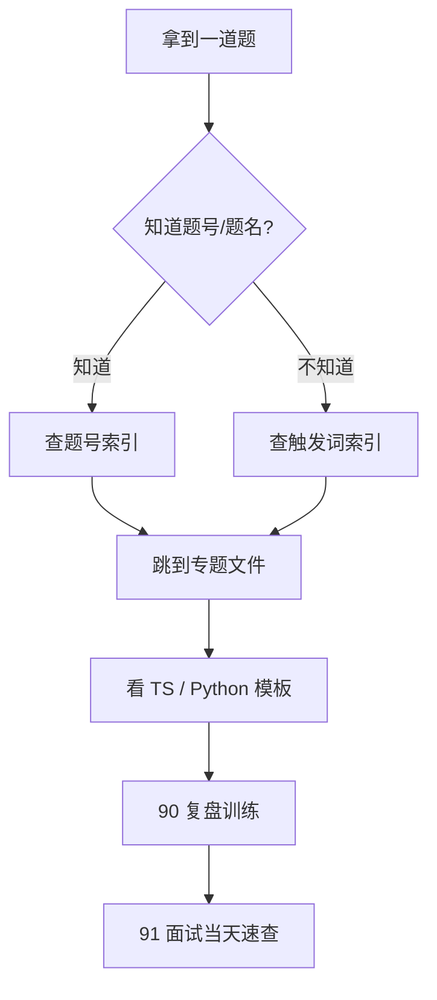

# Algorithm Frameworks 详细索引

> 核心一句话：**刷题时先搜题号或触发词，再跳到对应专题；不要从 00 开始翻。**
>
> 搜索建议：在编辑器里 `Cmd/Ctrl + F` 搜题号、英文题名、中文模式名，例如 `560`、`Minimum Window`、`前缀和`、`单调队列`。

---

## 🗺️ 查找路线总图

---

## 最常用入口

| 目标 | 入口 |
|---|---|
| 不知道该用什么算法 | [34 算法模式识别](34-algorithm-pattern-recognition.md) |
| 面试当天 30-60 分钟速查 | [91 面试当天速查](91-interview-day-cheatsheet.md) |
| 必背模板题 | [39 必背题清单](39-must-solve-list.md) |
| 错题复盘、题型触发、相似模式对比 | [90 错题复盘与题型训练](90-review-and-pattern-training.md) |
| TypeScript / Python / 手写结构速查 | [95 语言基础与手写结构参考](95-basic-coding-challenges.md) |
| 剑指 Offer | [99 剑指 Offer 题解](99-jianzhi-offer.md) |
| 文档质量检查 | [92 文档质量审计](92-quality-audit.md) |

---

## 按触发词查专题

| 看到什么 | 优先看 | 常见题号 / 题名 |
|---|---|---|
| 数据结构、遍历、复杂度、解题框架 | [00 数据结构与算法框架思维](00-data-structures-and-algorithm-thinking.md) | Big-O、数组 vs 链表、树遍历 |
| 递归、分治、归并、表达式拆分 | [01 递归与分治](01-recursion-and-divide-conquer.md) | 241, merge sort |
| DFS、岛屿、连通块、递归搜索 | [02 DFS 与回溯框架](02-dfs-backtracking.md) | 200, 695, 51 |
| 最短步数、层序、多源扩散、双向搜索 | [03 BFS 框架](03-bfs-framework.md) | 102, 127, 752, 994 |
| 子集、排列、组合、所有方案 | [04 回溯三件套](04-backtracking-subsets-permutations-combinations.md) | 46, 47, 77, 78, 39, 40, 51 |
| 有序、边界、第一个/最后一个、答案可判定 | [05 二分搜索](05-binary-search.md) | 704, 34, 33, 81, 875, 410 |
| 最值、计数、可行性、重叠子问题 | [06 DP 框架](06-dp-framework.md) | 322, 300, 1143, 139 |
| 容量、选或不选、组合数、排列数 | [07 背包问题](07-knapsack-problems.md) | 416, 494, 518, 377, 322 |
| 股票买卖、持有/不持有、交易次数 | [08 股票系列](08-stock-series.md) | 121, 122, 123, 188, 309, 714 |
| 相邻不能选、环形、树形、区间合并 | [09 打家劫舍与区间 DP](09-house-robber-and-interval-dp.md) | 198, 213, 337, 312 |
| 两个字符串编辑、LCS、二维表 | [10 编辑距离](10-edit-distance.md) | 72, 1143, 583 |
| 鸡蛋、最坏情况、次数最少 | [11 高楼扔鸡蛋](11-egg-drop.md) | 887 |
| 二叉树前中后序、递归位置、迭代遍历 | [12 二叉树遍历](12-binary-tree-traversal.md) | 94, 144, 145, 102 |
| BST、序列化、重复子树、增删查 | [13 二叉树操作与 BST](13-binary-tree-operations.md) | 98, 230, 297, 449, 652 |
| LCA、路径和、右视图、树形进阶 | [14 二叉树进阶](14-binary-tree-advanced.md) | 236, 124, 199, 543 |
| 快慢指针、左右夹逼、原地去重 | [15 双指针](15-two-pointers.md) | 11, 26, 42, 75, 88, 141 |
| 连续子串/子数组、最长/最短窗口 | [16 滑动窗口](16-sliding-window.md) | 3, 76, 209, 567, 713 |
| 排序、QuickSelect、归并、堆排 | [17 排序算法](17-sorting-algorithms.md) | 912, 215, 75, 315 |
| 下一个更大/更小、柱状图、贡献边界 | [18 单调栈](18-monotonic-stack.md) | 739, 496, 503, 84, 907 |
| 链表反转、合并、环、中点、K 组 | [19 链表技巧](19-linked-list-techniques.md) | 21, 19, 92, 141, 142, 206, 234 |
| 前缀和、差分、区间和、子数组数量 | [20 前缀和与差分](20-prefix-sum-and-diff-array.md) | 303, 304, 325, 560, 1109 |
| Two Sum、3Sum、4Sum、去重计数 | [21 nSum](21-n-sum-problems.md) | 1, 15, 18, 167, 259 |
| 回文子串、回文判断、中心扩展 | [22 回文串与字符串](22-palindrome-and-string-techniques.md) | 5, 125, 680, 647, 516 |
| 查重、计数、分组、索引映射 | [23 哈希表](23-hash-table-techniques.md) | 1, 49, 128, 242, 349 |
| Top K、数据流中位数、合并 K 个链表 | [24 堆与优先级队列](24-heap-and-priority-queue.md) | 215, 295, 347, 703, 23 |
| 合并区间、会议室、扫描线、交集 | [25 区间与扫描线](25-interval-and-sweep-line.md) | 56, 57, 252, 253, 986 |
| 连通性、账户合并、朋友圈、动态岛屿 | [26 并查集](26-union-find.md) | 200, 547, 684, 721 |
| 图、拓扑、Dijkstra、二分图、MST | [27 图算法](27-graph-algorithms.md) | 207, 210, 743, 787, 1584 |
| KMP、Rabin-Karp、Z 数组 | [28 字符串匹配](28-string-matching.md) | 28, 1392, 214 |
| LRU、LFU、缓存淘汰 | [29 LRU & LFU](29-lru-and-lfu-cache.md) | 146, 460 |
| 前缀树、通配符、词根替换 | [30 Trie](30-trie-prefix-tree.md) | 208, 211, 212, 648 |
| 异或、lowbit、位掩码、子集枚举 | [31 位运算](31-bit-manipulation-and-math.md) | 136, 137, 190, 191, 338 |
| 设计题、O(1) 结构、文件系统 | [32 设计与 OOD](32-design-and-ood.md) | 155, 380, 381, 588, 981 |
| 区间调度、跳跃游戏、加油站 | [33 贪心](33-greedy.md) | 55, 45, 134, 435, 452 |
| 看到什么想到什么 | [34 模式识别总结](34-algorithm-pattern-recognition.md) | 综合入口 |
| 动态区间和、区间更新、离散化 | [35 线段树与树状数组](35-segment-tree-and-bit.md) | 307, 315, 218 |
| 窗口最大/最小、前缀和单调队列 | [36 单调队列](36-monotonic-queue.md) | 239, 862, 1438, 1696 |
| 矩阵、网格 BFS/DFS、二维前缀和 | [37 矩阵技巧](37-matrix-techniques.md) | 48, 54, 73, 200, 304, 542, 994 |
| 面试口述、复杂度表达、正确性证明 | [38 面试表达](38-interview-explanation-patterns.md) | 讲解模板 |
| 高频模板题压缩清单 | [39 必背题](39-must-solve-list.md) | 50 题 |
| 错题、复盘、触发词训练、7 天冲刺 | [90 复盘训练](90-review-and-pattern-training.md) | 训练入口 |
| 面试当天最后速查 | [91 面试当天速查](91-interview-day-cheatsheet.md) | 30-60 分钟 |
| 语言语法、基础函数、手写结构 | [95 语言基础与手写结构参考](95-basic-coding-challenges.md) | TS / Python |
| 剑指 Offer 分类题单 | [99 剑指 Offer](99-jianzhi-offer.md) | 71 题 |

---

## 按 `list.md` 分类跳转

| `list.md` 分类 | 典型题号 | 对应专题 |
|---|---|---|
| 基础 / 字符串 / 数组热身 | 37, 214, 241, 463, 484 | [95 语言基础](95-basic-coding-challenges.md), [17 排序](17-sorting-algorithms.md) |
| 链表基础 | 225, 466, 483 | [19 链表](19-linked-list-techniques.md) |
| 栈与队列基础 | 40, 492, 494, 495 | [95 语言基础](95-basic-coding-challenges.md), [03 BFS](03-bfs-framework.md) |
| 朴素二分法 | 704, 34, 702, 153, 154, 278, 658 | [05 二分搜索](05-binary-search.md) |
| 条件二分法 | 33, 81, 4, 74, 162, 852 | [05 二分搜索](05-binary-search.md), [37 矩阵](37-matrix-techniques.md) |
| 答案二分法 | 875, 1283, 69, Wood Cut, Copy Books | [05 二分搜索](05-binary-search.md), [11 高楼扔鸡蛋](11-egg-drop.md) |
| 多指针 - 数组 | 75, 26, 80, 88, 215, 347, 42 | [15 双指针](15-two-pointers.md), [17 排序](17-sorting-algorithms.md), [24 堆](24-heap-and-priority-queue.md) |
| 多指针 - 链表 | 21, 86, 141, 142, 160, 234, 876 | [19 链表](19-linked-list-techniques.md) |
| 多指针 - 区间 | 56, 57, 252, 253, 986 | [25 区间](25-interval-and-sweep-line.md) |
| 回文串 | 5, 125, 345, 680 | [22 回文串](22-palindrome-and-string-techniques.md) |
| 滑动窗口 | 3, 76, 209, 239, 395, 480, 567, 713, 727 | [16 滑动窗口](16-sliding-window.md), [36 单调队列](36-monotonic-queue.md), [24 堆](24-heap-and-priority-queue.md) |
| 流 / 数据流 | 295, 346, 352, 703 | [24 堆](24-heap-and-priority-queue.md), [25 区间](25-interval-and-sweep-line.md) |
| 前缀和 | 53, 238, 303, 325, 528, 560 | [20 前缀和](20-prefix-sum-and-diff-array.md), [06 DP](06-dp-framework.md) |
| 和差问题 | 1, 15, 18, 167, 170, 259, 653, 1099 | [21 nSum](21-n-sum-problems.md), [23 哈希表](23-hash-table-techniques.md) |
| BFS / 二叉树 | 102, 103, 107, 297, 513 | [03 BFS](03-bfs-framework.md), [12 二叉树遍历](12-binary-tree-traversal.md) |
| BFS / 拓扑排序 | 207, 210, 269, 310 | [27 图算法](27-graph-algorithms.md), [03 BFS](03-bfs-framework.md) |
| BFS / 矩阵 | 200, 542, 994, 1091, 1162 | [37 矩阵技巧](37-matrix-techniques.md), [03 BFS](03-bfs-framework.md) |
| BFS / 图 | 127, 133, 261, 323, 399, 743 | [27 图算法](27-graph-algorithms.md), [03 BFS](03-bfs-framework.md) |
| 二叉树遍历 | 94, 144, 145, 102, 104, 111 | [12 二叉树遍历](12-binary-tree-traversal.md) |
| 二叉树构造 / 序列化 | 105, 106, 297, 449 | [13 二叉树操作](13-binary-tree-operations.md) |
| BST / Iterator | 98, 173, 230, 270, 272 | [13 二叉树操作](13-binary-tree-operations.md) |
| 树形判断 / 子树 / 路径 | 100, 101, 110, 112, 113, 124, 437, 572 | [13 二叉树操作](13-binary-tree-operations.md), [14 二叉树进阶](14-binary-tree-advanced.md) |
| LCA | 235, 236, 1644, 1650, 1676 | [14 二叉树进阶](14-binary-tree-advanced.md) |
| DFS 排列组合 | 17, 39, 40, 46, 47, 51, 77, 78, 90, 131 | [04 回溯三件套](04-backtracking-subsets-permutations-combinations.md), [02 DFS](02-dfs-backtracking.md) |
| DFS 图 / 矩阵 | 200, 207, 210, 332, 399, 417, 695 | [02 DFS](02-dfs-backtracking.md), [27 图算法](27-graph-algorithms.md), [37 矩阵](37-matrix-techniques.md) |
| Array & Matrix | 48, 54, 73, 289, 498, 766 | [37 矩阵技巧](37-matrix-techniques.md), [15 双指针](15-two-pointers.md) |
| String | 28, 43, 49, 125, 242, 344, 680 | [22 回文串](22-palindrome-and-string-techniques.md), [28 字符串匹配](28-string-matching.md), [23 哈希表](23-hash-table-techniques.md) |
| Hash | 1, 49, 128, 149, 202, 205, 242, 349, 350 | [23 哈希表](23-hash-table-techniques.md), [21 nSum](21-n-sum-problems.md) |
| Heap | 23, 215, 295, 347, 373, 378, 692, 703 | [24 堆](24-heap-and-priority-queue.md) |
| Stack / Monotonic Stack | 20, 84, 155, 224, 496, 503, 739, 907 | [18 单调栈](18-monotonic-stack.md), [32 设计](32-design-and-ood.md) |
| Trie | 208, 211, 212, 336, 421, 648, 677 | [30 Trie](30-trie-prefix-tree.md) |
| Union Find | 128, 200, 261, 305, 323, 547, 684, 721 | [26 并查集](26-union-find.md) |
| Sweep Line | 56, 57, 218, 252, 253, 391 | [25 区间](25-interval-and-sweep-line.md) |
| BIT / Segment Tree | 218, 307, 315, 327, 493 | [35 线段树与树状数组](35-segment-tree-and-bit.md) |
| Complex Data Structure | 146, 155, 295, 380, 381, 460, 588, 981 | [29 LRU/LFU](29-lru-and-lfu-cache.md), [32 设计](32-design-and-ood.md) |
| Backpack | 322, 416, 474, 494, 518, 1049 | [07 背包](07-knapsack-problems.md) |
| 单序列 DP | 53, 70, 198, 213, 300, 322, 343 | [06 DP](06-dp-framework.md), [09 打家劫舍](09-house-robber-and-interval-dp.md) |
| 双序列 DP | 72, 97, 115, 583, 1143 | [10 编辑距离](10-edit-distance.md), [06 DP](06-dp-framework.md) |
| 区间 DP | 312, 516, 664, 730 | [09 区间 DP](09-house-robber-and-interval-dp.md), [22 回文串](22-palindrome-and-string-techniques.md) |
| 矩阵 DP | 62, 63, 64, 120, 221, 931 | [06 DP](06-dp-framework.md), [37 矩阵](37-matrix-techniques.md) |
| 贪心 | 45, 55, 122, 134, 435, 452, 621, 763 | [33 贪心](33-greedy.md) |
| Queue / 单调队列 | 239, 346, 362, 622, 641, 862, 1438 | [36 单调队列](36-monotonic-queue.md), [03 BFS](03-bfs-framework.md) |
| TreeMap / 有序映射 | 352, 729, 731, 732, 855 | [25 区间](25-interval-and-sweep-line.md), [32 设计](32-design-and-ood.md) |

---

## 高频题号速查

| 题号 | 题名 | 模式 | 文件 |
|---|---|---|---|
| 1 | Two Sum | 哈希表 | [23](23-hash-table-techniques.md), [21](21-n-sum-problems.md) |
| 3 | Longest Substring Without Repeating Characters | 滑动窗口 | [16](16-sliding-window.md) |
| 5 | Longest Palindromic Substring | 中心扩展 / DP | [22](22-palindrome-and-string-techniques.md) |
| 15 | 3Sum | 排序 + 双指针 | [21](21-n-sum-problems.md) |
| 19 | Remove Nth Node From End | 前后指针 | [19](19-linked-list-techniques.md) |
| 21 | Merge Two Sorted Lists | 链表 dummy | [19](19-linked-list-techniques.md) |
| 23 | Merge k Sorted Lists | 堆 | [24](24-heap-and-priority-queue.md) |
| 33 | Search in Rotated Sorted Array | 条件二分 | [05](05-binary-search.md) |
| 34 | First and Last Position | 二分边界 | [05](05-binary-search.md) |
| 39 | Combination Sum | 回溯组合 | [04](04-backtracking-subsets-permutations-combinations.md) |
| 42 | Trapping Rain Water | 双指针 / 单调栈 | [15](15-two-pointers.md), [18](18-monotonic-stack.md) |
| 46 | Permutations | 回溯排列 | [04](04-backtracking-subsets-permutations-combinations.md) |
| 49 | Group Anagrams | 哈希 key 设计 | [23](23-hash-table-techniques.md) |
| 53 | Maximum Subarray | DP / Kadane | [06](06-dp-framework.md), [20](20-prefix-sum-and-diff-array.md) |
| 56 | Merge Intervals | 排序 + 合并 | [25](25-interval-and-sweep-line.md) |
| 72 | Edit Distance | 双序列 DP | [10](10-edit-distance.md) |
| 76 | Minimum Window Substring | 滑动窗口 | [16](16-sliding-window.md) |
| 84 | Largest Rectangle in Histogram | 单调栈 | [18](18-monotonic-stack.md) |
| 98 | Validate BST | 中序 / 上下界 | [13](13-binary-tree-operations.md) |
| 102 | Binary Tree Level Order | BFS | [03](03-bfs-framework.md), [12](12-binary-tree-traversal.md) |
| 121 | Best Time to Buy and Sell Stock | 股票 DP | [08](08-stock-series.md) |
| 124 | Binary Tree Maximum Path Sum | 树形 DP / 后序 | [14](14-binary-tree-advanced.md) |
| 127 | Word Ladder | BFS | [03](03-bfs-framework.md) |
| 128 | Longest Consecutive Sequence | 哈希集合 | [23](23-hash-table-techniques.md), [26](26-union-find.md) |
| 141 | Linked List Cycle | 快慢指针 | [19](19-linked-list-techniques.md) |
| 146 | LRU Cache | Map + 双向链表 | [29](29-lru-and-lfu-cache.md) |
| 155 | Min Stack | 设计题 | [32](32-design-and-ood.md) |
| 198 | House Robber | 一维 DP | [09](09-house-robber-and-interval-dp.md) |
| 200 | Number of Islands | DFS/BFS/并查集 | [37](37-matrix-techniques.md), [26](26-union-find.md) |
| 206 | Reverse Linked List | 链表反转 | [19](19-linked-list-techniques.md) |
| 207 | Course Schedule | 拓扑排序 | [27](27-graph-algorithms.md) |
| 208 | Implement Trie | Trie | [30](30-trie-prefix-tree.md) |
| 215 | Kth Largest Element | QuickSelect / 堆 | [17](17-sorting-algorithms.md), [24](24-heap-and-priority-queue.md) |
| 226 | Invert Binary Tree | 树递归 | [12](12-binary-tree-traversal.md) |
| 236 | LCA | 后序递归 | [14](14-binary-tree-advanced.md) |
| 239 | Sliding Window Maximum | 单调队列 | [36](36-monotonic-queue.md) |
| 253 | Meeting Rooms II | 扫描线 / 堆 | [25](25-interval-and-sweep-line.md), [24](24-heap-and-priority-queue.md) |
| 295 | Median Data Stream | 双堆 | [24](24-heap-and-priority-queue.md) |
| 300 | LIS | DP + 二分 | [06](06-dp-framework.md) |
| 307 | Range Sum Query Mutable | BIT / 线段树 | [35](35-segment-tree-and-bit.md) |
| 322 | Coin Change | 完全背包 / DP | [07](07-knapsack-problems.md), [06](06-dp-framework.md) |
| 347 | Top K Frequent | 堆 / 桶 | [24](24-heap-and-priority-queue.md) |
| 380 | Insert Delete GetRandom O(1) | 数组 + 哈希 | [32](32-design-and-ood.md) |
| 416 | Partition Equal Subset Sum | 0-1 背包 | [07](07-knapsack-problems.md) |
| 435 | Non-overlapping Intervals | 贪心 | [33](33-greedy.md), [25](25-interval-and-sweep-line.md) |
| 460 | LFU Cache | 设计题 | [29](29-lru-and-lfu-cache.md) |
| 494 | Target Sum | 背包 / DFS | [07](07-knapsack-problems.md), [04](04-backtracking-subsets-permutations-combinations.md) |
| 516 | Longest Palindromic Subsequence | 区间 DP | [22](22-palindrome-and-string-techniques.md) |
| 560 | Subarray Sum Equals K | 前缀和 + 哈希 | [20](20-prefix-sum-and-diff-array.md) |
| 621 | Task Scheduler | 贪心 / 堆 | [33](33-greedy.md), [24](24-heap-and-priority-queue.md) |
| 704 | Binary Search | 二分模板 | [05](05-binary-search.md) |
| 721 | Accounts Merge | 并查集 | [26](26-union-find.md) |
| 739 | Daily Temperatures | 单调栈 | [18](18-monotonic-stack.md) |
| 743 | Network Delay Time | Dijkstra | [27](27-graph-algorithms.md) |
| 875 | Koko Eating Bananas | 二分答案 | [05](05-binary-search.md) |
| 994 | Rotting Oranges | 多源 BFS | [37](37-matrix-techniques.md), [03](03-bfs-framework.md) |
| 1143 | Longest Common Subsequence | 双序列 DP | [06](06-dp-framework.md), [10](10-edit-distance.md) |

---

## 面试查找路径

| 时间 | 看什么 |
|---|---|
| 只有 30 分钟 | [91 面试当天速查](91-interview-day-cheatsheet.md) |
| 只有 1 天 | [91](91-interview-day-cheatsheet.md) → [39](39-must-solve-list.md) → [34](34-algorithm-pattern-recognition.md) |
| 还有 1 周 | [90](90-review-and-pattern-training.md) 的 7 天冲刺表 |
| 正在刷题卡住 | 本文件搜题号/触发词 → 对应专题 → [90](90-review-and-pattern-training.md) 记录错因 |

---

## 文件编号总览

| 范围 | 内容 |
|---|---|
| `00-01` | 算法思维基础 |
| `02-05` | DFS / BFS / 回溯 / 二分 |
| `06-11` | 动态规划 |
| `12-27` | 树、指针、链表、哈希、堆、区间、图 |
| `28-39` | 字符串匹配、设计、贪心、模式识别、进阶结构、必背题 |
| `90-92` | 复盘训练、面试当天速查、质量审计 |
| `95` | 语言基础与手写结构参考 |
| `99` | 剑指 Offer |
