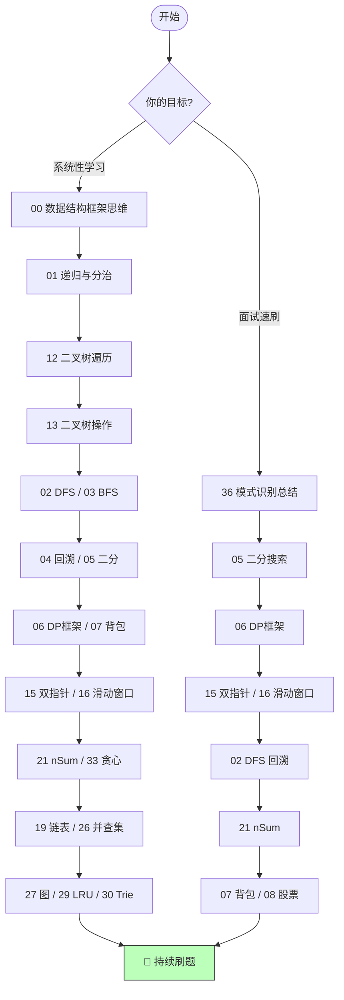

# 📘 Algorithm Frameworks

> 基于 labuladong 算法框架思维的结构化总结 —— 将 40+ 个零散的笔记重构为 **39 篇结构化 Markdown**，覆盖 **269 道 LeetCode 高频题**。
>
> 每篇文章包含：核心思想 → 可运行 TypeScript 代码 → Mermaid 流程图 → 复杂度分析 → 刷题路线

---

## 🧭 怎么用这套笔记

```
① 按顺序从头读到尾（推荐）→ 适合系统性复习
② 刷题时遇到卡点 → 查对应主题文件
③ 面试前速刷 → 看 34-模式识别总结.md + 复杂度速查表
```

### 🗺️ 知识体系总图

```mermaid
flowchart LR
    subgraph 基础 [Phase 0 思维基础]
        direction TB
        A0["00 数据结构框架"] --> A1["01 递归与分治"]
    end

    subgraph 搜索 [Phase 1 搜索算法]
        B0["02 DFS"] --> B1["03 BFS"]
        B0 --> B2["04 回溯"]
        B1 --> B2
        B3["05 二分搜索"]
    end

    subgraph DP [Phase 2 动态规划]
        C0["06 DP框架"] --> C1["07 背包"]
        C0 --> C2["08 股票"]
        C0 --> C3["09 打家劫舍"]
        C0 --> C4["10 编辑距离"]
        C0 --> C5["11 扔鸡蛋"]
    end

    subgraph 数据结构 [Phase 3 数据结构]
        D0["12 二叉树遍历"] --> D1["13 二叉树操作"]
        D2["15 双指针"] --> D3["16 滑动窗口"]
        D4["18 单调栈"] --> D5["20 前缀和"]
        D6["19 链表"] --> D7["21 nSum"]
        D8["22 回文串"] --> D9["23 哈希表"]
        D10["24 堆"] --> D11["25 区间"]
        D12["26 并查集"] --> D13["27 图"]
    end

    subgraph 进阶 [Phase 4 进阶]
        E0["29 LRU缓存"] --> E1["30 Trie"]
        E2["14 二叉树进阶"]
        E3["31 位运算"] --> E4["32 OOD"]
        E5["33 贪心"]
    end

    基础 --> 搜索 --> DP --> 数据结构 --> 进阶 --> F["34 模式识别总结"]

    style F fill:#f9f,stroke:#333,stroke-width:3px
```



### 📈 学习路线推荐



---

## 📦 文件总览 (39 篇)

### 🔷 Phase 0 — 思维基础 (2 篇)

| #   | 文件                                                                   | 一句话总结                                           | 核心题数 |
| --- | ---------------------------------------------------------------------- | ---------------------------------------------------- | :------: |
| 00  | [数据结构与算法框架思维](00-data-structures-and-algorithm-thinking.md) | 数组 vs 链表、遍历方式、Big-O、五步解题框架          |    12    |
| 01  | [递归与分治思想](01-recursion-and-divide-conquer.md)                   | 递归三要素、分治 vs DP vs 回溯 vs 贪心对比、归并排序 |    9     |

### 🔷 Phase 1 — 搜索算法 (4 篇)

| #   | 文件                                                                         | 一句话总结                                     | 核心题数 |
| --- | ---------------------------------------------------------------------------- | ---------------------------------------------- | :------: |
| 02  | [DFS 与回溯算法](02-dfs-backtracking.md)                                     | 回溯万能模板、4 种剪枝策略、N 皇后、全排列     |    18    |
| 03  | [BFS 框架](03-bfs-framework.md)                                              | BFS 模板、双向 BFS、多源 BFS、拓扑排序、图遍历 |    24    |
| 04  | [回溯：子集·排列·组合](04-backtracking-subsets-permutations-combinations.md) | 三合一模板、去重口诀、剪枝优化                 |    10    |
| 05  | [二分搜索框架](05-binary-search.md)                                          | 三种二分模板、答案二分法、珂珂吃香蕉           |    15    |

### 🔷 Phase 2 — 动态规划 (6 篇)

| #   | 文件                                                    | 一句话总结                                        | 核心题数 |
| --- | ------------------------------------------------------- | ------------------------------------------------- | :------: |
| 06  | [动态规划框架](06-dp-framework.md)                      | DP 四步走、斐波那契进化、零钱兑换、LCS            |    10    |
| 07  | [背包问题](07-knapsack-problems.md)                     | 0-1 背包 vs 完全背包、状态压缩、排列 vs 组合      |    8     |
| 08  | [团灭股票买卖](08-stock-series.md)                      | 三维状态机 DP、6 道股票题统一解法、冷冻期、手续费 |    6     |
| 09  | [打家劫舍与区间 DP](09-house-robber-and-interval-dp.md) | 线性→环形→树形 DP 递进                            |    7     |
| 10  | [编辑距离](10-edit-distance.md)                         | 二维 DP 表、增删改操作可视化、路径回溯            |    4     |
| 11  | [高楼扔鸡蛋](11-egg-drop.md)                            | DP + 二分优化、反向 DP 最优解                     |    2     |

### 🔷 Phase 3 — 数据结构 (13 篇)

| #   | 文件                                                     | 一句话总结                                       | 核心题数 |
| --- | -------------------------------------------------------- | ------------------------------------------------ | :------: |
| 12  | [二叉树遍历框架](12-binary-tree-traversal.md)            | 前/中/后序本质、迭代遍历、快排=前序归并=后序     |    17    |
| 13  | [二叉树常见操作与 BST](13-binary-tree-operations.md)     | 序列化、BST 增删查、合法性判断、重复子树         |    21    |
| 15  | [双指针技巧](15-two-pointers.md)                         | 快慢/左右/归并/三指针 四种模式、接雨水           |    18    |
| 16  | [滑动窗口](16-sliding-window.md)                         | 万能滑动窗口模板、最小覆盖子串、定长窗口         |    8     |
| 17  | [排序算法合集](17-sorting-algorithms.md)                 | 10 大排序算法、Mermaid 流程、三语言实现          |    12    |
| 18  | [单调栈](18-monotonic-stack.md)                          | 下一个更大元素、每日温度、环形数组、接雨水       |    8     |
| 19  | [链表技巧](19-linked-list-techniques.md)                 | 反转链表、快慢指针、相交链表、回文链表、K 组反转 |    16    |
| 20  | [前缀和与差分数组](20-prefix-sum-and-diff-array.md)      | 前缀和 + 二分、和为 K 的子数组、差分航班预订     |    8     |
| 21  | [nSum 问题](21-n-sum-problems.md)                        | 两数之和→三数→四数、递归 nSum 统一框架           |    8     |
| 22  | [回文串与字符串](22-palindrome-and-string-techniques.md) | 中心扩展、验证回文串、最长回文子串               |    11    |
| 23  | [哈希表技巧](23-hash-table-techniques.md)                | 两数之和、字母异位词分组、最长连续序列           |    10    |
| 24  | [堆与优先级队列](24-heap-and-priority-queue.md)          | 双堆求中位数、Top K、合并 K 个链表               |    7     |
| 25  | [区间与扫描线](25-interval-and-sweep-line.md)            | 合并区间、会议室 II、扫描线模板                  |    7     |
| 26  | [并查集 Union-Find](26-union-find.md)                    | 路径压缩 + 按秩合并、岛屿数量、账户合并          |    7     |
| 27  | [图算法](27-graph-algorithms.md)                         | Dijkstra、拓扑排序、二分图染色                   |    9     |

### 🔷 Phase 4 — 进阶专题 (7 篇)

| #   | 文件                                                    | 一句话总结                          | 核心题数 |
| --- | ------------------------------------------------------- | ----------------------------------- | :------: |
| 14  | [二叉树进阶](14-binary-tree-advanced.md)                | LCA、序列化、路径综合、BST 迭代器   |    10    |
| 29  | [LRU & LFU 缓存](29-lru-and-lfu-cache.md)               | 哈希表 + 双向链表、频率桶淘汰       |    2     |
| 30  | [Trie 前缀树](30-trie-prefix-tree.md)                   | 插入/搜索/前缀搜索模板、通配符匹配  |    4     |
| 31  | [位运算](31-bit-manipulation-and-math.md)               | 异或性质、n&(n-1)、位掩码枚举子集   |    6     |
| 32  | [设计与 OOD](32-design-and-ood.md)                      | 最小栈、O(1)随机访问、LFU、文件系统 |    12    |
| 33  | [贪心算法](33-greedy.md)                                | 区间调度、跳跃游戏、加油站          |    7     |
| 34  | [算法模式识别总结](34-algorithm-pattern-recognition.md) | 看到什么→想到什么速查表 + 面试策略  |    —     |

### 🔷 Phase 5 — 补充专题 (4 篇)

| #   | 文件                                                                    | 一句话总结                     | 核心题数 |
| --- | ----------------------------------------------------------------------- | ------------------------------ | :------: |
| 95  | [基础编程练习](95-basic-coding-challenges.md)                           | 字符串/数组/递归等基础编程练习 |    20    |
| 96  | [JS 基础知识参考](96-js-basics.md)                                       | BigInt / Map / Set / Array 等  |    —     |
| 97  | [数据结构手写实现](97-data-structures-implementations.md)                 | 11 种数据结构的 TS + Python 实现|    —     |
| 99  | [剑指 Offer 题解](99-jianzhi-offer.md)                                   | 71 道经典面试题，11 个分类     |    71    |

---

## 📊 完整覆盖率

| 来源                   |    数量    | 备注                                 |
| ---------------------- | :--------: | ------------------------------------ |
| 文件中的 LeetCode 链接 | **247 题** | 覆盖率 **91.8%**                     |
| 题库总题数             |   269 题   | 来自 `leetcode-questions-summary.md` |
| 未覆盖                 |   22 题    | 均为 LintCode / Premium 付费题       |

---

## 🔗 关联阅读顺序建议

```
新手友好路径：
  00 → 01 → 12 → 13 → 14 → 02 → 03 → 04 → 05 → 06 → 07 → 15 → 16 → 21 → 34

面试速刷路径：
  34 → 05 → 06 → 02 → 15 → 16 → 21 → 07 → 08 → 19 → 23 → 24 → 33
```

---

> 原笔记仓库：`1.算法框架_labuladong/1.必备算法框架/` ← 原始 `.js`/`.ts` 文件
> 重构产出：`algorithm-frameworks/` ← 本目录
