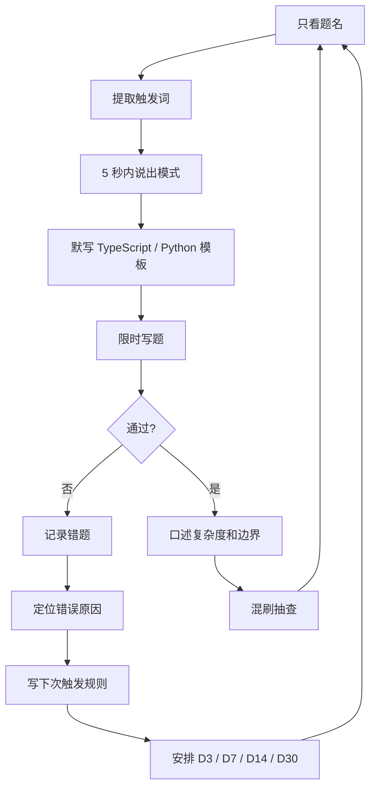
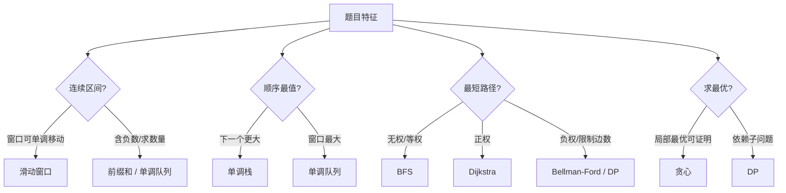

# 错题复盘与题型训练手册

> 核心一句话：**错题复盘不是记录“我错了”，而是把“题目特征 → 算法模式 → 代码模板 → 下次触发规则”训练成条件反射。**
>
> 使用方式：每天用 30 分钟做题名识别、模板默写、限时写题和错题复盘；面试前用 7 天冲刺表集中查漏。

---

## 🗺️ 训练闭环总图



---

## 1. 题型触发训练


### 高频触发词训练表

| 题目特征 | 应该想到 | 典型题 | 对应文件 |
|---|---|---|---|
| 连续子数组 / 子串，求最长 | 滑动窗口 / DP | 3, 209, 424 | `16` |
| 连续子数组，求和为 K 的数量 | 前缀和 + 哈希计数 | 560 | `20` |
| 数组含负数，求最短和 >= K | 前缀和 + 单调队列 | 862 | `36` |
| 固定窗口最大 / 最小 | 单调队列 | 239 | `36` |
| 下一个更大 / 更小 | 单调栈 | 739, 496, 503 | `18` |
| 有序数组查找边界 | 二分左/右边界 | 34 | `05` |
| 最大值最小化 / 最小值最大化 | 二分答案 | 875, 1011, 410 | `05` |
| 升序数组两数和 | 双指针夹逼 | 167 | `15` |
| 三数 / 四数和 | 排序 + 固定 + 双指针 | 15, 18 | `21` |
| 原地移除 / 去重 | 快慢指针 | 26, 80, 283 | `15` |
| 链表环 / 中点 | 快慢指针 | 141, 142, 876 | `19` |
| 网格连通块 | DFS/BFS 感染 | 200, 695 | `37` |
| 最少步数 / 每步等价 | BFS | 127, 752 | `03` |
| 多个起点同时扩散 | 多源 BFS | 994, 542 | `37` |
| 课程依赖 / 先后顺序 | 拓扑排序 | 207, 210 | `27` |
| 正权图最短路 | Dijkstra | 743, 1631 | `27` |
| 负权 / K 次中转 | Bellman-Ford / DP | 787 | `27` |
| 连通性 / 合并账户 | 并查集 | 547, 721 | `26` |
| 动态区间和 | BIT / 线段树 | 307 | `35` |
| Top K | 堆 / QuickSelect | 215, 347 | `24` |
| 数据流中位数 | 双堆 | 295 | `24` |
| 前缀匹配 | Trie | 208, 211, 648 | `30` |
| 单模式字符串匹配 | KMP / Z / rolling hash | 28, 1392 | `28` |
| 回文子串 | 中心扩展 / Manacher | 5, 647 | `22` |
| 回文子序列 | 区间 DP | 516 | `22` |
| 每个物品选一次 | 0-1 背包，容量倒序 | 416, 494 | `07` |
| 每个物品无限选 | 完全背包，容量正序 | 322, 518 | `07` |
| 所有方案 / 所有路径 | 回溯 | 46, 78, 39 | `04` |
| 区间合并 / 插入 | 排序 + 合并 | 56, 57 | `25` |
| 无重叠区间 / 气球 | 按 end 排序贪心 | 435, 452 | `33` |
| 最近使用淘汰 | LRU：Map + 双向链表 | 146 | `29` |

### 盲测题

| # | 描述 | 正确模式 |
|---|---|---|
| 1 | 给一个数组，找乘积小于 K 的连续子数组个数 | 滑动窗口 |
| 2 | 给一个数组，问有多少个连续子数组和等于 K | 前缀和 + 哈希 |
| 3 | 每次可以腐烂四周橘子，问几分钟全部腐烂 | 多源 BFS |
| 4 | 给航班预订区间，批量给每段加座位数 | 差分数组 |
| 5 | 课程有先修关系，问能否学完 | 拓扑排序 |
| 6 | 数据流不断插入数字，随时返回中位数 | 双堆 |
| 7 | 给字符串集合，查某个前缀是否存在 | Trie |
| 8 | 给数组和目标，找最小速度满足条件 | 二分答案 |
| 9 | 链表是否有环，若有返回入口 | 快慢指针 |
| 10 | 每个数只能选一次，问能否凑成目标和 | 0-1 背包 |

---

## 2. 相似题型对比



| 容易混淆 | 选择规则 |
|---|---|
| 滑动窗口 vs 前缀和 | 窗口扩大/缩小能稳定改变条件，用滑动窗口；含负数或统计数量，用前缀和 |
| 单调栈 vs 单调队列 | 问左右第一个更大/更小，用单调栈；问窗口内最大/最小，用单调队列 |
| DFS vs BFS | 要所有方案或连通块，用 DFS；要最少步数，用 BFS |
| 回溯 vs DP | 要列出具体方案，用回溯；只要最值/数量/可行性且子问题重复，用 DP |
| 贪心 vs DP | 能证明局部选择不变差，用贪心；证明不了就考虑 DP |
| 堆 vs 排序 vs QuickSelect | 动态 Top K 用堆；完整有序用排序；只找第 K 个用 QuickSelect |
| Trie vs HashMap | 完整 key 查找用 HashMap；前缀、词根、通配符用 Trie |
| BIT vs 线段树 | 只维护和优先 BIT；维护 min/max、区间更新或复杂节点信息用线段树 |
| BFS vs Dijkstra vs Bellman-Ford | 等权 BFS；非负权 Dijkstra；负权或 K 次中转 Bellman-Ford / DP |

---

## 3. 错题复盘模板

每道错题至少记录这 6 项：

| 项目 | 内容 |
|---|---|
| 题目 | 题号、题名、难度、日期、用时 |
| 触发词 | 题目里哪些词应该触发某个模式 |
| 第一反应 | 我一开始想到什么，为什么不够好 |
| 正确思路 | 模式、状态/数据结构、更新规则 |
| 错误原因 | 模式识别错、状态定义错、边界漏、复杂度不达标等 |
| 下次规则 | 下次看到什么信号，我应该立刻想到什么 |

### 代码模板占位

```typescript
// TypeScript 关键模板
function solve(input: unknown): unknown {
  // 1. 明确状态 / 指针 / 数据结构
  // 2. 写出初始化
  // 3. 写出遍历和更新规则
  // 4. 返回答案
  return input;
}
```

```python
# Python 关键模板
def solve(data):
    # 1. 明确状态 / 指针 / 数据结构
    # 2. 写出初始化
    # 3. 写出遍历和更新规则
    # 4. 返回答案
    return data
```

### 错误原因分类表

| 错误类型 | 典型表现 | 修复方法 |
|---|---|---|
| 模式识别错 | 看到连续子数组却用了暴力枚举 | 回到 `34` 触发词表 |
| 状态定义错 | DP 数组含义说不清 | 先写中文定义再写转移 |
| 遍历顺序错 | 背包一维压缩方向反了 | 标注依赖来源 |
| 边界漏掉 | 空数组、单节点、重复值错 | 固定写边界测试 |
| 数据结构不同步 | Map 和数组 / 链表状态不一致 | 每个操作列同步步骤 |
| 复杂度不达标 | O(n²) 过不了 1e5 | 用数据规模倒推 |

### 错题集索引模板

| 日期 | 题号 | 题名 | 模式 | 错误原因 | D3 | D7 | D14 | D30 | 状态 |
|---|---|---|---|---|---|---|---|---|---|
| 2026-xx-xx |  |  |  |  |  |  |  |  |  |

---

## 4. 间隔复习计划


| 时间 | 要做什么 | 通过标准 |
|---|---|---|
| D0 | 做题并记录错题 | 知道自己卡在哪里 |
| D1 | 看笔记，补模板 | 能说出正确模式 |
| D3 | 不看题解重写 | 代码能 AC 或接近 AC |
| D7 | 限时重做 | 15-25 分钟内完成 |
| D14 | 只看题名口述 | 能讲清状态、转移、复杂度 |
| D30 | 混合题单随机抽 | 能快速识别模式 |

### 每日 30 分钟训练方案


| 时间 | 动作 | 使用文件 | 产出 |
|---|---|---|---|
| 0-5 分钟 | 随机抽 5-10 个题名，只说模式和触发词 | `39`, `90` | 题名 → 模式 |
| 5-15 分钟 | 默写一个模板，不看答案 | 对应专题文件 | TypeScript 或 Python 核心代码 |
| 15-25 分钟 | 限时写一道中等题 | `39` 或 `List.md` | 可运行解法 |
| 25-28 分钟 | 记录错因和下次触发规则 | `90` | 一条复盘记录 |
| 28-30 分钟 | 口述复杂度、边界和替代方案 | `38`, `90` | 面试表达闭环 |

### 每周复习安排

| 星期 | 内容 |
|---|---|
| 周一 | 二分 / 双指针 / 滑动窗口 |
| 周二 | DFS / BFS / 回溯 |
| 周三 | DP / 背包 / 股票 |
| 周四 | 树 / 链表 / 哈希 |
| 周五 | 堆 / Trie / 并查集 / 图 |
| 周六 | 区间 / 贪心 / 设计题 |
| 周日 | 错题复盘 + 随机模拟 |

---

## 5. 面试前 7 天冲刺表

| 天数 | 主任务 | 必看文件 | 通过标准 |
|---|---|---|---|
| Day 1 | 模式总览 + 高频题名识别 | `34`, `39`, `90` | 只看 30 道题名，至少 24 道能说出模式 |
| Day 2 | 二分、双指针、滑动窗口 | `05`, `15`, `16`, `21` | 每类能独立写 1 道模板题 |
| Day 3 | DFS、BFS、回溯、树 | `02`, `03`, `04`, `12-14` | 能解释递归返回值和 BFS 层数含义 |
| Day 4 | DP、背包、股票、编辑距离 | `06-10` | 能先定义状态，再写转移 |
| Day 5 | 哈希、堆、Trie、并查集、图 | `23`, `24`, `30`, `26`, `27` | 能说出为什么选这个数据结构 |
| Day 6 | 相似题型对比 + 错题重写 | `90` | 对 10 组相似题不再混用模板 |
| Day 7 | 限时模拟 + 面试表达 | `38`, `39`, `90` | 2 道中等题限时完成，并能口述取舍 |

### 7 天冲刺不要做什么

| 不建议 | 原因 | 替代动作 |
|---|---|---|
| 大量刷新题 | 新题会制造假进度 | 重做 `39` 的模板题 |
| 只看题解 | 面试考的是独立重建 | 做题型触发训练 |
| 每题都追求最优解 | 会牺牲稳定性 | 先保证可解释、可 AC |
| 忽略口述 | 面试不是 OJ | 用 `38` 练 2 分钟表达 |

---

## 掌握标准

```
[ ] 只看题名能说出算法模式。
[ ] 能先讲暴力解，再讲优化点。
[ ] 能写出 TypeScript 或 Python 模板。
[ ] 能解释为什么正确。
[ ] 能给出时间和空间复杂度。
[ ] 能主动列出边界测试。
[ ] 能说出为什么不用相似模式。
```

---

> **关联阅读：** [34 模式识别](../algorithm-frameworks/34-algorithm-pattern-recognition.md) → [38 面试表达](../algorithm-frameworks/38-interview-explanation-patterns.md) → [39 必背题](../algorithm-frameworks/39-must-solve-list.md) → [92 质量审计](../Audit.md)
