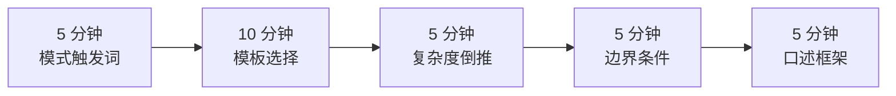
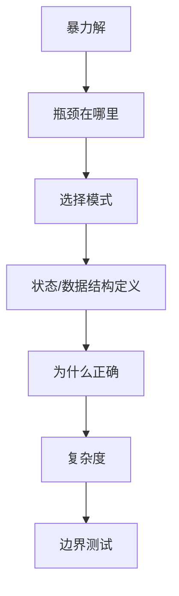

# 面试当天速查

> 核心一句话：**面试当天不要重新学习，只看触发词、模板选择、复杂度和高频边界。**
>
> 使用方式：面试前 30-60 分钟从上到下扫一遍；只看你已经学过的模式，不临时扩新内容。

---

## 🗺️ 30 分钟速查路径



---

## 看到什么，先想什么

| 题目特征 | 第一反应 | 文件 |
|---|---|---|
| 有序、边界、第一个/最后一个 | 二分边界 | `05` |
| 最大值最小化、最小值最大化 | 二分答案 + `check` | `05` |
| 连续子串/子数组最长最短 | 滑动窗口 | `16` |
| 连续子数组和等于 K / 数量 | 前缀和 + 哈希 | `20` |
| 固定窗口最大最小 | 单调队列 | `36` |
| 下一个更大/更小 | 单调栈 | `18` |
| Top K / 数据流中位数 | 堆 / 双堆 | `24` |
| 所有方案 | 回溯 | `04` |
| 最少步数 | BFS | `03` |
| 连通性 / 合并集合 | 并查集 | `26` |
| 正权最短路 | Dijkstra | `27` |
| 课程依赖 | 拓扑排序 | `27` |
| 前缀匹配 | Trie | `30` |
| 区间合并 / 会议室 | 排序 + 扫描线 / 堆 | `25` |
| 局部最优可证明 | 贪心 | `33` |
| 最值/计数/可行性 + 重复子问题 | DP | `06` |

---

## TypeScript / Python 开场模板

```typescript
// TypeScript：先写清楚变量语义，再写循环
function solve(nums: number[]): number {
  let ans = 0;
  const count = new Map<number, number>();
  for (const x of nums) {
    count.set(x, (count.get(x) ?? 0) + 1);
    ans = Math.max(ans, count.get(x)!);
  }
  return ans;
}
```

```python
# Python：优先用标准库降低实现噪音
from collections import defaultdict, deque
import heapq

def solve(nums: list[int]) -> int:
    ans = 0
    count = defaultdict(int)
    for x in nums:
        count[x] += 1
        ans = max(ans, count[x])
    return ans
```

---

## 复杂度倒推

| 输入规模 | 通常可接受 | 优先考虑 |
|---|---|---|
| `n <= 20` | `O(2^n)`, `O(n!)` | 回溯、状态压缩 |
| `n <= 500` | `O(n^3)` | 区间 DP、Floyd |
| `n <= 2,000` | `O(n^2)` | 双序列 DP、枚举中心 |
| `n <= 1e5` | `O(n log n)` / `O(n)` | 排序、堆、哈希、双指针 |
| `n >= 1e6` | `O(n)` / `O(log n)` | 前缀、滑窗、二分 |

---

## 高频边界条件

```
[ ] 空数组 / 空字符串
[ ] 单元素 / 两个元素
[ ] 全部相同 / 全部不同
[ ] 已排序 / 逆序
[ ] 有重复值
[ ] 有负数 / 0 / 大数
[ ] 链表头尾变化
[ ] 树为空 / 只有根节点
[ ] 图不连通 / 有环
[ ] 矩阵一行 / 一列
```

---

## 最后 5 分钟口述框架



---

> **关联阅读：** [34 模式识别](../algorithm-frameworks/34-algorithm-pattern-recognition.md) → [39 必背题](../algorithm-frameworks/39-must-solve-List.md) → [90 复盘训练](90-review-and-pattern-training.md)
